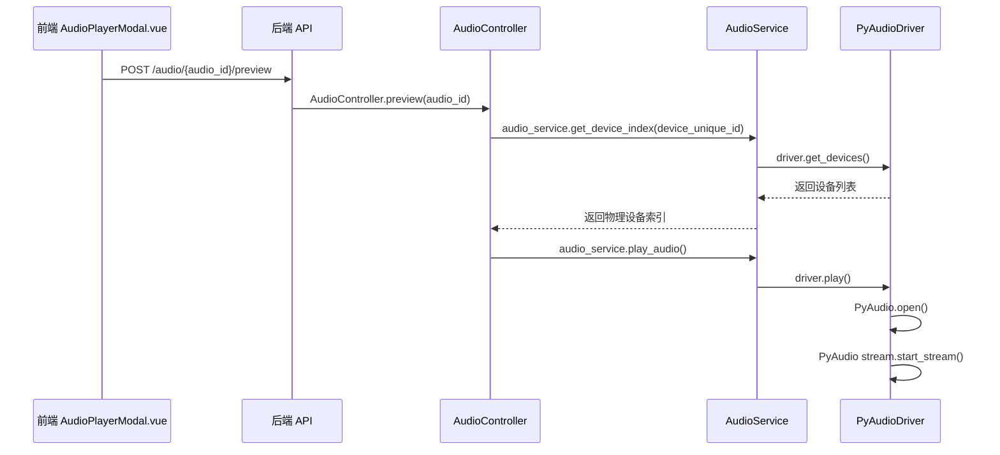

# 音频播放设备选择问题分析

## 问题描述

音频没有在所选择的播放设备上播放，而是在系统映射的扬声器上播放。

## 调用链路分析

### 1. 前端调用流程



### 2. 后端核心函数调用链路

#### 2.1 AudioController.preview()
- **位置**: `backend/controllers/audio_controller.py:1397`
- **功能**: 处理音频试听请求，支持前端浏览器播放和后端硬件播放
- **关键步骤**:
  1. 查询音频信息
  2. 检查音频是否存在且未被删除
  3. 获取请求参数中的播放设备ID和SPL值
  4. 如果没有提供播放设备ID，返回音频流供前端播放
  5. 如果提供了播放设备ID，执行后端硬件播放：
     - 处理播放设备（支持数据库设备和扫描设备）
     - 计算音量/增益
     - 获取物理设备索引
     - 触发播放指令
     - 返回播放结果
  6. 异常处理，记录错误日志

#### 2.2 AudioService.get_device_index()
- **位置**: `backend/utils/audio_engine.py:192`
- **功能**: 根据设备唯一标识获取物理设备索引
- **关键逻辑**:
  1. 获取所有可用设备
  2. 精确匹配设备名称或索引
  3. 模糊匹配设备名称
  4. 按API优先级排序选择设备
  5. 针对RME设备进行优化

#### 2.3 PyAudioDriver.play()
- **位置**: `backend/utils/audio_engine.py:51`
- **功能**: 实际执行音频播放
- **关键步骤**:
  1. 打开音频文件
  2. 获取设备信息
  3. 初始化PyAudio流
  4. 启动音频流
  5. 阻塞直到播放结束或收到停止信号

## 根本原因分析

### 1. 设备索引匹配问题

**问题**: `get_device_index()` 函数的匹配逻辑可能导致无法找到正确的设备，或者返回了错误的设备索引。

**代码分析**:
```python
# 优先级API列表
priority_apis = ["Windows WDM-KS", "Windows DirectSound", "Windows WASAPI", "MME"]

# 设备选择逻辑
for api in priority_apis:
    api_matches = [dev for dev in matches if dev['host_api'] == api]
    if api_matches:
        # 针对 RME 优化：如果名称中不含“扬声器”，通常是更纯净的物理对
        for dev in api_matches:
            if "扬声器" not in dev['name'] and "Speaker" not in dev['name']:
                return dev['index']
        return api_matches[0]['index']
```

### 2. 设备名称匹配不精确

**问题**: 前端传递的设备ID与实际设备名称不完全匹配，导致无法找到正确的设备。

**代码分析**:
```python
# 1. 首先尝试精确匹配 (在所有 API 中找)
exact_matches = [dev for dev in devices if unique_id == dev['name'] or unique_id == str(dev['index'])]

# 2. 如果没有精确匹配，尝试模糊匹配
matches = exact_matches if exact_matches else [dev for dev in devices if unique_id in dev['name'] or dev['name'] in unique_id]
```

### 3. 默认设备回退机制

**问题**: 当无法找到指定设备时，PyAudio会自动使用系统默认设备（系统映射的扬声器）。

**代码分析**:
```python
# 当无法找到匹配设备时，返回None
if not matches:
    return None

# 但在play函数中没有对device_index为None的情况进行处理
stream = self.pa.open(
    format=pyaudio.paInt16,
    channels=ch,
    rate=rate,
    output=True,
    output_device_index=device_index,  # 如果为None，PyAudio会使用默认设备
    stream_callback=callback
)
```

### 4. 设备唯一标识问题

**问题**: 设备的唯一标识可能与实际设备名称不一致，导致匹配失败。

**代码分析**:
```python
# 设备唯一标识存储在device_unique_id字段中
device = PlaybackDevice.query.get(device_id)
device_index = audio_service.get_device_index(device.device_unique_id)
```

## 解决方案

### 1. 增强设备索引匹配逻辑

**建议**:
- 优化设备名称匹配算法，支持更灵活的匹配方式
- 增强设备识别的日志记录，便于调试
- 添加设备选择的验证机制

**实现思路**:
```python
def get_device_index(self, unique_id):
    """增强版设备索引获取"""
    # ... 现有逻辑 ...
    
    # 增强日志记录
    logger.debug(f"Device matching: unique_id={unique_id}, matches={len(matches)}, exact={len(exact_matches)}")
    
    # 添加设备匹配的详细日志
    for i, dev in enumerate(devices):
        logger.debug(f"Device {i}: name={dev['name']}, api={dev['host_api']}, index={dev['index']}")
    
    # ... 现有逻辑 ...
```

### 2. 确保设备唯一标识准确性

**建议**:
- 确保设备注册时，`device_unique_id`与实际设备名称完全匹配
- 添加设备注册时的验证机制，确保设备名称有效
- 定期更新设备列表，确保设备信息的准确性

**实现思路**:
```python
# 在设备注册或更新时验证设备名称
def register_device(self, device_data):
    # 验证设备名称是否存在
    devices = self.driver.get_devices()
    device_names = [dev['name'] for dev in devices]
    
    if device_data['device_unique_id'] not in device_names:
        # 尝试模糊匹配
        matched_names = [name for name in device_names if device_data['device_unique_id'] in name]
        if matched_names:
            # 提示用户选择正确的设备名称
            pass
        else:
            raise ValueError(f"设备名称 '{device_data['device_unique_id']}' 不存在")
    
    # ... 注册逻辑 ...
```

### 3. 优化默认设备处理

**建议**:
- 在播放前验证设备索引的有效性
- 当无法找到指定设备时，返回明确的错误信息
- 避免使用默认设备，确保音频只在指定设备上播放

**实现思路**:
```python
def play(self, file_path, device_index=None, channel_index=0, gain=1.0, loop=False, stop_event=None):
    # 验证设备索引
    if device_index is None:
        raise ValueError("设备索引不能为空")
    
    # 验证设备是否存在
    try:
        dev_info = self.pa.get_device_info_by_index(device_index)
    except Exception as e:
        raise ValueError(f"无效的设备索引: {device_index}")
    
    # ... 现有逻辑 ...
```

### 4. 增强错误处理和日志记录

**建议**:
- 在整个调用链路中添加详细的日志记录
- 增强错误处理，返回明确的错误信息
- 添加设备状态监控，及时发现设备异常

**实现思路**:
```python
# 在AudioController.preview()中增强错误处理
def preview(audio_id):
    try:
        audio = Audio.query.get(audio_id)
        if not audio or audio.deleted:
            return error_response("音频不存在", 404)
            
        data = request.get_json() or {}
        playback_device_id = data.get('playback_device_id')
        spl = data.get('spl')
        
        # ... 现有逻辑 ...
        
        # 3. 获取物理设备索引
        device_index = audio_service.get_device_index(device_unique_id)
        if device_index is None:
            return error_response(f"无法定位物理设备: {device_unique_id}", 404)
        
        # ... 现有逻辑 ...
        
    except Exception as e:
        logger.error(f"Audio preview error: {str(e)}", exc_info=True)
        return error_response(f"硬件播放失败: {str(e)}")
```

## 验证方法

### 1. 设备匹配验证

使用 `verify_multichannel_playback.py` 脚本测试设备匹配和播放功能：

```bash
python scripts/verify_multichannel_playback.py
```

### 2. 日志分析

检查应用日志，查看设备匹配和播放的详细信息：

```bash
# 查看最新的应用日志
tail -f logs/app.log
```

### 3. 设备列表验证

检查系统中可用的音频设备列表，确保设备名称与 `device_unique_id` 匹配：

```python
# 使用Python脚本查看设备列表
import pyaudio

pa = pyaudio.PyAudio()
for i in range(pa.get_device_count()):
    dev_info = pa.get_device_info_by_index(i)
    host_api_info = pa.get_host_api_info_by_index(dev_info.get('hostAPI'))
    if dev_info.get('maxOutputChannels') > 0:
        print(f"Index: {i}, Name: {dev_info.get('name')}, API: {host_api_info.get('name')}")
pa.terminate()
```

## 结论

音频没有在选择的设备上播放，而是在系统映射的扬声器上播放，主要原因是设备索引匹配逻辑存在问题，导致无法找到正确的设备，或者设备名称匹配不精确。

通过优化设备索引匹配逻辑、确保设备唯一标识准确性、优化默认设备处理和增强错误处理和日志记录，可以解决这个问题，确保音频在指定的设备上播放。

## 相关代码片段

### AudioController.preview() 完整实现

```python
    # 试听音频 (前端或后端播放)
    @staticmethod
    def preview(audio_id):
        audio = Audio.query.get(audio_id)
        if not audio or audio.deleted:
            return error_response("音频不存在", 404)
            
        data = request.get_json() or {}
        playback_device_id = data.get('playback_device_id')
        spl = data.get('spl')
        
        if not playback_device_id:
            # 返回流，让前端浏览器播放
            return AudioController.stream(audio_id)
        else:
            # 控制后端硬件播放
            try:
                from backend.utils.audio_engine import audio_service
                
                # 设备信息
                device_name = ""
                device_unique_id = ""
                channel_index = 0
                gain = 1.0
                
                # 1. 首先尝试从数据库中查找设备
                device = None
                try:
                    from backend.models.models import PlaybackDevice, SPLMapping
                    device = PlaybackDevice.query.get(playback_device_id)
                except Exception as db_err:
                    # 数据库查询失败，可能是扫描出来的设备还未入库
                    pass
                
                if device:
                    # 数据库设备
                    device_name = device.name
                    device_unique_id = device.device_unique_id
                    channel_index = device.channel_index
                    
                    # 计算音量/增益
                    if spl and device.current_spl_mapping_id:
                        from backend.utils.spl_service import spl_service
                        gain = spl_service.spl_to_gain(device.current_spl_mapping_id, spl)
                else:
                    # 2. 扫描出来的设备，直接使用playback_device_id作为唯一标识
                    device_name = playback_device_id
                    device_unique_id = playback_device_id
                    
                    # 解析通道索引，如 "设备名 [Ch X]" -> X-1
                    if " [Ch " in playback_device_id:
                        channel_part = playback_device_id.split(" [Ch ")[1]
                        channel_number = channel_part.split("]")[0]
                        if channel_number.isdigit():
                            channel_index = int(channel_number) - 1
                    
                # 3. 获取物理设备索引
                device_index = audio_service.get_device_index(device_unique_id)
                if device_index is None:
                    return error_response(f"无法定位物理设备: {device_unique_id}", 404)
                
                # 4. 触发播放指令
                audio_service.play_audio(
                    task_id=f"preview_{audio_id}",
                    file_path=audio.file_path,
                    device_index=device_index,
                    channel_index=channel_index,
                    gain=gain,
                    player_type='dry'
                )
                
                return success_response({
                    "device": device_name,
                    "audio": audio.name,
                    "gain": round(gain, 4)
                }, f"已在设备 {device_name} 上开始试听")
            except Exception as e:
                import logging
                logging.error(f"Audio preview error: {str(e)}", exc_info=True)
                return error_response(f"硬件播放失败: {str(e)}")
    
    # 停止音频试听
    @staticmethod
    def stop_preview(audio_id):
        try:
            from backend.utils.audio_engine import audio_service
            
            # 使用与play_audio相同的task_id格式停止播放
            task_id = f"preview_{audio_id}"
            audio_service.stop_task_audio(task_id)
            
            return success_response(None, f"音频试听已停止")
        except Exception as e:
            import logging
            logging.error(f"Stop audio preview error: {str(e)}", exc_info=True)
            return error_response(f"停止试听失败: {str(e)}")
```