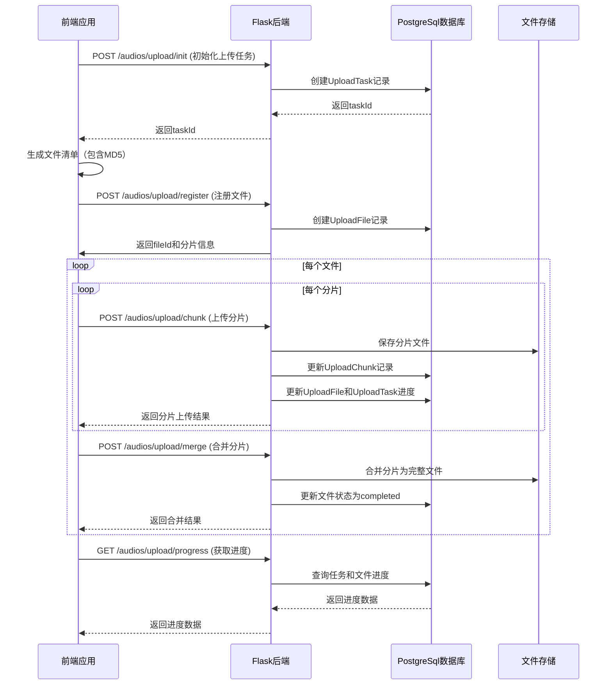
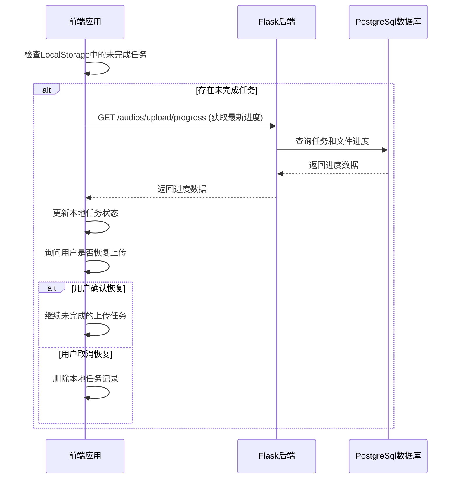
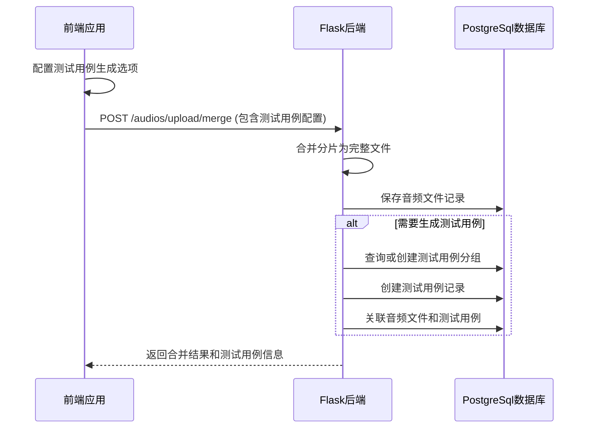

# 音频文件上传系统完整方案

## 1. 功能概述

### 1.1 核心功能
- 支持音频文件的分块上传（10MB/块）
- 支持大文件上传（30GB+）
- 支持批量文件夹上传（1280个文件）
- 支持文件统计信息显示（数量、总大小）
- 支持测试用例自动生成
- 支持上传进度恢复（页面刷新后）
- 支持文件完整性验证（MD5）
- 支持详细的上传进度显示
- 支持SPL（声压级）配置

### 1.2 技术栈
- **前端**：Vue 3 + Composition API
- **后端**：Flask + SQLAlchemy
- **数据库**：PostgreSql
- **文件存储**：本地文件系统
- **通信协议**：RESTful API + FormData（文件上传）
- **前端状态管理**：Vue Ref + LocalStorage
- **后端状态管理**：数据库存储

## 2. 系统架构

### 2.1 整体架构
```
┌─────────────────────────────────────────────────────────────────────────┐
│                            前端应用层                                │
├─────────────────────────────────────────────────────────────────────────┤
│  AudioImport.js          │  UploadFileModal.vue   │  API 调用层       │
│  - 上传任务管理         │  - 文件选择           │  - 分块上传API     │
│  - 分块上传逻辑         │  - 测试用例配置       │  - 进度查询API     │
│  - 进度恢复逻辑         │  - 上传状态显示       │  - 任务管理API     │
├─────────────────────────────────────────────────────────────────────────┤
│                            后端服务层                                │
├─────────────────────────────────────────────────────────────────────────┤
│  Flask API              │  AudioController      │  数据模型层       │
│  - 路由配置             │  - 分块上传处理       │  - UploadTask     │
│  - 跨域处理             │  - 文件合并逻辑       │  - UploadFile     │
│  - 错误处理             │  - 测试用例生成       │  - UploadChunk    │
├─────────────────────────────────────────────────────────────────────────┤
│                            存储层                                   │
├─────────────────────────────────────────────────────────────────────────┤
│  文件系统               │  PostgreSql数据库         │  LocalStorage     │
│  - 音频文件存储         │  - 上传任务记录       │  - 前端状态缓存     │
│  - 分片临时存储         │  - 文件信息存储       │  - 上传进度缓存     │
└─────────────────────────────────────────────────────────────────────────┘
```

### 2.2 数据模型设计

#### 2.2.1 UploadTask（上传任务）
| 字段名 | 类型 | 描述 |
|-------|------|------|
| id | String | 任务唯一标识符 |
| total_files | Integer | 总文件数量 |
| completed_files | Integer | 已完成文件数量 |
| failed_files | Integer | 失败文件数量 |
| total_size | Integer | 总文件大小（字节） |
| uploaded_size | Integer | 已上传大小（字节） |
| status | String | 任务状态（preparing/uploading/completed/failed） |
| created_at | DateTime | 创建时间 |
| updated_at | DateTime | 更新时间 |
| expired_at | DateTime | 任务过期时间 |

#### 2.2.2 UploadFile（上传文件）
| 字段名 | 类型 | 描述 |
|-------|------|------|
| id | String | 文件唯一标识符 |
| task_id | String | 关联任务ID |
| filename | String | 文件名 |
| original_filename | String | 原始文件名 |
| relative_path | String | 相对路径 |
| size | Integer | 文件大小（字节） |
| md5 | String | 文件MD5值 |
| status | String | 文件状态（pending/uploading/completed/failed） |
| uploaded_size | Integer | 已上传大小（字节） |
| completed_chunks | Integer | 已完成分片数量 |
| total_chunks | Integer | 总分片数量 |
| created_at | DateTime | 创建时间 |
| updated_at | DateTime | 更新时间 |

#### 2.2.3 UploadChunk（上传分片）
| 字段名 | 类型 | 描述 |
|-------|------|------|
| id | Integer | 分片唯一ID |
| file_id | String | 关联文件ID |
| chunk_index | Integer | 分片索引 |
| chunk_size | Integer | 分片大小（字节） |
| stored_path | String | 分片存储路径 |
| status | String | 分片状态（pending/uploading/completed/failed） |
| created_at | DateTime | 创建时间 |
| updated_at | DateTime | 更新时间 |

## 3. 核心流程设计

### 3.1 分块上传流程



### 3.2 进度恢复流程



### 3.3 测试用例生成流程



## 4. 详细设计

### 4.1 前端设计

#### 4.1.1 上传任务管理
- **功能**：管理上传任务的创建、更新、恢复、删除和自动清理
- **数据结构**：
  ```javascript
  {
    taskId: string,
    createdAt: string,
    status: string,
    totalFiles: number,
    completedFiles: number,
    failedFiles: number,
    totalSize: number,
    uploadedSize: number,
    files: Array<{
      name: string,
      path: string,
      size: number,
      md5: string,
      status: string,
      uploadedSize: number,
      totalSize: number
    }>,
    options: {
      createTestCase: boolean,
      testType: string,
      playbackDeviceId: string,
      spl: number,
      groupNameType: string,
      customGroupName: string
    }
  }
  ```
- **存储**：LocalStorage，键名：`audioUploadTasks`

#### 4.1.1.1 任务自动清理机制
- **功能**：自动清理无效和过期任务，优化本地存储使用
- **清理规则**：
  - 已完成/失败任务：超过24小时自动清理
  - 待上传/准备中任务：超过1小时自动清理
  - 上传中任务：保留
- **触发时机**：
  - 组件挂载时
  - 上传任务完成后
  - 任务状态变更时
- **核心实现**：
  ```javascript
  function cleanInvalidTasks() {
    const now = new Date().getTime();
    const dayMs = 24 * 60 * 60 * 1000; // 24小时
    const hourMs = 60 * 60 * 1000; // 1小时
    
    const tasks = getLocalTasks();
    const validTasks = tasks.filter(task => {
      const taskTime = new Date(task.createdAt).getTime();
      const taskAge = now - taskTime;
      
      if (['completed', 'failed'].includes(task.status)) {
        return taskAge < dayMs;
      }
      if (['pending', 'preparing'].includes(task.status)) {
        return taskAge < hourMs;
      }
      return true;
    });
    
    if (validTasks.length !== tasks.length) {
      localStorage.setItem('audioUploadTasks', JSON.stringify(validTasks));
      uploadTasks.value = validTasks;
    }
  }
  ```

#### 4.1.2 分块上传逻辑
- **功能**：处理单个文件的分块上传
- **分片大小**：10MB
- **核心算法**：
  ```javascript
  async function uploadFileInChunks(file, registeredFile, task) {
    // 1. 计算总分片数和每片大小
    // 2. 循环上传每个分片
    // 3. 更新上传进度
    // 4. 合并分片
  }
  ```

#### 4.1.3 进度恢复逻辑
- **功能**：页面刷新后恢复未完成的上传任务
- **触发时机**：组件挂载时
- **核心算法**：
  ```javascript
  async function checkAndResumeTasks() {
    // 1. 读取LocalStorage中的任务
    // 2. 过滤未完成的任务
    // 3. 询问用户是否恢复
    // 4. 恢复或删除任务
  }
  ```

#### 4.1.4 前端交互逻辑

##### 4.1.4.1 模态窗口交互流程
- **功能**：处理上传模态窗口的打开、配置和确认
- **交互流程**：
  ```javascript
  // 打开上传模态窗口
  function openUploadModal() {
    // 1. 构造测试用例生成选项
    // 2. 调用模态窗口管理器打开上传文件模态窗口
    // 3. 配置支持的文件格式和大小限制
    // 4. 注册onSubmit回调处理上传确认
  }
  
  // 处理上传确认
  async function onSubmit(data) {
    // 1. 更新上传选项
    // 2. 设置选中的文件
    // 3. 开始分块上传
  }
  ```

##### 4.1.4.2 文件选择和拖拽上传
- **功能**：支持文件选择和拖拽上传两种方式
- **交互逻辑**：
  ```javascript
  // 处理文件选择
  function handleFileSelect(event) {
    const files = Array.from(event.target.files);
    processFiles(files);
  }
  
  // 处理拖拽上传
  function handleDrop(event) {
    event.preventDefault();
    isDragActive.value = false;
    const files = Array.from(event.dataTransfer.files);
    processFiles(files);
  }
  
  // 处理文件
  function processFiles(files) {
    // 1. 过滤不支持的文件格式
    // 2. 过滤超过大小限制的文件
    // 3. 更新选中文件列表
  }
  ```

##### 4.1.4.3 测试用例配置交互
- **功能**：允许用户配置测试用例生成选项
- **交互逻辑**：
  ```javascript
  // 监听测试用例配置变化
  watch(uploadConfig, (newConfig) => {
    emit('configChange', newConfig);
  }, { deep: true });
  
  // 计算可见的选项（根据条件显示子选项）
  const visibleUploadOptions = computed(() => {
    // 1. 根据createTestCase选项决定是否显示测试类型
    // 2. 根据testType选项决定是否显示播放设备和SPL选项
    // 3. 返回过滤后的选项列表
  });
  ```

##### 4.1.4.4 上传进度显示
- **功能**：实时显示上传进度
- **交互逻辑**：
  ```javascript
  // 更新全局进度
  uploadProgress.value = Math.floor((task.uploadedSize / task.totalSize) * 100);
  
  // 更新当前上传文件
  currentUploadingFile.value = fileName;
  
  // 更新文件状态
  if (fileItem) {
    fileItem.status = 'uploading';
    fileItem.uploadedSize = uploadResult.uploadedSize;
    fileItem.completedChunks = uploadResult.completedChunks;
  }
  ```

##### 4.1.4.5 错误处理和用户反馈
- **功能**：处理上传过程中的错误并提供用户反馈
- **交互逻辑**：
  ```javascript
  try {
    // 上传逻辑
  } catch (err) {
    console.error('上传失败:', err);
    console.error('错误堆栈:', err.stack);
    console.error('错误详细信息:', {
      code: err.code,
      detail: err.detail,
      errors: err.errors,
      message: err.message
    });
    alert('上传失败: ' + (err.message || '未知错误'));
    uploadStatus.value = 'failed';
    uploadProgress.value = 0;
  }
  ```

##### 4.1.4.6 页面刷新后的进度恢复交互
- **功能**：处理页面刷新后的进度恢复
- **交互逻辑**：
  ```javascript
  // 检查并恢复未完成的上传任务
  async function checkAndResumeTasks() {
    const tasks = getLocalTasks();
    if (tasks.length === 0) {
      return;
    }
    
    // 过滤出未完成的任务
    const pendingTasks = tasks.filter(task => 
      task.status !== 'completed' && task.status !== 'failed'
    );
    
    if (pendingTasks.length === 0) {
      return;
    }
    
    // 询问用户是否恢复上传
    const task = pendingTasks[0]; // 只恢复最新的一个任务
    const shouldResume = confirm(
      `检测到未完成的上传任务（${task.completedFiles}/${task.totalFiles} 个文件，已上传 ${formatFileSize(task.uploadedSize)}/${formatFileSize(task.totalSize)}），是否继续上传？`
    );
    
    if (shouldResume) {
      // 恢复任务
      await resumeUploadTask(task.taskId);
    } else {
      // 删除任务
      removeLocalTask(task.taskId);
      uploadTasks.value = getLocalTasks();
    }
  }
  ```

##### 4.1.4.7 上传完成后的处理
- **功能**：处理上传完成后的后续操作
- **交互逻辑**：
  ```javascript
  // 上传完成后更新状态
  uploadStatus.value = 'completed';
  
  // 准备刷新列表
  uploadProgress.value = 90;
  // 刷新音频列表
  await fetchAudios();
  // 上传完成
  uploadProgress.value = 100;
  
  // 显示上传完成消息
  let message = `成功上传 ${task.completedFiles} 个音频文件`;
  if (task.failedFiles > 0) {
    message += `，失败 ${task.failedFiles} 个文件`;
  }
  alert(message);
  
  // 重置上传选项
  uploadOptions.value = {
    createTestCase: false,
    testType: 'api',
    playbackDeviceId: null,
    spl: 65.0,
    groupNameType: 'root',
    customGroupName: ''
  };
  
  setTimeout(() => {
    closeModal('uploadModal');
    uploadProgress.value = 0;
    selectedFilesForUpload.value = [];
    fileList.value = [];
    currentTask.value = null;
    uploadStatus.value = 'idle';
    currentUploadingFile.value = null;
  }, 1000);
  ```

##### 4.1.4.8 批量从文件夹导入交互

##### 4.1.4.8.1 文件夹导入模态窗口流程
- **功能**：处理批量文件夹导入的配置和确认
- **交互流程**：
  ```javascript
  // 打开批量文件夹导入模态窗口
  function openFolderImportModal() {
    // 1. 构造测试用例生成选项
    // 2. 调用模态窗口管理器打开文件夹导入模态窗口
    // 3. 配置支持的文件格式
    // 4. 注册onSubmit回调处理上传确认
  }
  
  // 处理文件夹导入确认
  async function handleFolderImport(event) {
    // 1. 获取配置和选中的文件
    // 2. 更新上传选项
    // 3. 关闭模态窗口
    // 4. 设置选中的文件
    // 5. 生成文件清单
    // 6. 开始分块上传
  }
  ```

##### 4.1.4.8.2 文件夹选择和处理
- **功能**：支持在模态窗口中选择文件夹，显示统计信息，用户确认后执行上传
- **交互逻辑**：
  ```javascript
  // 处理文件选择
  function handleFolderSelect(event) {
    const files = Array.from(event.target.files);
    processFiles(files);
  }
  
  // 处理拖拽上传
  function handleDrop(event) {
    event.preventDefault();
    isDragActive.value = false;
    const files = Array.from(event.dataTransfer.files);
    processFiles(files);
  }
  
  // 处理文件
  function processFiles(files) {
    // 1. 过滤不支持的文件格式
    // 2. 更新选中文件列表
    // 3. 显示文件统计信息（数量、总大小）
    // 4. 启用"开始上传"按钮
  }
  
  // 开始导入
  async function handleImport() {
    if (selectedFiles.value.length === 0) return;
    
    importing.value = true;
    importProgress.value = 0;
    
    try {
      // 发送确认事件，将配置和选中的文件传递给父组件处理
      emit('confirm', { 
        config: uploadConfig.value,
        files: selectedFiles.value 
      });
      
      importing.value = false;
      importProgress.value = 0;
      selectedFiles.value = [];
    } catch (error) {
      console.error('文件夹导入失败:', error);
      importing.value = false;
      importProgress.value = 0;
    }
  }
  ```

##### 4.1.4.8.3 模态窗口确认处理
- **功能**：处理模态窗口确认事件，执行实际的上传操作
- **交互逻辑**：
  ```javascript
  // 处理批量文件夹导入确认
  async function handleFolderImport(event) {
    console.log('AudioImport: 处理批量文件夹导入', event);
    const { config, files } = event;
    
    if (!files || files.length === 0) {
      alert('请先选择文件夹');
      return;
    }
    
    // 更新folderImportOptions
    folderImportOptions.value = {
      createTestCase: config.createTestCase || false,
      testType: config.testType || 'api',
      playbackDeviceId: config.playbackDeviceId || null,
      spl: config.defaultSpl || 65.0,
      groupNameType: config.groupNameType || 'root',
      customGroupName: config.customGroupName || ''
    };
    
    // 关闭模态框
    const manager = getModalManager();
    manager.closeModal(MODAL_TYPES.FOLDER_IMPORT);
    
    // 使用模态框返回的文件进行上传
    loading.value = true;
    uploadProgress.value = 0;
    
    try {
      // 浏览器环境：使用performFolderImport处理批量文件夹导入
      const result = await performFolderImport(files, false);
      
      uploadProgress.value = 90;
      await fetchAudios();
      uploadProgress.value = 100;
      
      setTimeout(() => {
        uploadProgress.value = 0;
      }, 500);
      
      alert(`成功导入 ${result.importedCount} 个音频文件${result.testCaseCount > 0 ? `，并创建了 ${result.testCaseCount} 个测试用例` : ''}`);
    } catch (err) {
      console.error('文件夹导入失败:', err);
      alert('导入失败: ' + err.message);
      uploadProgress.value = 0;
    } finally {
      loading.value = false;
    }
  }
  ```

##### 4.1.4.8.4 浏览器环境下的批量导入逻辑
- **功能**：在浏览器环境下处理批量文件夹导入，包含完整的任务管理
- **核心实现**：
  ```javascript
  async function performFolderImport(source, isElectron, groupName = null) {
    // 浏览器环境
    const files = source;
    
    // 只处理支持的音频文件
    const audioFiles = files.filter(file => {
      const parts = file.name.toLowerCase().split('.');
      if (parts.length < 2) return false;
      const ext = parts.pop();
      return supportedAudioExts.includes(ext);
    });
    
    if (audioFiles.length === 0) {
      return { importedCount: 0, testCaseCount: 0 };
    }
    
    // 创建上传任务
    const taskId = generateTaskId();
    const task = {
      taskId,
      createdAt: new Date().toISOString(),
      status: 'uploading',
      totalFiles: audioFiles.length,
      completedFiles: 0,
      failedFiles: 0,
      totalSize: audioFiles.reduce((sum, file) => sum + file.size, 0),
      uploadedSize: 0,
      files: audioFiles.map(file => ({
        name: file.name,
        path: file.webkitRelativePath || file.name,
        size: file.size,
        status: 'pending',
        uploadedSize: 0,
        totalSize: file.size
      })),
      options: { ...folderImportOptions.value }
    };
    
    // 保存任务
    saveLocalTask(task);
    uploadTasks.value = getLocalTasks();
    
    // 逐个上传文件
    for (let i = 0; i < audioFiles.length; i++) {
      const file = audioFiles[i];
      const fileItem = task.files[i];
      
      // 上传文件...
      try {
        fileItem.status = 'uploading';
        saveLocalTask(task);
        
        const response = await audiosApi.upload(formData);
        fileItem.status = 'completed';
        fileItem.uploadedSize = fileItem.size;
        task.completedFiles++;
        task.uploadedSize += fileItem.size;
        importedCount++;
      } catch (err) {
        fileItem.status = 'failed';
        task.failedFiles++;
      }
      
      saveLocalTask(task);
    }
    
    // 上传完成，更新任务状态
    task.status = 'completed';
    saveLocalTask(task);
    uploadTasks.value = getLocalTasks();
    
    return { importedCount, testCaseCount };
  }
  ```

##### 4.1.4.8.4 分块上传执行逻辑
- **功能**：执行实际的分块上传操作
- **交互逻辑**：
  ```javascript
  // 分片上传实现
  async function startChunkUpload() {
    try {
      console.log('开始分块上传流程');
      
      // 生成文件清单
      console.log('步骤1: 生成文件清单');
      fileList.value = await generateFileList(selectedFilesForUpload.value);
      console.log('文件清单生成完成:', fileList.value);
      
      // 步骤2: 检查是否存在未完成的上传任务，自动检测并恢复
      console.log('步骤2: 检查是否存在未完成的上传任务');
      let taskId = null;
      let existingTask = null;
      
      // 获取所有本地未完成任务
      const localTasks = getLocalTasks();
      const pendingTasks = localTasks.filter(task => 
        task.status !== 'completed' && task.status !== 'failed'
      );
      
      // 检查是否有匹配的未完成任务
      if (pendingTasks.length > 0) {
        for (const task of pendingTasks) {
          // 比较任务中的文件与当前选择的文件是否匹配
          const hasMatchingFiles = task.files.some(taskFile => 
            fileList.value.some(selectedFile => selectedFile.name === taskFile.name)
          );
          
          if (hasMatchingFiles) {
            // 检查后端任务是否存在
            try {
              const progressResult = await audiosApi.getUploadProgress(task.taskId);
              if (progressResult && progressResult.task) {
                // 后端任务存在，提示用户是否恢复
                const shouldResume = confirm(
                  `检测到未完成的上传任务（任务ID: ${task.taskId}），包含与当前选择文件匹配的项，是否继续上传？`
                );
                
                if (shouldResume) {
                  taskId = task.taskId;
                  existingTask = task;
                  console.log('恢复现有任务:', taskId);
                  break;
                }
              }
            } catch (err) {
              console.error('检查任务进度失败:', err);
              // 任务不存在，跳过
              continue;
            }
          }
        }
      }
      
      // 如果没有找到匹配的任务，初始化新任务
      if (!taskId) {
        console.log('步骤3: 初始化新上传任务');
        const taskInitResult = await audiosApi.initUpload();
        console.log('初始化上传任务结果:', taskInitResult);
        taskId = taskInitResult.taskId;
        console.log('创建新任务:', taskId);
      }
      
      // 检查文件清单是否为空
      if (fileList.value.length === 0) {
        throw new Error('没有找到支持的音频文件，请检查文件格式是否正确');
      }
      
      // 注册文件
      console.log('步骤4: 注册文件');
      const registerResult = await audiosApi.registerUploadFiles(taskId, fileList.value);
      console.log('文件注册结果:', registerResult);
      
      // 更新本地任务
      console.log('步骤5: 更新本地任务');
      let task;
      if (existingTask) {
        // 更新现有任务
        task = existingTask;
        task.status = 'uploading';
        task.files = fileList.value;
        task.totalFiles = fileList.value.length;
        task.totalSize = fileList.value.reduce((sum, file) => sum + file.size, 0);
        task.options = { ...uploadOptions.value };
      } else {
        // 创建新任务
        task = initUploadTask();
        task.taskId = taskId;
      }
      saveLocalTask(task);
      console.log('本地任务更新完成:', task);
      
      // 开始上传
      console.log('步骤6: 开始上传');
      uploadStatus.value = 'uploading';
      
      // 上传所有文件
      console.log('步骤7: 上传所有文件');
      for (let i = 0; i < selectedFilesForUpload.value.length; i++) {
        console.log(`上传文件 ${i+1}/${selectedFilesForUpload.value.length}`);
        const file = selectedFilesForUpload.value[i];
        const fileInfo = fileList.value[i];
        const registeredFile = registerResult.files.find(f => f.filename === fileInfo.name);
        
        if (registeredFile) {
          console.log(`开始上传文件: ${fileInfo.name}，文件ID: ${registeredFile.fileId}`);
          await uploadFileInChunks(file, registeredFile, task);
        }
      }
      
      // 上传完成后更新状态
      console.log('步骤8: 上传完成');
      uploadStatus.value = 'completed';
      // 更新任务状态为已完成
      task.status = 'completed';
      saveLocalTask(task);
      // 清理无效任务
      cleanInvalidTasks();
      uploadTasks.value = getLocalTasks();
      
      // 准备刷新列表
      uploadProgress.value = 90;
      // 刷新音频列表
      console.log('步骤9: 刷新音频列表');
      await fetchAudios();
      // 上传完成
      uploadProgress.value = 100;
      
      // 显示上传完成消息
      let message = `成功上传 ${task.completedFiles} 个音频文件`;
      if (task.failedFiles > 0) {
        message += `，失败 ${task.failedFiles} 个文件`;
      }
      alert(message);
      
      // 重置上传选项
      uploadOptions.value = {
        createTestCase: false,
        testType: 'api',
        playbackDeviceId: null,
        spl: 65.0,
        groupNameType: 'root',
        customGroupName: ''
      };
      
      setTimeout(() => {
        closeModal('uploadModal');
        uploadProgress.value = 0;
        selectedFilesForUpload.value = [];
        fileList.value = [];
        currentTask.value = null;
        uploadStatus.value = 'idle';
        currentUploadingFile.value = null;
      }, 1000);
    } catch (err) {
      console.error('上传失败:', err);
      console.error('错误堆栈:', err.stack);
      console.error('错误详细信息:', {
        code: err.code,
        detail: err.detail,
        errors: err.errors,
        message: err.message
      });
      alert('上传失败: ' + (err.message || '未知错误'));
      uploadStatus.value = 'failed';
      // 重置进度
      uploadProgress.value = 0;
    } finally {
      loading.value = false;
    }
  }
  
  // 分片上传单个文件
  async function uploadFileInChunks(file, registeredFile, task) {
    const { fileId, filename } = registeredFile;
    // 确保有totalChunks和chunkSize，处理恢复上传的情况
    const totalChunks = registeredFile.totalChunks || registeredFile.total_chunks;
    // 默认chunkSize为10MB
    const chunkSize = registeredFile.chunkSize || 10 * 1024 * 1024;
    const fileName = typeof file === 'string' ? pathBasename(file) : file.name;
    
    currentUploadingFile.value = fileName;
    
    // 更新文件状态
    const fileItem = task.files.find(f => f.name === fileName);
    if (fileItem) {
      fileItem.status = 'uploading';
    }
    
    try {
      // 分片上传
      for (let chunkIndex = 0; chunkIndex < totalChunks; chunkIndex++) {
        // 计算分片范围
        const start = chunkIndex * chunkSize;
        const end = Math.min(start + chunkSize, file.size);
        
        // 获取分片数据
        let chunkData;
        if (typeof file === 'string') {
          // Electron环境：文件路径，这里简化处理，实际应该读取文件分片
          throw new Error('Electron环境的分片上传尚未实现');
        } else {
          // 浏览器环境：File对象
          chunkData = file.slice(start, end);
        }
        
        // 创建FormData
        const formData = new FormData();
        formData.append('fileId', fileId);
        formData.append('chunkIndex', chunkIndex);
        formData.append('totalChunks', totalChunks);
        formData.append('taskId', task.taskId);
        formData.append('chunk', chunkData);
        
        // 上传分片
        const uploadResult = await audiosApi.uploadChunk(formData);
        
        // 更新进度
        if (fileItem) {
          fileItem.uploadedSize = uploadResult.uploadedSize;
          fileItem.completedChunks = uploadResult.completedChunks;
        }
        
        // 更新任务进度
        task.uploadedSize = uploadResult.taskProgress.uploadedSize;
        task.completedFiles = uploadResult.taskProgress.completedFiles;
        task.status = uploadResult.taskProgress.status;
        
        // 更新全局进度
        uploadProgress.value = Math.floor((task.uploadedSize / task.totalSize) * 100);
        
        saveLocalTask(task);
      }
      
      // 合并分片
    const mergeData = {
      createTestCase: uploadOptions.value.createTestCase,
      testType: uploadOptions.value.testType,
      defaultPlaybackDeviceId: uploadOptions.value.playbackDeviceId,
      defaultSpl: uploadOptions.value.spl,
      testCaseGroupName: getEffectiveGroupName()
    };
    
    const mergeResult = await audiosApi.mergeChunks(fileId, task.taskId, mergeData);
    
    // 更新文件状态
    if (fileItem) {
      fileItem.status = 'completed';
    }
    
    // 使用服务器返回的最新completedFiles值，避免重复计数
    if (mergeResult && mergeResult.taskProgress) {
      task.completedFiles = mergeResult.taskProgress.completedFiles;
    } else {
      // 如果服务器没有返回taskProgress，则确保completedFiles不会超过totalFiles
      task.completedFiles = Math.min(task.completedFiles + 1, task.totalFiles);
    }
    saveLocalTask(task);
    } catch (err) {
      console.error(`文件 ${fileName} 上传失败:`, err);
      if (fileItem) {
        fileItem.status = 'failed';
      }
      task.failedFiles++;
      saveLocalTask(task);
    }
  }
  ```

### 4.2 后端设计

#### 4.2.1 分块上传API
| API端点 | 方法 | 功能 | 请求体 | 响应体 |
|---------|------|------|--------|--------|
| `/audios/upload/init` | POST | 初始化上传任务 | `{}` | `{ taskId: string }` |
| `/audios/upload/register` | POST | 注册上传文件 | `{ taskId: string, files: Array<{ name, path, size, md5 }> }` | `{ files: Array<{ fileId, totalChunks, chunkSize }> }` |
| `/audios/upload/chunk` | POST | 上传分片 | `FormData: { fileId, chunkIndex, totalChunks, taskId, chunk }` | `{ fileId, chunkIndex, completedChunks, uploadedSize, taskProgress }` |
| `/audios/upload/merge` | POST | 合并分片 | `{ fileId, taskId, createTestCase, testType, ... }` | `{ fileId, audioId, status, testCaseId }` |
| `/audios/upload/progress` | GET | 获取上传进度 | `?taskId=string` | `{ task: {}, files: Array<{}> }` |

#### 4.2.2 文件合并逻辑
- **功能**：将多个分片合并为完整文件
- **核心算法**：
  ```python
  def merge_chunks(fileId, taskId, mergeData):
    # 1. 检查所有分片是否已上传
    # 2. 按照分片索引顺序合并文件
    # 3. 提取音频元数据
    # 4. 保存音频文件记录
    # 5. 生成测试用例（如果需要）
    # 6. 清理临时分片文件
  ```

#### 4.2.3 测试用例生成逻辑
- **功能**：根据音频文件生成测试用例
- **核心算法**：
  ```python
  def _create_test_case_from_audio(audio_id, test_type, audio_tags, ...):
    # 1. 获取或创建测试用例分组
    # 2. 创建测试用例名称和配置
    # 3. 保存测试用例记录
    # 4. 关联音频文件和测试用例
    # 5. 继承音频标签
  ```

## 5. 代码实现

### 5.1 前端关键代码

#### 5.1.1 API调用层（api.js）
```javascript
// 分块上传相关API
async initUpload() {
  return request('POST', '/audios/upload/init', {});
},

async registerUploadFiles(taskId, files) {
  return request('POST', '/audios/upload/register', { taskId, files });
},

async uploadChunk(chunkData) {
  return request('POST', '/audios/upload/chunk', chunkData, { isMultipart: true });
},

async mergeChunks(fileId, taskId, mergeData = {}) {
  return request('POST', '/audios/upload/merge', { fileId, taskId, ...mergeData });
},

async getUploadProgress(taskId) {
  return request('GET', `/audios/upload/progress?taskId=${taskId}`);
}
```

#### 5.1.2 分块上传核心逻辑（AudioImport.js）
```javascript
// 分片上传实现
async function startChunkUpload() {
  try {
    // 1. 初始化上传任务
    // 2. 生成文件清单
    // 3. 注册文件
    // 4. 上传所有文件
    // 5. 合并分片
    // 6. 刷新音频列表
  } catch (err) {
    // 错误处理
  }
}

// 分片上传单个文件
async function uploadFileInChunks(file, registeredFile, task) {
  try {
    // 1. 计算分片范围
    // 2. 获取分片数据
    // 3. 创建FormData
    // 4. 上传分片
    // 5. 更新进度
  } catch (err) {
    // 错误处理
  }
}
```

### 5.2 后端关键代码

#### 5.2.1 路由配置（audio_bp.py）
```python
# 分片上传相关接口
@audio_bp.route('/upload/init', methods=['POST'])
def init_upload():
    return AudioController.init_upload_task()

@audio_bp.route('/upload/register', methods=['POST'])
def register_upload():
    return AudioController.register_upload_file()

@audio_bp.route('/upload/chunk', methods=['POST'])
def upload_chunk():
    return AudioController.upload_chunk()

@audio_bp.route('/upload/merge', methods=['POST'])
def merge_chunks():
    return AudioController.merge_chunks()

@audio_bp.route('/upload/progress', methods=['GET'])
def get_upload_progress():
    return AudioController.get_upload_progress()
```

#### 5.2.2 分块上传处理（audio_controller.py）
```python
# 初始化上传任务
@staticmethod
def init_upload_task():
    # 生成任务ID
    # 创建UploadTask记录
    # 返回taskId

# 注册上传文件
@staticmethod
def register_upload_file():
    # 验证任务存在
    # 注册文件
    # 返回fileId和分片信息

# 上传分片
@staticmethod
def upload_chunk():
    # 获取分片信息
    # 保存分片文件
    # 更新分片、文件和任务进度
    # 返回分片上传结果

# 合并分片
@staticmethod
def merge_chunks():
    # 检查所有分片是否已上传
    # 合并分片为完整文件
    # 保存音频文件记录
    # 生成测试用例（如果需要）
    # 返回合并结果
```

## 6. 测试和部署

### 6.1 测试策略

#### 6.1.1 单元测试
- **前端**：测试核心函数（calculateFileMD5, generateFileList, uploadFileInChunks）
- **后端**：测试API端点和核心逻辑（init_upload_task, register_upload_file, upload_chunk, merge_chunks）

#### 6.1.2 集成测试
- 测试完整的分块上传流程
- 测试进度恢复功能
- 测试批量文件夹上传
- 测试测试用例生成功能

#### 6.1.3 性能测试
- 测试大文件上传（30GB+）
- 测试批量文件上传（1280个文件）
- 测试上传速度和CPU/内存占用

### 6.2 部署方案

#### 6.2.1 开发环境
- **前端**：`npm run dev`（Vite开发服务器）
- **后端**：`python run.py`（Flask开发服务器）
- **数据库**：PostgreSql（自动创建）

#### 6.2.2 生产环境
- **前端**：`npm run build` + Nginx部署
- **后端**：Gunicorn + Flask + Supervisor
- **数据库**：PostgreSql（或迁移到PostgreSQL）
- **文件存储**：单独的文件服务器或云存储

## 7. 监控和维护

### 7.1 日志记录

#### 7.1.1 前端日志
- 上传步骤日志
- 错误日志
- 性能日志（上传速度、耗时）

#### 7.1.2 后端日志
- API请求日志
- 错误日志
- 数据库操作日志
- 文件操作日志

### 7.2 监控指标

- 上传成功率
- 平均上传速度
- 平均上传耗时
- 失败率和失败原因
- 服务器资源使用率（CPU、内存、磁盘）

### 7.3 维护建议

- 定期清理过期的上传任务和临时文件
- 监控文件系统空间使用情况
- 定期备份数据库
- 优化大文件上传的内存使用
- 考虑添加断点续传的暂停/恢复功能

## 8. 总结

本方案设计了一个完整的音频文件上传系统，支持分块上传、进度恢复、测试用例生成等功能。系统采用了前后端分离的架构，前端使用Vue 3，后端使用Flask，数据库使用PostgreSql，文件存储使用本地文件系统。系统支持大文件上传和批量文件夹上传，能够处理30GB+的文件和1280个文件的批量上传。

系统的核心功能包括：
- 分块上传（10MB/块）
- 上传进度恢复
- 文件完整性验证（MD5）
- 测试用例自动生成
- 详细的上传进度显示
- SPL配置

本方案的设计考虑了系统的可靠性、性能和用户体验，能够满足用户的需求，同时提供了良好的扩展性和可维护性。