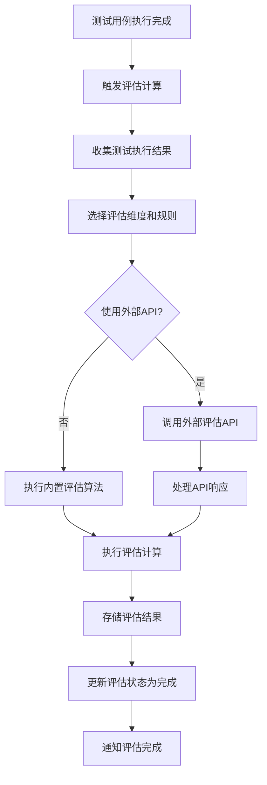
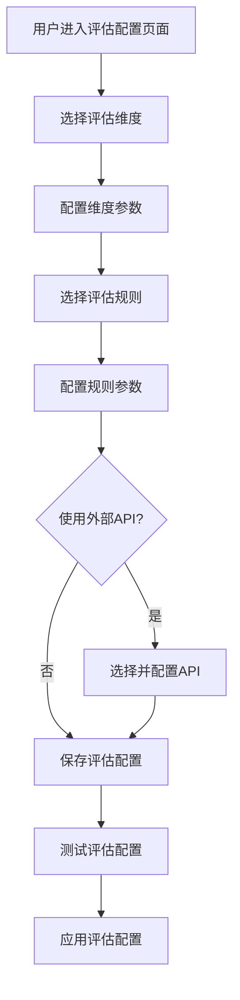
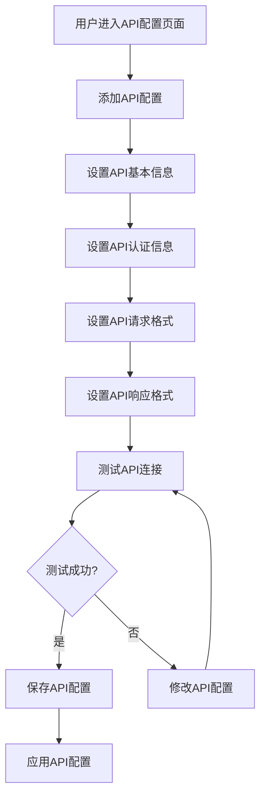
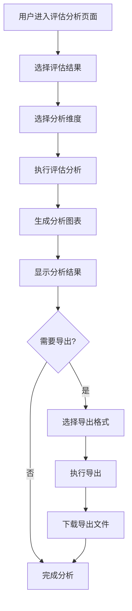

# 评估系统功能设计文档

## 1. 概述

### 1.1 文档目的

本文档描述智能语音测试系统中评估系统（Evaluation）功能模块的详细设计，包括功能定位、架构设计、核心流程、技术实现和用户界面等方面。评估系统功能作为系统的核心分析能力之一，旨在为用户提供多维度语音评估，支持自定义评估规则和API集成，满足不同场景的评估需求。

### 1.2 功能定位

评估系统功能位于系统测试结果评估的核心位置，主要解决以下测试场景需求：

- **多维度评估**：提供准确率、召回率、F1分数等多维度评估指标
- **自定义评估规则**：支持用户自定义评估规则和指标
- **API集成**：支持集成第三方评估API，扩展评估能力
- **实时评估**：实时计算评估分数，快速定位语音识别问题
- **评估标准管理**：管理评估标准和阈值
- **评估结果分析**：提供评估结果的分析和可视化

该功能适用于语音识别质量评估、翻译质量评估、语音合成质量评估等场景，是确保语音测试结果可量化和可分析的重要工具。

### 1.3 术语定义

| 术语 | 解释 |
|------|------|
| 评估维度 | 评估的具体方面，如准确率、召回率、F1分数等 |
| 评估指标 | 用于衡量评估维度的具体数值指标 |
| 评估规则 | 定义如何计算评估指标的规则 |
| 评估标准 | 评估指标的判断标准和阈值 |
| 评估API | 提供评估服务的外部API |
| 评估结果 | 评估计算的结果数据 |
| 评估报告 | 包含评估结果和分析的报告 |
| 评估阈值 | 评估指标的判断阈值，用于确定结果是否合格 |

## 2. 系统架构设计

### 2.1 整体架构

评估系统功能采用前后端分离的三层架构设计，包含前端展示层、后端评估服务层和评估计算层。

**前端展示层**：基于Vue 3框架构建，提供用户界面、评估配置、实时监控和结果展示功能。前端通过WebSocket与后端建立实时通信，接收评估进度和状态更新。

**后端评估服务层**：基于Flask框架实现，负责评估维度管理、评估规则配置、API集成和评估计算调度。后端通过异步IO处理评估计算，通过WebSocket向前端推送实时数据。

**评估计算层**：负责具体的评估计算，包括内置评估算法和外部评估API调用。支持多种评估维度的计算和分析。

### 2.2 核心组件

| 组件 | 职责 | 技术实现 | 通信方式 |
|------|------|----------|----------|
| 前端评估配置页面 | 提供用户界面、评估配置、实时监控和结果展示 | Vue 3 + WebSocket | WebSocket推送 |
| 后端评估服务 | 负责评估维度管理、评估规则配置、API集成和评估计算调度 | Flask + SQLAlchemy | HTTP REST + WebSocket |
| 评估维度管理 | 管理评估维度的定义和配置 | Flask + SQLAlchemy | 数据库操作 |
| 评估规则管理 | 管理评估规则的定义和配置 | Flask + SQLAlchemy | 数据库操作 |
| 评估计算引擎 | 执行具体的评估计算 | Python评估库 | 内存计算 |
| API集成管理 | 管理与外部评估API的集成 | Flask + HTTP客户端 | HTTP请求 |
| 评估结果管理 | 管理评估结果的存储和分析 | Flask + SQLAlchemy | 数据库操作 |

### 2.3 数据流设计

评估系统功能的数据流设计遵循单向数据流原则，确保数据传输的清晰性和可追溯性。

1. **评估配置数据流**：用户在前端配置评估维度和规则 → 前端通过HTTP POST发送到后端 → 后端存储评估配置 → 前端通过WebSocket接收配置成功通知

2. **评估执行数据流**：测试任务执行 → 触发评估计算 → 后端获取测试结果 → 后端执行评估计算 → 后端存储评估结果 → 前端通过WebSocket接收评估完成通知 → 前端显示评估结果

3. **API集成数据流**：用户在前端配置外部评估API → 前端通过HTTP POST发送到后端 → 后端存储API配置 → 后端测试API连接性 → 前端通过WebSocket接收API状态通知

4. **结果分析数据流**：前端请求评估结果分析 → 后端查询评估结果 → 后端计算分析指标 → 后端生成分析图表数据 → 前端显示分析结果 → 前端请求导出分析报告 → 后端生成分析报告 → 前端下载分析报告

### 2.4 依赖关系

评估系统功能依赖以下系统模块：

- **测试执行模块**：用于获取测试执行结果
- **结果处理模块**：用于处理测试执行结果数据
- **报告管理模块**：用于生成包含评估结果的报告
- **任务管理模块**：用于关联测试任务
- **用例管理模块**：用于获取测试用例信息
- **设备管理模块**：用于获取设备信息

## 3. 核心功能模块

### 3.1 评估维度管理

#### 3.1.1 维度定义

维度定义模块负责评估维度的定义和管理。

**内置维度**
- **ASR评估维度**：字错率（CER）、词错率（WER）、句错率（SER）
- **翻译评估维度**：BLEU分数、COMET分数、CHRF分数
- **语音合成评估维度**：MOS分数、PESQ分数、STOI分数
- **对话评估维度**：任务完成率、意图识别准确率、槽位填充准确率

**自定义维度**
- 支持用户自定义评估维度
- 支持设置维度名称、描述、计算方法
- 支持设置维度的单位和范围
- 支持设置维度的权重

#### 3.1.2 维度配置

维度配置模块负责评估维度的配置和管理。

**维度参数配置**
- 支持设置维度的计算参数
- 支持设置维度的阈值
- 支持设置维度的权重
- 支持设置维度的显示方式

**维度分组**
- 支持将维度分组管理
- 支持设置组的名称和描述
- 支持设置组的权重
- 支持组的嵌套结构

**维度激活**
- 支持激活/禁用维度
- 支持批量激活/禁用维度
- 支持按组激活/禁用维度

### 3.2 评估规则管理

#### 3.2.1 规则定义

规则定义模块负责评估规则的定义和管理。

**内置规则**
- **准确率计算**：计算正确识别的比例
- **召回率计算**：计算正确识别的比例（基于参考）
- **F1分数计算**：计算准确率和召回率的调和平均
- **BLEU计算**：计算机器翻译评估分数
- **WER计算**：计算词错率
- **CER计算**：计算字错率

**自定义规则**
- 支持用户自定义评估规则
- 支持使用Python脚本定义规则
- 支持规则参数配置
- 支持规则版本控制

#### 3.2.2 规则配置

规则配置模块负责评估规则的配置和管理。

**规则参数配置**
- 支持设置规则的计算参数
- 支持设置规则的阈值
- 支持设置规则的权重
- 支持设置规则的执行顺序

**规则组合**
- 支持将多个规则组合使用
- 支持设置规则的逻辑关系（与、或、非）
- 支持设置规则的优先级
- 支持规则的嵌套组合

**规则测试**
- 支持测试规则的执行结果
- 支持验证规则的正确性
- 支持调试规则的执行过程

### 3.3 API集成管理

#### 3.3.1 API配置

API配置模块负责外部评估API的配置和管理。

**API添加**
- 支持添加外部评估API
- 支持设置API名称、URL、认证信息
- 支持设置API请求格式和响应格式
- 支持设置API参数模板

**API编辑**
- 支持编辑现有API配置
- 支持更新API认证信息
- 支持更新API请求和响应格式
- 支持更新API参数模板

**API测试**
- 支持测试API连接性
- 支持测试API响应时间
- 支持测试API返回结果格式
- 支持测试API错误处理

#### 3.3.2 API使用

API使用模块负责外部评估API的使用和管理。

**API选择**
- 支持为评估维度选择使用的API
- 支持设置API的使用条件
- 支持设置API的备用方案
- 支持设置API的优先级

**API调用**
- 支持调用外部评估API
- 支持处理API响应
- 支持处理API错误
- 支持API调用重试

**API监控**
- 支持监控API的使用情况
- 支持监控API的响应时间
- 支持监控API的错误率
- 支持监控API的调用次数

### 3.4 评估计算

#### 3.4.1 实时评估

实时评估模块负责实时执行评估计算。

**触发机制**
- 测试用例执行完成后自动触发
- 支持手动触发评估计算
- 支持批量触发评估计算

**计算过程**
- 收集测试执行结果
- 选择评估维度和规则
- 执行评估计算
- 存储评估结果
- 通知评估完成

**计算优化**
- 支持并行计算多个评估维度
- 支持缓存计算结果
- 支持增量计算
- 支持分布式计算

#### 3.4.2 批量评估

批量评估模块负责批量执行评估计算。

**批量触发**
- 支持基于时间范围批量触发
- 支持基于任务批量触发
- 支持基于设备批量触发

**批量处理**
- 支持批量收集测试执行结果
- 支持批量执行评估计算
- 支持批量存储评估结果
- 支持批量通知评估完成

**批量监控**
- 实时监控批量评估进度
- 实时监控批量评估状态
- 实时监控批量评估错误

### 3.5 评估结果管理

#### 3.5.1 结果存储

结果存储模块负责评估结果的存储和管理。

**存储结构**
- 按评估维度存储结果
- 按评估时间存储结果
- 按评估对象存储结果
- 按评估规则存储结果

**存储格式**
- 支持JSON格式存储
- 支持CSV格式存储
- 支持数据库存储

**存储管理**
- 支持结果的压缩存储
- 支持结果的过期清理
- 支持结果的备份和恢复

#### 3.5.2 结果查询

结果查询模块负责评估结果的查询和管理。

**查询条件**
- 支持按评估维度查询
- 支持按评估时间查询
- 支持按评估对象查询
- 支持按评估规则查询

**查询结果**
- 支持返回原始结果
- 支持返回聚合结果
- 支持返回趋势结果
- 支持返回对比结果

**查询优化**
- 支持查询缓存
- 支持查询索引
- 支持查询分页

### 3.6 评估标准管理

#### 3.6.1 标准定义

标准定义模块负责评估标准的定义和管理。

**内置标准**
- **ASR标准**：CER < 5%为优秀，< 10%为良好，< 20%为合格
- **翻译标准**：BLEU > 0.8为优秀，> 0.6为良好，> 0.4为合格
- **语音合成标准**：MOS > 4.0为优秀，> 3.5为良好，> 3.0为合格

**自定义标准**
- 支持用户自定义评估标准
- 支持设置标准的名称和描述
- 支持设置标准的等级和阈值
- 支持设置标准的适用范围

#### 3.6.2 标准应用

标准应用模块负责评估标准的应用和管理。

**标准选择**
- 支持为评估维度选择适用的标准
- 支持设置标准的使用条件
- 支持设置标准的优先级

**标准评估**
- 支持根据标准评估结果
- 支持显示评估等级
- 支持显示评估建议
- 支持显示评估趋势

**标准监控**
- 支持监控标准的使用情况
- 支持监控标准的评估结果
- 支持监控标准的有效性

### 3.7 评估分析

#### 3.7.1 结果分析

结果分析模块负责评估结果的分析和管理。

**基本分析**
- 计算评估结果的统计指标
- 分析评估结果的分布
- 分析评估结果的趋势
- 分析评估结果的异常

**维度分析**
- 分析不同维度的评估结果
- 分析维度之间的相关性
- 分析维度的重要性
- 分析维度的一致性

**对比分析**
- 对比不同时间的评估结果
- 对比不同设备的评估结果
- 对比不同模型的评估结果
- 对比不同参数的评估结果

#### 3.7.2 数据可视化

数据可视化模块负责评估结果的可视化和管理。

**图表类型**
- **趋势图**：显示评估结果的变化趋势
- **分布图**：显示评估结果的分布情况
- **对比图**：显示不同评估结果的对比
- **热力图**：显示评估结果的密度分布
- **雷达图**：显示多维度评估结果

**可视化配置**
- 支持配置图表类型
- 支持配置图表样式
- 支持配置图表数据来源
- 支持配置图表交互方式

**可视化导出**
- 支持导出图表为图片
- 支持导出图表为SVG
- 支持导出图表为PDF

## 4. 核心流程图

### 4.1 评估执行流程



### 4.2 评估配置流程



### 4.3 API集成流程



### 4.4 评估分析流程



## 5. 用户界面设计

### 5.1 页面布局

评估系统功能页面采用左侧导航+右侧内容区的经典布局，响应式设计适配不同屏幕尺寸。

**顶部导航栏**：显示当前操作状态、搜索框、批量操作按钮
**左侧边栏**：评估配置和管理导航，支持展开/折叠
**右侧主内容区**：评估配置、执行监控和结果分析，包含操作按钮
**底部状态栏**：显示选中评估维度数量、总数等统计信息

### 5.2 核心界面

#### 5.2.1 评估维度管理界面

**维度列表标签页**
- 维度表格：显示维度名称、类型、描述、状态等
- 排序功能：支持按名称、类型、状态等排序
- 筛选功能：支持按类型、状态等筛选
- 搜索功能：支持关键词搜索维度
- 批量操作：支持选择多个维度进行批量操作

**维度详情标签页**
- 基本信息：维度名称、类型、描述、创建时间等
- 参数配置：维度的计算参数、阈值、权重等
- 规则配置：维度使用的评估规则
- API配置：维度使用的外部API

**维度操作标签页**
- 添加按钮：添加新维度
- 编辑按钮：编辑维度信息
- 删除按钮：删除维度
- 激活/禁用按钮：激活或禁用维度
- 复制按钮：复制维度

#### 5.2.2 评估规则管理界面

**规则列表标签页**
- 规则表格：显示规则名称、类型、描述、状态等
- 排序功能：支持按名称、类型、状态等排序
- 筛选功能：支持按类型、状态等筛选
- 搜索功能：支持关键词搜索规则
- 批量操作：支持选择多个规则进行批量操作

**规则详情标签页**
- 基本信息：规则名称、类型、描述、创建时间等
- 参数配置：规则的计算参数、阈值等
- 代码编辑：规则的实现代码（自定义规则）
- 测试结果：规则的测试结果

**规则操作标签页**
- 添加按钮：添加新规则
- 编辑按钮：编辑规则信息
- 删除按钮：删除规则
- 激活/禁用按钮：激活或禁用规则
- 测试按钮：测试规则执行

#### 5.2.3 API集成管理界面

**API列表标签页**
- API表格：显示API名称、类型、URL、状态等
- 排序功能：支持按名称、类型、状态等排序
- 筛选功能：支持按类型、状态等筛选
- 搜索功能：支持关键词搜索API
- 批量操作：支持选择多个API进行批量操作

**API详情标签页**
- 基本信息：API名称、类型、URL、创建时间等
- 认证配置：API的认证信息
- 请求配置：API的请求格式和参数
- 响应配置：API的响应格式和处理
- 监控信息：API的使用情况和响应时间

**API操作标签页**
- 添加按钮：添加新API
- 编辑按钮：编辑API信息
- 删除按钮：删除API
- 测试按钮：测试API连接
- 激活/禁用按钮：激活或禁用API

#### 5.2.4 评估分析界面

**结果选择标签页**
- 结果列表：显示评估结果的名称、时间、关联任务等
- 筛选功能：支持按时间、任务、设备等筛选
- 搜索功能：支持关键词搜索结果
- 选择功能：支持选择评估结果进行分析

**分析配置标签页**
- 分析维度：选择要分析的维度
- 分析类型：选择分析的类型（趋势、分布、对比等）
- 时间范围：选择分析的时间范围
- 对比对象：选择要对比的对象

**分析结果标签页**
- 分析图表：显示分析的可视化图表
- 分析数据：显示分析的详细数据
- 分析结论：显示分析的结论和建议
- 异常检测：显示分析中的异常情况

**报告导出标签页**
- 导出格式：选择导出的格式（PDF、Excel等）
- 导出内容：配置导出的具体内容
- 执行导出：执行报告导出
- 导出历史：显示导出的历史记录

### 5.3 交互设计

#### 5.3.1 操作流程

**评估配置流程**
1. 用户进入评估配置页面
2. 选择要配置的评估维度
3. 配置维度的参数和规则
4. 选择是否使用外部API
5. 保存评估配置
6. 测试评估配置
7. 应用评估配置

**评估执行流程**
1. 测试用例执行完成后自动触发评估
2. 系统执行评估计算
3. 用户在评估分析页面查看评估结果
4. 用户可以选择分析维度和类型
5. 系统生成分析图表和结论
6. 用户可以导出评估报告

**API集成流程**
1. 用户进入API配置页面
2. 添加新的API配置
3. 设置API的基本信息和认证信息
4. 测试API连接
5. 保存API配置
6. 在评估维度中选择使用该API

#### 5.3.2 响应式设计

评估系统界面采用响应式设计，适配不同屏幕尺寸：

- **桌面端**（≥1200px）：完整三栏布局，左侧导航、右侧配置和分析
- **平板端**（768px-1199px）：双栏布局，导航可折叠，配置和分析优先显示
- **移动端**（<768px）：单栏布局，通过标签页切换不同功能区域

### 5.4 视觉设计

#### 5.4.1 颜色系统

评估系统功能采用黄色主题，体现专业、精准的分析工具属性：

- **主色调**：#FAAD14（黄色），用于按钮、重要状态、高亮显示
- **辅助色**：#FFF7E6（浅黄），用于背景、边框、次要元素
- **状态色**：
  - 优秀：#52C41A（绿色）
  - 良好：#1890FF（蓝色）
  - 合格：#FAAD14（黄色）
  - 不合格：#F5222D（红色）

#### 5.4.2 字体与图标

- **字体**：系统默认无衬线字体，主标题16px，正文14px，小字12px
- **图标**：使用Font Awesome图标库，主要图标包括：
  - 评估：用于评估管理
  - 规则：用于规则管理
  - API：用于API管理
  - 图表：用于数据分析
  - 配置：用于参数配置

#### 5.4.3 布局原则

- **信息层次**：重要信息（评估结果、分析结论）优先显示，次要信息（详细配置）可折叠
- **空间利用**：充分利用屏幕空间，避免不必要的留白
- **操作便捷**：常用操作按钮放置在显眼位置，减少操作路径
- **视觉引导**：使用颜色、图标、动画等元素引导用户注意力
- **一致性**：保持与系统其他模块的视觉风格一致

## 6. 技术实现

### 6.1 前端实现

#### 6.1.1 技术栈

- **框架**：Vue 3 + Composition API
- **状态管理**：Pinia（轻量级状态管理）
- **路由**：Vue Router
- **通信**：WebSocket（实时通信） + Axios（HTTP请求）
- **UI组件**：自定义组件 + Element Plus
- **表格组件**：Element Plus Table
- **图表库**：ECharts（数据可视化）
- **代码编辑器**：Monaco Editor（规则编辑）
- **样式**：SCSS + CSS变量

#### 6.1.2 核心模块

**评估维度模块**
- 维度列表组件：`DimensionList.vue`
- 维度详情组件：`DimensionDetail.vue`
- 维度配置组件：`DimensionConfig.vue`

**评估规则模块**
- 规则列表组件：`RuleList.vue`
- 规则详情组件：`RuleDetail.vue`
- 规则编辑组件：`RuleEditor.vue`

**API集成模块**
- API列表组件：`ApiList.vue`
- API详情组件：`ApiDetail.vue`
- API测试组件：`ApiTester.vue`

**评估分析模块**
- 结果选择组件：`ResultSelector.vue`
- 分析配置组件：`AnalysisConfig.vue`
- 分析结果组件：`AnalysisResult.vue`

#### 6.1.3 关键实现

**评估维度管理**
```javascript
// 评估维度管理
export const useDimensionManagement = () => {
  const dimensions = ref([]);
  const loading = ref(false);
  const error = ref(null);
  const pagination = ref({
    currentPage: 1,
    pageSize: 20,
    total: 0
  });
  const filters = ref({
    type: null,
    status: null,
    search: ''
  });
  
  const fetchDimensions = async () => {
    loading.value = true;
    error.value = null;
    
    try {
      const response = await axios.get('/api/evaluation/dimensions', {
        params: {
          page: pagination.value.currentPage,
          page_size: pagination.value.pageSize,
          ...filters.value
        }
      });
      
      dimensions.value = response.data.items;
      pagination.value.total = response.data.total;
    } catch (err) {
      error.value = err.message;
    } finally {
      loading.value = false;
    }
  };
  
  const handlePageChange = (page) => {
    pagination.value.currentPage = page;
    fetchDimensions();
  };
  
  const handleSizeChange = (size) => {
    pagination.value.pageSize = size;
    pagination.value.currentPage = 1;
    fetchDimensions();
  };
  
  const handleFilterChange = () => {
    pagination.value.currentPage = 1;
    fetchDimensions();
  };
  
  const addDimension = async (dimension) => {
    try {
      const response = await axios.post('/api/evaluation/dimensions', dimension);
      await fetchDimensions();
      return { success: true, data: response.data };
    } catch (err) {
      return { success: false, error: err.message };
    }
  };
  
  const updateDimension = async (id, dimension) => {
    try {
      const response = await axios.put(`/api/evaluation/dimensions/${id}`, dimension);
      await fetchDimensions();
      return { success: true, data: response.data };
    } catch (err) {
      return { success: false, error: err.message };
    }
  };
  
  const deleteDimension = async (id) => {
    try {
      await axios.delete(`/api/evaluation/dimensions/${id}`);
      await fetchDimensions();
      return { success: true };
    } catch (err) {
      return { success: false, error: err.message };
    }
  };
  
  // 初始加载
  fetchDimensions();
  
  return {
    dimensions,
    loading,
    error,
    pagination,
    filters,
    handlePageChange,
    handleSizeChange,
    handleFilterChange,
    addDimension,
    updateDimension,
    deleteDimension
  };
};
```

**评估分析**
```javascript
// 评估分析
export const useEvaluationAnalysis = () => {
  const selectedResults = ref([]);
  const analysisConfig = ref({
    dimensions: [],
    analysisType: 'trend',
    timeRange: '7d'
  });
  const isAnalyzing = ref(false);
  const analysisProgress = ref(0);
  const analysisResult = ref(null);
  
  const selectResult = (resultId, selected) => {
    if (selected) {
      if (!selectedResults.value.includes(resultId)) {
        selectedResults.value.push(resultId);
      }
    } else {
      selectedResults.value = selectedResults.value.filter(id => id !== resultId);
    }
  };
  
  const executeAnalysis = async () => {
    if (selectedResults.value.length === 0) {
      return {
        success: false,
        message: '请选择要分析的评估结果'
      };
    }
    
    isAnalyzing.value = true;
    analysisProgress.value = 0;
    analysisResult.value = null;
    
    try {
      const response = await axios.post('/api/evaluation/analyze', {
        result_ids: selectedResults.value,
        config: analysisConfig.value
      });
      
      analysisResult.value = response.data;
      return {
        success: true,
        message: '分析完成'
      };
    } catch (error) {
      return {
        success: false,
        message: error.message
      };
    } finally {
      isAnalyzing.value = false;
    }
  };
  
  const exportAnalysis = async (format) => {
    if (!analysisResult.value) {
      return {
        success: false,
        message: '请先执行分析'
      };
    }
    
    try {
      const response = await axios.post('/api/evaluation/export', {
        analysis_result: analysisResult.value,
        format: format
      });
      
      // 下载文件
      const url = window.URL.createObjectURL(new Blob([response.data]));
      const link = document.createElement('a');
      link.href = url;
      link.setAttribute('download', `analysis_${Date.now()}.${format}`);
      document.body.appendChild(link);
      link.click();
      document.body.removeChild(link);
      
      return {
        success: true,
        message: '导出成功'
      };
    } catch (error) {
      return {
        success: false,
        message: error.message
      };
    }
  };
  
  return {
    selectedResults,
    analysisConfig,
    isAnalyzing,
    analysisProgress,
    analysisResult,
    selectResult,
    executeAnalysis,
    exportAnalysis
  };
};
```

### 6.2 后端实现

#### 6.2.1 技术栈

- **框架**：Flask + Flask-SocketIO
- **数据库**：SQLite + SQLAlchemy
- **ORM**：SQLAlchemy
- **网络通信**：WebSocket + RESTful API
- **数据序列化**：Marshmallow
- **评估算法**：Python评估库（如jiwer、sacrebleu）
- **API集成**：Requests（HTTP客户端）
- **异步处理**：asyncio
- **代码执行**：Python AST（安全执行用户代码）
- **图表生成**：ECharts（服务器端渲染）

#### 6.2.2 核心模块

**评估维度模块**
- 维度CRUD：`dimension_controller.py`
- 维度计算：`dimension_calculator.py`
- 维度管理：`dimension_manager.py`

**评估规则模块**
- 规则CRUD：`rule_controller.py`
- 规则执行：`rule_executor.py`
- 规则管理：`rule_manager.py`

**API集成模块**
- API CRUD：`api_controller.py`
- API调用：`api_caller.py`
- API管理：`api_manager.py`

**评估分析模块**
- 结果查询：`result_controller.py`
- 分析计算：`analysis_calculator.py`
- 分析管理：`analysis_manager.py`

#### 6.2.3 关键实现

**评估计算**
```python
# 评估计算
from flask import Blueprint, request, jsonify
from flask_jwt_extended import jwt_required
from app.models import EvaluationDimension, EvaluationRule, EvaluationAPI
from app.schemas import EvaluationResultSchema
from app.extensions import db
from app.evaluation import evaluator

api = Blueprint('evaluation', __name__, url_prefix='/api/evaluation')

evaluation_result_schema = EvaluationResultSchema()
evaluation_results_schema = EvaluationResultSchema(many=True)

@api.route('/calculate', methods=['POST'])
def calculate_evaluation():
    """执行评估计算"""
    data = request.get_json()
    test_result_id = data.get('test_result_id')
    dimension_ids = data.get('dimension_ids', [])
    options = data.get('options', {})
    
    if not test_result_id:
        return jsonify({'error': '请提供测试结果ID'}), 400
    
    try:
        # 获取测试结果
        test_result = get_test_result(test_result_id)
        if not test_result:
            return jsonify({'error': '测试结果不存在'}), 404
        
        # 获取评估维度
        dimensions = []
        if dimension_ids:
            dimensions = EvaluationDimension.query.filter(EvaluationDimension.id.in_(dimension_ids)).all()
        else:
            # 使用所有激活的维度
            dimensions = EvaluationDimension.query.filter_by(status='active').all()
        
        if not dimensions:
            return jsonify({'error': '没有可用的评估维度'}), 400
        
        # 执行评估计算
        results = []
        for dimension in dimensions:
            # 执行评估计算
            result = evaluator.evaluate(
                test_result, 
                dimension, 
                options
            )
            results.append(result)
        
        # 存储评估结果
        evaluation_results = save_evaluation_results(results, test_result_id)
        
        return jsonify({
            'success': True,
            'results': evaluation_results_schema.dump(evaluation_results),
            'count': len(evaluation_results)
        })
    
    except Exception as e:
        return jsonify({'error': str(e)}), 500

def get_test_result(test_result_id):
    """获取测试结果"""
    # 这里实现获取测试结果的逻辑
    return {}

def save_evaluation_results(results, test_result_id):
    """保存评估结果"""
    # 这里实现保存评估结果的逻辑
    return []
```

**评估分析**
```python
# 评估分析
from flask import Blueprint, request, jsonify
from app.models import EvaluationResult
from app.extensions import db
import pandas as pd
import numpy as np

api = Blueprint('evaluation_analysis', __name__, url_prefix='/api/evaluation')

@api.route('/analyze', methods=['POST'])
def analyze_evaluation():
    """执行评估分析"""
    data = request.get_json()
    result_ids = data.get('result_ids', [])
    config = data.get('config', {})
    
    if not result_ids:
        return jsonify({'error': '请提供评估结果ID'}), 400
    
    try:
        # 获取评估结果
        results = EvaluationResult.query.filter(EvaluationResult.id.in_(result_ids)).all()
        if not results:
            return jsonify({'error': '评估结果不存在'}), 404
        
        # 收集评估数据
        analysis_data = []
        for result in results:
            # 获取评估数据
            result_data = get_result_data(result.id)
            analysis_data.append({
                'result_id': result.id,
                'test_id': result.test_id,
                'timestamp': result.created_at,
                'data': result_data
            })
        
        # 执行分析
        analysis_type = config.get('analysis_type', 'trend')
        if analysis_type == 'trend':
            # 趋势分析
            analysis_result = analyze_trend(analysis_data, config)
        elif analysis_type == 'comparison':
            # 对比分析
            analysis_result = analyze_comparison(analysis_data, config)
        elif analysis_type == 'distribution':
            # 分布分析
            analysis_result = analyze_distribution(analysis_data, config)
        else:
            return jsonify({'error': '不支持的分析类型'}), 400
        
        return jsonify({
            'success': True,
            'result': analysis_result
        })
    
    except Exception as e:
        return jsonify({'error': str(e)}), 500

def get_result_data(result_id):
    """获取评估结果数据"""
    # 这里实现获取评估结果数据的逻辑
    return {}

def analyze_trend(analysis_data, config):
    """执行趋势分析"""
    # 这里实现趋势分析的逻辑
    return {}

def analyze_comparison(analysis_data, config):
    """执行对比分析"""
    # 这里实现对比分析的逻辑
    return {}

def analyze_distribution(analysis_data, config):
    """执行分布分析"""
    # 这里实现分布分析的逻辑
    return {}
```

## 7. 性能与可靠性设计

### 7.1 性能优化

#### 7.1.1 评估计算优化

- **异步计算**：使用异步IO处理评估计算，提高并发能力
- **并行计算**：使用多线程并行计算多个评估维度，提高处理速度
- **缓存机制**：缓存评估计算结果，减少重复计算
- **增量计算**：只计算变化的部分，减少计算量

#### 7.1.2 数据处理优化

- **数据压缩**：对评估数据进行压缩存储，减少存储空间
- **索引优化**：为评估结果创建索引，加速查询和分析
- **批量处理**：使用批量处理减少数据库操作次数
- **内存管理**：使用流式处理大文件，减少内存使用

#### 7.1.3 API调用优化

- **连接池**：使用HTTP连接池，减少连接建立的开销
- **批量请求**：批量调用外部API，减少API调用次数
- **超时处理**：合理设置API调用超时，避免长时间阻塞
- **错误处理**：妥善处理API错误，提高系统稳定性

### 7.2 可靠性设计

#### 7.2.1 错误处理

- **评估计算错误**：处理评估计算过程中的错误
- **API调用错误**：处理API调用过程中的错误
- **数据处理错误**：处理数据处理过程中的错误
- **系统错误**：处理系统资源不足、权限不足等错误

#### 7.2.2 重试机制

- **评估计算重试**：评估计算失败自动重试
- **API调用重试**：API调用失败自动重试
- **数据处理重试**：数据处理失败自动重试

#### 7.2.3 容错设计

- **评估计算容错**：部分维度计算失败不影响其他维度
- **API调用容错**：API调用失败时使用备用方案
- **数据处理容错**：部分数据错误不影响整体处理
- **系统容错**：系统崩溃后支持恢复处理

#### 7.2.4 监控与告警

- **系统监控**：监控CPU、内存、磁盘使用情况
- **评估监控**：监控评估计算状态、进度和错误
- **API监控**：监控API的使用情况、响应时间和错误率
- **错误告警**：关键错误实时告警，支持邮件通知

## 8. 安全设计

### 8.1 数据安全

- **数据加密**：敏感数据传输和存储加密
- **访问控制**：基于角色的访问控制，限制用户权限
- **数据脱敏**：评估结果中的敏感信息脱敏处理
- **审计日志**：记录所有操作日志，支持追溯

### 8.2 代码安全

- **代码执行安全**：使用安全的方式执行用户定义的规则代码
- **输入验证**：严格验证用户输入，防止注入攻击
- **权限控制**：限制用户代码的执行权限
- **沙箱环境**：在沙箱环境中执行用户代码

### 8.3 API安全

- **API认证**：保护API认证信息，避免泄露
- **API调用限制**：限制API调用频率，防止滥用
- **API错误处理**：妥善处理API错误，避免信息泄露
- **API监控**：监控API调用情况，发现异常行为

### 8.4 系统安全

- **依赖安全**：定期更新第三方依赖，修复安全漏洞
- **代码安全**：代码审查，防止安全漏洞
- **配置安全**：敏感配置信息加密存储
- **运行安全**：应用运行在沙箱环境中

## 9. 测试与维护

### 9.1 测试策略

#### 9.1.1 单元测试

- **评估计算测试**：测试评估计算的准确性
- **规则执行测试**：测试评估规则的执行
- **API集成测试**：测试API集成的正确性
- **分析计算测试**：测试分析计算的准确性

#### 9.1.2 集成测试

- **前后端集成**：测试前端组件与后端API的交互
- **模块集成**：测试不同模块之间的集成
- **API集成**：测试与外部API的集成
- **系统集成**：测试与其他系统模块的集成

#### 9.1.3 端到端测试

- **完整流程测试**：测试从评估配置到结果分析的完整流程
- **异常场景测试**：测试各种异常场景的处理
- **性能测试**：测试系统在高负载下的表现
- **可靠性测试**：测试系统的可靠性和稳定性

### 9.2 维护策略

#### 9.2.1 监控与日志

- **系统监控**：监控CPU、内存、磁盘使用情况
- **评估监控**：监控评估计算状态、进度和错误
- **API监控**：监控API的使用情况、响应时间和错误率
- **日志管理**：集中管理系统日志、应用日志、评估计算日志

#### 9.2.2 故障排除

- **故障诊断**：快速定位故障原因
- **故障修复**：及时修复系统故障
- **故障预防**：分析故障原因，预防类似问题
- **知识积累**：建立故障知识库，支持快速解决

#### 9.2.3 版本管理

- **代码版本**：使用Git进行代码版本管理
- **配置版本**：管理系统配置的版本
- **规则版本**：管理评估规则的版本
- **数据版本**：管理评估数据的版本

#### 9.2.4 升级策略

- **系统升级**：定期升级系统组件和依赖
- **功能升级**：根据用户反馈和需求添加新功能
- **性能升级**：优化系统性能，提高处理效率
- **安全升级**：及时修复安全漏洞

## 10. 未来规划

### 10.1 功能增强

- **智能评估**：使用AI自动选择评估维度和规则
- **多语言支持**：支持多语言的评估
- **多模态评估**：支持多模态（语音、文本、图像）的评估
- **实时评估**：支持实时评估和反馈

### 10.2 技术演进

- **容器化部署**：支持Docker容器化部署，提高环境一致性
- **云服务集成**：集成云服务，扩展计算能力
- **低代码配置**：提供可视化配置界面，降低使用门槛
- **API开放**：开放API接口，支持与其他系统集成

### 10.3 生态建设

- **插件系统**：支持第三方插件扩展功能
- **评估标准库**：建立评估标准库，支持标准共享
- **社区建设**：建立用户社区，共享评估经验
- **标准制定**：参与评估标准制定，推动行业发展

## 11. 结论

评估系统功能是智能语音测试系统的核心分析能力之一，通过提供多维度语音评估，支持自定义评估规则和API集成，为用户的测试结果分析提供了重要工具。本文档详细描述了该功能的设计方案，包括系统架构、核心功能、技术实现、用户界面等方面，为开发团队提供了清晰的实现指导。

随着技术的不断发展和用户需求的不断变化，评估系统功能也需要持续演进和优化。通过本文档的指导，开发团队可以快速实现该功能的核心能力，并在此基础上不断扩展和完善，为用户提供更加全面、高效、可靠的评估解决方案。

## 12. 参考资料

- [Vue 3官方文档](https://vuejs.org/)
- [Flask官方文档](https://flask.palletsprojects.com/)
- [SQLAlchemy官方文档](https://www.sqlalchemy.org/)
- [jiwer官方文档](https://github.com/jitsi/jiwer)
- [sacrebleu官方文档](https://github.com/mjpost/sacrebleu)
- [ECharts官方文档](https://echarts.apache.org/)
- [语音识别评估标准](https://www.isca-speech.org/archive/interspeech_2018/)
- [机器翻译评估标准](https://www.aclweb.org/anthology/W14-3346/)
- [语音合成评估标准](https://www.isca-speech.org/archive/interspeech_2020/)
