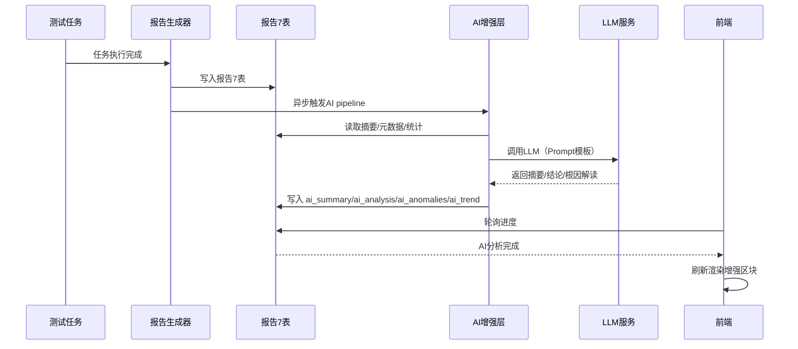

# AI 增强报告与结果分析功能设计文档

## 1. 文档说明

### 1.1 文档目的

本文档描述在现有报告管理功能基础上引入 AI 能力（报告摘要、分析结论自动撰写、异常检测、趋势预测、报告问答、对比分析增强）的详细设计方案。AI 能力作为**增强层**深度嵌入现有报告体系，不改变现有报告 7 表结构与数据流，所有 AI 能力均有明确的降级路径。

### 1.2 文档关系

| 文档 | 职责 |
| --- | --- |
| [报告管理功能设计文档](报告管理功能设计文档.md) | 报告生成、存储、对比、导出等总设计 |
| [report_documentation](report_documentation.md) | 报告类型、7 表结构、数据查询与计算逻辑 |
| [报告组件数据处理方案](报告组件数据处理方案.md) | 报告组件数据获取、图表计算、数据传递 |
| [report_metrics_format_change](report_metrics_format_change.md) | 报告用例 metrics 数组格式 `[{id, metric, value}]` |
| [报告Benchmark排行功能设计文档](报告Benchmark排行功能设计文档.md) | Benchmark 排行功能（本方案与排行互补） |
| **本文档** | AI 增强报告与结果分析的详细设计 |

### 1.3 术语定义

| 术语 | 解释 |
| --- | --- |
| AI 摘要 | LLM 基于报告数据生成的自然语言摘要（`ai_summary`） |
| AI 分析结论 | LLM 自动撰写并预填至 `test_reports.analysis` 的分析文字 |
| 异常检测 | 基于统计方法 + LLM 根因解释的指标异常识别引擎 |
| 趋势预测 | 基于历史报告指标时序的回归/指数平滑预测 |
| 报告问答 | 基于报告数据上下文（RAG）的自然语言问答 |

---

## 2. 整体定位与集成架构

AI 能力不重新发明轮子，而是**深度嵌入现有报告 7 表结构 + 报告组件体系**，作为后端的一个独立能力层（`backend/ai/`），通过扩展现有接口和组件的方式集成。

```
现有后端:
  report_controller_task.py       → 任务报告生成
  report_controller_compare.py    → 对比报告生成
  report_controller_secondary.py  → 二次对比报告
  report_utils.py                 → 聚合策略、维度取值
  aggregation_strategies.py       → 3 大聚合策略

新增 AI 层:
  backend/ai/
    ├── report_analyzer.py             # 报告数据分析（异常检测 + 趋势分析）
    ├── insight_generator.py           # AI 洞察生成（调用 LLM）
    ├── analysis_conclusion.py         # 分析结论自动撰写
    ├── anomaly_detector.py            # 指标异常检测引擎
    ├── trend_predictor.py             # 趋势预测（轻量统计 + AI）
    ├── report_qa.py                   # 报告问答（RAG）
    ├── prompt_templates/              # LLM Prompt 模板（Jinja2，与代码分离）
    │   ├── conclusion.j2              # 分析结论模板
    │   ├── anomaly.j2                 # 异常分析模板
    │   ├── trend.j2                   # 趋势解读模板
    │   └── suggestion.j2              # 优化建议模板
    └── __init__.py

新增数据库扩展（报告主表原地加字段，不新增表）:
  test_reports.ai_analysis        TEXT    → AI 分析结论 JSON（含多项洞察）
  test_reports.ai_anomalies       JSON    → 异常检测结果
  test_reports.ai_trend           JSON    → 趋势预测数据（对比/二次对比报告使用）
  test_reports.ai_summary         TEXT    → AI 生成的自然语言摘要
```

### 2.1 架构原则

1. **增强而非重构**：报告 7 表、指标计算链路、导出逻辑完全不动，AI 仅在报告生成后异步注入额外字段。
2. **后端统一计算**：延续"指标计算统一在后端完成，前端不做二次计算"的既有原则，AI 数据同样由后端生成。
3. **统计优先、LLM 兜底**：异常检测等数值判断先用统计方法，LLM 只做自然语言层面的根因解释与解读，避免 LLM 数值幻觉。
4. **模板与代码分离**：所有 LLM Prompt 使用 Jinja2 模板，便于后续迭代优化。
5. **降级可用**：LLM 调用失败时 AI 字段置空，报告正常展示，与现状完全一致。

---

## 3. 六大 AI 能力详解

### 3.1 AI 报告摘要自动生成

**数据来源**：现有 `report_summaries`（总用例数、通过率、时长）+ `report_summary_meta`（维度值、设备列表）+ `report_metric_stats`（分组/标签统计数据）

**触发时机**：报告生成完成后异步触发（`_generate_task_report_async` 末尾调用）

**输出格式**（写入 `test_reports.ai_summary`）：

```json
{
  "one_liner": "本次 V3.2 全双工对话测试通过率 92.3%，打断成功率 87.5%，较上一版本提升 5.2%",
  "key_findings": [
    "核心功能组通过率 98.1%，边缘用例组通过率 79.4%，差距明显",
    "打断响应时延较基线版本降低 120ms（-15%）",
    "设备 A 在噪声场景下 WER 恶化至 8.9%，超出阈值 6%"
  ],
  "risk_highlights": [
    "边缘用例组的误接管率（false_takeover）达 12.3%，超过告警阈值 10%",
    "设备 B 在连续打断场景下恢复时延波动大（σ=450ms）"
  ],
  "improvement_suggestions": [
    "建议重点关注噪声场景的 VAD 触发逻辑",
    "边缘用例在设备 B 上的表现需进一步验证"
  ]
}
```

**嵌入现有组件**：在 `ReportHeaderComponent` 中新增 `<AiSummaryBanner>` 子组件，展示 `one_liner` 和 `key_findings` 轮播。

### 3.2 AI 分析结论自动撰写（替代现有空白 analysis 字段）

**当前现状**：`test_reports.analysis` 字段为 `TEXT` 类型，由用户手工编辑（`AnalysisEditorComponent`），大部分报告生成后为空。

**AI 方案**：后端在报告生成时自动填充 `analysis`，用户可基于 AI 结论进行微调。

**数据输入**（`analysis_conclusion.py`）：

```python
def build_analysis_input(report_id):
    """聚合报告数据为 LLM 可理解的输入（只传提炼后的关键数字，非全量数据）"""
    report = db.session.get(TestReport, report_id)
    summary = ReportSummary.query.filter_by(report_id=report_id).first()
    meta = ReportSummaryMeta.query.filter_by(report_id=report_id).first()
    stats = ReportMetricStats.query.filter_by(report_id=report_id).first()

    return {
        "report_name": report.name,
        "type": report.type,  # task / comparison / secondary_comparison
        "total_cases": summary.total_cases,
        "pass_rate": summary.pass_rate,
        "devices": meta.devices,
        "apis": meta.apis,
        "dimension_values": meta.dimension_values,
        "case_type_stats": stats.case_type_stats,  # 分组维度平均值
        "device_stats": stats.device_stats,
        # 对比/二次对比报告额外带趋势数据
        "task_ids": summary.task_ids,
        "trend": get_trend_summary(report_id),
    }
```

**Prompt 模板**（`prompt_templates/conclusion.j2`）：

```
你是一位智能语音测试分析专家。请基于以下测试数据撰写分析结论：

## 报告概览
- 报告名称：{{ report_name }}
- 报告类型：{{ {'task': '单任务报告', 'comparison': '多任务对比', 'secondary_comparison': '二次对比'}[type] }}
- 总用例数：{{ total_cases }}
- 整体通过率：{{ pass_rate }}%

## 设备/API

- {{ d }}：...


## 各分组表现

- {{ group }}：...


## 要求：
1. 用中文撰写，语气专业、客观
2. 先总览，再说各维度表现
3. 发现异常点重点描述
4. 给出明确的结论判断（通过/有条件通过/不通过）
5. 篇幅 300-500 字
6. 对对比报告：突出差异最大的指标和变化趋势
```

**输出格式**：纯文本，直接写入 `test_reports.analysis`，与现有 `AnalysisEditorComponent` 完全兼容——用户打开报告时看到的就是 AI 生成的结论，可直接编辑。

### 3.3 AI 异常检测与根因分析

**核心设计**：不依赖 LLM 做数值判断（LLM 不擅长精确数值计算），先用统计方法检测异常，再由 LLM 做根因解释。

**异常检测引擎**（`anomaly_detector.py`）：

| 检测类型 | 检测算法 | 数据源 |
| --- | --- | --- |
| 单指标超阈值 | `value > threshold` 或 `value < threshold` | `report_cases.metrics` |
| 跨设备差异 | 同用例在不同设备上的指标值标准差 > 阈值 | `report_cases` + 设备分组 |
| 跨分组差异 | 不同分组同一指标的均值差异 > 阈值 | `report_metric_stats.case_type_stats` |
| 历史突变 | 当前报告 vs 历史报告同一指标变化 > 阈值 | `report_metric_stats` + 历史查询 |
| 趋势异常 | 连续 N 个版本的指标值单调递增/递减 | `test_reports` + 历史查询 |

**异常数据结构**（写入 `test_reports.ai_anomalies`）：

```json
{
  "anomalies": [
    {
      "type": "threshold_breach",
      "severity": "high",
      "dimension": "WER",
      "device": "设备A",
      "category": "噪声场景",
      "value": 8.9,
      "threshold": 6.0,
      "exceed_by": 48.3,
      "affected_cases": ["TTS-001", "TTS-003", "TTS-007"],
      "llm_analysis": "噪声场景下 WER 显著恶化，建议检查 VAD 模块在 SNR<15dB 环境下的表现"
    },
    {
      "type": "cross_device_variance",
      "severity": "medium",
      "dimension": "takeover_latency",
      "variance": 185,
      "threshold": 100,
      "devices": ["设备A", "设备B"],
      "llm_analysis": "设备A与设备B在接管时延上差异显著（设备A 520ms vs 设备B 335ms），可能是设备A音频通路配置问题"
    }
  ]
}
```

**预警分级**：

| 严重级别 | 触发条件 | 展示方式 |
| --- | --- | --- |
| `critical` | 通过率 < 80% 或核心指标恶化 > 30% | 红色横幅 + 弹窗提醒 |
| `high` | 阈值超限 > 20% 或跨设备差异 > 阈值 | 橙色标签 + 详情页高亮 |
| `medium` | 阈值超限但 < 20% 或单点异常 | 黄色标记 |
| `low` | 轻微波动或信息提示 | 灰色提示，可折叠 |

**集成到现有组件**：
- `OverviewCardComponent` 新增通过率/异常数徽标
- `CaseCategoryComparisonComponent` 中异常分组行高亮（背景色 + 异常图标）
- 新增 `<AnomalyPanel>` 组件（可折叠面板），展示所有异常项及 LLM 分析

### 3.4 AI 趋势分析与预测

**适用报告类型**：对比报告（`comparison`）和二次对比报告（`secondary_comparison`）

**数据来源**：
- 二次对比报告已有多个历史报告的 `report_metric_stats` 数据
- 对比报告可从多个任务的报告数据中提取时间序列

**计算逻辑**（`trend_predictor.py`）：

```python
def compute_trend(report_ids_or_task_ids, metric_code):
    """
    计算指定指标在多个报告/任务上的时序趋势
    返回：{ "history": [...], "prediction": [...], "trend_direction": "up|down|stable" }
    """
    # 1. 按时间排序各报告中的指标值
    # 2. 用线性回归或简单指数平滑预测下一步
    # 3. 计算趋势方向（斜率符号 + 显著性）
    # 4. 返回历史值 + 预测值 + 趋势解读
```

**LLM 解读输出**（写入 `test_reports.ai_trend`）：

```json
{
  "trend_direction": "deteriorating",
  "confidence": 0.85,
  "metrics_trend": [
    {
      "metric": "WER",
      "direction": "improving",
      "change_rate": "-3.2%/版本",
      "prediction_next": "5.1±0.3",
      "llm_comment": "WER 连续 4 个版本稳定下降，VAD 优化效果持续"
    },
    {
      "metric": "interruption_success_rate",
      "direction": "deteriorating",
      "change_rate": "+2.1%/版本",
      "prediction_next": "83.5±1.5",
      "llm_comment": "打断成功率连续 3 个版本下滑，需关注全双工对话的打断逻辑变更"
    }
  ],
  "summary": "整体趋势向好，WER 持续改善，但打断成功率出现连续下滑趋势，需优先排查"
}
```

**集成到现有组件**：
- `TrendAnalysis` 组件在现有折线图上叠加预测虚线（`prediction` 段）
- 新增 `AiTrendSummary` 文字气泡，展示 LLM 趋势解读

### 3.5 AI 报告问答（RAG）

**功能**：用户对报告内容进行自然语言提问，AI 基于报告数据回答。

**交互入口**：在报告详情页右下角新增浮动问答入口（类似聊天浮窗）。

**技术方案**（`report_qa.py`）：

```python
class ReportQAEngine:
    """基于报告数据的问答引擎（RAG 方案）"""

    def build_context(self, report_id):
        """
        构建问答上下文：
        1. 读取报告 7 表数据
        2. 结构化摘要（维度、指标、分类统计）
        3. 关键数据点（Top-N 异常、最好/最差用例）
        4. 限制 token 在 4K 以内
        """

    def ask(self, report_id, question):
        context = self.build_context(report_id)
        prompt = f"""
        你是一个智能语音测试报告助手。请基于以下数据回答问题：

        {context}

        用户问题：{question}

        请给出简洁、数据驱动的回答。
        """
        return llm_call(prompt)
```

**问题上下文注入**：当用户提问时，自动携带当前报告 URL 中的 `reportId`，QA Engine 利用该 ID 读取报告 7 表数据作为 RAG context。

**常见问题示例**：

| 用户提问 | AI 回答模式 |
| --- | --- |
| "这次测试通过率多少？" | 直接读取 `report_summaries.pass_rate` |
| "哪个设备表现最差？" | 遍历 `report_metric_stats.device_stats` 对比 |
| "和上一版比有哪些变化？" | 查询关联历史报告的 `metric_stats` 做 delta |
| "噪声场景的问题是什么？" | 读取 `case_type_stats` 的噪声分组 + `anomalies` |
| "建议优化什么？" | 基于异常检测 + LLM 分析给出建议 |

**集成方式**：
- 新增 `<ReportChatWidget>` 浮窗组件（`src/components/report/ReportChatWidget.vue`）
- API 前缀：`POST /api/v1/reports/{id}/qa`（请求 `{question}`，响应 `{answer, source_data}`）
- **不依赖 WebSocket**，使用普通 HTTP + loading 状态

### 3.6 AI 对比分析增强（多报告/多任务）

**适用场景**：对比报告 `comparison` 和二次对比报告 `secondary_comparison` 的**分析结论组件**。

**当前现状**：对比报告中"分析结论"组件目前显示的是后端计算的静态对比数据表格，缺少**自然语言层面的对比解读**。

**AI 增强**：在对比报告中新增 "AI 对比分析" 区块，LLM 基于多个报告的指标差异生成自然语言对比解读。

**数据输入**：

```python
def build_comparison_llm_input(report_ids):
    """聚合多个报告的对比数据（只取 Top-5 关键指标，控制 token）"""
    reports = []
    for rid in report_ids:
        r = db.session.get(TestReport, rid)
        meta = ReportSummaryMeta.query.filter_by(report_id=rid).first()
        stats = ReportMetricStats.query.filter_by(report_id=rid).first()
        reports.append({
            "name": r.name,
            "created_at": r.created_at.isoformat(),
            "pass_rate": r.summary.pass_rate,
            "dimension_values": meta.dimension_values,
            "top_metrics": extract_top_metrics(stats),  # 只取 Top-5 关键指标
        })
    return reports
```

**LLM 输出示例**：

```
## AI 对比分析

### 总体表现
对比 V3.0、V3.1、V3.2 三个版本，整体通过率分别为 88.5% → 90.2% → 92.3%，呈稳步上升趋势。

### 关键指标变化
- **WER（词错率）**：V3.0→V3.2 下降了 2.1 个百分点（7.2%→5.1%），优化明显
- **打断成功率**：V3.1 出现峰值 91.2% 后回落到 87.5%，V3.2 版本需关注打断逻辑的回归
- **接管时延**：持续改善，V3.2 达到 385ms（较 V3.0 降低 18%）

### 风险点
- 噪声场景下误接管率在 V3.2 升至 12.3%（V3.1 为 8.1%），需排查噪声 VAD 阈值变更
- 设备 B 在连续打断场景的恢复时延波动持续增大（σ: 280ms→450ms）

### 建议
1. 优先修复 V3.2 打断成功率的回退问题
2. 长期跟踪设备 B 的恢复时延稳定性
3. 考虑对噪声场景单独设置 VAD 阈值
```

**集成到现有组件**：
- 在 `ComparisonResult` 组件中新增 `<AiComparisonInsight>` 卡片，位于对比结果的顶部
- 现有 `AnalysisEditorComponent` 的 `analysis` 字段保留不变，AI 对比分析作为独立区块展示

---

## 4. AI 能力触发时机与数据流

```
测试任务完成 → 报告生成 (现有流程)
  → 写入报告 7 表
  → 异步触发 AI 分析 pipeline：
      1. ai_anomaly_detection()    → 写入 test_reports.ai_anomalies
      2. ai_trend_analysis()       → 写入 test_reports.ai_trend
      3. ai_summary_generation()   → 写入 test_reports.ai_summary
      4. ai_conclusion_generation()→ 写入 test_reports.analysis
  → 报告状态更新为 "已完成（含 AI 分析）"
  → 前端轮询进度时感知到 AI 分析完成，刷新展示

用户打开报告详情页:
  → 加载报告主表 + summary + meta（现有流程）
  → 异步加载 ai_analysis / ai_anomalies / ai_trend（新增）
  → 各组件根据 AI 数据渲染增强内容
```

### 4.1 时序流程



---

## 5. LLM 调用设计原则

| 原则 | 说明 |
| --- | --- |
| **结构化 Prompt** | 所有 Prompt 使用 Jinja2 模板（`prompt_templates/`），模板内容与代码分离 |
| **数据投喂而非全量** | 只传提炼后的关键指标（Top-N 异常、分组均值、趋势方向），不传 `report_cases` 全量行 |
| **分步而非一次性** | 异常检测先用统计方法，再让 LLM 做根因解释；不依赖 LLM 做数值计算 |
| **可观测性** | 每次 AI 调用记录 `{input_tokens, output_tokens, model, latency, success}` 到审计日志 |
| **降级策略** | LLM 调用失败时，`ai_analysis`/`ai_summary`/`ai_anomalies` 置空，不影响报告正常展示 |
| **配置化模型选择** | 系统配置中指定 LLM 模型（如 DeepSeek / GPT-4o-mini），可通过环境变量切换，开发/生产环境分离 |

---

## 6. 现有组件修改清单（最小侵入）

| 组件 | 修改内容 |
| --- | --- |
| `ReportHeaderComponent` | 新增 `<AiSummaryBanner>` 子组件，展示 AI 摘要轮播 |
| `AnalysisEditorComponent` | 无修改——`analysis` 字段由 AI 预填充，用户直接编辑 |
| `OverviewCardComponent` | 通过率旁新增异常数徽标（`+N anomalies`），点击展开 `<AnomalyPanel>` |
| `CaseCategoryComparisonComponent` | 异常分组行高亮（`severity` 对应颜色） |
| `ComparisonResult` | 顶部新增 `<AiComparisonInsight>` 卡片 |
| `TrendAnalysis` | 折线图叠加预测虚线，新增趋势解读文字 |
| 新增 `<AnomalyPanel>` | 可折叠异常面板，列出所有检测到的异常项 |
| 新增 `<ReportChatWidget>` | 右下角浮动问答入口 |

### 6.1 新增接口设计

| 接口 | 方法 | 说明 |
| --- | --- | --- |
| `POST /api/v1/reports/{id}/qa` | POST | 报告问答，请求 `{question}`，响应 `{answer, source_data}` |
| `GET /api/v1/reports/{id}/ai` | GET | 获取 AI 增强数据（`ai_summary` / `ai_anomalies` / `ai_trend`），异步加载 |
| `POST /api/v1/reports/{id}/ai/regenerate` | POST | 手动重新触发 AI 分析（当用户编辑报告数据后） |

> 所有接口延续 `/api/v1/reports` 前缀语义，不新增独立前缀；AI 数据随报告详情接口一并返回，或按需单独加载。

### 6.2 前端分层建议

```text
frontend/src/domain/model/aiAnalysis.ts               # AiSummary / AiAnomaly / AiTrend Domain 模型
frontend/src/composables/useAiAnalysis.ts             # 编排 AI 分析数据获取用例（Ports）
frontend/src/composables/useReportQa.ts               # 编排报告问答用例
frontend/src/store/aiAnalysisStore.ts                 # AI 分析数据状态
frontend/src/components/report/AiSummaryBanner.vue    # AI 摘要轮播横幅
frontend/src/components/report/AnomalyPanel.vue       # 异常检测面板
frontend/src/components/report/AiComparisonInsight.vue# AI 对比分析卡片
frontend/src/components/report/AiTrendSummary.vue     # AI 趋势解读气泡
frontend/src/components/report/ReportChatWidget.vue   # 报告问答浮窗
frontend/src/infrastructure/api/aiAnalysisApi.ts
```

---

## 7. 与 Benchmark 排行功能的关系

AI 能力与 Benchmark 排行（`benchmark_rankings`）天然互补：

| 场景 | Benchmark 排行提供 | AI 分析增强 |
| --- | --- | --- |
| 排行数据 | 名次、百分位、score100 | AI 解读："本次 WER 排名从第 5 升至第 3，主要受益于噪声场景优化" |
| 外部基线 | 实测值 vs 导入值 + delta | AI 分析 delta 根因："实测 WER 2.8% vs 对外公布的 2.1%，差异 0.7pp，建议检查测试集一致性" |
| 趋势 | 版本变化 | AI 趋势解读："连续 3 个版本排名上升，与 VAD 模块迭代节奏一致" |

**集成方式**：在 `BenchmarkRankingCard`（报告内嵌排行区块）中新增 "AI 分析" 按钮，调用 LLM 解读排行数据。

---

## 8. 权限与审计

### 8.1 权限预留

| 权限编码 | 说明 |
| --- | --- |
| `report.ai.read` | 查看 AI 增强数据 |
| `report.ai.regenerate` | 重新触发 AI 分析 |
| `report.ai.qa` | 使用报告问答 |

### 8.2 审计事件

| 事件 | 说明 |
| --- | --- |
| `REPORT_AI_ANALYZED` | AI 分析完成（记录报告 ID、模型、token 消耗、耗时） |
| `REPORT_AI_REGENERATED` | AI 分析重新触发 |
| `REPORT_QA_ASKED` | 报告问答发起（记录报告 ID、问题摘要） |

---

## 9. 异常处理与降级

| 场景 | 处理方式 |
| --- | --- |
| LLM 调用超时/失败 | AI 字段置空，报告正常展示，记录错误日志，支持手动重试 |
| LLM 输出不符合 JSON 结构 | 解析失败时丢弃该字段，保留其他成功字段 |
| 报告数据量过大 | 只提取 Top-N 指标与分组均值投喂，控制 token 在 4K 以内 |
| 问答上下文超限 | 精简上下文（丢弃低优先级数据点），仍超限则返回"数据量过大，请缩小问题范围" |
| 历史报告无 AI 数据 | 报告详情正常展示，AI 区块隐藏；提供"生成 AI 分析"按钮按需触发 |
| 并发触发 AI 分析 | 同一报告串行执行（报告 ID 维度加锁），避免重复调用 |

---

## 10. 分阶段实施建议

| 阶段 | 能力 | 优先级 |
| --- | --- | --- |
| **Phase 1** | AI 分析结论自动撰写（`analysis` 字段预填） | P0 |
| **Phase 1** | AI 报告摘要自动生成（`ai_summary` + AI 摘要横幅） | P0 |
| **Phase 2** | AI 异常检测引擎（统计方法 + LLM 根因解释） | P1 |
| **Phase 2** | AI 对比分析增强（对比报告专属） | P1 |
| **Phase 3** | AI 趋势预测（历史数据 + 预测线） | P2 |
| **Phase 3** | 报告问答浮窗（RAG） | P2 |
| **Phase 4** | Benchmark AI 增强（排行解读 + delta 分析） | P3 |

### 10.1 验收标准

1. 新报告生成完成后，`analysis` 字段自动填充 AI 结论，用户可编辑。
2. 报告详情页展示 AI 摘要横幅（one_liner + key_findings）。
3. 异常检测引擎能识别阈值超限、跨设备差异、历史突变三类异常，并给出 LLM 根因解释。
4. LLM 不可用时，报告所有功能与现状一致，无报错。
5. 报告问答能基于当前报告数据回答常见问题（通过率、最差设备、与上版差异）。
6. 对比/二次对比报告展示 AI 对比分析与趋势解读。
7. 现有报告生成、对比、导出功能无回归。

---

## 11. 版本历史

| 版本 | 日期 | 修改内容 |
| --- | --- | --- |
| 1.0 | 2026-09-16 | 初始版本，AI 增强报告与结果分析整体方案 |
