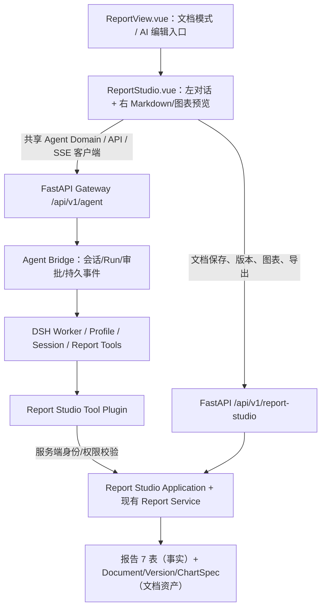

# 对话式报告工作台功能设计文档

> **架构选型更新 · 2026-10-08（适用于 `design/deepseek-harness-migration` 分支）**：本文第 1–3、5–7、10–11、13 章的产品目标与交互需求继续有效；第 4、8–9、12 章涉及的独立 `backend/ai/report_agent.py`、单独 LLM/RAG 会话编排、独立对话历史及旧目录/路由均为**历史实施草案，不可直接用于编码**。最新实现一律以文末 **第 15 章：DeepSeek Harness 统一落地方案** 及 [Agent 前后端改造方案](../../agent化/04_前后端改造方案.md) 为准。不得再实现第二套 Agent Loop。

### 产品优先级更新：Report First（2026-10-08）

**报告是智能音频测试平台的首要产品能力，不是 Agent 的附属展示。** 本文的 Report Studio 应优先于通用 Agent 工作台、自动创建用例、设备驱动生成及自动重试落地。核心验收是用户实际拿到结构正确、指标可信、可对话修改、可导出交付的报告，而非模型演示或通用工具调用数量。

报告业务既包括从已有报告进入，也包括从**单个测试任务、多任务对比、二次对比报告**进入。如果结构化报告尚未创建，先复用原 Report Service 进行确定性生成，然后再启动 DSH Report Studio 会话；AI 不接管报告七表的数值计算。标准模式继续可用。统一实施顺序见 [05_报告优先实施路线图](../../agent化/05_报告优先实施路线图.md)。

## 1. 文档说明

### 1.1 文档目的

本文档描述「对话式报告工作台」（Report Studio）的详细设计。其核心理念是：**用户是导演，AI 是执行者**——用户通过自然语言对话自主决定报告内容、结构、样式，AI 负责起草、修改、渲染和导出，用户对每一步拥有最终决定权。

### 1.2 文档关系

| 文档 | 职责 |
| --- | --- |
| [报告管理功能设计文档](报告管理功能设计文档.md) | 报告生成、存储、对比、导出等总设计 |
| [report_documentation](report_documentation.md) | 报告类型、7 表结构、数据查询与计算逻辑 |
| [AI增强报告与结果分析功能设计文档](AI增强报告与结果分析功能设计文档.md) | AI 自动能力（摘要/结论/异常检测/趋势/问答/RAG） |
| **本文档** | 对话式报告工作台——用户主导、AI 按指令执行的交互模式 |

> 本方案与「AI 增强报告」方案的关系：两者复用同一 `backend/ai/` 技术底座（LLM 调用、Prompt 模板、审计、降级），区别在于交互模式——前者是报告生成后自动执行的分析增强，后者是用户通过对话获得一份可编辑可导出 Markdown 文档。

### 1.3 术语定义

| 术语 | 解释 |
| --- | --- |
| 报告工作台（Report Studio） | 用户与 AI 对话生成/编辑报告的工作台，含左侧对话面板 + 右侧文档预览 |
| Agent 会话（Session） | 一次对话式编辑任务的完整上下文，含报告ID、文档ID、历史消息、上下文偏好 |
| 文档版本快照（Snapshot） | 每个编辑动作前自动保存的文档版本，支持一键回滚 |
| 图表占位符 | AI 在 Markdown 中标记的 `[chart:xxx]`，由后端从报告 7 表计算真实数据渲染为图表 |
| Markdown 中间格式 | 用户编辑的最终文档以 Markdown 存储，HTML/PPT/PDF 均为其派生格式 |

---

## 2. 概述

### 2.1 核心定位

对话式报告工作台是用户获取可交付报告的唯一入口。其价值主张：

```
报告 7 表数据（结构化）
    ↓ AI 对话式起草 + 修改
用户编辑定稿的 Markdown 文档
    ↓ 一键导出
HTML（在线/内网共享） | PPT（汇报） | PDF（正式交付） | MD（归档复用）
```

**关键原则**：
- AI 只起草不计算——数值全部从报告 7 表提炼，图表用占位符由后端计算渲染
- 用户全权掌控——生成后的一切修改决定权在用户，AI 只做按需辅助
- 单一中间格式——Markdown 是唯一真相源，所有导出格式都是派生产物

### 2.2 与现有报告模式的关系（双模式并存）

用户在报告详情页顶部切换：

| 模式 | 适用场景 | 特点 |
| --- | --- | --- |
| **标准模式**（现有） | 快速查看数据 | 固定区块直接渲染报告 7 表，所见即所得 |
| **文档模式**（本方案） | 生成可交付报告文档 | AI 对话起草 → 用户自由编辑 → 多格式导出 |

两者数据同源（同一份报告 7 表），只是呈现层不同，互不干扰。

---

## 3. USE CASE

### 3.1 主 Use Case

| 项 | 内容 |
| --- | --- |
| **名称** | 对话式报告生成与编辑 |
| **参与者** | 用户（主要）、AI 报告助手 Agent（系统） |
| **目标** | 用户通过自然语言对话自主决定报告内容/结构/样式，AI 按指令执行，最终获得可导出的 Markdown 文档 |
| **前置条件** | 已有报告（可读报告 7 表），或用户选定可生成报告的单任务/多任务对比来源；可先通过原 Report Service 生成结构化报告。用户需具有对应读/建/编辑权限 |
| **后置条件** | 文档已保存或导出为指定格式 |
| **触发** | 用户在报告详情页点击「AI 对话生成报告」或直接进入报告工作台 |

### 3.2 主流程（Main Flow）

```
1. 用户进入报告工作台
2. 用户发出第一条指令（如"帮我把这次全双工测试生成一份报告"）
3. AI 读取报告 7 表数据（read_report_data 工具）
4. AI 生成 Markdown 草稿并渲染到右侧预览区
5. AI 回复：已生成初稿，说明包含哪些章节，询问是否需要调整
6. 用户提出修改意见（如"面向管理层，精简一点"）
7. AI 执行 edit_document 工具修改文档，预览区实时更新
8. AI 回复修改结果
9. 循环 6-8 步，直到用户满意
10. 用户选择导出格式（HTML / PPT / PDF / MD）
11. AI 执行 export_document 工具，生成并返回下载链接
12. 用户下载文件，Use Case 结束
```

### 3.3 备选流程

| 编号 | 场景 | 处理 |
| --- | --- | --- |
| 3a | 用户对草稿不满意 | 用户说"重新生成"，AI 调 `generate_draft` 重新起草；或用户直接在预览区手动编辑 |
| 3b | 用户插入图表 | AI 调 `insert_chart` 插入 `[chart:xxx]` 占位符，后端从报告 7 表计算数据渲染；用户可要求换图类型 |
| 3c | 用户追问数据细节 | AI 调 `query_report` 基于报告数据回答（复用 RAG），不修改文档 |
| 3d | 用户要求撤销 | AI 调 `undo_snapshot` 回滚到上一版本快照 |
| 3e | 用户手动编辑文档 | 预览区支持直接编辑 Markdown，编辑后保存触发版本快照，AI 对话上下文自动同步变更 |
| 3f | AI 无法理解指令 | AI 主动反问澄清（"您希望精简到什么程度？保留主体还是只留结论？"） |
| 3g | 用户中途退出 | 工作台自动保存当前文档状态，下次进入可继续对话 |

---

## 4. Agent 架构

### 4.1 整体架构

```
┌─────────────────────────────────────────────────┐
│                   用户对话                        │
└──────────────────────┬──────────────────────────┘
                       ↓
┌─────────────────────────────────────────────────┐
│              AI 报告助手 Agent                     │
│  （会话编排层 · 后端 async 异步处理）              │
│                                                   │
│  1. 意图理解（NLU + 会话历史上下文）               │
│  2. 工具选择（Function Calling）                   │
│  3. 工具执行 → 文档变更 + 预览刷新               │
│  4. 回复汇总（做了什么 + 下一步建议）              │
└──────────────────────┬──────────────────────────┘
                       ↓
┌─────────────────────────────────────────────────┐
│                 工具层（Tools）                    │
│                                                   │
│  read_report_data  → 读报告 7 表提炼关键指标      │
│  generate_draft    → 生成/重生成 Markdown 草稿   │
│  edit_document     → 局部修改（加/删/改）        │
│  insert_chart      → 插入图表占位符 + 参数       │
│  export_document   → 导出 HTML/PPT/PDF/MD       │
│  query_report      → 基于报告数据问答（RAG）     │
│  snapshot          → 编辑前自动打版本快照         │
└─────────────────────────────────────────────────┘
```

### 4.2 工具定义

#### read_report_data

| 项 | 内容 |
| --- | --- |
| **用途** | 读取指定报告的报告 7 表数据，提炼出 LLM 可理解的摘要（仅取关键指标，不传全量） |
| **输入** | `reportId` |
| **输出** | `{ pass_rate, devices, dimensions, top_case_type_stats, top_anomalies, ... }` |
| **数据量限制** | 输出控制在 4K token 以内 |

#### generate_draft

| 项 | 内容 |
| --- | --- |
| **用途** | 基于报告数据生成或重新生成完整的 Markdown 文档草稿 |
| **输入** | `docId`, `params`（可选：面向对象、篇幅、重点章节、语种等） |
| **输出** | Markdown 文档内容（含图表占位符 `[chart:xxx]`） |
| **备注** | 首次调用时若 `docId` 不存在则自动创建 |

#### edit_document

| 项 | 内容 |
| --- | --- |
| **用途** | 对文档进行局部修改，支持加章/删章/改表格/改文字/调顺序/改口气 |
| **输入** | `docId`, `instruction`（自然语言编辑指令） |
| **输出** | 修改后的 Markdown 差异（diff） |

#### insert_chart

| 项 | 内容 |
| --- | --- |
| **用途** | 在文档中插入图表占位符，后端从报告 7 表计算真实数据渲染 |
| **输入** | `docId`, `position`（光标位置/章节名）, `spec`（`{type: bar/line/radar/pie, metrics: [...], groupBy: device/category}`） |
| **输出** | `[chart:uuid]` 占位符已插入文档 |

#### export_document

| 项 | 内容 |
| --- | --- |
| **用途** | 将 Markdown 文档导出为指定格式 |
| **输入** | `docId`, `format`（html/pptx/pdf/md）, `theme`（可选） |
| **输出** | 下载链接或文件流 |

#### query_report

| 项 | 内容 |
| --- | --- |
| **用途** | 基于报告数据回答用户的数据追问（复用报告问答 RAG 引擎） |
| **输入** | `reportId`, `question` |
| **输出** | 回答文字，不修改文档 |
| **权限** | 只读，不产生文档变更 |

#### snapshot

| 项 | 内容 |
| --- | --- |
| **用途** | 在每个编辑动作前自动保存文档版本快照 |
| **触发** | 每次 `edit_document` / `insert_chart` / `generate_draft` 执行前自动调用 |
| **输出** | 版本号，支持 `undo_snapshot` 回滚 |

### 4.3 执行链路

```
用户指令
  ↓
Agent 理解意图（LLM 推理）
  ↓
选择工具 + 准备参数
  ├── 调用 snapshot           ← 先打快照
  ├── 调用目标工具（核心操作） ← 执行实际修改
  └── 等待工具返回结果
  ↓
验证工具输出
  ↓
Agent 汇总回复用户：
  - 做了什么（修改摘要）
  - 当前文档状态
  - 下一步建议（"还要调整吗？" / "是否导出？"）
```

---

## 5. 会话状态与记忆

### 5.1 会话数据结构（`report_studio_sessions` 表）

```json
{
  "session_id": "rs-20260916-001",
  "report_id": 123,
  "document_id": 45,
  "status": "active",
  "context": {
    "audience": "engineering",
    "language": "zh",
    "highlight": ["conclusion", "anomaly"],
    "tone": "professional",
    "max_pages": null
  },
  "history": [
    {
      "role": "user",
      "content": "帮我把这次全双工测试生成一份报告"
    },
    {
      "role": "assistant",
      "content": "已生成初稿，包含5个章节...",
      "tool_calls": ["generate_draft"],
      "tool_results": { "version": 1 }
    },
    {
      "role": "user",
      "content": "面向研发，突出异常分析"
    },
    {
      "role": "assistant",
      "content": "已将异常分析章节提前，补充数据表格...",
      "tool_calls": ["edit_document"],
      "tool_results": { "version": 2 }
    }
  ],
  "current_version": 3,
  "created_by": "user1",
  "created_at": "2026-09-16T10:00:00",
  "updated_at": "2026-09-16T10:15:00"
}
```

### 5.2 上下文自动提炼

`context` 字段由 Agent 在对话过程中动态维护，用户一句话"改成面向老板"，后续所有工具调用自动适配：

| 用户指令 | 引发的 context 变更 |
| --- | --- |
| "给老板看的" | `audience: management`，`max_pages: 2` |
| "详细一点" | `max_pages: null`，`tone: detailed` |
| "重点说风险" | `highlight: ["risk", "anomaly"]` |
| "用英文" | `language: en` |

### 5.3 版本快照（`report_document_versions` 表）

```json
{
  "version": 3,
  "doc_id": 45,
  "markdown_content": "# 全双工对话测试报告 V3.2\n\n...",
  "parent_version": 2,
  "snapshot_reason": "ai_edit: 精简为管理层版本",
  "created_at": "2026-09-16T10:15:00"
}
```

每次编辑动作前自动打快照，用户或 AI 可触发回滚。

---

## 6. 界面布局

```
┌──────────────────────────────────────────────────────────────────┐
│ 报告工作台 · 全双工对话测试报告 V3.2     [导出▾] [版本▾] [关闭] │  ← 顶部栏
├─────────────────────────────┬────────────────────────────────────┤
│                             │                                    │
│  💬 对话面板                 │   📄 文档预览（持续更新）          │
│                             │                                    │
│  ┌─────────────────────┐    │   # 全双工对话测试报告 V3.2       │
│  │ 用户: 生成一份报告  │    │                                    │
│  │ AI: 已生成初稿      │    │   ## 一句话总结                    │
│  │    - 测试概述       │    │   本次测试通过率 92.3%，较上版     │
│  │    - 核心指标对比   │    │   提升 5.2%，核心指标全部达标。    │
│  │    - 分组表现       │    │                                    │
│  │    - 异常分析       │    │   ## 核心指标总览                  │
│  │    - 结论与建议     │    │   ┌──────────────────────────┐    │
│  │  还想调整什么？     │    │   │  ECharts 柱状图        │    │
│  │                     │    │   │  3设备 × 5指标         │    │
│  │  用户: 面向管理层    │    │   └──────────────────────────┘    │
│  │  AI: 已精简         │    │                                    │
│  │    - 删除用例明细   │    │   ## 风险清单                      │
│  │    - 精简为2页      │    │   | 级别 | 维度 | 值 | 阈值 |     │
│  │    - 新增风险表格   │    │   | 高   | WER | 8.9 | 6.0  |     │
│  └─────────────────────┘    │                                    │
│                             │                                    │
│  [输入框........................] [发送]  │                    │
│                             │                                    │
│  [AI 建议：]                │                                    │
│  ▸ 切换到面向研发            │                                    │
│  ▸ 插入雷达对比图            │                                    │
│  ▸ 导出为PPT                │                                    │
└─────────────────────────────┴────────────────────────────────────┘
```

### 6.1 对话面板功能

- **消息气泡**：用户和 AI 的消息按气泡展示，AI 回复含工具执行摘要
- **AI 快捷建议**：底部智能推荐下步操作，一键发送
- **Markdown 预览**：AI 回复中的 Markdown 代码块在气泡内实时渲染
- **操作回退**：每条 AI 回复右侧有「撤销」按钮，回滚到该操作前的版本

### 6.2 文档预览功能

- **实时渲染**：Markdown 文档实时渲染为带样式的 HTML
- **图表实时渲染**：`[chart:xxx]` 占位符由后端数据驱动，渲染为 ECharts 实例
- **直接编辑**：预览区支持 WYSIWYG 编辑，编辑后自动同步到对话上下文
- **源码切换**：支持切换到 Markdown 源码编辑模式

---

## 7. 典型对话场景

### 场景 A：从零生成

```
用户: 帮我生成一份这次全双工测试的报告

AI: 已基于任务 #320 的报告数据生成初稿，包含：
    📄 1. 测试概述（通过率 92.3%，120 个用例，3 台设备）
    📄 2. 核心指标对比表（3 设备 × 5 指标）
    📄 3. 分组表现（核心功能组 / 边缘用例组）
    📄 4. 异常分析（2 项高风险 + 3 项中风险）
    📄 5. 结论与建议

    您希望调整哪些内容？例如：
    ▸ 面向的读者（老板/研发/客户）
    ▸ 篇幅长度
    ▸ 重点突出哪些指标

用户: 我给老板汇报用的，控制在 2 页

AI: 已调整：
    ✅ 删除具体用例明细章节
    ✅ 指标表精简为 Top-5 关键指标
    ✅ 新增「一句话总结」置于顶部
    ✅ 风险部分改为表格形式
    当前预计阅读时长约 2 分钟。是否需要进一步调整？

用户: 结论部分改得积极一点

AI: 已改写结论，突出版本进步：
    • 通过率 92.3%，较上版提升 5.2%
    • 打断成功率 87.5%，较上版提升 3.1%
    • 接管时延降至 385ms，较上版降低 15%
```

### 场景 B：基于现有文档修改

```
用户: 把设备对比图换成雷达图

AI: 已将「核心指标」章节的柱状图替换为雷达图（3 设备 × 5 指标），
    雷达图能更直观展示各设备在不同维度的均衡性。
    [图已实时更新]

用户: 在结论前插入一个"风险清单"章节

AI: 已在「结论」前新增「风险清单」章节，包含 5 项异常的严重级别分布。
```

### 场景 C：数据追问

```
用户: 设备B的接管时延为什么比设备A高这么多？

AI: 设备B 平均接管时延 520ms，设备A 335ms（差距 55%）。
    跨越 3 轮测试，设备B 的接管时延一直高于设备A。
    可能原因：设备B 音频通路配置差异或硬件性能差异。
    是否需要我：
    ▸ 在报告里补充一句风险说明？
    ▸ 单独插入一个跨设备时延对比图？
```

### 场景 D：多轮调优到满意后导出

```
用户: 不错，帮我导出成PPT

AI: 已导出为 PPT 格式（基于 Marp/Markdown 自动分页）：
    • 封面 1 页
    • 摘要 1 页
    • 核心指标 2 页
    • 风险分析 1 页
    • 结论与建议 1 页
    共 6 页。
    [下载链接：report-20260916-320.pptx]

用户: 再导出成 HTML 方便我内网分享

AI: 已导出 HTML 格式：
    • 内置完整 CSS（浅色主题）
    • 含交互式 ECharts 图表
    • 含右侧目录导航
    • 单文件，可离线打开
    [下载链接：report-20260916-320.html]
```

---

## 8. 后端实现

### 8.1 文件结构

```text
backend/ai/
  ├── agent/
  │   ├── report_agent.py             # Agent 主编排（意图→工具选择→执行→回复）
  │   ├── session.py                  # 工作会话状态管理（context + history）
  │   ├── tools/
  │   │   ├── read_report_data.py     # 读报告 7 表，提炼关键指标
  │   │   ├── generate_draft.py       # 生成/重生成 Markdown 草稿
  │   │   ├── edit_document.py        # 结构化编辑（加/删/改章节、表格、顺序）
  │   │   ├── insert_chart.py         # 图表占位符 + 参数
  │   │   ├── export_document.py      # Markdown → HTML/PPT/PDF 导出
  │   │   └── query_report.py         # 复用报告问答 RAG
  │   └── prompts/
  │       ├── agent_system.j2         # Agent 系统提示（角色、工具定义、约束）
  │       └── edit_plan.j2            # 编辑指令解析（从自然语言提取结构化编辑动作）
  └── ...
```

### 8.2 接口设计

所有接口前缀：`/api/v1/report-studio`

```http
# 会话管理
POST   /api/v1/report-studio/sessions                              # 创建新工作会话（绑定报告ID）
GET    /api/v1/report-studio/sessions/{sessionId}                  # 获取会话状态
DELETE /api/v1/report-studio/sessions/{sessionId}                  # 关闭会话

# 对话与编辑
POST   /api/v1/report-studio/sessions/{sessionId}/messages         # 发送用户消息 → AI 回复 + 文档变更
GET    /api/v1/report-studio/sessions/{sessionId}/document         # 获取当前文档 Markdown + 渲染 HTML
POST   /api/v1/report-studio/sessions/{sessionId}/undo             # 回滚到上一版本快照

# 图表
GET    /api/v1/report-studio/sessions/{sessionId}/charts/{uuid}   # 获取图表占位符的渲染数据

# 导出
POST   /api/v1/report-studio/sessions/{sessionId}/export          # 导出 {format: html/pptx/pdf/md}
```

### 8.3 导出引擎

| 导出格式 | 技术方案 | 特点 |
| --- | --- | --- |
| **HTML** | `markdown-it` + ECharts 服务端渲染（`node-chart-renderer`） | 交互式图表、目录导航、主题 CSS、单文件离线可用 |
| **PPT** | `Marp` CLI（Markdown → PPT）或 Python `python-pptx` | 按标题层级自动分页，图表占位符渲染为内嵌图片 |
| **PDF** | `WeasyPrint`（HTML → PDF） | A4 页面、页眉页脚、打印样式，含图表图片 |
| **MD** | 原始 Markdown 下载 | 可复用进 Git 仓库/文档系统 |

PPT 自动分页规则：

| Markdown 元素 | PPT 呈现 |
| --- | --- |
| `# 标题` | 封面页 |
| `## 章节` | 章节分隔页 |
| `### 小节` | 内容页（每小节一页） |
| `\| 表格 \|` | PPT 原生表格 |
| `[chart:xxx]` | 渲染后的图表图片（内嵌） |
| `> 引用` | 重点强调框 |
| 图片 | 保持原位 |
| 普通段落 | 自动分页 |

---

## 9. 前端实现

### 9.1 分层结构（DDD）

```text
frontend/src/domain/model/
  ├── reportSession.ts           # ReportSession / ReportDocument 领域模型
  └── reportDocument.ts          # 文档版本快照

frontend/src/composables/
  ├── useReportStudio.ts         # 编排工作台会话用例（Ports）
  └── useReportDocument.ts       # 编排文档编辑与版本管理

frontend/src/store/
  └── reportStudioStore.ts       # 工作台全局状态（会话、文档、对话历史）

frontend/src/views/
  └── ReportStudio.vue           # 报告工作台主页面（对话面板 + 预览区）

frontend/src/components/report/studio/
  ├── StudioToolbar.vue           # 顶部工具栏（导出、版本、设置）
  ├── ChatPanel.vue               # 对话面板（消息气泡、输入框、AI 快捷建议）
  ├── ChatBubble.vue              # 单条消息气泡（用户/AI）
  ├── DocumentPreview.vue         # 文档预览区（Markdown 渲染，支持 WYSIWYG）
  ├── ChartRenderer.vue           # 图表占位符渲染器（`[chart:xxx]` → ECharts）
  ├── VersionDropdown.vue         # 版本回滚下拉框
  └── ExportDialog.vue            # 导出配置弹窗

frontend/src/infrastructure/api/
  └── reportStudioApi.ts
```

### 9.2 状态管理核心数据结构

```typescript
// 工作台会话状态（Pinia Store）
interface ReportStudioState {
  sessionId: string
  reportId: number
  documentId: number
  sessionStatus: 'idle' | 'ai_thinking' | 'ready'
  messages: ChatMessage[]
  currentVersion: number
  document: {
    markdownContent: string
    renderedHtml: string       // 后端渲染的 HTML 预览
    chartData: Record<string, ChartData>  // 图表占位符 → 图表数据映射
  }
  aiSuggestions: string[]      // AI 快捷建议列表
}

interface ChatMessage {
  id: string
  role: 'user' | 'assistant'
  content: string
  toolCalls?: string[]
  toolResults?: Record<string, any>
  timestamp: string
}
```

---

## 10. 异常处理

| 场景 | 处理方式 |
| --- | --- |
| AI 生成文档失败 | 返回错误信息，文档保持上一次可用状态，用户可重试 |
| 图表数据无法计算 | 占位符处显示"数据不可用"提示，不影响整篇文档 |
| 导出格式失败 | 支持单格式重试，其他格式不受影响 |
| 会话超时（长时间未操作） | 自动保存当前状态，下次进入可继续 |
| 并行编辑冲突 | 以版本号控制，后保存的版本号+1，覆盖前告知用户 |
| LLM 调用超时 | Agent 重试一次，仍失败则回复"暂时无法处理，请重试" |
| 指令无法理解 | AI 反问澄清，不执行修改（安全兜底） |
| 用户要求删除整篇文档 | 只打快照不删除（可在文档管理页手动删除） |

### 10.1 降级策略

- **LLM 不可用**：工作台不可用，用户仍可使用标准模式查看报告
- **导出服务不可用**：Markdown 源文件始终可下载，其他格式暂不可用
- **图表渲染服务不可用**：占位符显示为文本表格兜底

---

## 11. 权限与审计

### 11.1 权限预留

| 权限编码 | 说明 |
| --- | --- |
| `report.studio.create` | 创建工作台会话 |
| `report.studio.edit` | 在对话中编辑文档（含 AI 修改） |
| `report.studio.export` | 导出文档 |
| `report.studio.undo` | 回滚文档版本 |

### 11.2 审计事件

| 事件 | 说明 |
| --- | --- |
| `REPORT_STUDIO_CREATED` | 工作台会话创建 |
| `REPORT_STUDIO_DOCUMENT_EDITED` | AI 编辑文档（记录编辑类型、版本号、tool_calls） |
| `REPORT_STUDIO_DOCUMENT_EXPORTED` | 文档导出（记录格式、页数） |
| `REPORT_STUDIO_DOCUMENT_UNDONE` | 文档回滚（记录版本号） |

---

## 12. 与 AI 增强方案的关系

| 维度 | AI 增强方案（已有文档） | 对话式工作台（本方案） |
| --- | --- | --- |
| **交互模式** | 自动执行，报告生成后静默触发 | 用户对话驱动，按指令执行 |
| **产出物** | 报告摘要/分析结论/异常标记/趋势数据（均写入报告 7 表） | 可编辑/导出的 Markdown 文档 |
| **用户角色** | 被动接收者（看到 AI 生成的补充信息） | 主动决策者（每一步由用户确认） |
| **AI 角色** | 自动助手（后台执行，不打扰用户） | 按指令执行者（对话驱动） |
| **复用关系** | 工作台可一键采纳 AI 生成的摘要/异常分析进入文档 | — |

**技术复用**：
- 共用 `backend/ai/` 层的 LLM 调用基础设施、Prompt 模板系统、审计与降级机制
- 工作台的 `query_report` 工具直接复用 AI 增强方案的报告问答 RAG 引擎
- 异常检测引擎的结果可作为工作台数据分析的输入

---

## 13. 分阶段实施建议

| 阶段 | 能力 | 优先级 |
| --- | --- | --- |
| **Phase 1** | 对话式报告生成（Agent 骨架 + `generate_draft` + `edit_document` + Markdown 预览 + HTML 导出） | P0 |
| **Phase 2** | 图表占位符 + 图表实时渲染（`insert_chart` + `ChartRenderer`） | P1 |
| **Phase 2** | 版本快照 + 回滚（`snapshot` + `undo`） | P1 |
| **Phase 3** | PPT 导出 | P1 |
| **Phase 3** | PDF 导出 | P2 |
| **Phase 3** | 对话中的 AI 快捷建议（底部建议栏） | P2 |
| **Phase 4** | WYSIWYG 直接编辑（预览区可编辑） | P2 |
| **Phase 4** | 数据追问（`query_report` 工具集成） | P3 |

### 13.1 验收标准

1. 用户进入工作台后，发一句"生成报告"即可获得结构完整的 Markdown 草稿。
2. 用户可对话调整文档内容、结构、篇幅、语气，AI 按指令执行，预览区实时更新。
3. 用户可导出 HTML（交互图表）和 PPT（按标题自动分页）。
4. 每次 AI 修改前自动保存版本快照，支持一键回滚。
5. LLM 不可用时工作台提示不可用，不影响标准模式查看报告。
6. 导出失败时允许单格式重试，不阻塞其他格式。
7. 现有报告生成、对比、导出功能无回归。

---

## 14. 版本历史

| 版本 | 日期 | 修改内容 |
| --- | --- | --- |
| 1.0 | 2026-09-16 | 初始版本，对话式报告工作台完整方案 |

## 15. DeepSeek Harness 统一落地方案（2026-10-08）

> 本章覆盖第 4、8–9、12 章旧技术实现建议；原来的产品流程、交互设计与“用户是导演，AI 是执行者”的目标不变。本章只描述目标架构，**尚未完成代码实施与验收**。
>
> 同级设计：[00_DeepSeek_Harness统一迁移设计](../../agent化/00_DeepSeek_Harness统一迁移设计.md)、[04_前后端改造方案](../../agent化/04_前后端改造方案.md)。

### 15.1 定位：共用 DSH Agent 引擎，保留独立 Report Studio UI

通用 Agent 工作台（`/agent`）与对话式报告工作台（建议 `/report/:id/studio`）**使用同一套 DeepSeek Harness（DSH）部署、模型路由、Session/Agent Loop/Tool Registry 和插件机制**；前端分别呈现最适合业务的界面。



- 报告 7 表和现有 Report Service 负责**数据事实与指标计算**；LLM 仅组织叙述、提出结构化编辑建议，不自己生成或改写真实数值。
- DSH 负责模型回合、工具调用、对话上下文、事件；FastAPI Bridge 负责鉴权、租户/资源归属、调用审计、Run 关联。
- Report Studio Application 负责 Markdown 文档、版本、图表数据定义、导出作业；这些业务资产的可靠性不依赖 DSH Session Log。
- 不另造 `report_agent.py`、`backend/ai/agent/session.py` 或一套独立的 `messages → function_call → agent loop`。
- 文档模式与标准报告模式并存；退出 Studio 后标准报告的原始统计/报告内容不应被静默修改。

### 15.2 面向当前仓库的代码落点

已核对 `V9.7.31`：`frontend/src/views/ReportView/ReportView.vue`、`frontend/src/infrastructure/api/reportsApi.ts`、`frontend/src/components/report/`、`api_gateway/routes/report_bp.py`，以及 `report_service/` 已存在。**现有仓库没有原文中的 `backend/ai/` 作为当前实现入口**。

```text
# 前端：下列 Studio 子模块为拟新增
frontend/src/views/ReportStudio/ReportStudio.vue
frontend/src/components/report/studio/
  ChatPanel.vue           # 复用通用 agent 消息组件/组合逻辑
  DocumentEditor.vue      # Markdown 为受控文档资产
  DocumentPreview.vue     # 受控渲染（禁止脚本注入）
  ChartRenderer.vue       # 已注册 ChartSpec ID → 可视化
  DocumentVersionList.vue
  ExportDialog.vue
frontend/src/composables/report/useReportStudio.ts
frontend/src/store/reportStudioStore.ts
frontend/src/domain/model/reportStudio.ts
frontend/src/infrastructure/api/reportStudioApi.ts
frontend/src/infrastructure/dto/reportStudioDto.ts
frontend/src/infrastructure/adapters/reportStudioAdapter.ts

# 后端：新增业务文件/接口，不是新的 Agent Runtime
api_gateway/routes/report_studio_bp.py
api_gateway/application/services/report_studio/
  document_service.py
  version_service.py
  chart_service.py
  export_service.py
api_gateway/infrastructure/agent/  # 共用 04 的 Agent Bridge
report_service/application/         # 复用领域查询/计算；按需要加只读 Ports
agent_worker/plugins/report_studio/  # DSH TypeScript Tools，桥接业务 API
```

和 `04_前后端改造方案` 的 `frontend/src/infrastructure/stream/agentEvents.ts`、`agentStore.ts`、`/api/v1/agent`、DSH Worker、Run 事件持久化共用；前端不得复制第二套会话重连代码。Studio Store 只保存业务 UI 状态（`documentId`、`documentVersion`、`reportId`、`activeRunId`、`chartRefs`）；对话消息以共用 Agent Session 为准。

### 15.3 DSH Report Studio Tool Plugin

| Tool（模型可见） | 执行所在服务 | 副作用与权限 |
| --- | --- | --- |
| `report_get_facts`（旧 `read_report_data`） | Report Query Application | 只读：报告汇总、分组、设备/维度指标，带可信 `sourceRef` 和数据版本 |
| `report_query_metrics`（旧 `query_report`） | Report Query Application | 只读：参数化指标/维度查询；不要求先建 RAG |
| `studio_create_draft`（旧 `generate_draft`） | Studio Document Service | 创建草稿；通过文档访问权限和用户意图检查 |
| `studio_apply_edit`（旧 `edit_document`） | Studio Document Service | 结构化 patch + `expectedVersion`；编辑后返回 diff/新版本 |
| `studio_insert_chart`（旧 `insert_chart`） | Studio Chart Service | 保存有类型的 ChartSpec，插入受控引用，不执行模型指定脚本 |
| `studio_get_versions` | Studio Version Service | 只读、查询可恢复版本 |
| `studio_restore_version`（旧 `undo_snapshot`） | Studio Version Service | 版本恢复生成**新版本**，保留历史；有权限/预期版本校验 |
| `studio_request_export`（旧 `export_document`） | Studio Export Service | 固定某个文档版本异步渲染、审计、提供经鉴权的下载 |

**重要变化**：`snapshot` 不作为模型必须主动调用的工具，而是 Document Service **每次提交编辑的同一数据库事务**里自动落历史版本；避免模型漏调用 snapshot 导致回滚不可用。工具输出包含 `documentId`、`version`、`diff`、`sourceRefs`，大文本通过后端授权资源引用加载，不把整个报告 7 表送进模型上下文。

工具按报告会话动态装配并由服务端再次授权：`report:read` 授予只读事实查询；创建编辑/回滚/导出分别授予 `report:studio:create`、`report:studio:edit`、`report:studio:undo`、`report:studio:export`（建议编码，需与现有 `report:*` 权限注册方案对齐）。发布/覆盖正式报告仍走单独审批，不能把 Studio 写草稿视为发布授权。

### 15.4 事实、图表与文档的三重边界

1. **业务事实源：** 报告 7 表。原方案中的 `pass_rate`、WER、设备对比、评分等必须由原报告服务/确定性算法计算。携带源报告 ID、指标 ID、分组维度、时间范围、口径和数据修订版本（可用可追溯的 source fingerprint 代替）。
2. **文档真相源：** `report_studio_documents` 的当前 Markdown + 不可变 `report_studio_document_versions`。Markdown 是文档与导出的内容源，**不是报告指标的事实源**。每次 AI/用户编辑均做乐观并发 `expectedVersion`；冲突返回 HTTP 409，显示差异并请用户选择合并/重试。原文“后保存覆盖前者”的行为废弃。
3. **图表定义源：** `report_studio_chart_specs`（`chartId`、`reportId`、指标/分组参数、样式、版本）。原 `[chart:uuid]` 只代表引用，服务端以可验证 ID 读取 ChartSpec 并重新校验权限、指标与报表归属；用户输入不得生成任意 JS/SQL/URL，也不信任 Markdown 内联脚本。

数据追问优先走 `report_get_facts` / `report_query_metrics`；针对历史故障案例、自然语言文档的语义检索可作为后续可选 Plugin，经真实问答评测证明必要后才引入 RAG。**`rg` 是源代码排查工具，不用于替代报告数据查询。**

### 15.5 会话/文档 API 契约（替代 8.2 的旧同步对话设计）

对话与运行：**共用** `04` 文档定义的 `POST /api/v1/agent/sessions`、`POST /api/v1/agent/sessions/{session_id}/runs`、`GET /api/v1/agent/runs/{run_id}/events`、取消/审批 API；所有消息走 DSH/Agent Bridge，不再做 `POST /report-studio/sessions/{sessionId}/messages` 作为第二聊天 Runtime。

Studio 的业务资源 API（建议，尚未实现）：

| Method | 路径（`/api/v1/report-studio`） | 用途 |
| --- | --- | --- |
| `POST` | `/documents` | 用现有 reportId 创建草稿，绑定已有 agentSessionId |
| `GET` | `/documents/{docId}` | 当前版本、Markdown、图表引用、ETag |
| `PUT` | `/documents/{docId}` | 人工编辑，`expected_version` + 幂等键 |
| `GET` | `/documents/{docId}/versions` | 不可变版本列表 |
| `POST` | `/documents/{docId}/restore` | 选定历史版本恢复为新版本 |
| `GET` | `/documents/{docId}/charts/{chartId}` | 按当前报告数据和 ChartSpec 返回图表数据 |
| `POST` | `/documents/{docId}/exports` | 固定文档版本、格式、主题，创建导出作业 |
| `GET` | `/exports/{exportId}` | 作业状态与下载引用（需资源授权） |
| `GET` | `/exports/{exportId}/download` | 已完成产物鉴权下载 |

所有 DTO 在后端采用 snake_case，前端仅 Infrastructure 转为 camelCase；报表与文档的对象级权限检查由服务端强制实现。DSH Session 与 Studio Document 是一对多/可配置关联，不把整段对话 `history` 重复写进 `report_studio_sessions`；只保存 `document_id ↔ agent_session_id` 与样式偏好等少量业务元数据。

SSE 事件除共用 Agent 事件外，还可由 Bridge 标准化输出 `document_version_created`、`chart_render_ready`、`export_job_updated` 等**业务事件**，前端按消息 ID/序号去重。AI 文字流中的“已经修改”不代表已提交：只有业务工具返回成功且版本落库，UI 才更新文档版本。

### 15.6 导出与预览安全

- HTML/PPT/PDF/MD **基于锁定的文档版本**导出；同一个版本重复导出应该稳定可重试，不允许模型生成可执行导出脚本。
- Markdown 和模型生成内容视为不可信，渲染器执行 HTML 过滤、链接/图片域白名单与 CSP；图表只根据服务端校验的 ChartSpec 与数据渲染。
- PDF/PPT 图表要在服务端渲染为静态图；交互 HTML 离线单文件能否保留交互图表，须通过实际构建方案验证，不直接承诺。
- 旧文档列举的 Marp、WeasyPrint、HTML 渲染器均是**候选技术**；应基于实际测试确认分页、字体、表格、雷达图、ECharts/图片嵌入、资源隔离及 Electron 兼容后确定。
- 前端可 WYSIWYG 或 Markdown 源码编辑，但必须统一走 Document Service 的版本化写 API；导出、撤销、AI 改稿都不可绕过同一版本校验。
- AI 服务不可用时：标准报告继续可用；Studio 已保存文档仍可阅读/人工编辑/下载 MD（不强制全部依赖 LLM）。

### 15.7 迁移分工与优先级（Report First，优先于通用 /agent）

| 阶段 | 前端交付 | 后端/DSH 交付 | 验收重点 |
| --- | --- | --- | --- |
| S0 报告数据核验 | ReportView“文档模式/生成 AI 报告”入口设计 | 核对三类真实报告与七表口径、权限、DSH 隔离/SDK | 标准报告和原指标计算不变 |
| S1 真实报告草稿（技术闭环） | 双栏 Studio、统一 Agent SSE、Markdown 预览 | DSH report facts/query 工具、Studio Document v1 | 从真实单任务/对比/二次对比数据生成有指标依据的文档 |
| S2 多轮编辑与版本化 | 对话改稿、Markdown 人工修改、版本恢复、diff 与冲突提示 | 结构化 patch、事务历史版本、乐观锁；HTML/MD 导出 | 修改/恢复一致，409 冲突不覆盖，不丢数据 |
| S3 可交付报告正式版 | 图表预览、导出 PDF/PPTX/HTML、下载进度 | 图表 ChartSpec、固定版本 PDF/PPTX 渲染、导出作业持久化 | 三类报告 PDF/PPTX/HTML 图表、表格、分页和指标一致 |
| S4 深度分析体验 | 数据追问、跨报告比较、异常指标跳转 | 报告指标/比较工具、证据引用、可选历史文档 RAG | 回答可信且可追溯；无依据不瞎报数 |

产品首版验收门槛至少包括：**报告可信、对话可改、版本可恢复、PDF/PPTX 可实际交付**；MD/HTML 为辅助格式。S1 只是技术演示，不能作为“报告功能上线完成”。其他业务 Agent（重试、自动用例、驱动生成）不得阻塞上述主线。详细 PR/里程碑：[05_报告优先实施路线图](../../agent化/05_报告优先实施路线图.md)。

### 15.8 关键风险与验收

- 上游 DSH 目前为 **Developer Preview，官方 SAFETY 提醒未经安全审计**：运行时和插件须隔离、最小权限、禁用无约束 Shell/文件系统，模型不持生产库和设备密钥。
- 账号 A 无法用 reportId/docId/sessionId 读取账号 B 的报告、历史版本、图表和导出文件；业务服务端核验而非依赖 UI。
- 模型输出包含看似真实的百分比/设备差异时，展示端通过 sourceRef/指标映射验证；无法证明来源则标注待核实，不能写入定稿数字。
- AI/人工混合编辑时，任何冲突禁止“最后覆盖获胜”；生成版本回滚可恢复整个 Markdown/ChartSpec 的一致状态。
- DSH Worker 断连或重启后，已持久化文档不丢失，未确认的编辑不会作为成功显示，导出作业与文档版本无错配。
- 对照 `V9.7.31` 原报告服务与前端既有报告流程做完整回归；`AUTH_MODE=off` 仅用于隔离开发环境，生产必须启用身份及对象权限。

## 16. 版本历史补充

| 版本 | 日期 | 修改内容 |
| --- | --- | --- |
| 1.1（设计附录） | 2026-10-08 | DSH 统一 Agent Runtime；前后端真实代码边界、文档/版本/图表/API、迁移与安全要求；旧技术章节标记为历史设计 |
| 1.2（优先级更新） | 2026-10-08 | 确认 Report First：报告主入口、三类报告来源、对话编辑/版本、PDF/PPTX 交付优先于通用 Agent |
