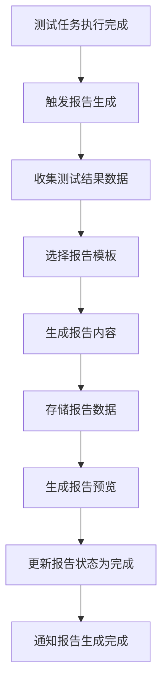
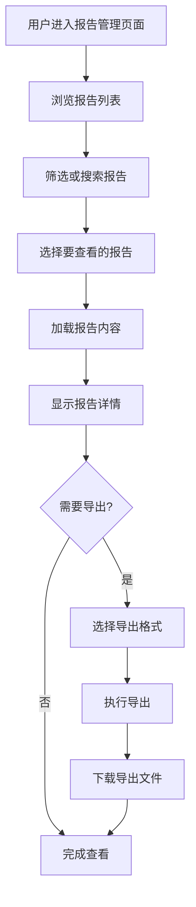
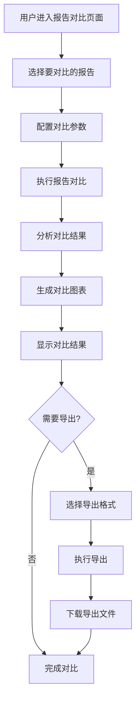
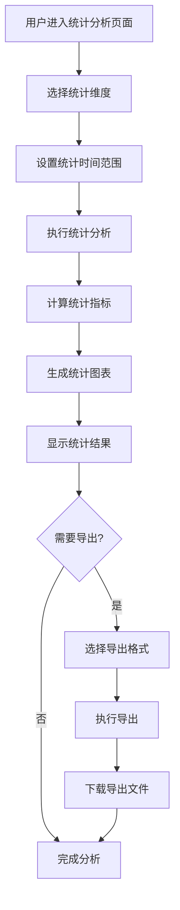

# 报告管理功能设计文档

## 1. 概述

### 1.1 文档目的

本文档描述智能语音测试系统中报告管理功能模块的详细设计，包括功能定位、架构设计、核心流程、技术实现和用户界面等方面。报告管理功能作为系统的核心分析能力之一，旨在为用户提供多维度测试报告查看、对比分析和导出功能，支持历史报告管理和统计分析。

### 1.2 功能定位

报告管理功能位于系统测试结果分析的核心位置，主要解决以下测试场景需求：

- **报告集中管理**：统一管理端到端测试报告和API测试报告
- **多维度查看**：支持按任务、时间、设备等维度查看报告
- **对比分析**：支持多报告结果对比和分析
- **报告导出**：支持多种格式的报告导出
- **统计分析**：提供报告数据的统计和分析
- **模板管理**：支持自定义报告模板

该功能适用于测试结果分析、报告生成、数据可视化等场景，是确保测试结果可分析性和可追溯性的重要工具。

### 1.3 术语定义

| 术语 | 解释 |
|------|------|
| 测试报告 | 测试任务执行完成后生成的详细报告，包含执行结果和分析 |
| 报告模板 | 预定义的报告格式和内容结构 |
| 报告导出 | 将报告转换为其他格式（如PDF、Excel等）的过程 |
| 报告对比 | 比较多个测试报告结果的过程 |
| 数据可视化 | 将测试数据转换为图表等可视化形式的过程 |
| 报告统计 | 对报告数据进行统计分析的过程 |
| 报告分享 | 将报告分享给其他用户的过程 |
| 历史报告 | 过去生成的测试报告 |

## 2. 系统架构设计

### 2.1 整体架构

报告管理功能采用前后端分离的三层架构设计，包含前端展示层、后端服务层和报告存储层。

**前端展示层**：基于Vue 3框架构建，提供用户界面、报告管理、查看分析和导出功能。前端通过WebSocket与后端建立实时通信，接收报告生成进度和状态更新。

**后端服务层**：基于Flask框架实现，负责报告生成、存储管理、对比分析和统计计算。后端通过异步IO处理报告生成和导出，通过WebSocket向前端推送实时数据。

**报告存储层**：负责报告的物理存储、元数据管理和索引。支持多种格式报告的存储和管理。

### 2.2 核心组件

| 组件 | 职责 | 技术实现 | 通信方式 |
|------|------|----------|----------|
| 前端报告管理页面 | 提供用户界面、报告管理、查看分析和导出功能 | Vue 3 + WebSocket | WebSocket推送 |
| 后端报告服务 | 负责报告生成、存储管理、对比分析和统计计算 | Flask + SQLAlchemy | HTTP REST + WebSocket |
| 报告生成器 | 负责根据测试结果生成报告 | Flask + Jinja2 | 模板渲染 |
| 报告存储 | 负责报告的物理存储和管理 | 文件系统 + PostgreSql | 文件操作 + 数据库 |
| 报告导出 | 负责将报告导出为其他格式 | Flask + WeasyPrint | 文件转换 |
| 报告对比 | 负责多报告结果对比和分析 | Flask + Pandas | 数据处理 |
| 报告统计 | 负责报告数据的统计和分析 | Flask + NumPy | 数据计算 |

### 2.3 数据流设计

报告管理功能的数据流设计遵循单向数据流原则，确保数据传输的清晰性和可追溯性。

1. **报告生成数据流**：测试任务执行完成 → 触发报告生成 → 后端收集测试结果 → 后端生成报告 → 后端存储报告 → 前端通过WebSocket接收报告生成完成通知 → 前端显示报告列表

2. **报告查看数据流**：前端请求查看报告 → 后端获取报告数据 → 后端返回报告内容 → 前端显示报告内容 → 前端请求导出报告 → 后端生成导出文件 → 前端下载导出文件

3. **报告对比数据流**：前端选择多个报告进行对比 → 后端获取报告数据 → 后端对比分析数据 → 后端生成对比结果 → 前端显示对比结果 → 前端请求导出对比报告 → 后端生成对比报告 → 前端下载对比报告

4. **统计分析数据流**：前端发起统计分析请求 → 后端查询报告数据 → 后端计算统计指标 → 后端生成统计图表数据 → 前端显示统计图表 → 前端请求导出统计报告 → 后端生成统计报告 → 前端下载统计报告

### 2.4 依赖关系

报告管理功能依赖以下系统模块：

- **测试执行模块**：用于获取测试执行结果
- **结果处理模块**：用于处理测试执行结果数据
- **任务管理模块**：用于关联测试任务
- **评估系统模块**：用于获取评估指标数据
- **用例管理模块**：用于获取测试用例信息
- **设备管理模块**：用于获取设备信息

## 3. 核心功能模块

### 3.1 报告生成

#### 3.1.1 自动生成

自动生成模块负责测试任务完成后自动生成报告。

**触发机制**
- 测试任务执行完成后自动触发
- 支持手动触发报告重新生成
- 支持定时批量生成报告

**生成过程**
- 收集测试执行结果
- 收集测试用例信息
- 收集设备信息
- 计算评估指标
- 生成报告内容
- 存储报告数据

**生成配置**
- 支持配置报告包含的内容
- 支持配置报告格式
- 支持配置报告模板
- 支持配置报告存储位置

#### 3.1.2 手动生成

手动生成模块负责用户手动触发报告生成。

**生成触发**
- 支持基于历史任务生成报告
- 支持基于自定义数据生成报告
- 支持基于多个任务合并生成报告

**参数配置**
- 支持选择报告模板
- 支持配置报告包含的内容
- 支持配置报告格式
- 支持配置报告存储位置

**生成监控**
- 实时监控报告生成进度
- 实时监控报告生成状态
- 实时监控报告生成错误

### 3.2 报告存储与管理

#### 3.2.1 报告存储

报告存储模块负责报告的物理存储和管理。

**存储结构**
- 按时间、任务类型等分类存储
- 支持自定义存储路径
- 支持报告文件和元数据分离存储

**存储格式**
- 原始报告：JSON格式，便于数据处理
- 预览报告：HTML格式，便于查看
- 导出报告：PDF、Excel等格式

**存储管理**
- 支持报告存储容量管理
- 支持报告自动清理策略
- 支持报告备份和恢复

#### 3.2.2 报告管理

报告管理模块负责报告的元数据管理和索引。

**元数据管理**
- 存储报告的基本信息（名称、类型、创建时间等）
- 存储报告的关联信息（任务ID、设备ID等）
- 支持报告元数据的搜索和筛选

**索引管理**
- 为报告元数据创建索引，加速搜索
- 支持多维度索引（时间、类型、设备等）
- 支持索引优化和维护

**报告操作**
- 支持报告的重命名
- 支持报告的移动和复制
- 支持报告的删除（软删除）
- 支持报告的恢复

### 3.3 报告查看与预览

#### 3.3.1 报告列表

报告列表模块负责显示报告列表。

**列表展示**
- 显示报告的基本信息（名称、类型、创建时间等）
- 支持按多种维度排序
- 支持分页显示
- 支持批量选择

**筛选功能**
- 按时间范围筛选
- 按报告类型筛选
- 按任务类型筛选
- 按设备类型筛选
- 按创建者筛选

**搜索功能**
- 支持关键词搜索报告名称、描述等
- 支持高级搜索（多条件组合）
- 支持搜索结果排序

#### 3.3.2 报告详情

报告详情模块负责显示报告的详细内容。

**基本信息**
- 报告名称、类型、描述
- 关联任务信息
- 创建时间、创建者
- 报告统计信息

**执行摘要**
- 测试执行总览
- 成功/失败统计
- 执行时间统计
- 关键指标概览

**详细结果**
- 测试用例执行结果列表
- 每个用例的详细执行信息
- 错误和异常信息
- 设备性能数据

**评估分析**
- 评估指标详情
- 指标趋势分析
- 异常指标识别
- 评估结果可视化

#### 3.3.3 报告预览

报告预览模块负责报告的在线预览。

**HTML预览**
- 支持在线预览HTML格式报告
- 支持报告内容的导航和跳转
- 支持报告内容的搜索


### 3.4 报告导出与分享

#### 3.4.1 报告导出

报告导出模块负责将报告导出为多种格式。

**导出格式**
- PDF格式：适合打印和正式文档
- Excel格式：适合数据进一步分析
- CSV格式：适合数据导入其他系统
- HTML格式：适合在线查看
- JSON格式：适合数据交换

**导出选项**
- 支持导出全部内容或部分内容
- 支持导出为压缩文件
- 支持批量导出多个报告
- 支持配置导出文件命名规则

**导出监控**
- 实时监控导出进度
- 实时监控导出状态
- 实时监控导出错误

#### 3.4.2 报告分享

报告分享模块负责报告的分享功能。

**分享方式**
- 生成分享链接
- 支持邮件分享
- 支持导出后分享

**分享权限**
- 支持设置分享链接的访问权限
- 支持设置分享链接的有效期
- 支持设置分享链接的访问密码

**分享统计**
- 记录分享链接的访问次数
- 记录分享链接的访问时间
- 支持分享链接的管理和撤销

### 3.5 报告对比分析

#### 3.5.1 多报告对比

多报告对比模块负责对比多个报告的结果。

**报告选择**
- 支持选择多个报告进行对比
- 支持按条件筛选报告
- 支持保存对比配置

**对比维度**
- 按测试用例对比
- 按评估指标对比
- 按设备性能对比
- 按执行时间对比

**对比结果**
- 对比结果表格
- 对比结果图表
- 对比结果分析
- 对比结果异常识别

#### 3.5.2 趋势分析

趋势分析模块负责分析报告数据的变化趋势。

**时间趋势**
- 按日分析指标变化
- 按周分析指标变化
- 按月分析指标变化
- 按季度分析指标变化

**维度趋势**
- 按测试类型分析趋势
- 按设备类型分析趋势
- 按评估指标分析趋势
- 按执行环境分析趋势

**趋势结果**
- 趋势图表
- 趋势分析报告
- 异常趋势识别
- 预测分析

### 3.6 报告统计与分析

#### 3.6.1 统计分析

统计分析模块负责对报告数据进行统计分析。

**基本统计**
- 报告数量统计
- 测试用例执行统计
- 评估指标统计
- 设备性能统计

**维度统计**
- 按时间维度统计
- 按任务类型统计
- 按设备类型统计
- 按评估维度统计

**统计结果**
- 统计表格
- 统计图表
- 统计分析报告
- 异常统计识别

#### 3.6.2 数据可视化

数据可视化模块负责将报告数据转换为可视化形式。

**图表类型**
- 柱状图：适合比较不同类别的数据
- 折线图：适合显示数据的变化趋势
- 饼图：适合显示数据的占比
- 散点图：适合显示两个变量之间的关系
- 热力图：适合显示数据的密度分布

**可视化配置**
- 支持配置图表类型
- 支持配置图表样式
- 支持配置图表数据来源
- 支持配置图表交互方式

**可视化导出**
- 支持导出图表为图片
- 支持导出图表为SVG
- 支持导出图表为PDF

### 3.7 报告模板管理

#### 3.7.1 模板创建与编辑

模板创建与编辑模块负责报告模板的创建和编辑。

**模板创建**
- 支持基于现有模板创建新模板
- 支持从空白创建新模板
- 支持导入外部模板

**模板编辑**
- 支持编辑模板的基本信息
- 支持编辑模板的内容结构
- 支持编辑模板的样式
- 支持编辑模板的数据源

**模板删除**
- 支持删除不再使用的模板
- 支持删除前确认
- 支持删除后恢复（软删除）

#### 3.7.2 模板使用与管理

模板使用与管理模块负责报告模板的使用和管理。

**模板使用**
- 支持在报告生成时选择模板
- 支持预览模板效果
- 支持模板参数配置

**模板管理**
- 支持模板的分类管理
- 支持模板的搜索和筛选
- 支持模板的版本控制
- 支持模板的导入导出

**预设模板**
- 标准测试报告模板
- 详细分析报告模板
- 摘要报告模板
- 对比分析报告模板

## 4. 核心流程图

### 4.1 报告生成流程



### 4.2 报告查看流程



### 4.3 报告对比流程



### 4.4 统计分析流程



## 5. 用户界面设计

### 5.1 页面布局

报告管理功能页面采用左侧导航+右侧内容区的经典布局，响应式设计适配不同屏幕尺寸。

**顶部导航栏**：显示当前操作状态、搜索框、批量操作按钮
**左侧边栏**：报告管理和统计分析导航，支持展开/折叠
**右侧主内容区**：报告列表和详情展示，包含操作按钮
**底部状态栏**：显示选中报告数量、总数等统计信息

### 5.2 核心界面

#### 5.2.1 报告列表界面

**报告列表标签页**
- 报告表格：显示报告名称、类型、创建时间、关联任务等
- 排序功能：支持按名称、类型、创建时间等排序
- 筛选功能：支持按类型、时间、设备等筛选
- 搜索功能：支持关键词搜索报告
- 批量操作：支持选择多个报告进行批量操作

**报告状态标签页**
- 状态统计：显示不同状态的报告数量
- 状态分布：使用饼图显示状态分布
- 状态筛选：点击状态快速筛选对应报告

**报告操作标签页**
- 查看按钮：查看报告详情
- 导出按钮：导出报告
- 删除按钮：删除报告
- 分享按钮：分享报告
- 对比按钮：将报告加入对比

#### 5.2.2 报告详情界面

**基本信息标签页**
- 报告名称、类型、描述
- 关联任务信息
- 创建时间、创建者
- 报告统计信息

**执行摘要标签页**
- 测试执行总览
- 成功/失败统计
- 执行时间统计
- 关键指标概览

**详细结果标签页**
- 测试用例执行结果列表
- 每个用例的详细执行信息
- 错误和异常信息
- 设备性能数据

**评估分析标签页**
- 评估指标详情
- 指标趋势分析
- 异常指标识别
- 评估结果可视化

**导出操作标签页**
- 导出格式选择
- 导出内容配置
- 导出执行
- 导出历史

#### 5.2.3 报告对比界面

**报告选择标签页**
- 报告列表：显示可选择的报告
- 报告筛选：支持按条件筛选报告
- 报告选择：支持选择多个报告
- 选择预览：显示已选择的报告数量和列表

**对比配置标签页**
- 对比维度：选择要对比的维度
- 对比指标：选择要对比的指标
- 对比方式：配置对比的具体方式
- 报告配置：配置对比报告的内容和格式

**对比结果标签页**
- 对比结果概览：显示对比的总体结果
- 详细对比：显示不同报告的结果对比
- 对比图表：显示对比的可视化图表
- 异常分析：显示对比中的异常情况

**导出操作标签页**
- 导出格式选择
- 导出内容配置
- 导出执行
- 导出历史

#### 5.2.4 统计分析界面

**统计维度标签页**
- 时间维度：选择统计的时间范围
- 任务维度：选择统计的任务类型
- 设备维度：选择统计的设备类型
- 指标维度：选择统计的评估指标

**统计结果标签页**
- 统计概览：显示统计的总体结果
- 详细统计：显示各维度的详细统计
- 统计图表：显示统计的可视化图表
- 异常分析：显示统计中的异常情况

**趋势分析标签页**
- 时间趋势：显示指标随时间的变化趋势
- 维度趋势：显示不同维度的指标趋势
- 趋势图表：显示趋势的可视化图表
- 预测分析：显示基于历史数据的预测

**报表生成标签页**
- 报表类型：选择要生成的报表类型
- 报表内容：配置报表的具体内容
- 报表格式：选择报表的导出格式
- 报表执行：执行报表生成

### 5.3 交互设计

#### 5.3.1 操作流程

**报告查看流程**
1. 用户在报告列表中选择报告
2. 点击"查看"按钮进入报告详情页面
3. 在详情页面查看报告的各个部分
4. 点击"导出"按钮选择导出格式
5. 点击"执行导出"按钮导出报告
6. 下载导出的报告文件

**报告对比流程**
1. 用户在报告列表中选择多个报告
2. 点击"对比"按钮进入报告对比页面
3. 配置对比参数和维度
4. 点击"执行对比"按钮执行对比
5. 在对比结果页面查看对比结果
6. 点击"导出"按钮导出对比报告

**统计分析流程**
1. 用户进入统计分析页面
2. 选择统计维度和时间范围
3. 点击"执行统计"按钮执行统计
4. 在统计结果页面查看统计结果
5. 点击"生成报表"按钮生成统计报表
6. 下载生成的报表文件

#### 5.3.2 响应式设计

报告管理界面采用响应式设计，适配不同屏幕尺寸：

- **桌面端**（≥1200px）：完整三栏布局，左侧导航、右侧报告列表和详情
- **平板端**（768px-1199px）：双栏布局，导航可折叠，报告列表优先显示
- **移动端**（<768px）：单栏布局，通过标签页切换不同功能区域

### 5.4 视觉设计

#### 5.4.1 颜色系统

报告管理功能采用深蓝色主题，体现专业、可靠的分析工具属性：

- **主色调**：#2F54EB（深蓝色），用于按钮、重要状态、高亮显示
- **辅助色**：#E6F7FF（浅蓝），用于背景、边框、次要元素
- **状态色**：
  - 成功：#52C41A（绿色）
  - 失败：#F5222D（红色）
  - 警告：#FAAD14（黄色）
  - 信息：#1890FF（蓝色）

#### 5.4.2 字体与图标

- **字体**：系统默认无衬线字体，主标题16px，正文14px，小字12px
- **图标**：使用Font Awesome图标库，主要图标包括：
  - 报告：用于报告管理
  - 图表：用于统计分析
  - 对比：用于报告对比
  - 导出：用于报告导出
  - 分享：用于报告分享
  - 模板：用于模板管理

#### 5.4.3 布局原则

- **信息层次**：重要信息（报告概览、关键指标）优先显示，次要信息（详细配置）可折叠
- **空间利用**：充分利用屏幕空间，避免不必要的留白
- **操作便捷**：常用操作按钮放置在显眼位置，减少操作路径
- **视觉引导**：使用颜色、图标、动画等元素引导用户注意力
- **一致性**：保持与系统其他模块的视觉风格一致

## 6. 技术实现

### 6.1 前端实现

#### 6.1.1 技术栈

- **框架**：Vue 3 + Composition API
- **状态管理**：Pinia（轻量级状态管理）
- **路由**：Vue Router
- **通信**：WebSocket（实时通信） + Axios（HTTP请求）
- **UI组件**：自定义组件 + Element Plus
- **表格组件**：Element Plus Table
- **图表库**：ECharts（数据可视化）
- **样式**：SCSS + CSS变量

#### 6.1.2 核心模块

**报告管理模块**
- 报告列表组件：`ReportList.vue`
- 报告详情组件：`ReportDetail.vue`
- 报告操作组件：`ReportOperations.vue`

**报告对比模块**
- 报告选择组件：`ReportSelector.vue`
- 对比配置组件：`ComparisonConfig.vue`
- 对比结果组件：`ComparisonResult.vue`

**统计分析模块**
- 统计维度组件：`StatsDimension.vue`
- 统计结果组件：`StatsResult.vue`
- 趋势分析组件：`TrendAnalysis.vue`
- 报表生成组件：`ReportGenerator.vue`

#### 6.1.3 关键实现

**报告列表处理**
```javascript
// 报告列表处理
export const useReportList = () => {
  const reports = ref([]);
  const loading = ref(false);
  const error = ref(null);
  const pagination = ref({
    currentPage: 1,
    pageSize: 20,
    total: 0
  });
  const filters = ref({
    type: null,
    startDate: null,
    endDate: null,
    taskType: null,
    search: ''
  });
  
  const fetchReports = async () => {
    loading.value = true;
    error.value = null;
    
    try {
      const response = await axios.get('/api/reports', {
        params: {
          page: pagination.value.currentPage,
          page_size: pagination.value.pageSize,
          ...filters.value
        }
      });
      
      reports.value = response.data.items;
      pagination.value.total = response.data.total;
    } catch (err) {
      error.value = err.message;
    } finally {
      loading.value = false;
    }
  };
  
  const handlePageChange = (page) => {
    pagination.value.currentPage = page;
    fetchReports();
  };
  
  const handleSizeChange = (size) => {
    pagination.value.pageSize = size;
    pagination.value.currentPage = 1;
    fetchReports();
  };
  
  const handleFilterChange = () => {
    pagination.value.currentPage = 1;
    fetchReports();
  };
  
  const refreshList = () => {
    fetchReports();
  };
  
  // 初始加载
  fetchReports();
  
  return {
    reports,
    loading,
    error,
    pagination,
    filters,
    handlePageChange,
    handleSizeChange,
    handleFilterChange,
    refreshList
  };
};
```

**报告对比处理**
```javascript
// 报告对比处理
export const useReportComparison = () => {
  const selectedReports = ref([]);
  const comparisonConfig = ref({
    dimensions: ['device', 'time'],
    metrics: ['accuracy', 'recall', 'f1'],
    generateReport: true
  });
  const isComparing = ref(false);
  const comparisonProgress = ref(0);
  const comparisonResult = ref(null);
  
  const selectReport = (reportId, selected) => {
    if (selected) {
      if (!selectedReports.value.includes(reportId)) {
        selectedReports.value.push(reportId);
      }
    } else {
      selectedReports.value = selectedReports.value.filter(id => id !== reportId);
    }
  };
  
  const executeComparison = async () => {
    if (selectedReports.value.length < 2) {
      return {
        success: false,
        message: '请至少选择两个报告进行对比'
      };
    }
    
    isComparing.value = true;
    comparisonProgress.value = 0;
    comparisonResult.value = null;
    
    try {
      const response = await axios.post('/api/reports/compare', {
        report_ids: selectedReports.value,
        config: comparisonConfig.value
      });
      
      comparisonResult.value = response.data;
      return {
        success: true,
        message: '报告对比成功'
      };
    } catch (error) {
      return {
        success: false,
        message: error.message
      };
    } finally {
      isComparing.value = false;
    }
  };
  
  const clearSelection = () => {
    selectedReports.value = [];
  };
  
  return {
    selectedReports,
    comparisonConfig,
    isComparing,
    comparisonProgress,
    comparisonResult,
    selectReport,
    executeComparison,
    clearSelection
  };
};
```

### 6.2 后端实现

#### 6.2.1 技术栈

- **框架**：Flask + Flask-SocketIO
- **数据库**：PostgreSql + SQLAlchemy
- **ORM**：SQLAlchemy
- **网络通信**：WebSocket + RESTful API
- **数据序列化**：Marshmallow
- **报告生成**：Jinja2（模板引擎） + WeasyPrint（PDF生成）
- **数据处理**：Pandas（数据分析） + NumPy（数值计算）
- **图表生成**：ECharts（服务器端渲染）
- **文件处理**：OpenPyXL（Excel处理） + CSV（CSV处理）

#### 6.2.2 核心模块

**报告生成模块**
- 报告生成器：`report_generator.py`
- 模板管理：`template_manager.py`
- 数据收集：`data_collector.py`

**报告管理模块**
- 报告CRUD：`report_controller.py`
- 报告存储：`report_storage.py`
- 报告索引：`report_index.py`

**报告对比模块**
- 报告选择：`report_selector.py`
- 对比处理：`comparison_processor.py`
- 对比结果：`comparison_result.py`

**统计分析模块**
- 统计计算：`stats_calculator.py`
- 趋势分析：`trend_analyzer.py`
- 报表生成：`stats_report_generator.py`

#### 6.2.3 关键实现

**报告管理**
```python
# 报告管理
from flask import Blueprint, request, jsonify, send_file
from flask_jwt_extended import jwt_required
from app.models import Report, ReportTemplate
from app.schemas import ReportSchema
from app.extensions import db
from app.reports import report_generator

api = Blueprint('reports', __name__, url_prefix='/api/reports')

report_schema = ReportSchema()
reports_schema = ReportSchema(many=True)

@api.route('/', methods=['GET'])
def get_reports():
    """获取报告列表"""
    # 分页参数
    page = request.args.get('page', 1, type=int)
    page_size = request.args.get('page_size', 20, type=int)
    
    # 筛选参数
    type = request.args.get('type')
    start_date = request.args.get('start_date')
    end_date = request.args.get('end_date')
    task_type = request.args.get('task_type')
    search = request.args.get('search')
    
    # 构建查询
    query = Report.query
    
    if type:
        query = query.filter_by(type=type)
    
    if start_date:
        query = query.filter(Report.created_at >= start_date)
    
    if end_date:
        query = query.filter(Report.created_at <= end_date)
    
    if task_type:
        query = query.filter_by(task_type=task_type)
    
    if search:
        query = query.filter(Report.name.ilike(f'%{search}%'))
    
    # 执行查询
    pagination = query.order_by(Report.created_at.desc()).paginate(page=page, per_page=page_size, error_out=False)
    reports = pagination.items
    
    # 序列化结果
    result = reports_schema.dump(reports)
    
    return jsonify({
        'items': result,
        'total': pagination.total,
        'page': page,
        'page_size': page_size
    })

@api.route('/<int:id>', methods=['GET'])
def get_report(id):
    """获取报告详情"""
    report = Report.query.get(id)
    if not report:
        return jsonify({'error': '报告不存在'}), 404
    
    # 序列化结果
    result = report_schema.dump(report)
    
    return jsonify(result)

@api.route('/<int:id>/content', methods=['GET'])
def get_report_content(id):
    """获取报告内容"""
    report = Report.query.get(id)
    if not report:
        return jsonify({'error': '报告不存在'}), 404
    
    # 获取报告内容
    content = get_report_content(report.id)
    
    return jsonify({'content': content})

@api.route('/<int:id>/export', methods=['POST'])
def export_report(id):
    """导出报告"""
    report = Report.query.get(id)
    if not report:
        return jsonify({'error': '报告不存在'}), 404
    
    data = request.get_json()
    format = data.get('format', 'pdf')
    options = data.get('options', {})
    
    try:
        # 生成导出文件
        file_path = report_generator.export_report(report.id, format, options)
        
        # 返回文件
        return send_file(file_path, as_attachment=True, download_name=f"report_{report.id}.{format}")
    
    except Exception as e:
        return jsonify({'error': str(e)}), 500

def get_report_content(report_id):
    """获取报告内容"""
    # 这里实现获取报告内容的逻辑
    # 从文件系统或数据库中读取报告内容
    return {}
```

**报告对比**
```python
# 报告对比
from flask import Blueprint, request, jsonify
from app.models import Report
from app.extensions import db
import pandas as pd

api = Blueprint('report_comparison', __name__, url_prefix='/api/reports')

@api.route('/compare', methods=['POST'])
def compare_reports():
    """对比多个报告"""
    data = request.get_json()
    
    report_ids = data.get('report_ids', [])
    config = data.get('config', {})
    
    if len(report_ids) < 2:
        return jsonify({'error': '请至少选择两个报告进行对比'}), 400
    
    # 验证报告是否存在
    reports = Report.query.filter(Report.id.in_(report_ids)).all()
    if len(reports) != len(report_ids):
        return jsonify({'error': '部分报告不存在'}), 404
    
    try:
        # 收集报告数据
        report_data = []
        for report in reports:
            # 获取报告数据
            data = get_report_data(report.id)
            report_data.append({
                'report_id': report.id,
                'report_name': report.name,
                'report_type': report.type,
                'data': data
            })
        
        # 执行对比分析
        comparison_result = compare_reports_data(report_data, config)
        
        # 生成对比报告
        if config.get('generateReport', False):
            report = generate_comparison_report(comparison_result, config)
            comparison_result['report_url'] = f'/api/reports/compare/{report.id}/report'
        
        return jsonify({
            'success': True,
            'result': comparison_result
        })
    
    except Exception as e:
        return jsonify({'error': str(e)}), 500

def get_report_data(report_id):
    """获取报告数据"""
    # 这里实现获取报告数据的逻辑
    return {}

def compare_reports_data(report_data, config):
    """对比报告数据"""
    # 这里实现对比报告数据的逻辑
    return {}

def generate_comparison_report(comparison_result, config):
    """生成对比报告"""
    # 这里实现生成对比报告的逻辑
    return {}
```

## 7. 性能与可靠性设计

### 7.1 性能优化

#### 7.1.1 报告生成优化

- **异步生成**：使用异步IO处理报告生成，提高并发能力
- **数据缓存**：缓存报告生成过程中的中间数据，减少重复计算
- **模板预编译**：预编译报告模板，减少模板渲染时间
- **并行处理**：使用多线程并行处理报告数据，提高处理速度

#### 7.1.2 报告存储优化

- **存储结构**：优化报告存储结构，提高文件读写速度
- **索引优化**：为报告元数据创建索引，加速搜索和筛选
- **压缩存储**：对大型报告进行压缩存储，减少存储空间
- **分层存储**：根据报告访问频率，采用不同的存储策略

#### 7.1.3 报告访问优化

- **前端优化**：使用虚拟滚动处理大量报告列表，减少DOM操作
- **后端优化**：使用缓存减少重复计算和数据库查询
- **分页加载**：使用分页加载报告列表，避免一次性加载大量数据
- **增量更新**：使用WebSocket实现报告状态的增量更新，减少数据传输

### 7.2 可靠性设计

#### 7.2.1 错误处理

- **报告生成错误**：处理报告生成过程中的错误
- **数据处理错误**：处理数据处理过程中的错误
- **文件操作错误**：处理文件读写过程中的错误
- **系统错误**：处理系统资源不足、权限不足等错误

#### 7.2.2 重试机制

- **报告生成重试**：报告生成失败自动重试
- **数据处理重试**：数据处理失败自动重试
- **文件操作重试**：文件操作失败自动重试

#### 7.2.3 容错设计

- **报告生成容错**：部分数据处理失败不影响报告生成
- **数据处理容错**：部分数据错误不影响整体处理
- **存储容错**：存储失败时使用备用存储方案
- **处理容错**：处理过程中系统崩溃后支持恢复处理

#### 7.2.4 监控与告警

- **系统监控**：监控CPU、内存、磁盘使用情况
- **报告监控**：监控报告生成状态、进度和错误
- **数据库监控**：监控数据库连接、查询性能
- **错误告警**：关键错误实时告警，支持邮件通知

## 8. 安全设计

### 8.1 数据安全

- **数据加密**：敏感数据传输和存储加密
- **访问控制**：基于角色的访问控制，限制用户权限
- **数据脱敏**：报告中的敏感信息脱敏处理
- **审计日志**：记录所有操作日志，支持追溯

### 8.2 操作安全

- **操作验证**：验证用户操作的合法性和权限
- **批量操作限制**：限制单次批量操作的数量，防止系统过载
- **报告生成限制**：限制并发生成的报告数量，防止系统过载
- **资源限制**：限制报告生成的资源使用，防止系统过载

### 8.3 网络安全

- **传输加密**：WebSocket连接使用WSS加密
- **访问限制**：限制API访问来源，防止未授权访问
- **CSRF防护**：防止跨站请求伪造攻击
- **XSS防护**：防止跨站脚本攻击

### 8.4 应用安全

- **依赖安全**：定期更新第三方依赖，修复安全漏洞
- **代码安全**：代码审查，防止安全漏洞
- **配置安全**：敏感配置信息加密存储
- **运行安全**：应用运行在沙箱环境中

## 9. 测试与维护

### 9.1 测试策略

#### 9.1.1 单元测试

- **报告生成测试**：测试报告生成的各个环节
- **报告管理测试**：测试报告的CRUD操作
- **报告对比测试**：测试报告对比的逻辑
- **统计分析测试**：测试统计分析的计算

#### 9.1.2 集成测试

- **前后端集成**：测试前端组件与后端API的交互
- **数据库集成**：测试与数据库的交互
- **文件系统集成**：测试与文件系统的交互
- **第三方库集成**：测试与第三方库的集成

#### 9.1.3 端到端测试

- **完整流程测试**：测试从报告生成到查看、导出的完整流程
- **报告对比测试**：测试多报告对比的完整流程
- **统计分析测试**：测试统计分析的完整流程
- **异常场景测试**：测试各种异常场景的处理

### 9.2 维护策略

#### 9.2.1 监控与日志

- **系统监控**：监控CPU、内存、磁盘使用情况
- **报告监控**：监控报告生成状态、进度和错误
- **数据库监控**：监控数据库连接、查询性能
- **日志管理**：集中管理系统日志、应用日志、报告生成日志

#### 9.2.2 故障排除

- **故障诊断**：快速定位故障原因
- **故障修复**：及时修复系统故障
- **故障预防**：分析故障原因，预防类似问题
- **知识积累**：建立故障知识库，支持快速解决

#### 9.2.3 版本管理

- **代码版本**：使用Git进行代码版本管理
- **配置版本**：管理系统配置的版本
- **模板版本**：管理报告模板的版本
- **数据版本**：管理报告数据的版本

#### 9.2.4 升级策略

- **系统升级**：定期升级系统组件和依赖
- **功能升级**：根据用户反馈和需求添加新功能
- **性能升级**：优化系统性能，提高处理效率
- **安全升级**：及时修复安全漏洞

## 10. 未来规划

### 10.1 功能增强

- **智能报告生成**：使用AI自动生成报告摘要和分析
- **报告推荐**：基于历史数据推荐相关报告
- **自定义仪表盘**：支持用户创建自定义数据仪表盘
- **实时报告**：支持实时生成和更新报告

### 10.2 技术演进

- **容器化部署**：支持Docker容器化部署，提高环境一致性
- **云服务集成**：集成云服务，扩展计算和存储能力
- **低代码配置**：提供可视化配置界面，降低使用门槛
- **API开放**：开放API接口，支持与其他系统集成

### 10.3 生态建设

- **插件系统**：支持第三方插件扩展功能
- **模板市场**：建立报告模板市场，支持模板共享和下载
- **社区建设**：建立用户社区，共享报告分析经验
- **标准制定**：参与报告标准制定，推动行业发展

## 11. 结论

报告管理功能是智能语音测试系统的核心分析能力之一，通过提供多维度测试报告查看、对比分析和导出功能，为用户的测试结果分析提供了重要工具。本文档详细描述了该功能的设计方案，包括系统架构、核心功能、技术实现、用户界面等方面，为开发团队提供了清晰的实现指导。

随着技术的不断发展和用户需求的不断变化，报告管理功能也需要持续演进和优化。通过本文档的指导，开发团队可以快速实现该功能的核心能力，并在此基础上不断扩展和完善，为用户提供更加全面、高效、可靠的报告管理解决方案。

## 12. 参考资料

- [Vue 3官方文档](https://vuejs.org/)
- [Flask官方文档](https://flask.palletsprojects.com/)
- [SQLAlchemy官方文档](https://www.sqlalchemy.org/)
- [Jinja2官方文档](https://jinja.palletsprojects.com/)
- [WeasyPrint官方文档](https://weasyprint.org/)
- [Pandas官方文档](https://pandas.pydata.org/)
- [ECharts官方文档](https://echarts.apache.org/)
- [OpenPyXL官方文档](https://openpyxl.readthedocs.io/)
- [报告设计最佳实践](https://www.smartsheet.com/content-center/best-practices/report-writing)
- [数据可视化设计指南](https://datavizcatalogue.com/)
