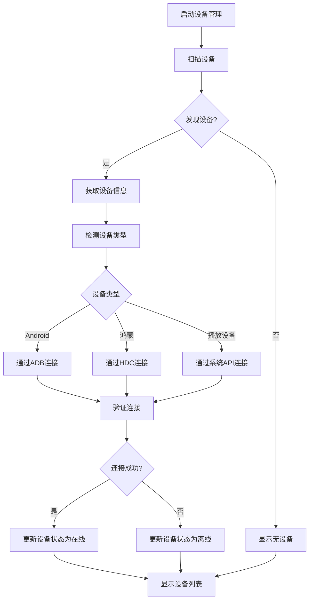
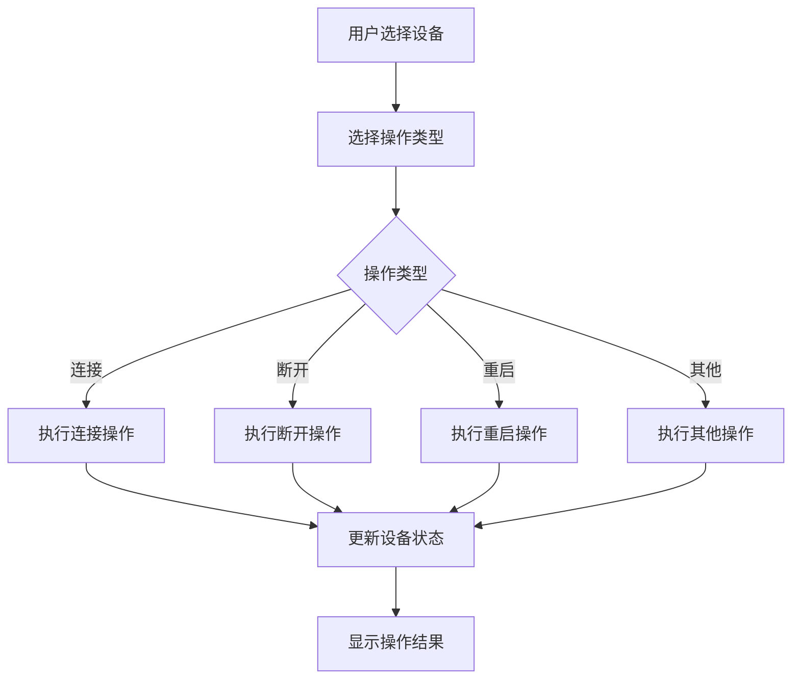
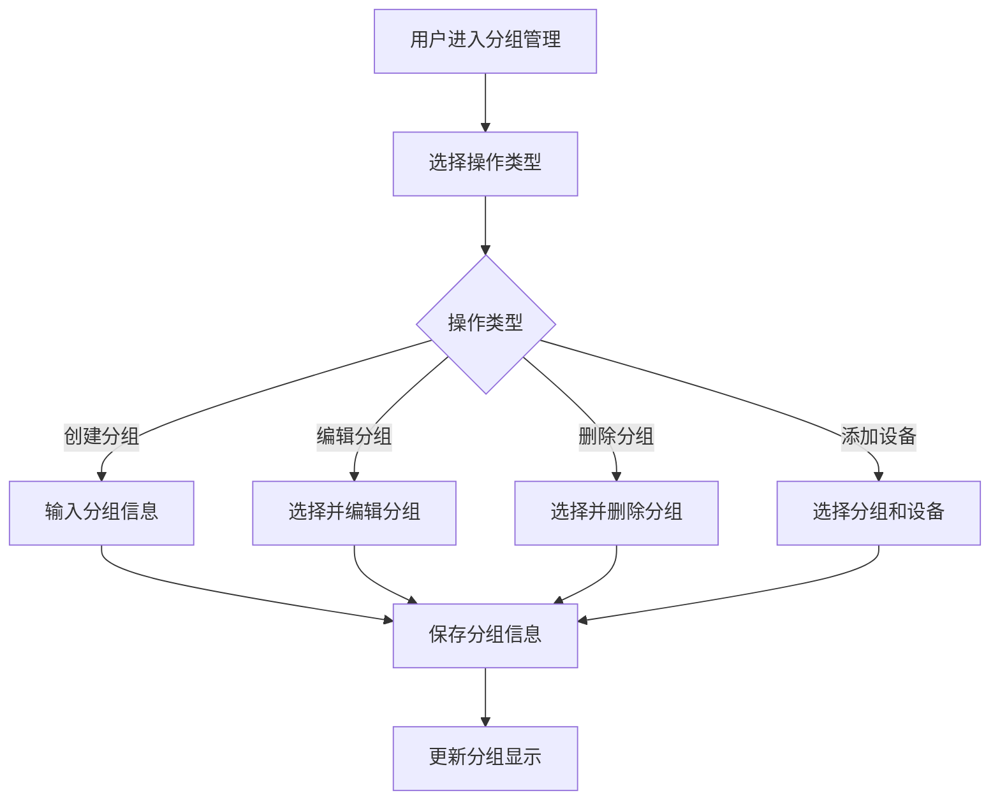
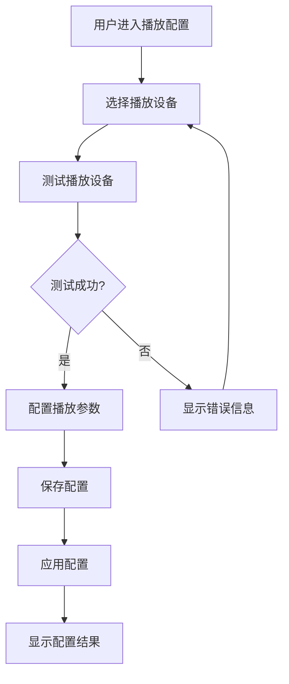

# 设备管理功能设计文档

## 1. 概述

### 1.1 文档目的

本文档描述智能语音测试系统中设备管理（Device）功能模块的详细设计，包括功能定位、架构设计、核心流程、技术实现和用户界面等方面。设备管理功能作为系统的基础支撑能力之一，旨在为用户提供统一管理测试设备和播放设备的能力，支持状态监控和分组配置。

### 1.2 功能定位

设备管理功能位于系统测试执行的基础位置，主要解决以下测试场景需求：

- **设备集中管理**：统一管理Android/鸿蒙真机设备和播放设备
- **状态监控**：实时监控设备在线状态，自动检测设备连接情况
- **设备分组**：支持设备分组管理，方便批量选择和测试执行
- **播放配置**：支持配置播放设备和参数
- **设备信息管理**：管理设备的基本信息和属性
- **设备操作**：支持设备的连接、断开、重启等操作

该功能适用于设备管理、测试执行、资源分配等场景，是确保测试设备可用和可控的重要工具。

### 1.3 术语定义

| 术语 | 解释 |
|------|------|
| 测试设备 | 执行测试的设备，如Android手机、鸿蒙平板等 |
| 播放设备 | 用于播放测试音频的设备，如声卡、扬声器等 |
| 设备状态 | 设备的连接状态，如在线、离线、连接中等 |
| 设备分组 | 对设备进行逻辑分组，方便管理和选择 |
| ADB | Android Debug Bridge，Android设备调试桥 |
| HDC | HarmonyOS Device Connector，鸿蒙设备连接器 |
| 设备信息 | 设备的基本信息，如型号、系统版本等 |
| 播放配置 | 播放设备的配置参数，如音量、采样率等 |
| 设备操作 | 对设备执行的操作，如连接、断开、重启等 |

## 2. 系统架构设计

### 2.1 整体架构

设备管理功能采用前后端分离的三层架构设计，包含前端展示层、后端设备服务层和设备通信层。

**前端展示层**：基于Vue 3框架构建，提供用户界面、设备管理、状态监控和配置功能。前端通过WebSocket与后端建立实时通信，接收设备状态更新和操作结果。

**后端设备服务层**：基于Flask框架实现，负责设备管理、状态监控、分组管理和配置管理。后端通过异步IO处理设备通信，通过WebSocket向前端推送实时数据。

**设备通信层**：负责与设备的直接通信，包括ADB/HDC命令执行、设备状态检测和设备操作执行。支持Android和鸿蒙设备的通信。

### 2.2 核心组件

| 组件 | 职责 | 技术实现 | 通信方式 |
|------|------|----------|----------|
| 前端设备管理页面 | 提供用户界面、设备管理、状态监控和配置功能 | Vue 3 + WebSocket | WebSocket推送 |
| 后端设备服务 | 负责设备管理、状态监控、分组管理和配置管理 | Flask + SQLAlchemy | HTTP REST + WebSocket |
| 设备通信模块 | 负责与设备的直接通信，包括ADB/HDC命令执行 | Python + subprocess | 本地进程通信 |
| 设备监控模块 | 负责实时监控设备状态和连接情况 | Flask + asyncio | 定时检测 |
| 设备分组模块 | 负责设备分组的管理和配置 | Flask + SQLAlchemy | 数据库操作 |
| 播放设备模块 | 负责播放设备的管理和配置 | Python + sounddevice | 本地库调用 |

### 2.3 数据流设计

设备管理功能的数据流设计遵循单向数据流原则，确保数据传输的清晰性和可追溯性。

1. **设备状态数据流**：设备通信模块检测设备状态 → 后端设备服务接收状态更新 → 后端更新设备状态 → 前端通过WebSocket接收状态更新 → 前端更新设备状态显示

2. **设备操作数据流**：前端发起设备操作请求 → 后端设备服务接收请求 → 后端设备服务调用设备通信模块 → 设备通信模块执行操作 → 后端设备服务接收操作结果 → 前端通过WebSocket接收操作结果 → 前端更新操作状态

3. **设备配置数据流**：前端修改设备配置 → 后端设备服务接收配置 → 后端更新设备配置 → 后端设备服务应用配置 → 前端通过WebSocket接收配置结果 → 前端更新配置状态

4. **设备分组数据流**：前端创建/修改设备分组 → 后端设备服务接收分组操作 → 后端更新分组信息 → 前端通过WebSocket接收分组更新 → 前端更新分组显示

### 2.4 依赖关系

设备管理功能依赖以下系统模块：

- **测试执行模块**：用于分配和使用测试设备
- **音频管理模块**：用于配置音频播放设备
- **任务管理模块**：用于关联测试任务和设备
- **报告管理模块**：用于记录设备信息到报告
- **评估系统模块**：用于关联设备和评估结果

## 3. 核心功能模块

### 3.1 设备发现与连接

#### 3.1.1 设备发现

设备发现模块负责自动发现和检测设备。

**自动发现**
- 支持自动发现连接到计算机的Android设备
- 支持自动发现连接到计算机的鸿蒙设备
- 支持自动发现系统中的播放设备
- 支持定时扫描和检测设备

**手动添加**
- 支持手动添加网络设备
- 支持手动添加远程设备
- 支持手动添加虚拟设备
- 支持手动添加播放设备

**设备检测**
- 检测设备的连接状态
- 检测设备的基本信息
- 检测设备的可用性
- 检测设备的权限状态

#### 3.1.2 设备连接

设备连接模块负责设备的连接和断开操作。

**Android设备连接**
- 通过ADB连接Android设备
- 自动处理ADB连接过程
- 支持无线ADB连接
- 支持ADB连接的认证和授权

**鸿蒙设备连接**
- 通过HDC连接鸿蒙设备
- 自动处理HDC连接过程
- 支持无线HDC连接
- 支持HDC连接的认证和授权

**播放设备连接**
- 检测和连接系统中的播放设备
- 支持选择特定的声卡和通道
- 支持配置播放设备参数
- 支持测试播放设备

**设备断开**
- 支持断开设备连接
- 支持批量断开设备连接
- 支持自动断开长时间无操作的设备

### 3.2 设备状态管理

#### 3.2.1 状态监控

状态监控模块负责实时监控设备的状态。

**实时监控**
- 实时监控设备的在线状态
- 实时监控设备的连接状态
- 实时监控设备的电池状态
- 实时监控设备的网络状态

**状态检测**
- 定时检测设备的连接状态
- 检测设备的响应时间
- 检测设备的可用性
- 检测设备的权限状态

**状态通知**
- 设备状态变化时通知前端
- 设备异常时发送告警
- 设备离线时发送通知
- 设备在线时发送通知

#### 3.2.2 状态管理

状态管理模块负责管理设备的状态和属性。

**状态定义**
- 在线（Online）：设备正常连接可用
- 离线（Offline）：设备未连接或不可用
- 连接中（Connecting）：设备正在连接中
- 断开中（Disconnecting）：设备正在断开中
- 错误（Error）：设备连接出错

**状态转换**
- 离线 → 连接中：开始连接设备
- 连接中 → 在线：设备连接成功
- 连接中 → 错误：设备连接失败
- 在线 → 断开中：开始断开设备
- 断开中 → 离线：设备断开成功
- 在线 → 错误：设备连接出错

**状态持久化**
- 保存设备的状态历史
- 记录设备状态变化的时间
- 分析设备状态的变化趋势
- 预测设备的可用性

### 3.3 设备分组管理

#### 3.3.1 分组创建与管理

分组创建与管理模块负责设备分组的创建和管理。

**分组创建**
- 支持创建设备分组
- 支持设置分组名称和描述
- 支持设置分组的类型（测试设备组、播放设备组）
- 支持创建嵌套分组

**分组编辑**
- 支持编辑分组信息
- 支持修改分组名称和描述
- 支持修改分组的设备成员
- 支持修改分组的类型

**分组删除**
- 支持删除设备分组
- 支持删除前确认
- 支持删除空分组
- 支持删除包含设备的分组（设备移出分组）

#### 3.3.2 分组使用

分组使用模块负责设备分组的使用和管理。

**设备添加/移除**
- 支持将设备添加到分组
- 支持将设备从分组移除
- 支持批量添加/移除设备
- 支持按条件添加/移除设备

**分组选择**
- 支持选择整个分组进行操作
- 支持选择多个分组进行操作
- 支持按分组筛选设备
- 支持按分组统计设备

**分组操作**
- 支持对分组中的设备执行批量操作
- 支持对分组设置统一的配置
- 支持对分组进行重命名和移动
- 支持对分组进行复制

### 3.4 设备信息管理

#### 3.4.1 基本信息

基本信息模块负责管理设备的基本信息。

**设备信息收集**
- 自动收集设备的基本信息
- 支持手动编辑设备信息
- 支持导入/导出设备信息
- 支持批量更新设备信息

**Android设备信息**
- 设备型号
- 系统版本
- Android API级别
- 设备ID
- 电池状态
- 存储状态
- 网络状态

**鸿蒙设备信息**
- 设备型号
- 系统版本
- HarmonyOS API级别
- 设备ID
- 电池状态
- 存储状态
- 网络状态

**播放设备信息**
- 设备名称
- 设备类型
- 支持的格式
- 支持的采样率
- 支持的通道数
- 设备状态

#### 3.4.2 高级信息

高级信息模块负责管理设备的高级信息和属性。

**设备属性**
- 支持设置设备的自定义属性
- 支持设置设备的标签
- 支持设置设备的备注
- 支持设置设备的优先级

**设备能力**
- 评估设备的测试能力
- 记录设备的历史表现
- 分析设备的可靠性
- 预测设备的可用性

**设备限制**
- 设置设备的使用限制
- 设置设备的访问权限
- 设置设备的执行限制
- 设置设备的资源限制

### 3.5 播放设备管理

#### 3.5.1 播放设备配置

播放设备配置模块负责配置播放设备和参数。

**设备选择**
- 支持选择系统中的播放设备
- 支持选择特定的声卡和通道
- 支持设置默认播放设备
- 支持测试播放设备

**参数配置**
- 支持设置播放音量
- 支持设置采样率
- 支持设置声道数
- 支持设置缓冲区大小
- 支持设置播放延迟

**高级配置**
- 支持设置音频格式
- 支持设置音频编码
- 支持设置音频效果
- 支持设置音频路由

#### 3.5.2 播放测试

播放测试模块负责测试播放设备的功能。

**音频测试**
- 支持播放测试音频
- 支持测试不同频率的音频
- 支持测试不同音量的音频
- 支持测试不同格式的音频

**设备测试**
- 测试播放设备的响应时间
- 测试播放设备的稳定性
- 测试播放设备的音质
- 测试播放设备的兼容性

**结果分析**
- 分析播放测试的结果
- 生成播放设备的测试报告
- 评估播放设备的性能
- 推荐最佳播放设备配置

### 3.6 设备操作管理

#### 3.6.1 基本操作

基本操作模块负责执行设备的基本操作。

**Android设备操作**
- 支持重启设备
- 支持关机设备
- 支持清除应用数据
- 支持安装/卸载应用
- 支持启动/停止应用

**鸿蒙设备操作**
- 支持重启设备
- 支持关机设备
- 支持清除应用数据
- 支持安装/卸载应用
- 支持启动/停止应用

**播放设备操作**
- 支持重启播放设备
- 支持重置播放设备配置
- 支持测试播放设备
- 支持静音/取消静音

#### 3.6.2 高级操作

高级操作模块负责执行设备的高级操作。

**设备诊断**
- 支持诊断设备的问题
- 支持检测设备的硬件状态
- 支持检测设备的软件状态
- 支持检测设备的网络状态

**设备修复**
- 支持修复设备的常见问题
- 支持修复设备的连接问题
- 支持修复设备的权限问题
- 支持修复设备的存储问题

**设备优化**
- 支持优化设备的性能
- 支持优化设备的电池使用
- 支持优化设备的存储使用
- 支持优化设备的网络连接

### 3.7 设备监控与告警

#### 3.7.1 监控功能

监控功能模块负责监控设备的状态和性能。

**实时监控**
- 实时监控设备的在线状态
- 实时监控设备的电池状态
- 实时监控设备的CPU使用率
- 实时监控设备的内存使用率
- 实时监控设备的存储使用率
- 实时监控设备的网络状态

**历史监控**
- 记录设备状态的历史数据
- 记录设备性能的历史数据
- 记录设备操作的历史记录
- 记录设备错误的历史记录

**统计分析**
- 分析设备的可用性统计
- 分析设备的性能统计
- 分析设备的错误统计
- 分析设备的使用统计

#### 3.7.2 告警功能

告警功能模块负责设备的告警管理。

**告警设置**
- 支持设置设备状态告警
- 支持设置设备性能告警
- 支持设置设备错误告警
- 支持设置告警阈值和规则

**告警通知**
- 设备状态异常时发送告警
- 设备性能异常时发送告警
- 设备错误时发送告警
- 支持邮件、短信等多种告警方式

**告警处理**
- 支持告警的确认和处理
- 支持告警的级别管理
- 支持告警的历史记录
- 支持告警的统计分析

## 4. 核心流程图

### 4.1 设备发现与连接流程



### 4.2 设备操作流程



### 4.3 设备分组流程



### 4.4 播放设备配置流程



## 5. 用户界面设计

### 5.1 页面布局

设备管理功能页面采用左侧导航+右侧内容区的经典布局，响应式设计适配不同屏幕尺寸。

**顶部导航栏**：显示当前操作状态、搜索框、批量操作按钮
**左侧边栏**：设备分组和管理导航，支持展开/折叠
**右侧主内容区**：设备列表、状态监控和配置，包含操作按钮
**底部状态栏**：显示在线设备数量、总数等统计信息

### 5.2 核心界面

#### 5.2.1 设备列表界面

**设备表格标签页**
- 设备列表：显示设备名称、类型、状态、型号等
- 状态显示：使用不同颜色标识设备状态（绿色=在线，灰色=离线，黄色=连接中）
- 排序功能：支持按名称、类型、状态等排序
- 筛选功能：支持按类型、状态等筛选
- 搜索功能：支持关键词搜索设备
- 批量操作：支持选择多个设备进行批量操作

**设备详情标签页**
- 基本信息：设备名称、类型、型号、系统版本等
- 状态信息：连接状态、电池状态、网络状态等
- 高级信息：设备ID、存储状态、CPU/内存使用等
- 操作历史：设备操作的历史记录

**设备操作标签页**
- 连接/断开：连接或断开设备
- 重启：重启设备
- 配置：配置设备参数
- 分组：管理设备分组
- 删除：从列表中移除设备

#### 5.2.2 分组管理界面

**分组树标签页**
- 分组树：显示分组的层级结构
- 分组操作：支持添加、编辑、删除分组
- 分组排序：支持调整分组顺序
- 分组统计：显示每个分组下的设备数量

**分组详情标签页**
- 分组信息：分组名称、描述、类型等
- 设备列表：显示该分组下的设备
- 分组操作：支持编辑、删除分组
- 设备操作：支持添加/移除设备

#### 5.2.3 播放配置界面

**播放设备标签页**
- 设备列表：显示系统中的播放设备
- 设备选择：支持选择默认播放设备
- 设备测试：支持测试播放设备
- 设备属性：显示设备的属性和能力

**播放参数标签页**
- 音量设置：设置播放音量
- 采样率设置：设置播放采样率
- 声道设置：设置播放声道数
- 缓冲区设置：设置播放缓冲区大小

**高级配置标签页**
- 音频格式设置：设置音频格式
- 音频编码设置：设置音频编码
- 音频效果设置：设置音频效果
- 音频路由设置：设置音频路由

#### 5.2.4 监控与告警界面

**实时监控标签页**
- 设备状态：实时显示设备的在线状态
- 性能监控：实时显示设备的性能数据
- 网络监控：实时显示设备的网络状态
- 电池监控：实时显示设备的电池状态

**历史数据标签页**
- 状态历史：显示设备状态的历史数据
- 性能历史：显示设备性能的历史数据
- 操作历史：显示设备操作的历史记录
- 错误历史：显示设备错误的历史记录

**告警设置标签页**
- 告警规则：设置设备告警规则
- 告警阈值：设置告警的阈值
- 告警通知：设置告警通知方式
- 告警级别：设置告警的级别

### 5.3 交互设计

#### 5.3.1 操作流程

**设备连接流程**
1. 用户在设备列表中选择离线设备
2. 点击"连接"按钮
3. 系统尝试连接设备
4. 显示连接进度
5. 连接成功后更新设备状态为在线
6. 显示连接成功提示

**设备分组流程**
1. 用户进入分组管理页面
2. 点击"创建分组"按钮
3. 输入分组名称和描述
4. 选择分组类型
5. 点击"保存"按钮
6. 从设备列表中选择设备添加到分组
7. 点击"添加"按钮
8. 显示添加成功提示

**播放配置流程**
1. 用户进入播放配置页面
2. 选择默认播放设备
3. 点击"测试"按钮测试设备
4. 调整播放参数
5. 点击"保存"按钮
6. 显示保存成功提示

#### 5.3.2 响应式设计

设备管理界面采用响应式设计，适配不同屏幕尺寸：

- **桌面端**（≥1200px）：完整三栏布局，左侧分组导航、右侧设备列表和详情
- **平板端**（768px-1199px）：双栏布局，分组导航可折叠，设备列表优先显示
- **移动端**（<768px）：单栏布局，通过标签页切换不同功能区域

### 5.4 视觉设计

#### 5.4.1 颜色系统

设备管理功能采用紫色主题，体现专业、科技的管理工具属性：

- **主色调**：#722ED1（紫色），用于按钮、重要状态、高亮显示
- **辅助色**：#F3EFFF（浅紫），用于背景、边框、次要元素
- **状态色**：
  - 在线：#52C41A（绿色）
  - 离线：#8C8C8C（灰色）
  - 连接中：#FAAD14（黄色）
  - 错误：#F5222D（红色）

#### 5.4.2 字体与图标

- **字体**：系统默认无衬线字体，主标题16px，正文14px，小字12px
- **图标**：使用Font Awesome图标库，主要图标包括：
  - 设备：用于设备管理
  - 连接：用于设备连接
  - 分组：用于分组管理
  - 配置：用于设备配置
  - 监控：用于设备监控
  - 告警：用于设备告警

#### 5.4.3 布局原则

- **信息层次**：重要信息（设备状态、操作按钮）优先显示，次要信息（详细配置）可折叠
- **空间利用**：充分利用屏幕空间，避免不必要的留白
- **操作便捷**：常用操作按钮放置在显眼位置，减少操作路径
- **视觉引导**：使用颜色、图标、动画等元素引导用户注意力
- **一致性**：保持与系统其他模块的视觉风格一致

## 6. 技术实现

### 6.1 前端实现

#### 6.1.1 技术栈

- **框架**：Vue 3 + Composition API
- **状态管理**：Pinia（轻量级状态管理）
- **路由**：Vue Router
- **通信**：WebSocket（实时通信） + Axios（HTTP请求）
- **UI组件**：自定义组件 + Element Plus
- **表格组件**：Element Plus Table
- **图表库**：ECharts（数据可视化）
- **样式**：SCSS + CSS变量

#### 6.1.2 核心模块

**设备管理模块**
- 设备列表组件：`DeviceList.vue`
- 设备详情组件：`DeviceDetail.vue`
- 设备操作组件：`DeviceOperations.vue`

**分组管理模块**
- 分组树组件：`GroupTree.vue`
- 分组详情组件：`GroupDetail.vue`
- 分组操作组件：`GroupOperations.vue`

**播放配置模块**
- 播放设备组件：`PlaybackDeviceList.vue`
- 播放参数组件：`PlaybackParamsConfig.vue`
- 播放测试组件：`PlaybackTester.vue`

**监控告警模块**
- 实时监控组件：`RealTimeMonitor.vue`
- 历史数据组件：`HistoricalData.vue`
- 告警设置组件：`AlarmSettings.vue`

#### 6.1.3 关键实现

**设备管理**
```javascript
// 设备管理
export const useDeviceManagement = () => {
  const devices = ref([]);
  const loading = ref(false);
  const error = ref(null);
  const pagination = ref({
    currentPage: 1,
    pageSize: 20,
    total: 0
  });
  const filters = ref({
    type: null,
    status: null,
    groupId: null,
    search: ''
  });
  
  const fetchDevices = async () => {
    loading.value = true;
    error.value = null;
    
    try {
      const response = await axios.get('/api/devices', {
        params: {
          page: pagination.value.currentPage,
          page_size: pagination.value.pageSize,
          ...filters.value
        }
      });
      
      devices.value = response.data.items;
      pagination.value.total = response.data.total;
    } catch (err) {
      error.value = err.message;
    } finally {
      loading.value = false;
    }
  };
  
  const handlePageChange = (page) => {
    pagination.value.currentPage = page;
    fetchDevices();
  };
  
  const handleSizeChange = (size) => {
    pagination.value.pageSize = size;
    pagination.value.currentPage = 1;
    fetchDevices();
  };
  
  const handleFilterChange = () => {
    pagination.value.currentPage = 1;
    fetchDevices();
  };
  
  const connectDevice = async (deviceId) => {
    try {
      const response = await axios.post(`/api/devices/${deviceId}/connect`);
      await fetchDevices();
      return { success: true, message: response.data.message };
    } catch (err) {
      return { success: false, message: err.message };
    }
  };
  
  const disconnectDevice = async (deviceId) => {
    try {
      const response = await axios.post(`/api/devices/${deviceId}/disconnect`);
      await fetchDevices();
      return { success: true, message: response.data.message };
    } catch (err) {
      return { success: false, message: err.message };
    }
  };
  
  const refreshDevices = () => {
    fetchDevices();
  };
  
  // 初始加载
  fetchDevices();
  
  return {
    devices,
    loading,
    error,
    pagination,
    filters,
    handlePageChange,
    handleSizeChange,
    handleFilterChange,
    connectDevice,
    disconnectDevice,
    refreshDevices
  };
};
```

**设备分组**
```javascript
// 设备分组
export const useDeviceGroups = () => {
  const groups = ref([]);
  const loading = ref(false);
  const error = ref(null);
  
  const fetchGroups = async () => {
    loading.value = true;
    error.value = null;
    
    try {
      const response = await axios.get('/api/device-groups');
      groups.value = response.data;
    } catch (err) {
      error.value = err.message;
    } finally {
      loading.value = false;
    }
  };
  
  const createGroup = async (groupData) => {
    try {
      const response = await axios.post('/api/device-groups', groupData);
      await fetchGroups();
      return { success: true, data: response.data };
    } catch (err) {
      return { success: false, error: err.message };
    }
  };
  
  const updateGroup = async (groupId, groupData) => {
    try {
      const response = await axios.put(`/api/device-groups/${groupId}`, groupData);
      await fetchGroups();
      return { success: true, data: response.data };
    } catch (err) {
      return { success: false, error: err.message };
    }
  };
  
  const deleteGroup = async (groupId) => {
    try {
      await axios.delete(`/api/device-groups/${groupId}`);
      await fetchGroups();
      return { success: true };
    } catch (err) {
      return { success: false, error: err.message };
    }
  };
  
  const addDeviceToGroup = async (groupId, deviceId) => {
    try {
      const response = await axios.post(`/api/device-groups/${groupId}/devices`, {
        device_id: deviceId
      });
      await fetchGroups();
      return { success: true, message: response.data.message };
    } catch (err) {
      return { success: false, error: err.message };
    }
  };
  
  const removeDeviceFromGroup = async (groupId, deviceId) => {
    try {
      const response = await axios.delete(`/api/device-groups/${groupId}/devices/${deviceId}`);
      await fetchGroups();
      return { success: true, message: response.data.message };
    } catch (err) {
      return { success: false, error: err.message };
    }
  };
  
  // 初始加载
  fetchGroups();
  
  return {
    groups,
    loading,
    error,
    fetchGroups,
    createGroup,
    updateGroup,
    deleteGroup,
    addDeviceToGroup,
    removeDeviceFromGroup
  };
};
```

### 6.2 后端实现

#### 6.2.1 技术栈

- **框架**：Flask + Flask-SocketIO
- **数据库**：PostgreSql + SQLAlchemy
- **ORM**：SQLAlchemy
- **网络通信**：WebSocket + RESTful API
- **数据序列化**：Marshmallow
- **设备通信**：subprocess（执行ADB/HDC命令）
- **播放设备**：sounddevice（音频设备）
- **异步处理**：asyncio
- **系统调用**：ctypes（系统API调用）

#### 6.2.2 核心模块

**设备管理模块**
- 设备CRUD：`device_controller.py`
- 设备通信：`device_communicator.py`
- 设备管理：`device_manager.py`

**分组管理模块**
- 分组CRUD：`group_controller.py`
- 分组管理：`group_manager.py`
- 分组操作：`group_operations.py`

**播放设备模块**
- 播放设备CRUD：`playback_controller.py`
- 播放设备管理：`playback_manager.py`
- 播放测试：`playback_tester.py`

**监控告警模块**
- 监控管理：`monitor_manager.py`
- 告警管理：`alarm_manager.py`
- 统计分析：`stats_analyzer.py`

#### 6.2.3 关键实现

**设备管理**
```python
# 设备管理
from flask import Blueprint, request, jsonify
from flask_jwt_extended import jwt_required
from app.models import Device, DeviceGroup
from app.schemas import DeviceSchema
from app.extensions import db
from app.devices import device_manager

api = Blueprint('devices', __name__, url_prefix='/api/devices')

device_schema = DeviceSchema()
devices_schema = DeviceSchema(many=True)

@api.route('/', methods=['GET'])
def get_devices():
    """获取设备列表"""
    # 分页参数
    page = request.args.get('page', 1, type=int)
    page_size = request.args.get('page_size', 20, type=int)
    
    # 筛选参数
    type = request.args.get('type')
    status = request.args.get('status')
    group_id = request.args.get('group_id', type=int)
    search = request.args.get('search')
    
    # 构建查询
    query = Device.query
    
    if type:
        query = query.filter_by(type=type)
    
    if status:
        query = query.filter_by(status=status)
    
    if group_id:
        # 查找分组中的设备
        group = DeviceGroup.query.get(group_id)
        if group:
            device_ids = [device.id for device in group.devices]
            query = query.filter(Device.id.in_(device_ids))
    
    if search:
        query = query.filter(Device.name.ilike(f'%{search}%') | 
                           Device.model.ilike(f'%{search}%'))
    
    # 执行查询
    pagination = query.order_by(Device.created_at.desc()).paginate(page=page, per_page=page_size, error_out=False)
    devices = pagination.items
    
    # 序列化结果
    result = devices_schema.dump(devices)
    
    return jsonify({
        'items': result,
        'total': pagination.total,
        'page': page,
        'page_size': page_size
    })

@api.route('/<int:id>', methods=['GET'])
def get_device(id):
    """获取设备详情"""
    device = Device.query.get(id)
    if not device:
        return jsonify({'error': '设备不存在'}), 404
    
    # 序列化结果
    result = device_schema.dump(device)
    
    return jsonify(result)

@api.route('/<int:id>/connect', methods=['POST'])
def connect_device(id):
    """连接设备"""
    device = Device.query.get(id)
    if not device:
        return jsonify({'error': '设备不存在'}), 404
    
    try:
        # 连接设备
        success = device_manager.connect_device(device)
        if success:
            # 更新设备状态
            device.status = 'online'
            db.session.commit()
            
            return jsonify({
                'success': True,
                'message': '设备连接成功',
                'device': device_schema.dump(device)
            })
        else:
            return jsonify({
                'success': False,
                'message': '设备连接失败'
            })
    
    except Exception as e:
        return jsonify({'error': str(e)}), 500

@api.route('/<int:id>/disconnect', methods=['POST'])
def disconnect_device(id):
    """断开设备连接"""
    device = Device.query.get(id)
    if not device:
        return jsonify({'error': '设备不存在'}), 404
    
    try:
        # 断开设备
        success = device_manager.disconnect_device(device)
        if success:
            # 更新设备状态
            device.status = 'offline'
            db.session.commit()
            
            return jsonify({
                'success': True,
                'message': '设备断开成功',
                'device': device_schema.dump(device)
            })
        else:
            return jsonify({
                'success': False,
                'message': '设备断开失败'
            })
    
    except Exception as e:
        return jsonify({'error': str(e)}), 500

@api.route('/scan', methods=['POST'])
def scan_devices():
    """扫描设备"""
    try:
        # 扫描设备
        devices = device_manager.scan_devices()
        
        return jsonify({
            'success': True,
            'devices': devices
        })
    
    except Exception as e:
        return jsonify({'error': str(e)}), 500
```

**设备通信**
```python
# 设备通信
import subprocess
import json
import time

class DeviceCommunicator:
    """设备通信器"""
    
    def connect_android_device(self, device_id):
        """连接Android设备"""
        try:
            # 执行ADB连接命令
            result = subprocess.run(
                ['adb', '-s', device_id, 'shell', 'echo', 'connected'],
                capture_output=True, text=True
            )
            return result.returncode == 0
        except Exception as e:
            print(f"连接Android设备失败: {e}")
            return False
    
    def connect_harmony_device(self, device_id):
        """连接鸿蒙设备"""
        try:
            # 执行HDC连接命令
            result = subprocess.run(
                ['hdc', '-t', device_id, 'shell', 'echo', 'connected'],
                capture_output=True, text=True
            )
            return result.returncode == 0
        except Exception as e:
            print(f"连接鸿蒙设备失败: {e}")
            return False
    
    def get_android_device_info(self, device_id):
        """获取Android设备信息"""
        try:
            # 获取设备型号
            model_result = subprocess.run(
                ['adb', '-s', device_id, 'shell', 'getprop', 'ro.product.model'],
                capture_output=True, text=True
            )
            model = model_result.stdout.strip()
            
            # 获取系统版本
            version_result = subprocess.run(
                ['adb', '-s', device_id, 'shell', 'getprop', 'ro.build.version.release'],
                capture_output=True, text=True
            )
            version = version_result.stdout.strip()
            
            # 获取API级别
            api_result = subprocess.run(
                ['adb', '-s', device_id, 'shell', 'getprop', 'ro.build.version.sdk'],
                capture_output=True, text=True
            )
            api_level = api_result.stdout.strip()
            
            return {
                'model': model,
                'version': version,
                'api_level': api_level
            }
        except Exception as e:
            print(f"获取Android设备信息失败: {e}")
            return {}
    
    def scan_android_devices(self):
        """扫描Android设备"""
        try:
            # 执行ADB设备命令
            result = subprocess.run(
                ['adb', 'devices'],
                capture_output=True, text=True
            )
            
            # 解析结果
            devices = []
            lines = result.stdout.strip().split('\n')[1:]  # 跳过第一行
            for line in lines:
                if line:
                    parts = line.split('\t')
                    if len(parts) == 2 and parts[1] == 'device':
                        device_id = parts[0]
                        info = self.get_android_device_info(device_id)
                        devices.append({
                            'id': device_id,
                            'type': 'android',
                            'model': info.get('model', 'Unknown'),
                            'version': info.get('version', 'Unknown'),
                            'status': 'available'
                        })
            
            return devices
        except Exception as e:
            print(f"扫描Android设备失败: {e}")
            return []
    
    def scan_harmony_devices(self):
        """扫描鸿蒙设备"""
        try:
            # 执行HDC设备命令
            result = subprocess.run(
                ['hdc', 'list', 'targets'],
                capture_output=True, text=True
            )
            
            # 解析结果
            devices = []
            lines = result.stdout.strip().split('\n')
            for line in lines:
                if line and 'device' in line:
                    parts = line.split(' ')
                    device_id = parts[0]
                    devices.append({
                        'id': device_id,
                        'type': 'harmony',
                        'model': 'Unknown',
                        'version': 'Unknown',
                        'status': 'available'
                    })
            
            return devices
        except Exception as e:
            print(f"扫描鸿蒙设备失败: {e}")
            return []
```

## 7. 性能与可靠性设计

### 7.1 性能优化

#### 7.1.1 设备扫描优化

- **异步扫描**：使用异步IO处理设备扫描，提高并发能力
- **缓存机制**：缓存设备扫描结果，减少重复扫描
- **增量扫描**：只扫描新增或变化的设备，减少扫描时间
- **并行扫描**：并行扫描不同类型的设备，提高扫描速度

#### 7.1.2 设备通信优化

- **连接池**：使用设备连接池，减少连接建立的开销
- **命令批处理**：批量执行设备命令，减少命令执行次数
- **超时控制**：合理设置设备命令超时，避免长时间阻塞
- **错误处理**：妥善处理设备命令错误，提高通信稳定性

#### 7.1.3 前端优化

- **虚拟滚动**：使用虚拟滚动处理大量设备列表，减少DOM操作
- **防抖节流**：对搜索和筛选操作使用防抖节流，减少请求次数
- **组件懒加载**：使用Vue的异步组件，按需加载组件
- **状态管理**：使用Pinia的持久化存储，减少重复请求

### 7.2 可靠性设计

#### 7.2.1 错误处理

- **设备通信错误**：处理设备通信过程中的错误
- **设备操作错误**：处理设备操作过程中的错误
- **系统错误**：处理系统资源不足、权限不足等错误
- **网络错误**：处理网络中断、超时等错误

#### 7.2.2 重试机制

- **连接重试**：设备连接失败自动重试
- **操作重试**：设备操作失败自动重试
- **通信重试**：设备通信失败自动重试

#### 7.2.3 容错设计

- **设备容错**：部分设备失败不影响其他设备
- **通信容错**：通信中断后自动重连，恢复操作
- **系统容错**：系统崩溃后支持恢复处理
- **存储容错**：设备信息实时保存，避免数据丢失

#### 7.2.4 监控与告警

- **系统监控**：监控CPU、内存、磁盘使用情况
- **设备监控**：监控设备状态、性能和错误
- **通信监控**：监控设备通信的稳定性和延迟
- **错误告警**：关键错误实时告警，支持邮件通知

## 8. 安全设计

### 8.1 设备安全

- **设备认证**：验证设备身份，防止未授权设备接入
- **权限控制**：最小权限原则，只申请必要的设备权限
- **数据隔离**：不同设备的数据相互隔离
- **设备保护**：避免对设备系统造成损害

### 8.2 通信安全

- **命令验证**：验证设备命令的合法性，防止恶意命令
- **通信加密**：对设备通信数据进行加密
- **访问控制**：限制设备通信的来源，防止未授权访问
- **命令审计**：记录设备命令的执行，支持追溯

### 8.3 系统安全

- **依赖安全**：定期更新第三方依赖，修复安全漏洞
- **代码安全**：代码审查，防止安全漏洞
- **配置安全**：敏感配置信息加密存储
- **运行安全**：应用运行在沙箱环境中

### 8.4 网络安全

- **传输加密**：WebSocket连接使用WSS加密
- **访问限制**：限制API访问来源，防止未授权访问
- **CSRF防护**：防止跨站请求伪造攻击
- **XSS防护**：防止跨站脚本攻击

## 9. 测试与维护

### 9.1 测试策略

#### 9.1.1 单元测试

- **设备通信测试**：测试设备通信的正确性
- **设备操作测试**：测试设备操作的执行
- **分组管理测试**：测试分组管理的功能
- **播放配置测试**：测试播放配置的功能

#### 9.1.2 集成测试

- **前后端集成**：测试前端组件与后端API的交互
- **模块集成**：测试不同模块之间的集成
- **设备集成**：测试与真实设备的集成
- **系统集成**：测试与其他系统模块的集成

#### 9.1.3 端到端测试

- **完整流程测试**：测试从设备发现到操作的完整流程
- **异常场景测试**：测试各种异常场景的处理
- **性能测试**：测试系统在高负载下的表现
- **可靠性测试**：测试系统的可靠性和稳定性

### 9.2 维护策略

#### 9.2.1 监控与日志

- **系统监控**：监控CPU、内存、磁盘使用情况
- **设备监控**：监控设备状态、性能和错误
- **通信监控**：监控设备通信的稳定性和延迟
- **日志管理**：集中管理系统日志、应用日志、设备日志

#### 9.2.2 故障排除

- **故障诊断**：快速定位故障原因
- **故障修复**：及时修复系统故障
- **故障预防**：分析故障原因，预防类似问题
- **知识积累**：建立故障知识库，支持快速解决

#### 9.2.3 版本管理

- **代码版本**：使用Git进行代码版本管理
- **配置版本**：管理系统配置的版本
- **设备版本**：管理设备固件的版本
- **驱动版本**：管理设备驱动的版本

#### 9.2.4 升级策略

- **系统升级**：定期升级系统组件和依赖
- **功能升级**：根据用户反馈和需求添加新功能
- **性能升级**：优化系统性能，提高处理效率
- **安全升级**：及时修复安全漏洞

## 10. 未来规划

### 10.1 功能增强

- **更多设备支持**：支持iOS设备、Windows设备等更多类型的设备
- **远程设备管理**：支持管理远程设备和云设备
- **智能设备分组**：使用AI自动对设备进行分组
- **设备健康检查**：定期对设备进行健康检查和维护

### 10.2 技术演进

- **容器化部署**：支持Docker容器化部署，提高环境一致性
- **云服务集成**：集成云服务，扩展设备管理能力
- **低代码配置**：提供可视化配置界面，降低使用门槛
- **API开放**：开放API接口，支持与其他系统集成

### 10.3 生态建设

- **插件系统**：支持第三方插件扩展功能
- **设备驱动管理**：建立设备驱动管理系统
- **社区建设**：建立用户社区，共享设备管理经验
- **标准制定**：参与设备管理标准制定，推动行业发展

## 11. 结论

设备管理功能是智能语音测试系统的基础支撑能力之一，通过提供统一管理测试设备和播放设备的能力，为用户的测试工作提供了重要的设备管理工具。本文档详细描述了该功能的设计方案，包括系统架构、核心功能、技术实现、用户界面等方面，为开发团队提供了清晰的实现指导。

随着技术的不断发展和用户需求的不断变化，设备管理功能也需要持续演进和优化。通过本文档的指导，开发团队可以快速实现该功能的核心能力，并在此基础上不断扩展和完善，为用户提供更加全面、高效、可靠的设备管理解决方案。

## 12. 参考资料

- [Vue 3官方文档](https://vuejs.org/)
- [Flask官方文档](https://flask.palletsprojects.com/)
- [SQLAlchemy官方文档](https://www.sqlalchemy.org/)
- [ADB官方文档](https://developer.android.com/studio/command-line/adb)
- [HDC官方文档](https://developer.harmonyos.com/cn/docs/documentation/doc-guides/hdc-guide-0000001054490281)
- [sounddevice官方文档](https://python-sounddevice.readthedocs.io/)
- [设备管理最佳实践](https://www.manageengine.com/network-monitoring/network-device-management-best-practices.html)
- [移动设备测试指南](https://www.guru99.com/mobile-testing-guide.html)
