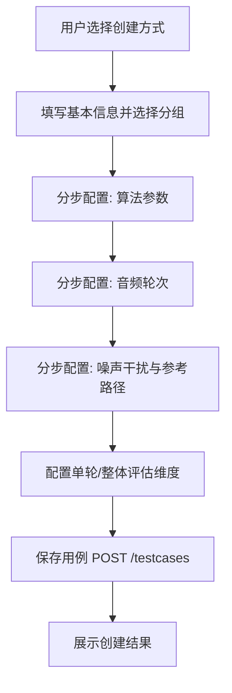
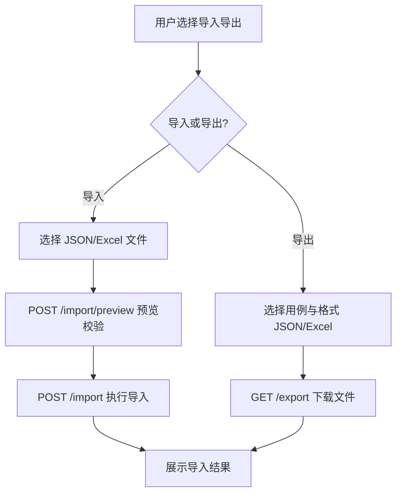
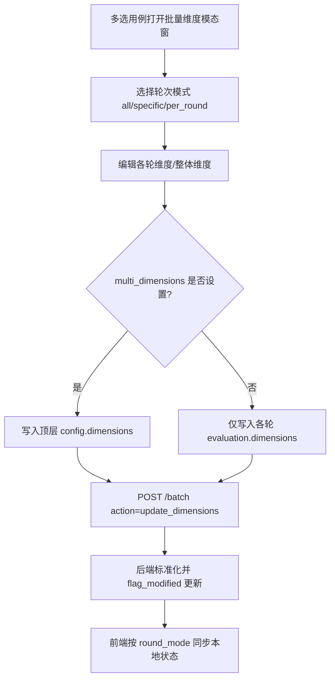

# 用例管理功能设计文档

## 1. 概述

### 1.1 文档目的

本文档描述智能语音测试系统中用例管理（TestCaseManager）功能模块的详细设计，包括功能定位、架构设计、核心流程、技术实现和用户界面等方面。

测试用例（TestCase）是**纯数据载体**：每条用例记录持有 `config`（轮次/评估维度/噪声干扰等配置）与 `algorithm_params`（按轮分组的算法参数），不区分类型，不绑定执行方式。执行方式由任务创建时选择的被测设备类型决定（物理设备 / HTTP API / WebSocket API）。用例管理为测试执行与评估提供统一的数据基础，支持分组、标签、批量操作、导入导出与参考参数管理。

### 1.2 功能定位

用例管理功能位于系统测试数据管理的核心位置，主要解决以下测试场景需求：

- **用例集中管理**：统一管理测试用例（纯数据，不区分类型），同一份用例可被物理设备、HTTP API、WebSocket API 三种执行链路消费
- **分组管理**：基于 TestCaseGroup 按名称组织用例，支持移动分组（`move_to_group`）、复制到分组（`copy_to_group`）、按分组复制（`copy_by_group`）
- **标签系统**：提供用例标签系统，支持按标签筛选、批量增删标签（`add_tags` / `remove_tags`）、标签重命名（`rename_tag`）与按标签复制（`copy_by_tag`）
- **批量操作**：通过统一 batch 端点（`POST /api/v1/testcases/batch`）按 action 分发，覆盖批量更新算法参数、播放设备、声压级（SPL）、评价维度、噪声干扰等
- **评估配置关联**：管理单轮评估维度（`rounds[N].evaluation.dimensions`）与整体评估维度（顶层 `config.dimensions`），与批量设置评价维度机制衔接
- **参考参数管理**：按轮管理参考参数（`reference_params`，内容存文件），支持单轮读写端点与批量刷新（含异步任务）
- **导入导出**：支持 JSON / Excel 格式的批量导入导出、导入前预览校验与模板下载

该功能适用于测试用例创建、管理、维护等场景，是确保测试执行效率和一致性的重要工具。

### 1.3 术语定义

| 术语 | 解释 |
|------|------|
| 测试用例 | 测试执行的基本数据单元，持有 `config`（轮次/维度/噪声配置）与 `algorithm_params`（算法参数），不绑定执行方式 |
| 执行方式 | 由被测设备的 `device_type` 决定（`physical`→E2EExecutor、`http_api`→APISessionExecutor、`websocket_api`→RealtimeSessionExecutor），用例本身不绑定执行方式 |
| 用例分组 | TestCaseGroup（名称唯一），组织同算法类型的用例；随用例创建/导入按名称自动建立 |
| 轮次 | `config.rounds` 数组元素，一轮测试对应一组音频、算法参数与单轮评估配置 |
| 单轮评估维度 | `rounds[N].evaluation.dimensions`，仅评估该轮；触发条件为 `enabled != False` 且 `dimensions` 非空 |
| 整体评估维度 | 顶层 `config.dimensions` 数组，评估整条用例；触发条件为非空 |
| 算法参数 | `algorithm_params`，按轮分组的 `[{round_number, params: [{field_code, field_value}]}]`，字段编码由智能语音算法配置化定义 |
| 参考参数 | `reference_params`，按轮分组的 `[{round_number, reference_params_path}]`，参数内容存文件而非入库 |
| 标签 | 用于对测试用例进行分类筛选的标记（TestCaseTag） |
| 批量操作 | 对多个测试用例同时执行的操作，统一经 batch 端点按 action 分发 |
| 导入导出 | 测试用例的批量导入和导出操作，支持 JSON / Excel 格式 |

## 2. 系统架构设计

### 2.1 整体架构

用例管理功能采用前后端分离架构，前端遵循 DDD 分层约定，后端采用 Blueprint → Controller → Schema 分层。

**前端（Presentation / Application / Domain / Infrastructure）**：基于 Vue 3 + TypeScript + Pinia 构建。Presentation（views/ + components/）只见 camelCase 的 Domain 模型与 composables（Ports）；Application（composables/ + store/）编排用例、缓存 ReadModel；Domain（domain/model/ + enums.ts）零依赖；Infrastructure（api/ + adapters/ + dto/ + http/）唯一知道 snake_case 报文。用例管理为 HTTP REST 同步交互（WebSocket 仅用于日志流推送，与用例管理数据流无关）。

**后端服务层**：基于 Flask 框架实现，负责用例 CRUD、分组管理、标签管理和导入导出处理；采用路由（Blueprint，前缀 `/api/v1/testcases`）→ 控制器（TestCaseController）→ Schema（Pydantic 校验，`AliasChoices` 兼容 snake_case/camelCase）分层，批量操作通过统一的 batch 端点按 action 分发处理。

**数据存储层**：使用 PostgreSQL 数据库存储结构化数据（`config`、`algorithm_params`、`reference_params` 等复杂结构存 JSON 列），参考参数内容存文件、库内仅存路径。

### 2.2 核心组件

| 组件 | 职责 | 技术实现 | 通信方式 |
|------|------|----------|----------|
| 用例管理页面 | 用例列表展示、筛选、批量操作入口 | `views/TestCaseManager.vue` + `TestCaseManagerLogic/` | HTTP REST |
| 用例列表/卡片组件 | 卡片式列表渲染与多选 | `TestCaseListContainer.vue` / `TestCaseCard.vue` / `TestCaseListWithPagination.vue` | 组件事件 |
| 用例编辑模态窗 | 分步式用例创建/编辑（算法参数、音频轮次、噪声干扰、参考路径、评估维度） | `TestCaseModal/index.vue` + `sections/*` | 组件事件 |
| 批量维度模态窗 | 批量设置评价维度（round_mode / multi_dimensions） | `BatchDimensionModal.vue` | 组件事件 |
| 状态与编排 | 编排用例、缓存 ReadModel、组装批量 payload | `store/testCaseStore.ts` + `composables/useTestCaseConfig.ts` / `useBatchActions.ts` | Pinia |
| API 客户端 | snake_case 报文封装（testcasesApi） | `utils/api.ts`（Infrastructure 层） | HTTP REST |
| 后端用例服务 | 用例 CRUD、批量 action 分发、导入导出、试听预览 | `blueprints/testcase_bp.py` + `controllers/testcase_controller.py` | HTTP REST |
| Schema 校验 | 请求/响应校验，AliasChoices 兼容双命名 | `schemas/testcase.py`（Pydantic） | 进程内 |
| 数据模型 | TestCase / TestCaseGroup / Tag 持久化 | `models/models.py`（SQLAlchemy） | 数据库操作 |

### 2.3 数据流设计

用例管理功能的数据流为 **HTTP REST 同步交互**（无 WebSocket 推送），遵循前端 DDD 分层的单向依赖：

1. **用例管理数据流**：用户在 Presentation 组件操作 → 调用 Application 层 composable/store → store 经 Infrastructure 层 `testcasesApi` 发送 HTTP 请求（snake_case 报文）→ 后端 Pydantic 校验 → TestCaseController 处理并更新 PostgreSQL → 响应返回 → 适配层映射为 camelCase Domain → store 更新 ReadModel → 组件响应式刷新

2. **批量操作数据流**：用户多选用例并选择操作 → `useBatchActions` / store 组装 `{action, ids, ...extraParams}` → `POST /api/v1/testcases/batch` → 后端按 action 分发到对应处理函数 → 返回操作结果 → 前端同步本地状态（分组、标签、维度等）。仅批量刷新参考参数在超过 50 条时转为异步任务，前端经 `/refresh_task/<task_id>` 轮询进度

3. **导入导出数据流**：用户发起导入/导出 → HTTP 请求 → 后端以 pandas + openpyxl 处理 Excel（JSON 直接序列化）→ 导入前可经 `/import/preview` 预览校验 → 前端接收结果文件/预览数据

4. **评估配置数据流**：用户在编辑模态窗或批量维度模态窗设置评价维度 → 写入 `rounds[N].evaluation.dimensions`（单轮）或顶层 `config.dimensions`（整体）→ 保存时经 `flag_modified` 强制 JSON 列更新 → 评估阶段按"单轮/整体隔离"规则读取

### 2.4 依赖关系

用例管理功能依赖以下系统模块：

- **音频管理模块**：轮次音频配置引用 Audio 资源，试听预览依赖音频流
- **算法配置化模块**：`algorithm_params` 的 `field_code` 由智能语音算法配置化定义
- **评估系统模块**：单轮/整体评估维度体系与评估结果计算（详见 04_评估 文档）
- **任务管理模块**：用例作为任务的数据来源被引用执行；`/refresh_task/<task_id>` 复用任务查询语义轮询参考参数刷新进度
- **测试执行模块**：被测设备 `device_type` 决定执行方式（用例本身不绑定执行器）

## 3. 核心功能模块

### 3.1 用例基本管理

#### 3.1.1 用例创建与编辑

用例创建与编辑模块负责测试用例的创建和编辑操作。

**用例创建**
- 支持手动创建测试用例（`POST /api/v1/testcases`），指定 `name`、`group`（或 `group_id`）
- 支持复制创建：单条复制（`POST /<tc_id>/copy`）、按分组复制（`copy_by_group`）、按标签复制（`copy_by_tag`），复制生成新 id 的新记录
- 支持从音频文件自动生成测试用例（`auto_generate_name` 批量重命名辅助）
- 支持下载导入模板（`GET /template/download`）后批量导入创建

**用例编辑**
- 支持编辑基本信息（名称、分组、算法类型）
- 支持分步式编辑：算法参数步、音频列表步（轮次）、噪声干扰步、参考路径步
- 支持编辑单轮评估维度（`RoundEvaluationEditor`）与整体评估维度（`OverallEvaluationEditor`）
- 保存时写入 `config`（rounds/dimensions/background_noise）、`algorithm_params`、`reference_params`

**用例删除**
- 支持删除单个测试用例（`DELETE /<tc_id>`）
- 支持批量删除
- 采用软删除（`deleted` 标记），列表查询默认过滤已删除记录

#### 3.1.2 用例分组管理

分组基于 TestCaseGroup 模型（`name` 全局唯一，含 `description`、`algorithm_type`）。系统不提供独立的分组 CRUD 端点，分组随用例创建/导入按名称自动建立（同名复用，不存在则自动创建），调整归属通过批量操作完成。

**分组建立**
- 创建/导入用例时传 `group`（名称）或 `group_id`，按名称查找或自动创建分组
- 分组携带算法类型语义，用于组织同类型用例

**分组使用**
- 支持按分组筛选用例
- 批量移动到分组（`move_to_group`）
- 批量复制到分组（`copy_to_group`）
- 按分组整体复制用例（`copy_by_group`）

#### 3.1.3 标签系统

标签系统模块负责测试用例的标签管理（Tag / TestCaseTag 关联模型）。

**标签获取与维护**
- `GET /api/v1/testcases/tags` 获取全量标签列表
- 批量添加标签（`add_tags`）、批量移除标签（`remove_tags`）
- 标签重命名（`rename_tag`），同步更新所有关联用例

**标签使用**
- 支持为用例添加/移除标签
- 支持按标签筛选用例
- 支持按标签批量复制用例（`copy_by_tag`）

### 3.2 批量操作管理

#### 3.2.1 批量选择

批量选择模块负责测试用例的批量选择操作。

**选择方式**
- 卡片复选框手动多选
- 按分组、标签等筛选条件圈定范围
- 全选当前筛选结果（`GET /ids` 获取全量 id）

**选择管理**
- 支持查看已选择数量
- 支持清空选择

#### 3.2.2 批量操作

批量操作统一入口为 `POST /api/v1/testcases/batch`，请求体为 `{action, ids, ...extraParams}`，后端按 action 分发：

| action | 说明 | 关键参数 |
|--------|------|----------|
| `copy_by_group` | 按分组复制用例 | 分组标识 |
| `copy_by_tag` | 按标签复制用例 | 标签 |
| `copy_to_group` | 复制用例到目标分组 | 目标分组 |
| `move_to_group` | 移动用例到目标分组 | 目标分组 |
| `update_algorithm_params` | 批量更新算法参数 | 按轮参数 |
| `update_playback_devices` | 批量更新播放设备 | 设备映射 |
| `update_spl` | 批量更新声压级 | SPL 值 |
| `update_dimensions` | 批量设置评价维度 | 见 3.2.3 |
| `update_noise` | 批量更新噪声干扰配置 | 噪声配置 |
| `auto_generate_name` | 自动生成用例名称 | 命名规则 |
| `add_tags` / `remove_tags` | 批量增删标签 | 标签列表 |
| `rename_tag` | 标签重命名 | 新旧标签名 |
| `refresh_reference` | 批量刷新参考参数 | round_mode / round_numbers |

操作结果同步返回；`refresh_reference` 超过 50 条时提交异步任务并返回 `task_id`，前端经 `GET /refresh_task/<task_id>` 轮询进度。

#### 3.2.3 批量设置评价维度

批量设置评价维度为独立的复合操作，详细设计见《批量设置评价维度功能设计文档》。要点：

- 支持 `round_mode`（`all` / `specific` / `per_round`）三种轮次模式
- `round_dimensions` 支持 `-1` 表示最后一轮叠加合并且按维度 id 去重
- `multi_dimensions` 写入顶层 `config.dimensions`（非 None 即写入，空数组表示清空整体评估维度）
- 后端 `_build_dim_list` 标准化维度字段（weight 默认 50、threshold 默认 60）
- 写入后经 `flag_modified(tc, 'config')` 强制 JSON 列更新

与评估维度隔离机制的衔接：单轮评估仅读取 `rounds[N].evaluation.dimensions`，整体评估仅读取顶层 `config.dimensions`，二者互不合并；报告取值优先取整体评估结果（overall），无整体结果时取各轮算术平均。

#### 3.2.4 导入导出

导入导出模块负责测试用例的导入和导出操作。

**导入功能**
- 支持从 JSON 文件导入测试用例
- 支持从 Excel 文件导入测试用例（pandas + openpyxl 解析）
- 支持导入前预览和验证（`POST /import/preview`）

**导出功能**
- 支持导出测试用例为 JSON 文件
- 支持导出测试用例为 Excel 文件（pandas + openpyxl 生成）
- 支持按当前筛选条件导出

**模板管理**
- 支持下载导入模板（`GET /template/download`）

### 3.3 评估配置关联

评估配置关联模块负责管理测试用例与评估维度体系的关联（取代旧设计中的"音频/设备关联"——用例是纯数据，执行资源由任务阶段注入）。

**单轮评估维度**
- 存储于 `rounds[N].evaluation.dimensions`，在编辑模态窗按轮配置（`RoundEvaluationEditor`）
- 触发条件：该轮 `enabled != False` 且 `dimensions` 非空

**整体评估维度**
- 存储于顶层 `config.dimensions`（数组），在编辑模态窗整体配置（`OverallEvaluationEditor`）
- 触发条件：非空

**批量配置**
- 经批量维度模态窗（`BatchDimensionModal`）对多选用例批量设置（见 3.2.3）
- 评估执行与报告取值规则见 04_评估 文档（整体评估优先，无整体结果取各轮算术平均）

### 3.4 参考参数管理

参考参数按轮存储于 `reference_params`（`[{round_number, reference_params_path}]`），参数内容存文件、库内仅存路径。

**单轮读写**
- `GET /api/v1/testcases/<tc_id>/rounds/<round_number>/ref-params`：读取指定轮参考参数
- `PUT /api/v1/testcases/<tc_id>/rounds/<round_number>/ref-params`：更新指定轮参考参数

**批量刷新**
- 批量操作 `refresh_reference`：按 `round_mode` / `round_numbers` 刷新用例参考参数
- ≤50 条同步处理；>50 条提交异步任务，返回 `task_id`，前端经 `GET /refresh_task/<task_id>` 轮询

**任务衔接**
- 参考参数在任务执行阶段注入执行器，用于评估比对基准

### 3.5 搜索与筛选

#### 3.5.1 搜索功能

**关键词搜索**
- 支持按名称搜索测试用例
- 支持按标签、分组搜索定位

**搜索结果**
- 支持搜索结果的排序与筛选
- 支持配合批量操作圈选范围

#### 3.5.2 筛选功能

**按分组筛选**
- 支持按用例分组筛选

**按标签筛选**
- 支持按标签筛选，支持多标签组合

**按属性筛选**
- 支持按算法类型（`algorithm_type`）筛选

**统计**
- `GET /stats` 提供用例统计信息，辅助筛选决策

### 3.6 试听预览与任务衔接

#### 3.6.1 试听预览

试听预览模块用于在执行前验证用例音频配置（`POST /<tc_id>/preview` / `POST /<tc_id>/stop_preview`，兼容旧路径 `stop-preview`）。

**预览模式**
- `frontend`：返回音频流 URL，由前端浏览器播放
- `backend`：通过后端扬声器播放

**预览处理**
- 校验用例已配置音频资源，从 `rounds` 收集音频
- 注入 `algorithm_params`（优先读独立列，兼容旧数据从 config 读取），与真实执行链路保持一致
- 支持指定偏移量（offset）与预览类型（preview_type）

#### 3.6.2 任务执行衔接

用例管理不负责执行，执行由任务管理模块驱动：

- **执行路由**：被测设备 `device_type` 决定执行方式——`physical`→E2EExecutor、`http_api`→APISessionExecutor、`websocket_api`→RealtimeSessionExecutor
- **用例引用**：任务通过 TaskCase 关联引用用例，用例变更不影响已创建任务的数据快照
- **结果回流**：执行与评估结果经报告模块呈现，用例维度体系决定评估内容（见 3.3）

## 4. 核心流程图

### 4.1 用例创建流程



### 4.2 批量操作流程

```mermaid
flowchart TD
    A[用户选择测试用例] --> B[选择批量操作 action]
    B --> C[配置操作参数]
    C --> D[组装 {action, ids, ...params}]
    D --> E[POST /testcases/batch]
    E --> F{是否异步任务?}
    F -->|否| G[返回操作结果]
    F -->|是| H[返回 task_id 轮询 /refresh_task]
    G --> I[前端同步本地状态]
    H --> I
    I --> J[展示操作结果]
```

### 4.3 导入导出流程



### 4.4 批量设置评价维度流程



## 5. 用户界面设计

### 5.1 页面布局

用例管理页面（`views/TestCaseManager.vue`）采用顶部工具栏+主内容区的布局：

**顶部工具栏**：搜索框、筛选条件（分组/标签/算法类型）、新建用例、批量操作、导入导出入口
**主内容区**：用例卡片网格（`TestCaseListContainer`）与分页组件（`TestCaseListWithPagination`）
**浮动层**：用例编辑模态窗（`TestCaseModal`）、批量维度模态窗（`BatchDimensionModal`）、分组操作面板（`TestCaseGroupActions`）

### 5.2 核心界面

#### 5.2.1 用例列表界面

**用例卡片**
- 显示用例名称、所属分组、标签、算法类型、轮次数与评估维度摘要
- 卡片操作：编辑、复制、删除、试听预览、参考参数入口
- 复选框多选，支持全选当前筛选结果

**列表能力**
- 排序：按名称、更新时间等排序
- 筛选：按分组、标签、`algorithm_type` 筛选
- 搜索：关键词搜索
- 分页：服务端分页

#### 5.2.2 用例编辑模态窗

分步式编辑（`TestCaseModal/index.vue`，子组件位于 `sections/`）：

- **步骤导航**：左侧步骤目录（StepToc）与轮次导航（RoundNav/RoundHead）
- **算法参数步**（AlgoParamsStep）：按轮配置算法参数，字段编码由算法配置化定义
- **音频列表步**（AudioListStep）：按轮配置音频资源与播放设备
- **噪声干扰步**（NoiseInterferenceStep）：配置背景噪声与干扰源
- **参考路径步**（ReferencePathStep）：按轮配置参考参数文件路径
- **评估配置编辑器**：单轮评估维度（RoundEvaluationEditor）与整体评估维度（OverallEvaluationEditor）

#### 5.2.3 批量维度模态窗

- 轮次模式选择：全部轮次（all）/ 指定轮次（specific）/ 逐轮设置（per_round）
- 维度编辑器：复用维度配置组合式函数（`useDimensionConfig`）
- 支持设置整体评估维度（`multi_dimensions`）
- 确认后经批量操作端点提交

#### 5.2.4 批量操作与导入导出界面

**批量操作面板**
- 操作类型：移动/复制分组、增删标签、更新算法参数、更新播放设备、更新 SPL、批量设置评价维度、刷新参考参数、自动命名等
- 操作执行：执行批量操作并展示结果

**导入导出面板**
- 导入：上传 JSON/Excel 文件，预览校验后确认导入
- 导出：选择用例与格式（JSON/Excel）下载
- 模板下载：获取标准导入模板

### 5.3 交互设计

#### 5.3.1 操作流程

**用例创建流程**
1. 用户在工具栏点击"新建用例"
2. 选择所属分组
3. 分步完成算法参数、音频轮次、噪声干扰、参考路径配置
4. 配置单轮/整体评估维度
5. 点击"保存"完成创建

**用例编辑流程**
1. 用户在卡片上点击"编辑"
2. 打开分步式编辑模态窗
3. 修改用例配置（config / algorithm_params / reference_params）
4. 点击"保存"完成编辑

**批量操作流程**
1. 用户在列表中多选用例
2. 点击工具栏批量操作入口
3. 选择操作类型并配置参数
4. 执行后同步返回结果（异步任务则轮询进度）

**导入导出流程**
1. 用户点击"导入导出"入口
2. 导入：选择文件 → 预览校验 → 确认导入
3. 导出：选择用例与格式 → 下载文件

#### 5.3.2 响应式设计

- **桌面端**（≥1200px）：完整布局，工具栏与卡片网格完整展示
- **窄屏**（<1200px）：筛选条件折叠，卡片网格自适应列数

### 5.4 视觉设计

#### 5.4.1 颜色系统

用例管理功能采用橙色主题，体现高效、专业的管理工具属性：

- **主色调**：#FF6A00（橙色），用于按钮、重要状态、高亮显示
- **辅助色**：#FFF2E8（浅橙），用于背景、边框、次要元素
- **状态色**：
  - 成功：#52C41A（绿色）
  - 警告：#FAAD14（黄色）
  - 错误：#F5222D（红色）
  - 信息：#1890FF（蓝色）

#### 5.4.2 字体与图标

- **字体**：系统默认无衬线字体，主标题 16px，正文 14px，小字 12px
- **图标**：使用 Font Awesome 图标库（`@fortawesome/fontawesome-free`），主要图标包括：
  - 用例：用于测试用例
  - 分组：用于分组管理
  - 标签：用于标签管理
  - 导入导出：用于导入导出操作
  - 批量操作：用于批量操作

#### 5.4.3 布局原则

- **信息层次**：重要信息（用例卡片列表）优先显示，次要信息（详细配置）在模态窗分步展示
- **操作便捷**：常用操作按钮放置在显眼位置，减少操作路径
- **一致性**：保持与系统其他模块的视觉风格一致

## 6. 技术实现

### 6.1 前端实现

#### 6.1.1 技术栈

- **框架**：Vue 3 + Composition API + TypeScript
- **状态管理**：Pinia（用例 ReadModel 缓存与用例编排）
- **路由**：Vue Router
- **通信**：Axios（HTTP REST，经统一 request 封装；WebSocket 仅日志流）
- **构建**：Vite；桌面端支持 Electron
- **样式**：Less + 公共样式（`assets/styles/`）
- **图标**：Font Awesome
- **测试**：Vitest + @vue/test-utils

#### 6.1.2 核心模块

遵循 DDD 分层约定：Presentation 只依赖 composables（Ports）与 camelCase Domain；Infrastructure 层（`utils/api.ts`）唯一知道 snake_case。

**Presentation（视图与组件）**
- 用例管理页面：`views/TestCaseManager.vue`（逻辑编排位于 `views/TestCaseManagerLogic/`）
- 列表组件：`components/common/test-case/TestCaseListContainer.vue`、`TestCaseCard.vue`、`TestCaseListWithPagination.vue`、`TestCaseGroupActions.vue`
- 编辑模态窗：`components/common/test-case/TestCaseModal/index.vue`（分步式，子组件位于 `sections/`：`AlgoParamsStep`、`AudioListStep`、`NoiseInterferenceStep`、`ReferencePathStep`、`RoundHead`、`RoundNav`、`StepToc`；编辑器组件：`RoundConfigEditor`、`RoundEvaluationEditor`、`OverallEvaluationEditor`、`InterfererConfigEditor`、`VoiceprintConfigEditor`、`AudioSelectEditor`、`BatchSplModal`、`CaseForm`、`ExportForm`、`GroupForm`、`ImportForm`）
- 批量维度模态窗：`components/common/modal/BatchDimensionModal.vue`

**Application（编排与缓存）**
- 组合式函数：`composables/useTestCaseConfig.ts`（用例配置编排）、`composables/useBatchActions.ts`（批量操作编排）
- 状态 store：`store/testCaseStore.ts`（用例 ReadModel 缓存、筛选状态、批量 payload 组装）

**Infrastructure（报文）**
- API 客户端：`utils/api.ts` 中的 `testcasesApi`（指向 `/api/v1/testcases` 相对路径）

#### 6.1.3 关键实现

**批量操作编排（节选自 `useBatchActions` / `testCaseStore` 模式）**
```typescript
// Application 层组装批量 payload（snake_case 仅出现在此层以下）
import { testcasesApi } from '@/utils/api';

export const useBatchActions = () => {
  // 批量设置评价维度：组装 {action, ids, ...extraParams}
  const batchUpdateDimensions = async (
    ids: string[],
    dimensions: unknown[],
    options?: { roundMode?: string; roundDimensions?: Record<string, unknown>; multiDimensions?: unknown[] }
  ) => {
    const payload: Record<string, unknown> = { dimensions };
    if (options?.roundMode) payload.round_mode = options.roundMode;
    if (options?.roundDimensions) payload.round_dimensions = options.roundDimensions;
    if (options?.multiDimensions !== undefined) payload.multi_dimensions = options.multiDimensions;

    const res = await testcasesApi.batchAction('update_dimensions', ids, payload);
    // 成功后同步本地 ReadModel：per_round 含 -1 叠加合并、统一模式过滤、整体维度写入 config.dimensions
    return res;
  };

  return { batchUpdateDimensions };
};
```

**接口清单（`testcasesApi`，指向 `/api/v1/testcases`）**
- `getList(params)`：`GET /testcases`（分页/筛选）
- `getById(id)` / `create(data)` / `update(id, data)` / `remove(id)`
- `copy(id)`：`POST /testcases/<id>/copy`
- `preview(id, data)` / `stopPreview(id)`：试听预览
- `batchAction(action, ids, extraParams)`：`POST /testcases/batch`
- `getStats()` / `getTags()` / `getAllIds()`
- `exportTestcases(params)` / `importTestcases(formData)` / `importPreview(formData)` / `downloadTemplate()`
- `getRefParams(id, round)` / `updateRefParams(id, round, data)`：单轮参考参数读写
- `refreshTask(taskId)`：参考参数异步刷新任务进度查询

### 6.2 后端实现

#### 6.2.1 技术栈

- **框架**：Flask（Blueprint 路由）
- **数据库**：PostgreSQL + SQLAlchemy（JSON 列存储 config 等）
- **数据校验**：Pydantic（`APIModel`，`AliasChoices` 以 snake_case 优先、兼容 camelCase）
- **文件处理**：pandas + openpyxl（仅用于 Excel 导入导出）
- **异步任务**：参考参数批量刷新（>50 条）经内部任务提交机制异步执行，前端轮询进度
- **日志流**：Flask-SocketIO 仅用于日志推送（namespace `/ws/logs`），与用例管理数据流无关

#### 6.2.2 核心模块

**路由层**
- `blueprints/testcase_bp.py`：用例路由（前缀 `/api/v1/testcases`），包括列表/详情 CRUD、复制、试听预览、批量操作、ids/stats/tags、导入导出、模板下载、导入预览、参考参数单轮读写、刷新任务查询

**控制层**
- `controllers/testcase_controller.py`：用例业务（CRUD、批量 action 分发、维度标准化、参考参数刷新、试听预览、导入导出）

**校验层**
- `schemas/testcase.py`：Pydantic Schema（`TestCaseCreateSchema`、`TestCaseBatchActionRequest`、`TestCasePreviewRequest` 等）

**模型层**
- `models/models.py`：`TestCase`（id/name/config/algorithm_params/reference_params/group_id/algorithm_type/deleted）、`TestCaseGroup`（name 唯一）、`Tag` / `TestCaseTag`

#### 6.2.3 关键实现

**批量操作 action 分发（示意）**
```python
# controllers/testcase_controller.py（示意，简化）
ACTION_HANDLERS = {
    'copy_by_group': TestCaseController._batch_copy_by_group,
    'copy_by_tag': TestCaseController._batch_copy_by_tag,
    'move_to_group': TestCaseController._batch_move_to_group,
    'copy_to_group': TestCaseController._batch_copy_to_group,
    'update_algorithm_params': TestCaseController._batch_update_algorithm_params,
    'update_playback_devices': TestCaseController._batch_update_playback_devices,
    'update_spl': TestCaseController._batch_update_spl,
    'update_dimensions': TestCaseController._batch_update_dimensions,
    'update_noise': TestCaseController._batch_update_noise,
    'auto_generate_name': TestCaseController._batch_auto_generate_name,
    'add_tags': TestCaseController._batch_add_tags,
    'remove_tags': TestCaseController._batch_remove_tags,
    'rename_tag': TestCaseController._batch_rename_tag,
    'refresh_reference': TestCaseController._batch_refresh_reference,
}

@staticmethod
def batch_action():
    req_data = TestCaseBatchActionRequest.model_validate(request.get_json() or {})
    handler = ACTION_HANDLERS.get(req_data.action)
    if not handler:
        return error_response(f"不支持的操作类型: {req_data.action}")
    result = handler(req_data)
    db.session.commit()
    return success_response(result)
```

**批量设置评价维度要点（`_batch_update_dimensions`）**
```python
# 要点示意（简化）
# 1. round_mode: all/specific/per_round；round_dimensions 支持 -1 表示最后一轮叠加合并且按维度 id 去重
# 2. multi_dimensions: 非 None 即写入顶层 config['dimensions']（空数组=清空整体评估维度）
# 3. _build_dim_list 标准化维度字段（weight 默认 50、threshold 默认 60）
# 4. JSON 列原地修改后必须 flag_modified 强制更新
from sqlalchemy.orm.attributes import flag_modified

flag_modified(tc, 'config')
db.session.add(tc)
```

**软删除过滤**
```python
# 列表与批量操作统一过滤软删除记录
test_cases = TestCase.query.filter(TestCase.id.in_(ids), TestCase.deleted == False).all()
```

## 7. 性能与可靠性设计

### 7.1 性能优化

#### 7.1.1 数据库优化

- **索引优化**：按分组、标签等常用查询字段优化
- **查询优化**：使用分页查询，避免一次性加载大量数据
- **批量操作**：使用数据库事务批量提交，减少数据库操作次数

#### 7.1.2 前端优化

- **ReadModel 缓存**：Pinia store 缓存用例列表，减少重复请求
- **防抖节流**：对搜索和筛选操作使用防抖节流，减少请求次数
- **组件懒加载**：模态窗等重组件按需加载

#### 7.1.3 后端优化

- **连接池**：使用数据库连接池，减少连接建立的开销
- **异步任务**：大批量参考参数刷新（>50 条）转异步任务，避免请求超时
- **流式响应**：导出文件采用流式输出，减少内存占用

### 7.2 可靠性设计

#### 7.2.1 错误处理

- **数据库错误**：处理数据库连接失败、事务回滚等错误
- **网络错误**：处理网络中断、超时等错误
- **业务错误**：处理参数校验失败、资源不存在等错误，统一错误响应格式
- **系统错误**：处理系统资源不足、权限不足等错误

#### 7.2.2 重试机制

- **操作重试**：批量操作失败可重新提交
- **异步任务轮询**：参考参数刷新任务经轮询确认最终状态

#### 7.2.3 容错设计

- **批量操作容错**：单个用例处理失败记录日志并继续处理其余用例，最终汇总成功数量
- **软删除兜底**：删除操作为软删除，数据可追溯
- **导入校验**：导入前预览校验，避免脏数据入库

## 8. 安全设计

### 8.1 数据安全

- **访问控制**：限制用例管理接口的访问权限
- **审计日志**：记录关键操作日志，支持追溯

### 8.2 操作安全

- **操作验证**：Pydantic 校验请求参数的合法性与类型
- **批量操作限制**：单次批量操作数量约束（如参考参数刷新超过 50 条转异步），防止系统过载
- **删除保护**：删除操作前确认；软删除降低误操作风险

### 8.3 网络安全

- **传输加密**：生产环境启用 HTTPS
- **访问限制**：限制 API 访问来源，防止未授权访问
- **XSS 防护**：用户输入内容转义处理

### 8.4 应用安全

- **依赖安全**：定期更新第三方依赖，修复安全漏洞
- **代码安全**：代码审查，防止安全漏洞
- **配置安全**：数据库连接等敏感配置经配置文件/环境变量管理，不硬编码

## 9. 测试与维护

### 9.1 测试策略

#### 9.1.1 单元测试

- **用例管理测试**：测试用例 CRUD 与软删除逻辑
- **批量操作测试**：测试各 action 分发与边界（如 `-1` 轮叠加合并、空维度清空）
- **Schema 校验测试**：测试 Pydantic 校验与 AliasChoices 双命名兼容
- **导入导出测试**：测试 JSON/Excel 导入导出与预览校验

#### 9.1.2 集成测试

- **前后端集成**：测试前端组件与后端 API 的交互（snake_case ↔ camelCase 映射）
- **数据库集成**：测试 JSON 列读写与 flag_modified 更新生效
- **系统集成**：测试与任务管理、评估模块的衔接

#### 9.1.3 端到端测试

- **完整流程测试**：测试从创建到任务执行的完整链路
- **批量操作测试**：测试批量操作的实际生效
- **导入导出测试**：测试导入导出功能
- **异常场景测试**：测试各种异常场景的处理

### 9.2 维护策略

#### 9.2.1 监控与日志

- **系统监控**：监控 CPU、内存、磁盘使用情况
- **数据库监控**：监控数据库连接、查询性能
- **操作监控**：监控批量操作的执行状态和结果
- **日志管理**：集中管理系统日志、应用日志、操作日志（日志经 WebSocket `/ws/logs` 推送前端展示）

#### 9.2.2 故障排除

- **故障诊断**：快速定位故障原因
- **故障修复**：及时修复系统故障
- **知识积累**：建立故障知识库，支持快速解决

#### 9.2.3 版本管理

- **代码版本**：使用 Git 进行代码版本管理
- **配置版本**：管理系统配置的版本
- **数据迁移**：用例结构变更通过迁移脚本执行

#### 9.2.4 升级策略

- **系统升级**：定期升级系统组件和依赖
- **功能升级**：根据用户反馈和需求添加新功能
- **安全升级**：及时修复安全漏洞

## 10. 未来规划

### 10.1 功能增强

- **智能用例生成**：使用 AI 自动生成测试用例
- **用例推荐**：基于历史测试数据推荐测试用例
- **用例分析**：分析测试用例的覆盖率和有效性

### 10.2 技术演进

- **容器化部署**：支持 Docker 容器化部署，提高环境一致性
- **低代码配置**：提供可视化配置界面，降低使用门槛
- **API 开放**：开放 API 接口，支持与其他系统集成

## 11. 结论

用例管理功能是智能语音测试系统的基础支撑能力之一。用例作为纯数据载体（`config` + `algorithm_params`），不区分类型，不绑定执行方式，通过分组、标签、批量操作、导入导出与参考参数管理，为测试执行与评估提供统一的数据基础。本文档详细描述了该功能的设计方案，包括系统架构、核心功能、技术实现、用户界面等方面，为开发团队提供了清晰的实现指导。

## 12. 参考资料

- 内部文档：《用例结构总览》（01_测试执行/01_UseCase总览）
- 内部文档：《批量设置评价维度功能设计文档》（07_用例管理）
- 内部文档：《测试用例共用机制文档》（07_用例管理）
- 内部文档：《测试用例列表卡片方案》（07_用例管理）
- [Vue 3 官方文档](https://vuejs.org/)
- [Pinia 官方文档](https://pinia.vuejs.org/)
- [Flask 官方文档](https://flask.palletsprojects.com/)
- [SQLAlchemy 官方文档](https://www.sqlalchemy.org/)
- [Pydantic 官方文档](https://docs.pydantic.dev/)
- [pandas 官方文档](https://pandas.pydata.org/docs/)
- [openpyxl 官方文档](https://openpyxl.readthedocs.io/)
