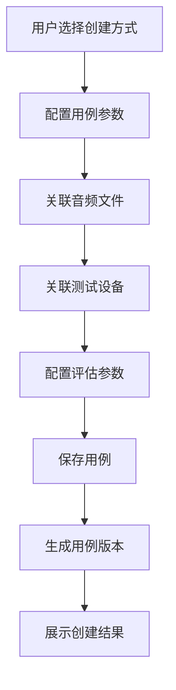
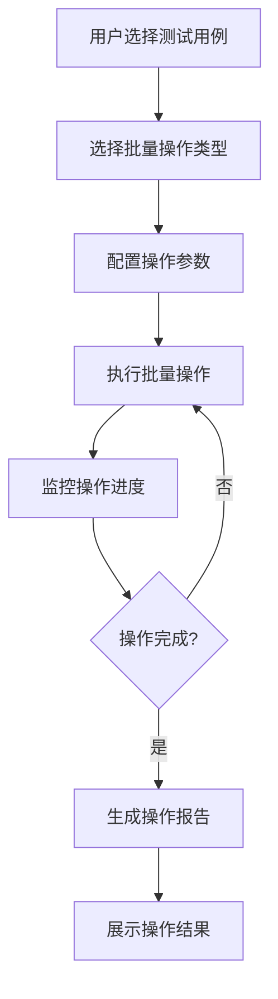
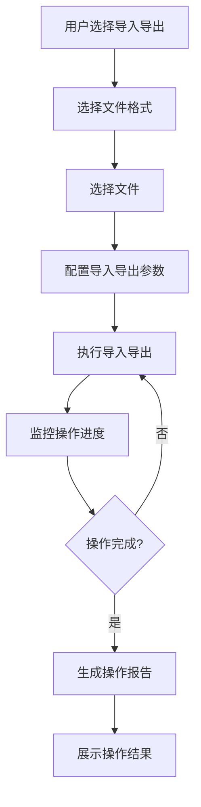
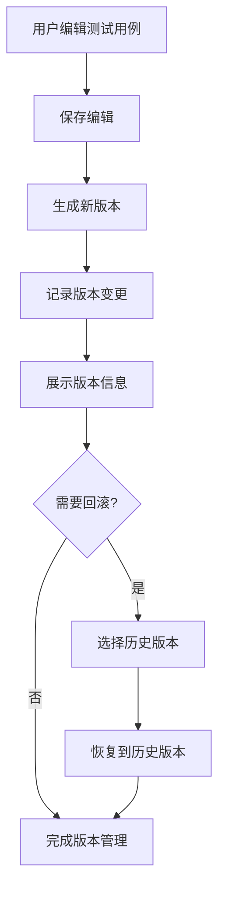

# 用例管理功能设计文档

## 1. 概述

### 1.1 文档目的

本文档描述智能语音测试系统中用例管理（TestCaseManager）功能模块的详细设计，包括功能定位、架构设计、核心流程、技术实现和用户界面等方面。用例管理功能作为系统的基础支撑能力之一，旨在为用户提供统一管理端到端测试用例和API测试用例的能力，支持分类、标签和批量操作。

### 1.2 功能定位

用例管理功能位于系统测试数据管理的核心位置，主要解决以下测试场景需求：

- **用例集中管理**：统一管理端到端测试用例和API测试用例
- **分类管理**：支持按测试类型、场景等对用例进行分类管理
- **标签系统**：提供用例标签系统，方便分类和筛选
- **批量操作**：支持批量导入导出、复制和移动操作
- **版本管理**：支持用例的版本控制和历史记录
- **关联管理**：管理用例与音频文件、设备的关联关系

该功能适用于测试用例创建、管理、维护等场景，是确保测试执行效率和一致性的重要工具。

### 1.3 术语定义

| 术语 | 解释 |
|------|------|
| 测试用例 | 测试执行的基本单元，包含测试步骤、预期结果等 |
| 用例集 | 多个相关测试用例的集合 |
| 测试类型 | 测试用例的类型，如唤醒词、命令识别、语音识别等 |
| 标签 | 用于对测试用例进行分类的标记 |
| 版本 | 测试用例的不同版本，记录修改历史 |
| 关联 | 测试用例与其他资源（如音频文件、设备）的关系 |
| 导入导出 | 测试用例的批量导入和导出操作 |
| 批量操作 | 对多个测试用例同时执行的操作 |

## 2. 系统架构设计

### 2.1 整体架构

用例管理功能采用前后端分离的三层架构设计，包含前端展示层、后端服务层和数据存储层。

**前端展示层**：基于Vue 3框架构建，提供用户界面、用例管理、批量操作和导入导出功能。前端通过WebSocket与后端建立实时通信，接收操作进度和状态更新。

**后端服务层**：基于Flask框架实现，负责用例管理、分类管理、标签管理和导入导出处理。后端通过异步IO处理批量操作，通过WebSocket向前端推送实时数据。

**数据存储层**：负责测试用例数据的存储和管理，包括用例基本信息、分类信息、标签信息和关联关系。使用SQLite数据库存储结构化数据。

### 2.2 核心组件

| 组件 | 职责 | 技术实现 | 通信方式 |
|------|------|----------|----------|
| 前端用例管理页面 | 提供用户界面、用例管理、批量操作和导入导出 | Vue 3 + WebSocket | WebSocket推送 |
| 后端用例管理服务 | 负责用例管理、分类管理、标签管理和导入导出处理 | Flask + SQLAlchemy | HTTP REST + WebSocket |
| 用例存储管理 | 负责测试用例数据的存储和管理 | SQLite + SQLAlchemy | 数据库操作 |
| 分类管理 | 负责测试用例分类的管理 | Flask + SQLAlchemy | 数据库操作 |
| 标签管理 | 负责测试用例标签的管理 | Flask + SQLAlchemy | 数据库操作 |
| 导入导出处理 | 负责测试用例的导入和导出 | Flask + 数据序列化 | HTTP请求 |
| 版本管理 | 负责测试用例的版本控制和历史记录 | Flask + SQLAlchemy | 数据库操作 |

### 2.3 数据流设计

用例管理功能的数据流设计遵循单向数据流原则，确保数据传输的清晰性和可追踪性。

1. **用例管理数据流**：用户在前端进行用例操作（创建、编辑、删除）→ 前端通过HTTP请求发送到后端 → 后端处理请求并更新数据库 → 前端通过WebSocket接收更新通知

2. **批量操作数据流**：用户在前端选择多个用例并执行批量操作 → 前端通过HTTP请求发送到后端 → 后端处理批量操作 → 前端通过WebSocket接收操作进度和结果

3. **导入导出数据流**：用户在前端选择导入/导出操作 → 前端通过HTTP请求发送到后端 → 后端处理导入/导出 → 前端接收导入/导出结果

4. **关联管理数据流**：用户在前端建立用例与其他资源的关联 → 前端通过HTTP请求发送到后端 → 后端更新关联关系 → 前端通过WebSocket接收更新通知

### 2.4 依赖关系

用例管理功能依赖以下系统模块：

- **音频管理模块**：用于关联音频文件
- **设备管理模块**：用于关联测试设备
- **评估系统模块**：用于配置测试评估维度
- **任务管理模块**：用于执行测试任务
- **报告管理模块**：用于生成测试报告

## 3. 核心功能模块

### 3.1 用例基本管理

#### 3.1.1 用例创建与编辑

用例创建与编辑模块负责测试用例的创建和编辑操作。

**用例创建**
- 支持手动创建测试用例
- 支持从模板创建测试用例
- 支持从音频文件自动生成测试用例
- 支持批量创建测试用例

**用例编辑**
- 支持编辑测试用例的基本信息
- 支持编辑测试用例的详细参数
- 支持编辑测试用例的关联关系
- 支持编辑测试用例的评估配置

**用例删除**
- 支持删除单个测试用例
- 支持批量删除测试用例
- 支持删除前确认
- 支持删除后恢复（软删除）

#### 3.1.2 用例分类管理

用例分类管理模块负责测试用例的分类管理。

**分类创建与编辑**
- 支持创建测试用例分类
- 支持编辑测试用例分类
- 支持删除测试用例分类
- 支持设置分类的层级关系

**分类使用**
- 支持将测试用例分配到分类
- 支持按分类筛选测试用例
- 支持按分类批量操作测试用例
- 支持分类统计和分析

**预设分类**
- 唤醒词测试
- 命令识别测试
- 语音识别测试
- 多轮对话测试
- API性能测试
- API准确率测试

#### 3.1.3 标签系统

标签系统模块负责测试用例的标签管理。

**标签创建与编辑**
- 支持创建测试用例标签
- 支持编辑测试用例标签
- 支持删除测试用例标签
- 支持设置标签的颜色和图标

**标签使用**
- 支持为测试用例添加标签
- 支持为测试用例移除标签
- 支持按标签筛选测试用例
- 支持按标签批量操作测试用例

**标签管理**
- 支持标签的导入导出
- 支持标签的批量管理
- 支持标签的使用统计
- 支持标签的搜索和筛选

### 3.2 批量操作管理

#### 3.2.1 批量选择

批量选择模块负责测试用例的批量选择操作。

**选择方式**
- 支持手动选择多个测试用例
- 支持按条件批量选择测试用例
- 支持全选和反选
- 支持保存选择集

**选择管理**
- 支持查看已选择的测试用例
- 支持从选择集中移除测试用例
- 支持清空选择集
- 支持选择集的导入导出

#### 3.2.2 批量操作

批量操作模块负责对多个测试用例执行批量操作。

**批量移动**
- 支持将多个测试用例移动到指定分类
- 支持移动前确认
- 支持移动后撤销

**批量复制**
- 支持复制多个测试用例
- 支持设置复制后的分类
- 支持复制后的重命名规则

**批量删除**
- 支持批量删除多个测试用例
- 支持删除前确认
- 支持删除后恢复（软删除）

**批量更新**
- 支持批量更新测试用例的属性
- 支持批量更新测试用例的标签
- 支持批量更新测试用例的关联关系

#### 3.2.3 导入导出

导入导出模块负责测试用例的导入和导出操作。

**导入功能**
- 支持从Excel文件导入测试用例
- 支持从CSV文件导入测试用例
- 支持从JSON文件导入测试用例
- 支持导入前预览和验证

**导出功能**
- 支持导出测试用例为Excel文件
- 支持导出测试用例为CSV文件
- 支持导出测试用例为JSON文件
- 支持按条件筛选导出

**模板管理**
- 支持下载导入模板
- 支持自定义导入模板
- 支持管理导出模板
- 支持模板的版本控制

### 3.3 关联管理

#### 3.3.1 音频关联

音频关联模块负责管理测试用例与音频文件的关联关系。

**关联操作**
- 支持为测试用例关联音频文件
- 支持为测试用例移除音频关联
- 支持为测试用例批量关联音频文件
- 支持查看测试用例的音频关联

**关联验证**
- 验证音频文件的存在性
- 验证音频文件的格式
- 验证音频文件的时长
- 验证音频文件的完整性

**关联管理**
- 支持按音频文件筛选测试用例
- 支持查看音频文件关联的测试用例
- 支持音频文件变更时的关联更新
- 支持音频文件删除时的关联处理

#### 3.3.2 设备关联

设备关联模块负责管理测试用例与测试设备的关联关系。

**关联操作**
- 支持为测试用例关联测试设备
- 支持为测试用例移除设备关联
- 支持为测试用例批量关联测试设备
- 支持查看测试用例的设备关联

**关联验证**
- 验证设备的存在性
- 验证设备的状态
- 验证设备的兼容性
- 验证设备的可用性

**关联管理**
- 支持按设备筛选测试用例
- 支持查看设备关联的测试用例
- 支持设备状态变更时的关联更新
- 支持设备删除时的关联处理

#### 3.3.3 评估配置关联

评估配置关联模块负责管理测试用例与评估配置的关联关系。

**关联操作**
- 支持为测试用例关联评估维度
- 支持为测试用例配置评估参数
- 支持为测试用例批量配置评估
- 支持查看测试用例的评估配置

**关联验证**
- 验证评估维度的存在性
- 验证评估参数的有效性
- 验证评估配置的完整性
- 验证评估配置的兼容性

**关联管理**
- 支持按评估维度筛选测试用例
- 支持查看评估维度关联的测试用例
- 支持评估维度变更时的关联更新
- 支持评估维度删除时的关联处理

### 3.4 版本管理

#### 3.4.1 版本控制

版本控制模块负责测试用例的版本控制。

**版本创建**
- 自动创建测试用例的版本
- 支持手动创建测试用例的版本
- 支持为版本添加描述和标签
- 支持版本的比较和合并

**版本管理**
- 支持查看测试用例的版本历史
- 支持恢复到之前的版本
- 支持删除不需要的版本
- 支持版本的导入导出

**版本对比**
- 支持比较不同版本的差异
- 支持查看版本变更的详细信息
- 支持版本变更的统计和分析
- 支持版本变更的通知和提醒

#### 3.4.2 历史记录

历史记录模块负责记录测试用例的操作历史。

**操作记录**
- 记录测试用例的创建操作
- 记录测试用例的编辑操作
- 记录测试用例的删除操作
- 记录测试用例的关联操作

**记录管理**
- 支持查看测试用例的操作历史
- 支持按操作类型筛选历史记录
- 支持按时间范围筛选历史记录
- 支持导出历史记录

**审计功能**
- 支持审计测试用例的操作
- 支持识别异常操作
- 支持操作的权限验证
- 支持操作的责任追溯

### 3.5 搜索与筛选

#### 3.5.1 搜索功能

搜索功能模块负责测试用例的搜索。

**关键词搜索**
- 支持按名称搜索测试用例
- 支持按描述搜索测试用例
- 支持按标签搜索测试用例
- 支持按分类搜索测试用例

**高级搜索**
- 支持按多个条件组合搜索
- 支持按日期范围搜索
- 支持按创建者搜索
- 支持按修改者搜索

**搜索结果**
- 支持搜索结果的排序
- 支持搜索结果的筛选
- 支持搜索结果的导出
- 支持搜索结果的保存

#### 3.5.2 筛选功能

筛选功能模块负责测试用例的筛选。

**按分类筛选**
- 支持按测试用例分类筛选
- 支持多级分类筛选
- 支持分类的组合筛选

**按标签筛选**
- 支持按测试用例标签筛选
- 支持多标签组合筛选
- 支持标签的排除筛选

**按属性筛选**
- 支持按测试用例类型筛选
- 支持按测试用例状态筛选
- 支持按测试用例优先级筛选

**按关联筛选**
- 支持按关联的音频文件筛选
- 支持按关联的设备筛选
- 支持按关联的评估维度筛选

### 3.6 用例集管理

#### 3.6.1 用例集创建与管理

用例集管理模块负责测试用例集的创建和管理。

**用例集创建**
- 支持创建测试用例集
- 支持从现有测试用例创建用例集
- 支持批量添加测试用例到用例集
- 支持用例集的复制和移动

**用例集编辑**
- 支持编辑测试用例集的基本信息
- 支持添加测试用例到用例集
- 支持从用例集移除测试用例
- 支持设置测试用例在集合中的顺序

**用例集删除**
- 支持删除测试用例集
- 支持删除前确认
- 支持删除后恢复（软删除）

#### 3.6.2 用例集执行

用例集执行模块负责测试用例集的执行。

**执行配置**
- 支持配置用例集的执行参数
- 支持配置用例集的执行设备
- 支持配置用例集的执行顺序
- 支持配置用例集的执行条件

**执行监控**
- 支持监控用例集的执行进度
- 支持监控用例集的执行状态
- 支持监控用例集的执行结果
- 支持监控用例集的执行错误

**执行结果**
- 支持查看用例集的执行结果
- 支持生成用例集的执行报告
- 支持用例集执行结果的分析
- 支持用例集执行结果的导出

## 4. 核心流程图

### 4.1 用例创建流程



### 4.2 批量操作流程



### 4.3 导入导出流程



### 4.4 版本管理流程



## 5. 用户界面设计

### 5.1 页面布局

用例管理功能页面采用左侧导航+右侧内容区的经典布局，响应式设计适配不同屏幕尺寸。

**顶部导航栏**：显示当前操作状态、搜索框、批量操作按钮
**左侧边栏**：用例分类和标签导航，支持展开/折叠
**右侧主内容区**：用例列表和详情展示，包含操作按钮
**底部状态栏**：显示选中用例数量、总数等统计信息

### 5.2 核心界面

#### 5.2.1 用例列表界面

**用例列表标签页**
- 用例表格：显示用例名称、类型、分类、标签、创建时间等
- 排序功能：支持按名称、类型、创建时间等排序
- 筛选功能：支持按类型、分类、标签等筛选
- 搜索功能：支持关键词搜索
- 批量操作：支持选择多个用例进行批量操作

**用例详情标签页**
- 基本信息：用例名称、类型、描述、创建时间等
- 参数配置：测试参数、执行配置等
- 关联信息：关联的音频文件、设备等
- 评估配置：评估维度、评估参数等
- 版本信息：版本历史、操作历史等

**用例操作标签页**
- 编辑按钮：编辑用例信息
- 删除按钮：删除用例
- 复制按钮：复制用例
- 移动按钮：移动用例到其他分类
- 导出按钮：导出用例

#### 5.2.2 分类管理界面

**分类树标签页**
- 分类树：显示分类的层级结构
- 分类操作：支持添加、编辑、删除分类
- 分类排序：支持调整分类顺序
- 分类统计：显示每个分类下的用例数量

**分类详情标签页**
- 分类信息：分类名称、描述、层级等
- 用例列表：显示该分类下的用例
- 分类操作：支持编辑、删除分类
- 分类权限：设置分类的访问权限

#### 5.2.3 标签管理界面

**标签列表标签页**
- 标签列表：显示标签名称、颜色、使用次数等
- 标签操作：支持添加、编辑、删除标签
- 标签排序：支持调整标签顺序
- 标签搜索：支持搜索标签

**标签详情标签页**
- 标签信息：标签名称、颜色、描述等
- 用例列表：显示使用该标签的用例
- 标签操作：支持编辑、删除标签
- 标签统计：显示标签的使用统计

#### 5.2.4 批量操作界面

**批量选择标签页**
- 用例列表：支持复选框选择多个用例
- 全选功能：支持全选和反选
- 条件选择：支持按条件批量选择用例
- 选择预览：显示已选择的用例数量和列表

**批量操作标签页**
- 操作类型：移动、复制、删除、更新属性等
- 操作参数：设置操作的具体参数
- 操作执行：执行批量操作并显示进度
- 操作结果：显示操作成功和失败的数量

**导入导出标签页**
- 导入功能：上传文件并导入用例
- 导出功能：选择用例并导出为文件
- 模板下载：下载导入模板
- 历史记录：显示导入导出的历史记录

### 5.3 交互设计

#### 5.3.1 操作流程

**用例创建流程**
1. 用户在左侧导航栏点击"创建用例"按钮
2. 选择创建方式（手动、模板、音频文件）
3. 填写用例基本信息和参数
4. 关联音频文件和测试设备
5. 配置评估参数
6. 点击"保存"按钮完成创建

**用例编辑流程**
1. 用户在列表中选择要编辑的用例
2. 点击"编辑"按钮进入编辑界面
3. 修改用例信息和参数
4. 点击"保存"按钮完成编辑
5. 系统自动生成新版本并记录历史

**批量操作流程**
1. 用户在列表中选择多个用例
2. 点击顶部的批量操作按钮
3. 选择操作类型（移动、复制、删除、更新）
4. 配置操作参数
5. 点击"执行"按钮完成批量操作

**导入导出流程**
1. 用户在左侧导航栏点击"导入导出"按钮
2. 选择导入或导出
3. 导入：选择文件并配置参数
4. 导出：选择用例并配置导出格式
5. 点击"执行"按钮完成导入导出

#### 5.3.2 响应式设计

用例管理界面采用响应式设计，适配不同屏幕尺寸：

- **桌面端**（≥1200px）：完整三栏布局，左侧分类导航、右侧用例列表和详情
- **平板端**（768px-1199px）：双栏布局，分类导航可折叠，用例列表优先显示
- **移动端**（<768px）：单栏布局，通过标签页切换不同功能区域

### 5.4 视觉设计

#### 5.4.1 颜色系统

用例管理功能采用橙色主题，体现高效、专业的管理工具属性：

- **主色调**：#FF6A00（橙色），用于按钮、重要状态、高亮显示
- **辅助色**：#FFF2E8（浅橙），用于背景、边框、次要元素
- **状态色**：
  - 成功：#52C41A（绿色）
  - 警告：#FAAD14（黄色）
  - 错误：#F5222D（红色）
  - 信息：#1890FF（蓝色）

#### 5.4.2 字体与图标

- **字体**：系统默认无衬线字体，主标题16px，正文14px，小字12px
- **图标**：使用Font Awesome图标库，主要图标包括：
  - 用例：用于测试用例
  - 分类：用于分类管理
  - 标签：用于标签管理
  - 导入导出：用于导入导出操作
  - 批量操作：用于批量操作

#### 5.4.3 布局原则

- **信息层次**：重要信息（用例列表、详情）优先显示，次要信息（详细配置）可折叠
- **空间利用**：充分利用屏幕空间，避免不必要的留白
- **操作便捷**：常用操作按钮放置在显眼位置，减少操作路径
- **视觉引导**：使用颜色、图标、动画等元素引导用户注意力
- **一致性**：保持与系统其他模块的视觉风格一致

## 6. 技术实现

### 6.1 前端实现

#### 6.1.1 技术栈

- **框架**：Vue 3 + Composition API
- **状态管理**：Pinia（轻量级状态管理）
- **路由**：Vue Router
- **通信**：WebSocket（实时通信） + Axios（HTTP请求）
- **UI组件**：自定义组件 + Element Plus
- **表格组件**：Element Plus Table
- **树形组件**：Element Plus Tree
- **样式**：SCSS + CSS变量

#### 6.1.2 核心模块

**用例管理模块**
- 用例列表组件：`TestCaseList.vue`
- 用例详情组件：`TestCaseDetail.vue`
- 用例编辑组件：`TestCaseEditor.vue`

**分类管理模块**
- 分类树组件：`CategoryTree.vue`
- 分类编辑组件：`CategoryEditor.vue`

**标签管理模块**
- 标签列表组件：`TagList.vue`
- 标签编辑组件：`TagEditor.vue`

**批量操作模块**
- 批量选择组件：`BatchSelector.vue`
- 批量操作组件：`BatchOperation.vue`
- 导入导出组件：`ImportExport.vue`

#### 6.1.3 关键实现

**用例列表处理**
```javascript
// 用例列表处理
export const useTestCaseList = () => {
  const testCases = ref([]);
  const loading = ref(false);
  const error = ref(null);
  const pagination = ref({
    currentPage: 1,
    pageSize: 20,
    total: 0
  });
  const filters = ref({
    categoryId: null,
    tagIds: [],
    type: null,
    search: ''
  });
  
  const fetchTestCases = async () => {
    loading.value = true;
    error.value = null;
    
    try {
      const response = await axios.get('/api/test-cases', {
        params: {
          page: pagination.value.currentPage,
          page_size: pagination.value.pageSize,
          ...filters.value
        }
      });
      
      testCases.value = response.data.items;
      pagination.value.total = response.data.total;
    } catch (err) {
      error.value = err.message;
    } finally {
      loading.value = false;
    }
  };
  
  const handlePageChange = (page) => {
    pagination.value.currentPage = page;
    fetchTestCases();
  };
  
  const handleSizeChange = (size) => {
    pagination.value.pageSize = size;
    pagination.value.currentPage = 1;
    fetchTestCases();
  };
  
  const handleFilterChange = () => {
    pagination.value.currentPage = 1;
    fetchTestCases();
  };
  
  const refreshList = () => {
    fetchTestCases();
  };
  
  // 初始加载
  fetchTestCases();
  
  return {
    testCases,
    loading,
    error,
    pagination,
    filters,
    handlePageChange,
    handleSizeChange,
    handleFilterChange,
    refreshList
  };
};
```

**批量操作处理**
```javascript
// 批量操作处理
export const useBatchOperation = () => {
  const selectedCases = ref([]);
  const operationType = ref('');
  const operationParams = ref({});
  const isExecuting = ref(false);
  const progress = ref(0);
  const result = ref(null);
  
  const selectTestCase = (caseId, selected) => {
    if (selected) {
      if (!selectedCases.value.includes(caseId)) {
        selectedCases.value.push(caseId);
      }
    } else {
      selectedCases.value = selectedCases.value.filter(id => id !== caseId);
    }
  };
  
  const selectAllCases = (cases, selected) => {
    if (selected) {
      selectedCases.value = cases.map(c => c.id);
    } else {
      selectedCases.value = [];
    }
  };
  
  const executeBatchOperation = async () => {
    if (selectedCases.value.length === 0) {
      return {
        success: false,
        message: '请选择要操作的测试用例'
      };
    }
    
    isExecuting.value = true;
    progress.value = 0;
    result.value = null;
    
    try {
      const response = await axios.post('/api/test-cases/batch-operation', {
        operation: operationType.value,
        case_ids: selectedCases.value,
        params: operationParams.value
      });
      
      result.value = response.data;
      return {
        success: true,
        message: '批量操作成功'
      };
    } catch (error) {
      return {
        success: false,
        message: error.message
      };
    } finally {
      isExecuting.value = false;
    }
  };
  
  const clearSelection = () => {
    selectedCases.value = [];
  };
  
  return {
    selectedCases,
    operationType,
    operationParams,
    isExecuting,
    progress,
    result,
    selectTestCase,
    selectAllCases,
    executeBatchOperation,
    clearSelection
  };
};
```

### 6.2 后端实现

#### 6.2.1 技术栈

- **框架**：Flask + Flask-SocketIO
- **数据库**：SQLite + SQLAlchemy
- **ORM**：SQLAlchemy
- **网络通信**：WebSocket + RESTful API
- **数据序列化**：Marshmallow
- **文件处理**：Pandas（Excel/CSV处理）
- **异步处理**：asyncio

#### 6.2.2 核心模块

**用例管理模块**
- 用例CRUD：`test_case_controller.py`
- 用例版本管理：`version_manager.py`
- 用例历史记录：`history_manager.py`

**分类管理模块**
- 分类CRUD：`category_controller.py`
- 分类树管理：`category_tree.py`

**标签管理模块**
- 标签CRUD：`tag_controller.py`
- 标签关联管理：`tag_association.py`

**批量操作模块**
- 批量操作处理：`batch_operation.py`
- 导入导出处理：`import_export.py`

#### 6.2.3 关键实现

**用例管理**
```python
# 用例管理
from flask import Blueprint, request, jsonify
from flask_jwt_extended import jwt_required
from app.models import TestCase, Category, Tag
from app.schemas import TestCaseSchema
from app.extensions import db

api = Blueprint('test_cases', __name__, url_prefix='/api/test-cases')

test_case_schema = TestCaseSchema()
test_cases_schema = TestCaseSchema(many=True)

@api.route('/', methods=['GET'])
def get_test_cases():
    """获取测试用例列表"""
    # 分页参数
    page = request.args.get('page', 1, type=int)
    page_size = request.args.get('page_size', 20, type=int)
    
    # 筛选参数
    category_id = request.args.get('category_id', type=int)
    tag_ids = request.args.getlist('tag_ids', type=int)
    type = request.args.get('type')
    search = request.args.get('search')
    
    # 构建查询
    query = TestCase.query
    
    if category_id:
        query = query.filter_by(category_id=category_id)
    
    if tag_ids:
        for tag_id in tag_ids:
            query = query.filter(TestCase.tags.any(Tag.id == tag_id))
    
    if type:
        query = query.filter_by(type=type)
    
    if search:
        query = query.filter(TestCase.name.ilike(f'%{search}%') | 
                           TestCase.description.ilike(f'%{search}%'))
    
    # 执行查询
    pagination = query.paginate(page=page, per_page=page_size, error_out=False)
    test_cases = pagination.items
    
    # 序列化结果
    result = test_cases_schema.dump(test_cases)
    
    return jsonify({
        'items': result,
        'total': pagination.total,
        'page': page,
        'page_size': page_size
    })

@api.route('/', methods=['POST'])
def create_test_case():
    """创建测试用例"""
    data = request.get_json()
    
    # 验证数据
    errors = test_case_schema.validate(data)
    if errors:
        return jsonify({'error': errors}), 400
    
    # 创建测试用例
    test_case = test_case_schema.load(data)
    db.session.add(test_case)
    db.session.commit()
    
    # 序列化结果
    result = test_case_schema.dump(test_case)
    
    return jsonify(result), 201

@api.route('/<int:id>', methods=['GET'])
def get_test_case(id):
    """获取测试用例详情"""
    test_case = TestCase.query.get(id)
    if not test_case:
        return jsonify({'error': '测试用例不存在'}), 404
    
    # 序列化结果
    result = test_case_schema.dump(test_case)
    
    return jsonify(result)

@api.route('/<int:id>', methods=['PUT'])
def update_test_case(id):
    """更新测试用例"""
    test_case = TestCase.query.get(id)
    if not test_case:
        return jsonify({'error': '测试用例不存在'}), 404
    
    data = request.get_json()
    
    # 验证数据
    errors = test_case_schema.validate(data)
    if errors:
        return jsonify({'error': errors}), 400
    
    # 更新测试用例
    for key, value in data.items():
        setattr(test_case, key, value)
    
    db.session.commit()
    
    # 序列化结果
    result = test_case_schema.dump(test_case)
    
    return jsonify(result)

@api.route('/<int:id>', methods=['DELETE'])
def delete_test_case(id):
    """删除测试用例"""
    test_case = TestCase.query.get(id)
    if not test_case:
        return jsonify({'error': '测试用例不存在'}), 404
    
    # 删除测试用例
    db.session.delete(test_case)
    db.session.commit()
    
    return jsonify({'message': '测试用例删除成功'})
```

**批量操作**
```python
# 批量操作
from flask import Blueprint, request, jsonify
from app.models import TestCase, Category, Tag
from app.extensions import db

api = Blueprint('batch_operations', __name__, url_prefix='/api/test-cases')

@api.route('/batch-operation', methods=['POST'])
def batch_operation():
    """批量操作测试用例"""
    data = request.get_json()
    
    operation = data.get('operation')
    case_ids = data.get('case_ids', [])
    params = data.get('params', {})
    
    if not operation:
        return jsonify({'error': '请指定操作类型'}), 400
    
    if not case_ids:
        return jsonify({'error': '请选择要操作的测试用例'}), 400
    
    # 查找测试用例
    test_cases = TestCase.query.filter(TestCase.id.in_(case_ids)).all()
    if not test_cases:
        return jsonify({'error': '未找到要操作的测试用例'}), 404
    
    # 执行批量操作
    try:
        if operation == 'move':
            # 批量移动测试用例
            category_id = params.get('category_id')
            if not category_id:
                return jsonify({'error': '请指定目标分类'}), 400
            
            category = Category.query.get(category_id)
            if not category:
                return jsonify({'error': '目标分类不存在'}), 404
            
            for test_case in test_cases:
                test_case.category_id = category_id
            
            db.session.commit()
            
            return jsonify({
                'success': True,
                'message': f'成功移动 {len(test_cases)} 个测试用例',
                'count': len(test_cases)
            })
        
        elif operation == 'copy':
            # 批量复制测试用例
            category_id = params.get('category_id')
            copied_cases = []
            
            for test_case in test_cases:
                # 创建新的测试用例
                new_case = TestCase(
                    name=f'{test_case.name} (复制)',
                    type=test_case.type,
                    description=test_case.description,
                    category_id=category_id or test_case.category_id,
                    audio_file_id=test_case.audio_file_id,
                    device_id=test_case.device_id,
                    volume=test_case.volume,
                    spl=test_case.spl,
                    repeat_count=test_case.repeat_count
                )
                
                # 复制标签
                for tag in test_case.tags:
                    new_case.tags.append(tag)
                
                db.session.add(new_case)
                copied_cases.append(new_case)
            
            db.session.commit()
            
            return jsonify({
                'success': True,
                'message': f'成功复制 {len(copied_cases)} 个测试用例',
                'count': len(copied_cases)
            })
        
        elif operation == 'delete':
            # 批量删除测试用例
            for test_case in test_cases:
                db.session.delete(test_case)
            
            db.session.commit()
            
            return jsonify({
                'success': True,
                'message': f'成功删除 {len(test_cases)} 个测试用例',
                'count': len(test_cases)
            })
        
        elif operation == 'update':
            # 批量更新测试用例
            update_count = 0
            
            for test_case in test_cases:
                # 更新属性
                for key, value in params.items():
                    if hasattr(test_case, key):
                        setattr(test_case, key, value)
                        update_count += 1
            
            db.session.commit()
            
            return jsonify({
                'success': True,
                'message': f'成功更新 {len(test_cases)} 个测试用例的 {update_count} 个属性',
                'count': len(test_cases),
                'update_count': update_count
            })
        
        else:
            return jsonify({'error': '不支持的操作类型'}), 400
    
    except Exception as e:
        db.session.rollback()
        return jsonify({'error': str(e)}), 500
```

## 7. 性能与可靠性设计

### 7.1 性能优化

#### 7.1.1 数据库优化

- **索引优化**：为常用查询字段（如分类ID、标签ID、类型）创建索引
- **查询优化**：使用懒加载和分页，避免一次性加载大量数据
- **批量操作**：使用数据库事务和批量SQL语句，减少数据库操作次数
- **缓存机制**：使用Redis缓存常用数据，减少数据库查询

#### 7.1.2 前端优化

- **虚拟滚动**：使用虚拟滚动处理大量用例列表，减少DOM操作
- **防抖节流**：对搜索和筛选操作使用防抖节流，减少请求次数
- **组件懒加载**：使用Vue的异步组件，按需加载组件
- **状态管理**：使用Pinia的持久化存储，减少重复请求

#### 7.1.3 后端优化

- **异步处理**：使用asyncio处理批量操作，提高并发能力
- **连接池**：使用数据库连接池，减少连接建立的开销
- **缓存**：使用缓存减少重复计算和数据库查询
- **文件处理**：使用流式处理大文件，减少内存使用

### 7.2 可靠性设计

#### 7.2.1 错误处理

- **数据库错误**：处理数据库连接失败、事务回滚等错误
- **网络错误**：处理网络中断、超时等错误
- **业务错误**：处理业务逻辑错误、参数验证错误等
- **系统错误**：处理系统资源不足、权限不足等错误

#### 7.2.2 重试机制

- **操作重试**：批量操作失败自动重试
- **网络重试**：网络请求失败自动重试
- **数据库重试**：数据库操作失败自动重试

#### 7.2.3 容错设计

- **批量操作容错**：部分用例操作失败不影响其他用例
- **网络容错**：网络中断后自动重连，恢复操作
- **存储容错**：数据存储采用冗余设计，避免数据丢失
- **处理容错**：处理过程中系统崩溃后支持恢复处理

#### 7.2.4 监控与告警

- **系统监控**：监控CPU、内存、磁盘使用情况
- **数据库监控**：监控数据库连接、查询性能
- **操作监控**：监控批量操作的执行状态和结果
- **错误告警**：关键错误实时告警，支持邮件通知

## 8. 安全设计

### 8.1 数据安全

- **数据加密**：敏感数据传输和存储加密
- **访问控制**：基于角色的访问控制，限制用户权限
- **数据脱敏**：测试用例中的敏感信息脱敏处理
- **审计日志**：记录所有操作日志，支持追溯

### 8.2 操作安全

- **操作验证**：验证用户操作的合法性和权限
- **批量操作限制**：限制单次批量操作的数量，防止系统过载
- **删除保护**：删除操作前确认，防止误操作
- **恢复机制**：支持删除后恢复，减少数据丢失风险

### 8.3 网络安全

- **传输加密**：WebSocket连接使用WSS加密
- **访问限制**：限制API访问来源，防止未授权访问
- **CSRF防护**：防止跨站请求伪造攻击
- **XSS防护**：防止跨站脚本攻击

### 8.4 应用安全

- **依赖安全**：定期更新第三方依赖，修复安全漏洞
- **代码安全**：代码审查，防止安全漏洞
- **配置安全**：敏感配置信息加密存储
- **运行安全**：应用运行在沙箱环境中

## 9. 测试与维护

### 9.1 测试策略

#### 9.1.1 单元测试

- **用例管理测试**：测试用例的CRUD操作
- **分类管理测试**：测试分类的CRUD操作
- **标签管理测试**：测试标签的CRUD操作
- **批量操作测试**：测试批量操作的执行

#### 9.1.2 集成测试

- **前后端集成**：测试前端组件与后端API的交互
- **数据库集成**：测试与数据库的交互
- **文件集成**：测试导入导出功能
- **系统集成**：测试与其他模块的集成

#### 9.1.3 端到端测试

- **完整流程测试**：测试从创建到管理的完整流程
- **批量操作测试**：测试批量操作的执行
- **导入导出测试**：测试导入导出功能
- **异常场景测试**：测试各种异常场景的处理

### 9.2 维护策略

#### 9.2.1 监控与日志

- **系统监控**：监控CPU、内存、磁盘使用情况
- **数据库监控**：监控数据库连接、查询性能
- **操作监控**：监控批量操作的执行状态和结果
- **日志管理**：集中管理系统日志、应用日志、操作日志

#### 9.2.2 故障排除

- **故障诊断**：快速定位故障原因
- **故障修复**：及时修复系统故障
- **故障预防**：分析故障原因，预防类似问题
- **知识积累**：建立故障知识库，支持快速解决

#### 9.2.3 版本管理

- **代码版本**：使用Git进行代码版本管理
- **配置版本**：管理系统配置的版本
- **数据版本**：管理测试用例的版本
- **模板版本**：管理导入导出模板的版本

#### 9.2.4 升级策略

- **系统升级**：定期升级系统组件和依赖
- **功能升级**：根据用户反馈和需求添加新功能
- **性能升级**：优化系统性能，提高处理效率
- **安全升级**：及时修复安全漏洞

## 10. 未来规划

### 10.1 功能增强

- **智能用例生成**：使用AI自动生成测试用例
- **用例推荐**：基于历史测试数据推荐测试用例
- **用例分析**：分析测试用例的覆盖率和有效性
- **用例优化**：自动优化测试用例的执行效率

### 10.2 技术演进

- **容器化部署**：支持Docker容器化部署，提高环境一致性
- **云服务集成**：集成云存储服务，扩展存储能力
- **低代码配置**：提供可视化配置界面，降低使用门槛
- **API开放**：开放API接口，支持与其他系统集成

### 10.3 生态建设

- **插件系统**：支持第三方插件扩展功能
- **模板共享**：支持测试用例模板的共享和下载
- **社区建设**：建立用户社区，共享测试用例和经验
- **标准制定**：参与测试用例标准制定，推动行业发展

## 11. 结论

用例管理功能是智能语音测试系统的基础支撑能力之一，通过提供统一管理端到端测试用例和API测试用例的能力，为用户的测试工作提供了重要的数据基础。本文档详细描述了该功能的设计方案，包括系统架构、核心功能、技术实现、用户界面等方面，为开发团队提供了清晰的实现指导。

随着技术的不断发展和用户需求的不断变化，用例管理功能也需要持续演进和优化。通过本文档的指导，开发团队可以快速实现该功能的核心能力，并在此基础上不断扩展和完善，为用户提供更加全面、高效、可靠的用例管理解决方案。

## 12. 参考资料

- [Vue 3官方文档](https://vuejs.org/)
- [Flask官方文档](https://flask.palletsprojects.com/)
- [SQLAlchemy官方文档](https://www.sqlalchemy.org/)
- [Element Plus官方文档](https://element-plus.org/)
- [测试用例设计最佳实践](https://www.softwaretestinghelp.com/test-case-design-techniques/)
- [批量操作设计模式](https://refactoring.guru/design-patterns/batch)
- [版本控制系统设计](https://git-scm.com/book/en/v2/Getting-Started-About-Version-Control)
