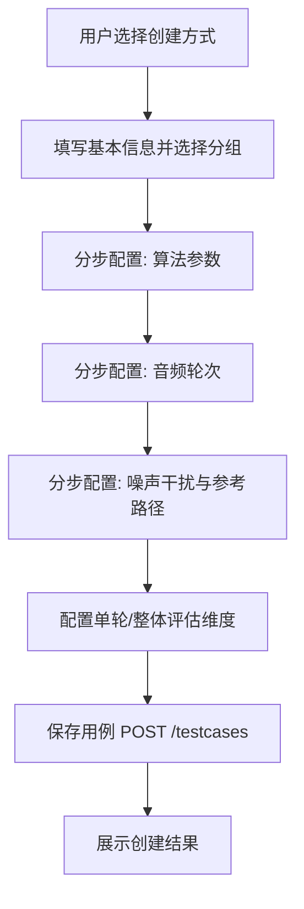
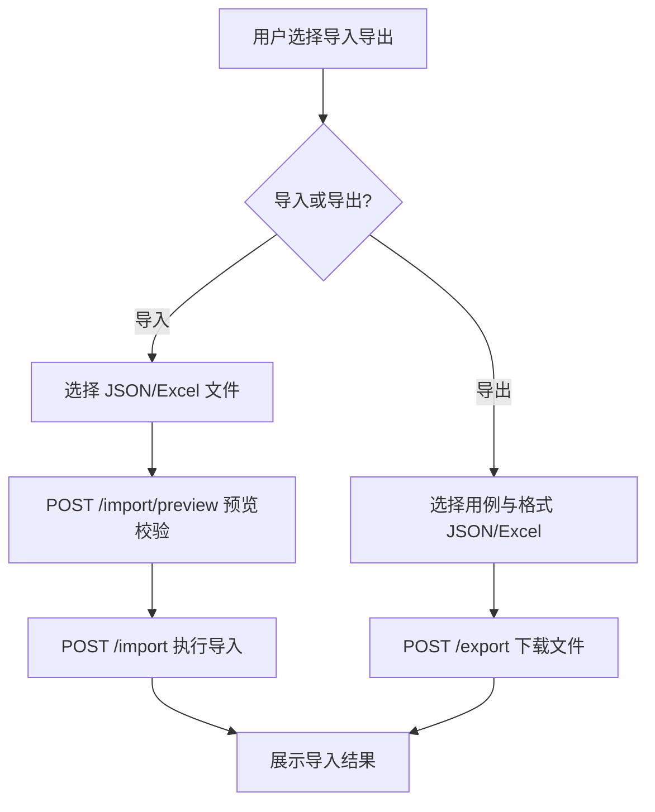
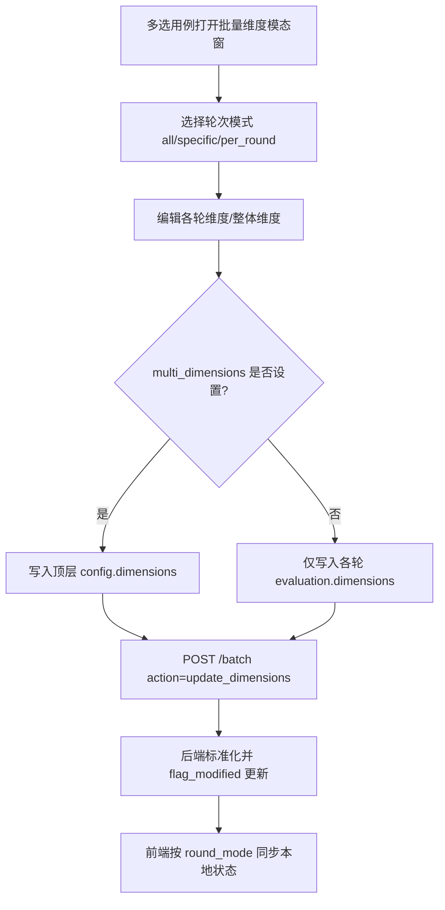

# 用例管理功能设计文档

> 版本：v2.0（V9.7.31 适配版）| 日期：2026-10-10 | 状态：适配自 V9.7.10《用例管理功能设计文档》
>
> 适配目标：将 V9.7.10 单体（Flask Blueprint → Controller → Schema）的用例管理设计映射到 V9.7.31 的 DDD 四层 + CQRS + 微服务架构。
> 架构事实：api_gateway:5000 为唯一 HTTP 入口（FastAPI）；用例聚合落位 task_service:5001；前后端数据面经 gRPC `TestCaseConfigService`（`shared/proto/task_service.proto`）通信；无 MQ，跨服务事件走 Redis EventBus 五通道（`shared/utils/redis_pubsub.py`）。体例对齐《01_UseCase总览》（V9.7.31 适配版）。

## 1. 概述

### 1.1 文档目的

本文档描述智能语音测试系统中用例管理（TestCaseManager）功能模块的详细设计，包括功能定位、架构设计、核心流程、技术实现和用户界面等方面。

测试用例（TestCase）是**纯数据载体**：每条用例记录持有 `config`（轮次/评估维度/噪声干扰等配置）与 `algorithm_params`（按轮分组的算法参数），不区分类型，不绑定执行方式。执行方式由任务创建时选择的被测设备类型决定（物理设备 / HTTP API / WebSocket API）。用例管理为测试执行与评估提供统一的数据基础，支持分组、标签、批量操作、导入导出与参考参数管理。

### 1.2 功能定位

用例管理功能位于系统测试数据管理的核心位置，主要解决以下测试场景需求：

- **用例集中管理**：统一管理测试用例（纯数据，不区分类型），同一份用例可被物理设备、HTTP API、WebSocket API 三种执行链路消费
- **分组管理**：基于 TestCaseGroup 按名称组织用例，支持移动分组（`move_to_group`）、复制到分组（`copy_to_group`）、按分组复制（`copy_by_group`）
- **标签系统**：提供用例标签系统，支持按标签筛选、批量增删标签（`add_tags` / `remove_tags`）、标签重命名（`rename_tag`）与按标签复制（`copy_by_tag`）
- **批量操作**：通过统一 batch 端点（`POST /api/v1/testcases/batch`）按 action 分发，覆盖批量更新算法参数、播放设备、声压级（SPL）、评价维度、噪声干扰等
- **评估配置关联**：管理单轮评估维度（`rounds[N].evaluation.dimensions`）与整体评估维度（顶层 `config.dimensions`），与批量设置评价维度机制衔接
- **参考参数管理**：按轮管理参考参数（`reference_params`，内容存文件），支持单轮读写端点与批量刷新（含异步任务）
- **导入导出**：支持 JSON / Excel 格式的批量导入导出、导入前预览校验与模板下载

该功能适用于测试用例创建、管理、维护等场景，是确保测试执行效率和一致性的重要工具。

### 1.3 术语定义

| 术语 | 解释 |
|------|------|
| 测试用例 | 测试执行的基本数据单元，持有 `config`（轮次/维度/噪声配置）与 `algorithm_params`（算法参数），不绑定执行方式 |
| 执行方式 | 由被测设备的 `device_type` 决定（`physical`→E2EExecutor、`http_api`→APISessionExecutor、`websocket_api`→RealtimeSessionExecutor），用例本身不绑定执行方式 |
| 用例分组 | TestCaseGroup（名称唯一），组织同算法类型的用例；随用例创建/导入按名称自动建立 |
| 轮次 | `config.rounds` 数组元素，一轮测试对应一组音频、算法参数与单轮评估配置 |
| 单轮评估维度 | `rounds[N].evaluation.dimensions`，仅评估该轮；触发条件为 `enabled != False` 且 `dimensions` 非空 |
| 整体评估维度 | 顶层 `config.dimensions` 数组，评估整条用例；触发条件为非空 |
| 算法参数 | `algorithm_params`，按轮分组的 `[{round_number, params: [{field_code, field_value}]}]`，字段编码由智能语音算法配置化定义 |
| 参考参数 | `reference_params`，按轮分组的 `[{round_number, reference_params_path}]`，参数内容存文件而非入库 |
| 标签 | 用于对测试用例进行分类筛选的标记（TestCaseTag） |
| 批量操作 | 对多个测试用例同时执行的操作，统一经 batch 端点按 action 分发 |
| 导入导出 | 测试用例的批量导入和导出操作，支持 JSON / Excel 格式 |

## 2. 系统架构设计

### 2.1 整体架构

用例管理功能采用前后端分离 + 微服务架构。前端遵循 DDD 四层约定；后端为「api_gateway（FastAPI 网关）→ gRPC → task_service（DDD 四层）」链路，用例聚合落位 task_service。

> 【适配说明】源文档为单体「Blueprint → Controller → Schema → SQLAlchemy」分层；V9.7.31 拆分为网关层（HTTP + 编排 + 防腐）与领域服务层（CQRS 命令/查询分离），两层间唯一通道为 gRPC。

**前端（Presentation / Application / Domain / Infrastructure）**：基于 Vue 3 + TypeScript + Pinia 构建。Presentation（`views/` + `components/`）只见 camelCase 的 Domain 模型与 composables（Ports）；Application（`composables/testCase/` + `store/`）编排用例、缓存 ReadModel；Domain（`domain/model/testCase.ts` + `domain/enums.ts`）零依赖；Infrastructure（`infrastructure/api/` + `adapters/` + `dto/` + `http/`）唯一知道 snake_case 报文。用例管理为 HTTP REST 同步交互（WebSocket 仅用于日志流推送，与用例管理数据流无关）。

**网关层（api_gateway:5000，FastAPI）**：用例路由（`routes/testcase_bp.py`，APIRouter 前缀 `/api/v1/testcases`；分组路由 `routes/group_bp.py` 前缀 `/api/v1/groups`），RBAC 权限点经 `require_permission` 声明。路由层不含业务，委托网关应用服务（`application/services/testcase/`：TestCaseQueryService / TestCaseCommandService / TestCaseImportExportService（外观，拆分 TestCaseImportService / TestCaseExportService）），应用服务经 ACL 防腐层（`infrastructure/acl/config_acl_repository.py` `TestCaseConfigAclRepositoryImpl`）调用 gRPC 代理（`infrastructure/grpc_proxies/task_testcase_config_proxies.py` `_TestCaseConfigProxy`），出站 stub 工厂 `shared/clients/_grpc_stubs.py`（`get_testcase_config_service_stub`）。Pydantic 校验（`schemas/testcase.py`）在网关入口完成。

**领域服务层（task_service:5001，DDD 四层）**：interfaces 层 `interfaces/grpc/testcase_config.py` 承接 `TestCaseConfigService` gRPC servicer；application 层按 CQRS 拆分——命令侧 `application/handlers/command_handlers.py`、查询侧 `application/handlers/query_handlers.py`（只读，不产生副作用）；用例域服务 `application/testcase/`（TestCaseBatchService 及四个职责 Mixin、testcase_crud_service、tag_crud_service、reference_refresh_task）；infrastructure 层 `infrastructure/persistence/`（testcase_repository + `models/testcase_models.py`）持久化。

**gRPC 契约**：`shared/proto/task_service.proto` 的 `TestCaseConfigService`（L284）——命令侧 6 个 RPC（CreateTestCaseConfig / UpdateTestCaseConfig / DeleteTestCaseConfig / CopyTestCaseConfig / BatchActionTestCases / UpdateTestCaseRefParams），查询侧 6 个 RPC（ListTestCases / GetTestCaseDetail / GetTestCaseStats / GetTestCaseTags / GetTestCaseRefParams / FetchCaseIds）。

**事件通道**：批量操作成功后经 `EventBus`（`shared/utils/redis_pubsub.py`）发布 `CASE_EVENTS` / `CASE_BATCH_ACTION_COMPLETED` 领域事件（`testcase_batch_service.py:151` `_publish_batch_event`，载荷含 action / case_ids / 幂等键 / status / async_task_id；事件类 `TestCaseBatchAction`，`task_service/domain/events/testcase_events.py:31`；Redis 不可用时发布降级仅记日志，不影响操作结果）。查询与其余操作仍为同步请求/响应。批量操作幂等去重（INT-75 已实现，提交 7270f885 / 6766e2f3）：客户端幂等键优先、缺省回退请求指纹（sha256(action + 排序后 ids + 其余参数)）；重复提交命中已完成批次回放上次响应（附 `idempotent_replay` 标记）、命中处理中批次返回冲突提示；占位 TTL 到期自愈、Redis 不可用降级放行；回放/占位 TTL 配置化（`IDEMPOTENCY_*_TTL_SECONDS`）。

**数据存储层**：PostgreSQL（task_service 库）存储结构化数据（`config`、`algorithm_params`、`reference_params` 等复杂结构存 JSON 列），参考参数内容存文件、库内仅存路径。

### 2.2 核心组件

| 组件 | 职责 | 落位（实际文件） | 通信方式 |
|------|------|------------------|----------|
| 用例管理页面 | 用例列表展示、筛选、批量操作入口 | `frontend/src/views/TestCaseManager/`（`TestCaseManager.vue` + 逻辑拆分 `TestCaseManager.ts`） | HTTP REST |
| 用例列表/卡片组件 | 卡片式列表渲染与多选 | `frontend/src/components/common/test-case/TestCaseListContainer.vue`（逻辑拆分 `testCaseListContainer.*.ts`）/ `TestCaseCard.vue` / `TestCaseListWithPagination.vue` / `TestCaseGroupActions.vue` | 组件事件 |
| 用例编辑模态窗 | 分步式用例创建/编辑（算法参数、音频轮次、噪声干扰、参考路径、评估维度） | `components/common/test-case/TestCaseModal/index.vue` + `sections/*` + 编辑器组件（含 `useDimensionConfig.ts`） | 组件事件 |
| 批量维度模态窗 | 批量设置评价维度（round_mode / multi_dimensions） | `components/common/modal/BatchDimensionModal.vue`（逻辑拆分 `BatchDimensionModal.*.ts`） | 组件事件 |
| 状态与编排 | 编排用例、缓存 ReadModel、组装批量 payload | `frontend/src/store/testCaseStore.ts` / `testCaseGroupStore.ts` + `composables/testCase/`（`useTestCaseConfig.ts`、`useTestCaseBatchActions.ts`、`useTestCaseBatchOps.ts` 等） | Pinia |
| Application Port | Presentation 访问用例/分组远程操作的唯一入口 | `composables/testCase/testcasesPort.ts` / `groupsPort.ts` | Port 薄封装 |
| API 客户端 | snake_case 报文封装（camelCase↔snake_case 转换经 dto/adapter） | `frontend/src/infrastructure/api/testcasesApi.ts` / `groupsApi`；`infrastructure/adapters/testCaseAdapter.ts`、`infrastructure/dto/testCaseDto.ts` | HTTP REST |
| 网关路由 | 用例/分组 HTTP 入口 + RBAC 权限声明 | `api_gateway/routes/testcase_bp.py`、`routes/group_bp.py`（FastAPI APIRouter） | HTTP REST |
| 网关应用服务 | 网关侧查询/命令/导入导出编排（外观模式） | `api_gateway/application/services/testcase/`（testcase_query_service / testcase_command_service / testcase_import_export_service → testcase_import_service / testcase_export_service） | 进程内 → ACL |
| ACL 防腐层 + gRPC 代理 | camelCase 语义到 gRPC 报文的防腐转换与出站调用 | `api_gateway/infrastructure/acl/config_acl_repository.py`（`TestCaseConfigAclRepositoryImpl`）+ `infrastructure/grpc_proxies/task_testcase_config_proxies.py`（`_TestCaseConfigProxy`） | gRPC |
| gRPC 契约 | 用例配置服务契约（命令 6 RPC + 查询 6 RPC） | `shared/proto/task_service.proto` `TestCaseConfigService`（L284）；stub 工厂 `shared/clients/_grpc_stubs.py` | gRPC |
| task_service 接口层 | gRPC servicer 承接，命令/查询转发 application | `task_service/interfaces/grpc/testcase_config.py` | 进程内 → application |
| 命令侧 handler | 用例命令处理（CQRS 写侧） | `task_service/application/handlers/command_handlers.py` | → 域服务 |
| 查询侧 handler | 用例查询处理（CQRS 读侧，只读） | `task_service/application/handlers/query_handlers.py` | → 仓储 |
| 批量操作域服务 | 17 种批量 action 分发与执行 | `task_service/application/testcase/testcase_batch_service.py`（四职责 Mixin 组合） | 进程内 → 仓储 |
| 持久化 | TestCase / TestCaseGroup / Tag 持久化（含软删除） | `task_service/infrastructure/persistence/testcase_repository.py` + `models/testcase_models.py` | 数据库操作 |

> 【适配说明】源文档组件表为单体组件（`blueprints/testcase_bp.py` + `controllers/testcase_controller.py` + `schemas/testcase.py` + `models/models.py`）；V9.7.31 拆为「前端 Infrastructure → 网关路由/应用服务/ACL/gRPC 代理 → task_service 接口/命令/查询/域服务/仓储」多组件协作，文件名以上表实际落位为准。

### 2.3 数据流设计

用例管理功能的数据流为 **HTTP REST → gRPC 同步交互**（无 WebSocket 推送；批量操作成功后发布 `CASE_EVENTS` 领域事件，见 2.1 事件通道），遵循前端 DDD 分层的单向依赖：

1. **用例管理数据流**：用户在 Presentation 组件操作 → 调用 Application 层 composable/Port（`composables/testCase/testcasesPort.ts`）→ Infrastructure 层 `infrastructure/api/testcasesApi.ts` 发送 HTTP 请求（snake_case 报文经 dto/adapter 转换）→ api_gateway 路由（FastAPI，Pydantic 校验 + RBAC）→ 网关应用服务 → ACL 防腐层 → gRPC 代理 → task_service `TestCaseConfigService` → application command/query → 持久化（PostgreSQL）→ 响应原链路回传 → 前端 adapter 映射为 camelCase Domain → store 更新 ReadModel → 组件响应式刷新

2. **批量操作数据流**：用户多选用例并选择操作 → `useTestCaseBatchActions`（目标圈定/模态控制）+ `useTestCaseBatchOps`（批量编排与本地状态同步）组装 `{action, ids, ...extraParams}` → `POST /api/v1/testcases/batch` → 网关 ACL → gRPC `BatchActionTestCases`（`task_testcase_config_proxies.py:429`）→ `task_service/interfaces/grpc/testcase_config.py:78` servicer → `application/handlers/command_handlers.py:417` `handle_batch_action_testcase` → `application/testcase/testcase_batch_service.py` `TestCaseBatchService.batch_action` 幂等守卫后按 action 分发（17 种，见 3.2.2）→ 仓储落库 → 发布 `CASE_EVENTS` / `CASE_BATCH_ACTION_COMPLETED`（`_publish_batch_event`）→ 结果原链路回传 → 前端同步本地状态（分组、标签、维度等）。重复提交经幂等去重（回放上次响应或返回处理中冲突）。仅批量刷新参考参数在超过 50 条时转为异步任务，前端经 `/refresh_task/{task_id}` 轮询 Redis 进度（见 3.4）

3. **导入导出数据流**：用户发起导入/导出 → HTTP 请求 → 网关侧应用服务处理（`application/services/testcase/testcase_import_service.py` / `testcase_export_service.py`，pandas + openpyxl 处理 Excel，JSON 直接序列化）→ 导入前可经 `/import/preview` 预览校验 → 导入写用例经 ACL → gRPC → task_service 落库 → 前端接收结果文件/预览数据

4. **评估配置数据流**：用户在编辑模态窗或批量维度模态窗设置评价维度 → 写入 `rounds[N].evaluation.dimensions`（单轮）或顶层 `config.dimensions`（整体）→ 命令侧经 SQLAlchemy 更新 JSON 列并以 `flag_modified` 强制更新生效 → 评估阶段按"单轮/整体隔离"规则读取

### 2.4 依赖关系

用例管理功能依赖以下系统模块（跨服务依赖一律 gRPC + ACL 防腐，服务归属见各条）：

- **音频管理模块**（audio_service，gRPC:50052）：轮次音频配置引用 Audio 资源，试听预览依赖音频流（预览编排保留网关侧，见 3.6.1）
- **算法配置化模块**：`algorithm_params` 的 `field_code` 由智能语音算法配置化定义
- **评估系统模块**：单轮/整体评估维度体系与评估结果计算（详见 04_评估 文档）
- **任务管理模块**（task_service 内聚）：用例作为任务的数据来源被引用执行；`/refresh_task/{task_id}` 经网关读取 Redis 中的参考参数刷新进度
- **测试执行模块**（e2e_test_service:5002 / api_test_service:5003）：被测设备 `device_type` 决定执行方式（用例本身不绑定执行器），分发在 task_service 执行引擎（见 3.6.2）

## 3. 核心功能模块

### 3.1 用例基本管理

#### 3.1.1 用例创建与编辑

用例创建与编辑模块负责测试用例的创建和编辑操作。

**用例创建**
- 支持手动创建测试用例（`POST /api/v1/testcases`），指定 `name`、`group`（或 `group_id`）
- 支持复制创建：单条复制（`POST /<tc_id>/copy`）、按分组复制（`copy_by_group`）、按标签复制（`copy_by_tag`），复制生成新 id 的新记录
- 支持从音频文件自动生成测试用例（`auto_generate_name` 批量重命名辅助）
- 支持下载导入模板（`GET /template/download`）后批量导入创建

**用例编辑**
- 支持编辑基本信息（名称、分组、算法类型）
- 支持分步式编辑：算法参数步、音频列表步（轮次）、噪声干扰步、参考路径步
- 支持编辑单轮评估维度（`RoundEvaluationEditor`）与整体评估维度（`OverallEvaluationEditor`）
- 保存时写入 `config`（rounds/dimensions/background_noise）、`algorithm_params`、`reference_params`

**用例删除**
- 支持删除单个测试用例（`DELETE /<tc_id>`）
- 支持批量删除
- 采用软删除（`deleted` 标记），列表查询默认过滤已删除记录

#### 3.1.2 用例分组管理

分组基于 TestCaseGroup 模型（`name` 全局唯一，含 `description`、`algorithm_type`，软删除标记同 TestCase）。

> 【适配说明】源文档"系统不提供独立的分组 CRUD 端点"在 V9.7.31 已演化：新增独立分组 CRUD 端点 `api_gateway/routes/group_bp.py`（前缀 `/api/v1/groups`：列表 / 创建 / 更新 / 删除（支持级联）/ `POST /move-cases` 批量移动用例），经网关 `GroupService` → `TestCaseConfigAclRepositoryImpl` → gRPC → task_service 落库；同时保留"创建/导入用例传 `group` 名称自动建组（同名复用）"语义（`testcase_crud_service.py` get_or_create）。前端经 `composables/testCase/groupsPort.ts` → `infrastructure/api` groupsApi 访问。

**分组建立**
- 创建/导入用例时传 `group`（名称）或 `group_id`，按名称查找或自动创建分组
- 分组携带算法类型语义，用于组织同类型用例
- 独立分组管理端点（`/api/v1/groups`）支持直接创建/编辑/删除分组

**分组使用**
- 支持按分组筛选用例
- 批量移动到分组（`move_to_group`）、复制到分组（`copy_to_group`）、按分组整体复制用例（`copy_by_group`）、跨分组批量移动（`POST /api/v1/groups/move-cases`）

#### 3.1.3 标签系统

标签系统模块负责测试用例的标签管理（Tag / TestCaseTag 关联模型）。

**标签获取与维护**
- `GET /api/v1/testcases/tags` 获取全量标签列表
- 批量添加标签（`add_tags`）、批量移除标签（`remove_tags`）
- 标签重命名（`rename_tag`），同步更新所有关联用例

**标签使用**
- 支持为用例添加/移除标签
- 支持按标签筛选用例
- 支持按标签批量复制用例（`copy_by_tag`）

### 3.2 批量操作管理

#### 3.2.1 批量选择

批量选择模块负责测试用例的批量选择操作。

**选择方式**
- 卡片复选框手动多选
- 按分组、标签等筛选条件圈定范围
- 全选当前筛选结果（`POST /ids` 获取全量 id，gRPC `FetchCaseIds`）

**选择管理**
- 支持查看已选择数量
- 支持清空选择

#### 3.2.2 批量操作

批量操作统一入口为 `POST /api/v1/testcases/batch`，请求体为 `{action, ids, ...extraParams}`，链路：网关路由 → ACL → gRPC `BatchActionTestCases` → `command_handlers.py` → `task_service/application/testcase/testcase_batch_service.py` `TestCaseBatchService.batch_action` 幂等守卫后按 action 分发（handler 映射表落位该文件，17 种 action，未知 action 返回 400）：

| action | 说明 | 关键参数 |
|--------|------|----------|
| `delete` | 批量删除（软删除） | — |
| `restore` | 批量恢复软删除用例（`testcase_batch_copy_move_mixin.py:30`） | — |
| `copy` | 批量复制用例 | — |
| `copy_by_group` | 按分组复制用例 | 分组标识 |
| `copy_by_tag` | 按标签复制用例 | 标签 |
| `copy_to_group` | 复制用例到目标分组 | 目标分组 |
| `move_to_group` | 移动用例到目标分组 | 目标分组 |
| `update_algorithm_params` | 批量更新算法参数 | 按轮参数 |
| `update_playback_devices` | 批量更新播放设备 | 设备映射 |
| `update_spl` | 批量更新声压级 | SPL 值 |
| `update_dimensions` | 批量设置评价维度 | 见 3.2.3 |
| `update_noise` | 批量更新噪声干扰配置 | 噪声配置 |
| `auto_generate_name` | 自动生成用例名称 | 命名规则 |
| `add_tags` / `remove_tags` | 批量增删标签 | 标签列表 |
| `rename_tag` | 标签重命名 | 新旧标签名 |
| `refresh_reference` | 批量刷新参考参数 | round_mode / round_numbers |

> 【适配说明】源文档 action 表为单体 Controller 分发的 14 种；V9.7.31 实现演化为 17 种（增 `delete` / `copy` / `restore` 三个批量超集，与单条删除/复制端点并存），分发落位 task_service 域服务 Mixin 组合（TestCaseReferenceRefreshMixin / TestCaseCopyMoveMixin / TestCaseConfigUpdateMixin / TestCaseTagMixin）。

操作结果同步返回，成功后发布 `CASE_EVENTS` / `CASE_BATCH_ACTION_COMPLETED` 领域事件（见 2.1 事件通道）；重复提交经幂等去重（命中已完成批次回放上次响应、命中处理中批次返回冲突提示）。`refresh_reference` 超过 50 条时提交异步任务并返回 `task_id`，前端经 `GET /refresh_task/{task_id}` 轮询进度（进度存 Redis，见 3.4）。

#### 3.2.3 批量设置评价维度

批量设置评价维度为独立的复合操作，详细设计见《批量设置评价维度功能设计文档》。要点：

- 支持 `round_mode`（`all` / `specific` / `per_round`）三种轮次模式
- `round_dimensions` 支持 `-1` 表示最后一轮叠加合并且按维度 id 去重
- `multi_dimensions` 写入顶层 `config.dimensions`（非 None 即写入，空数组表示清空整体评估维度）
- 命令侧 `_batch_update_dimensions`（`task_service/application/testcase/testcase_batch_config_update_mixin.py:479`）内 `_build_dim_list`（L509）标准化维度字段（weight 默认 50、threshold 默认 60）
- 写入后经 `flag_modified(tc, 'config')` 强制 JSON 列更新

与评估维度隔离机制的衔接：单轮评估仅读取 `rounds[N].evaluation.dimensions`，整体评估仅读取顶层 `config.dimensions`，二者互不合并；报告取值优先取整体评估结果（overall），无整体结果时取各轮算术平均。

#### 3.2.4 导入导出

导入导出模块负责测试用例的导入和导出操作。

**导入功能**
- 支持从 JSON 文件导入测试用例
- 支持从 Excel 文件导入测试用例（pandas + openpyxl 解析）
- 支持导入前预览和验证（`POST /import/preview`）

**导出功能**
- 支持导出测试用例为 JSON 文件
- 支持导出测试用例为 Excel 文件（pandas + openpyxl 生成）
- 支持按当前筛选条件导出

**模板管理**
- 支持下载导入模板（`GET /template/download`）

### 3.3 评估配置关联

评估配置关联模块负责管理测试用例与评估维度体系的关联（取代旧设计中的"音频/设备关联"——用例是纯数据，执行资源由任务阶段注入）。

**单轮评估维度**
- 存储于 `rounds[N].evaluation.dimensions`，在编辑模态窗按轮配置（`RoundEvaluationEditor`）
- 触发条件：该轮 `enabled != False` 且 `dimensions` 非空

**整体评估维度**
- 存储于顶层 `config.dimensions`（数组），在编辑模态窗整体配置（`OverallEvaluationEditor`）
- 触发条件：非空

**批量配置**
- 经批量维度模态窗（`BatchDimensionModal`）对多选用例批量设置（见 3.2.3）
- 评估执行与报告取值规则见 04_评估 文档（整体评估优先，无整体结果取各轮算术平均）

### 3.4 参考参数管理

参考参数按轮存储于 `reference_params`（`[{round_number, reference_params_path}]`），参数内容存文件、库内仅存路径。

**单轮读写**
- `GET /api/v1/testcases/<tc_id>/rounds/<round_number>/ref-params`：读取指定轮参考参数
- `PUT /api/v1/testcases/<tc_id>/rounds/<round_number>/ref-params`：更新指定轮参考参数

**批量刷新**
- 批量操作 `refresh_reference`：按 `round_mode` / `round_numbers` 刷新用例参考参数（`testcase_batch_reference_mixin.py`）
- ≤阈值条同步处理；超过阈值（配置键 `REFERENCE_REFRESH_ASYNC_THRESHOLD`，默认 50）提交异步任务（`task_service/application/testcase/reference_refresh_task.py` `submit_reference_refresh_task`，进程内线程池执行），返回 `task_id`
- 刷新进度写 Redis（键 `reference_refresh:task:{task_id}`），前端经 `GET /api/v1/testcases/refresh_task/{task_id}` 轮询（网关路由读 RedisStore）
- 异步任务可靠性（INT-76）：任务记录持久化输入 `case_ids` 与归属实例 `instance_id`；task_service 启动时收养归属实例已下线的 pending/running 孤儿任务并同 `task_id` 重放（`recovered_count` 累加可追溯），无输入的历史遗留记录标记 `failed`；任务状态 TTL 取配置键 `REFERENCE_REFRESH_TASK_TTL_SECONDS`（默认 24h）；前端轮询契约不变

**任务衔接**
- 参考参数在任务执行阶段注入执行器，用于评估比对基准

### 3.5 搜索与筛选

#### 3.5.1 搜索功能

**关键词搜索**
- 支持按名称搜索测试用例
- 支持按标签、分组搜索定位

**搜索结果**
- 支持搜索结果的排序与筛选
- 支持配合批量操作圈选范围

#### 3.5.2 筛选功能

**按分组筛选**
- 支持按用例分组筛选

**按标签筛选**
- 支持按标签筛选，支持多标签组合

**按属性筛选**
- 支持按算法类型（`algorithm_type`）筛选

**统计**
- `GET /stats` 提供用例统计信息，辅助筛选决策

### 3.6 试听预览与任务衔接

#### 3.6.1 试听预览

试听预览模块用于在执行前验证用例音频配置（`POST /<tc_id>/preview` / `POST /<tc_id>/stop_preview`，兼容旧路径 `stop-preview`）。

> 【适配说明】预览保留在网关侧（`api_gateway/application/services/testcase/testcase_query_service.py` `preview` / `testcase_command_service.py` `stop_preview`）：预览涉及跨服务编排（audio_service 播放，经 `PlaybackAclRepositoryImpl` / `AudioAclRepositoryImpl` ACL），非纯 DB 操作，故不落 task_service。

**预览模式**
- `frontend`：返回音频流 URL，由前端浏览器播放
- `backend`：通过后端扬声器播放

**预览处理**
- 校验用例已配置音频资源，从 `rounds` 收集音频
- 注入 `algorithm_params`（优先读独立列，兼容旧数据从 config 读取），与真实执行链路保持一致
- 支持指定偏移量（offset）与预览类型（preview_type）

#### 3.6.2 任务执行衔接

用例管理不负责执行，执行由任务管理模块驱动：

- **执行路由**：被测设备 `device_type` 决定执行方式——`physical`→E2EExecutor、`http_api`→APISessionExecutor、`websocket_api`→RealtimeSessionExecutor；分发落位 task_service 执行引擎 `task_service/core/execution_engine/mixins/task_dispatch.py`（按 `device_type` 分支经 gRPC 分发到 e2e_test_service / api_test_service，详见《01_UseCase总览》V9.7.31 适配版 §0.8）
- **用例引用**：任务通过 TaskCase 关联引用用例，用例变更不影响已创建任务的数据快照
- **结果回流**：执行与评估结果经报告模块呈现，用例维度体系决定评估内容（见 3.3）

## 4. 核心流程图

### 4.1 用例创建流程


```mermaid
flowchart TD
    A[用户选择创建方式] --> B[填写基本信息并选择分组]
    B --> C[分步配置: 算法参数]
    C --> D[分步配置: 音频轮次]
    D --> E[分步配置: 噪声干扰与参考路径]
    E --> F[配置单轮/整体评估维度]
    F --> G[保存用例 POST /testcases]
    G --> H[展示创建结果]
```

### 4.2 批量操作流程

```mermaid
flowchart TD
    A[用户选择测试用例] --> B[选择批量操作 action]
    B --> C[配置操作参数]
    C --> D[组装 {action, ids, ...params}]
    D --> E[POST /testcases/batch]
    E --> P[api_gateway 校验/ACL]
    P --> Q[gRPC BatchActionTestCases]
    Q --> R[task_service TestCaseBatchService 按 action 分发]
    R --> F{是否异步任务?}
    F -->|否| G[返回操作结果]
    F -->|是| H[返回 task_id 轮询 /refresh_task]
    G --> I[前端同步本地状态]
    H --> I
    I --> J[展示操作结果]
```

### 4.3 导入导出流程


```mermaid
flowchart TD
    A[用户选择导入导出] --> B{导入或导出?}
    B -->|导入| C[选择 JSON/Excel 文件]
    C --> D[POST /import/preview 预览校验]
    D --> E[POST /import 执行导入]
    E --> I[展示导入结果]
    B -->|导出| F[选择用例与格式 JSON/Excel]
    F --> G[POST /export 下载文件]
    G --> I
```

### 4.4 批量设置评价维度流程


```mermaid
flowchart TD
    A[多选用例打开批量维度模态窗] --> B[选择轮次模式 all/specific/per_round]
    B --> C[编辑各轮维度/整体维度]
    C --> D{multi_dimensions 是否设置?}
    D -->|是| E[写入顶层 config.dimensions]
    D -->|否| F[仅写入各轮 evaluation.dimensions]
    E --> G[POST /batch action=update_dimensions]
    F --> G
    G --> H[后端标准化并 flag_modified 更新]
    H --> I[前端按 round_mode 同步本地状态]
```

## 5. 用户界面设计

### 5.1 页面布局

用例管理页面（`views/TestCaseManager/TestCaseManager.vue`，逻辑拆分 `TestCaseManager.ts`）采用顶部工具栏+主内容区的布局：

**顶部工具栏**：搜索框、筛选条件（分组/标签/算法类型）、新建用例、批量操作、导入导出入口
**主内容区**：用例卡片网格（`TestCaseListContainer`）与分页组件（`TestCaseListWithPagination`）
**浮动层**：用例编辑模态窗（`TestCaseModal`）、批量维度模态窗（`BatchDimensionModal`）、分组操作面板（`TestCaseGroupActions`）

### 5.2 核心界面

#### 5.2.1 用例列表界面

**用例卡片**
- 显示用例名称、所属分组、标签、算法类型、轮次数与评估维度摘要
- 卡片操作：编辑、复制、删除、试听预览、参考参数入口
- 复选框多选，支持全选当前筛选结果

**列表能力**
- 排序：按名称、更新时间等排序
- 筛选：按分组、标签、`algorithm_type` 筛选
- 搜索：关键词搜索
- 分页：服务端分页

#### 5.2.2 用例编辑模态窗

分步式编辑（`TestCaseModal/index.vue`，子组件位于 `sections/`）：

- **步骤导航**：左侧步骤目录（StepToc）与轮次导航（RoundNav/RoundHead）
- **算法参数步**（AlgoParamsStep）：按轮配置算法参数，字段编码由算法配置化定义
- **音频列表步**（AudioListStep）：按轮配置音频资源与播放设备
- **噪声干扰步**（NoiseInterferenceStep）：配置背景噪声与干扰源
- **参考路径步**（ReferencePathStep）：按轮配置参考参数文件路径
- **评估配置编辑器**：单轮评估维度（RoundEvaluationEditor）与整体评估维度（OverallEvaluationEditor）

#### 5.2.3 批量维度模态窗

- 轮次模式选择：全部轮次（all）/ 指定轮次（specific）/ 逐轮设置（per_round）
- 维度编辑器：复用维度配置组合式函数（`TestCaseModal/useDimensionConfig.ts`）
- 支持设置整体评估维度（`multi_dimensions`）
- 确认后经批量操作端点提交

#### 5.2.4 批量操作与导入导出界面

**批量操作面板**
- 操作类型：移动/复制分组、增删标签、更新算法参数、更新播放设备、更新 SPL、批量设置评价维度、刷新参考参数、自动命名等
- 操作执行：执行批量操作并展示结果

**导入导出面板**
- 导入：上传 JSON/Excel 文件，预览校验后确认导入
- 导出：选择用例与格式（JSON/Excel）下载
- 模板下载：获取标准导入模板

### 5.3 交互设计

#### 5.3.1 操作流程

**用例创建流程**
1. 用户在工具栏点击"新建用例"
2. 选择所属分组
3. 分步完成算法参数、音频轮次、噪声干扰、参考路径配置
4. 配置单轮/整体评估维度
5. 点击"保存"完成创建

**用例编辑流程**
1. 用户在卡片上点击"编辑"
2. 打开分步式编辑模态窗
3. 修改用例配置（config / algorithm_params / reference_params）
4. 点击"保存"完成编辑

**批量操作流程**
1. 用户在列表中多选用例
2. 点击工具栏批量操作入口
3. 选择操作类型并配置参数
4. 执行后同步返回结果（异步任务则轮询进度）

**导入导出流程**
1. 用户点击"导入导出"入口
2. 导入：选择文件 → 预览校验 → 确认导入
3. 导出：选择用例与格式 → 下载文件

#### 5.3.2 响应式设计

- **桌面端**（≥1200px）：完整布局，工具栏与卡片网格完整展示
- **窄屏**（<1200px）：筛选条件折叠，卡片网格自适应列数

### 5.4 视觉设计

#### 5.4.1 颜色系统

用例管理功能采用橙色主题，体现高效、专业的管理工具属性：

- **主色调**：#FF6A00（橙色），用于按钮、重要状态、高亮显示
- **辅助色**：#FFF2E8（浅橙），用于背景、边框、次要元素
- **状态色**：
  - 成功：#52C41A（绿色）
  - 警告：#FAAD14（黄色）
  - 错误：#F5222D（红色）
  - 信息：#1890FF（蓝色）

#### 5.4.2 字体与图标

- **字体**：系统默认无衬线字体，主标题 16px，正文 14px，小字 12px
- **图标**：使用 Font Awesome 图标库（`@fortawesome/fontawesome-free`），主要图标包括：
  - 用例：用于测试用例
  - 分组：用于分组管理
  - 标签：用于标签管理
  - 导入导出：用于导入导出操作
  - 批量操作：用于批量操作

#### 5.4.3 布局原则

- **信息层次**：重要信息（用例卡片列表）优先显示，次要信息（详细配置）在模态窗分步展示
- **操作便捷**：常用操作按钮放置在显眼位置，减少操作路径
- **一致性**：保持与系统其他模块的视觉风格一致

## 6. 技术实现

### 6.1 前端实现

#### 6.1.1 技术栈

- **框架**：Vue 3 + Composition API + TypeScript
- **状态管理**：Pinia（用例 ReadModel 缓存与用例编排）
- **路由**：Vue Router
- **通信**：Axios（HTTP REST，经统一 request 封装；WebSocket 仅日志流）
- **构建**：Vite；桌面端支持 Electron
- **样式**：Less + 公共样式（`assets/styles/`）
- **图标**：Font Awesome
- **测试**：Vitest + @vue/test-utils

#### 6.1.2 核心模块

遵循 DDD 分层约定：Presentation 只依赖 composables（Ports）与 camelCase Domain；Infrastructure 层（`infrastructure/api/` + `adapters/` + `dto/`）唯一知道 snake_case。

> 【适配说明】源文档组件名已随前端 DDD 重构演化：`useBatchActions.ts` 拆分为 `useTestCaseBatchOps.ts` + `useTestCaseBatchActions.ts`；`testcasesApi` 迁至 `infrastructure/api/testcasesApi.ts`（原 `utils/api.ts` 不再承载用例 API）；页面逻辑由 `TestCaseManagerLogic/` 演化为 `views/TestCaseManager/` 下的 `.ts` 拆分文件。

**Presentation（视图与组件）**
- 用例管理页面：`views/TestCaseManager/TestCaseManager.vue`（逻辑编排拆分至同目录 `TestCaseManager.ts`）
- 列表组件：`components/common/test-case/TestCaseListContainer.vue`（逻辑拆分同目录 `testCaseListContainer.*.ts`）、`TestCaseCard.vue`、`TestCaseListWithPagination.vue`、`TestCaseGroupActions.vue`、`AddTestCaseModal.vue`
- 编辑模态窗：`components/common/test-case/TestCaseModal/index.vue`（分步式，步骤组件位于 `sections/`：`AlgoParamsStep`、`AudioListStep`、`NoiseInterferenceStep`、`ReferencePathStep`、`RoundHead`、`RoundNav`、`StepToc`；编辑器组件（模态窗根目录）：`RoundConfigEditor`、`RoundEvaluationEditor`、`OverallEvaluationEditor`、`InterfererConfigEditor`、`VoiceprintConfigEditor`、`AudioSelectEditor`、`GlobalNoiseEditor`、`BatchSplModal`、`CaseForm`、`ExportForm`、`GroupForm`、`ImportForm`；配置组合式函数 `useDimensionConfig.ts`）
- 批量维度模态窗：`components/common/modal/BatchDimensionModal.vue`（逻辑拆分 `BatchDimensionModal.constants/loaders/save/selection.ts`）

**Application（编排与缓存）**
- 组合式函数（`composables/testCase/`）：`useTestCaseConfig.ts`（用例配置编排）、`useTestCaseBatchActions.ts`（列表批量操作入口：目标圈定 resolveCaseIds、模态控制）、`useTestCaseBatchOps.ts`（批量操作执行与本地状态同步）、`useTestCaseImport.ts`、`useTestCaseAudioPreview.ts`、`useTestCaseGroups.ts` 等；Port 层 `testcasesPort.ts` / `groupsPort.ts`（Presentation 访问远程操作唯一入口）
- 状态 store：`store/testCaseStore.ts`（用例 ReadModel 缓存、筛选状态、批量 payload 组装）、`store/testCaseGroupStore.ts`

**Infrastructure（报文）**
- API 客户端：`infrastructure/api/testcasesApi.ts`（指向 `/api/v1/testcases` 相对路径）、分组 `groupsApi`（`/api/v1/groups`）；snake_case↔camelCase 转换经 `infrastructure/dto/testCaseDto.ts` + `infrastructure/adapters/testCaseAdapter.ts`

#### 6.1.3 关键实现

**批量操作编排（节选自 `useTestCaseBatchOps` / `testCaseStore` 模式）**
```typescript
// Application 层组装批量 payload（snake_case 仅出现在此层以下）
import { testcasesPort } from '@/composables/testCase/testcasesPort';

export const useTestCaseBatchOps = () => {
  // 批量设置评价维度：组装 {action, ids, ...extraParams}
  const batchUpdateDimensions = async (
    ids: string[],
    dimensions: unknown[],
    options?: { roundMode?: string; roundDimensions?: Record<string, unknown>; multiDimensions?: unknown[] }
  ) => {
    const payload: Record<string, unknown> = { dimensions };
    if (options?.roundMode) payload.round_mode = options.roundMode;
    if (options?.roundDimensions) payload.round_dimensions = options.roundDimensions;
    if (options?.multiDimensions !== undefined) payload.multi_dimensions = options.multiDimensions;

    const res = await testcasesPort.batchAction('update_dimensions', ids, payload);
    // 成功后同步本地 ReadModel：per_round 含 -1 叠加合并、统一模式过滤、整体维度写入 config.dimensions
    return res;
  };

  return { batchUpdateDimensions };
};
```

**接口清单（`testcasesApi`，`infrastructure/api/testcasesApi.ts`，指向 `/api/v1/testcases`）**
- `getAll(params)`：`GET /testcases`（分页/筛选）、`getTagView(params)`：标签视图分页
- `getOne(id)` / `create(data)` / `update(id, data)` / `delete(id)`
- `copy(id)`：`POST /testcases/<id>/copy`
- `preview(id, data)` / `stopPreview(id)`：试听预览
- `batchAction(action, ids, extraParams)`：`POST /testcases/batch`
- `getTags()`：`GET /tags`；`getIdsByFilter(filters)`：`POST /ids`（全量 id 圈定）
- `export(ids, format, includeDeleted)`：`POST /export`；`importCases(formData)`：`POST /import`；`previewImport(formData)`：`POST /import/preview`；`downloadTemplate()`：`GET /template/download`
- `getGroups(params)` / `createGroup(data)` / `updateGroup(id, data)` / `deleteGroup(id, cascade)`：分组管理（groupsApi，`/api/v1/groups`）
- `getRefreshTaskStatus(taskId)`：`GET /refresh_task/{taskId}` 参考参数异步刷新进度查询
- 【适配说明】网关已提供 `GET /stats` 与单轮参考参数读写端点，前端暂无对应封装（gap 转 INT-73）；旧文档所列 `getStats()` / `getRefParams()` / `updateRefParams()` 当前不存在于 testcasesApi

### 6.2 后端实现

> 【适配说明】源文档本章为单体实现（Flask Blueprint → TestCaseController → schemas/testcase.py → models/models.py）；V9.7.31 拆分为「api_gateway 网关侧（HTTP 入口 + 编排 + 防腐）」与「task_service 领域侧（DDD 四层 + CQRS）」，两侧经 gRPC `TestCaseConfigService` 通信。

#### 6.2.1 技术栈

**api_gateway（:5000，HTTP 入口）**
- **框架**：FastAPI（APIRouter 路由，前缀 `/api/v1/testcases`、`/api/v1/groups`）
- **数据校验**：Pydantic v2（`schemas/base.py` `APIModel`：`alias_generator=to_camel` + `populate_by_name`，snake_case/camelCase 双命名兼容；`schemas/testcase.py` 辅以 `AliasChoices` 兼容历史别名）
- **访问控制**：路由级 RBAC（`require_permission`，如 `testcase:read` / `testcase:update` / `testcase:import_export`）
- **文件处理**：pandas + openpyxl（仅用于 Excel 导入导出，落位网关应用服务）
- **出站通信**：ACL 防腐层 → gRPC 代理 → `shared/clients/_grpc_stubs.py` stub 工厂

**task_service（:5001，用例聚合归属）**
- **分层**：DDD 四层（interfaces / application / domain / infrastructure），CQRS 命令/查询分离
- **数据库**：PostgreSQL + SQLAlchemy（JSON 列存储 config 等）
- **异步任务**：参考参数批量刷新（>50 条）为进程内线程 + Redis 进度（可靠性缺口见 3.4 / INT-76）
- **日志流**：WebSocket 日志推送归 api_gateway Socket.IO（日志通道），与用例管理数据流无关

#### 6.2.2 核心模块

**网关路由层**
- `api_gateway/routes/testcase_bp.py`：用例路由（前缀 `/api/v1/testcases`）——列表/详情 CRUD、复制、试听预览、批量操作、`POST /ids`/`GET /stats`/`GET /tags`、导入导出、模板下载、导入预览、`GET /refresh_task/{task_id}`、参考参数单轮读写
- `api_gateway/routes/group_bp.py`：分组路由（前缀 `/api/v1/groups`）——分组 CRUD、`POST /move-cases`

**网关应用服务**
- `api_gateway/application/services/testcase/`：`testcase_query_service.py`（查询编排 + 试听预览）、`testcase_command_service.py`（命令编排 + 停止预览）、`testcase_import_export_service.py`（外观）→ `testcase_import_service.py` / `testcase_export_service.py`（pandas + openpyxl）

**ACL 防腐层与 gRPC 代理**
- `api_gateway/infrastructure/acl/config_acl_repository.py`：`TestCaseConfigAclRepositoryImpl`（L137，用例/分组语义到 gRPC 报文的防腐转换）
- `api_gateway/infrastructure/grpc_proxies/task_testcase_config_proxies.py`：`_TestCaseConfigProxy`（L341），批量操作 `batch_action`（L429）出站 `BatchActionTestCases`

**gRPC 契约**
- `shared/proto/task_service.proto` `TestCaseConfigService`（L284）：命令 6 RPC + 查询 6 RPC（见 2.1）
- stub 工厂：`shared/clients/_grpc_stubs.py:136` `get_testcase_config_service_stub`

**task_service 接口层**
- `task_service/interfaces/grpc/testcase_config.py`：gRPC servicer 承接，`BatchActionTestCases`（L78）等命令入口转发 application

**命令侧（CQRS 写侧）**
- `task_service/application/handlers/command_handlers.py`：`handle_batch_action_testcase`（L417）等命令 handler → 域服务
- 域服务 `task_service/application/testcase/`：`testcase_batch_service.py`（批量，L54 `TestCaseBatchService`，四 Mixin 组合：reference_refresh / copy_move / config_update / tag）、`testcase_crud_service.py`（单条 CRUD + 分组自动建立）、`tag_crud_service.py`、`reference_refresh_task.py`（异步刷新）

**查询侧（CQRS 读侧）**
- `task_service/application/handlers/query_handlers.py`：`handle_list_testcases`（L195）、`handle_get_testcase_detail`（L209）、`handle_get_testcase_stats`（L213）、`handle_get_testcase_tags`（L217）、`handle_get_testcase_ref_params`（L221）、`handle_fetch_case_ids`（L227）

**持久化层**
- `task_service/infrastructure/persistence/testcase_repository.py` + `_testcase_query_mixin.py`（查询组装、软删除过滤）
- `task_service/infrastructure/persistence/models/testcase_models.py`：`TagCategory`（L18）、`Tag`（L38）、`TestCaseGroup`（L56，name 唯一）、`TestCase`（L74：id/name/config/algorithm_params/reference_params 独立列/group_id/algorithm_type，`deleted`/`deleted_at` 软删除 L92-93，`test_type` 残留列待废弃——缺口转 INT-79）、`TestCaseTag`（L101）

#### 6.2.3 关键实现

**批量操作 action 分发（示意，对齐 `testcase_batch_service.py`）**
```python
# task_service/application/testcase/testcase_batch_service.py（示意，简化）
class TestCaseBatchService(
    TestCaseReferenceRefreshMixin,   # 参考参数刷新
    TestCaseCopyMoveMixin,           # 删除/移动/复制/自动命名
    TestCaseConfigUpdateMixin,       # 配置更新（参数/设备/声压/维度/噪声）
    TestCaseTagMixin,                # 标签批量操作
):
    def batch_action(self, data: dict) -> dict:
        action = data.get('action')
        handlers = {
            'delete': self._batch_delete,
            'restore': self._batch_restore,
            'copy': self._batch_copy,
            'copy_by_group': self._batch_copy_by_group,
            'copy_by_tag': self._batch_copy_by_tag,
            'move_to_group': self._batch_move_to_group,
            'copy_to_group': self._batch_copy_to_group,
            'update_algorithm_params': self._batch_update_algorithm_params,
            'update_playback_devices': self._batch_update_playback_devices,
            'update_spl': self._batch_update_spl,
            'update_dimensions': self._batch_update_dimensions,
            'update_noise': self._batch_update_noise,
            'auto_generate_name': self._batch_auto_generate_name,
            'add_tags': self._batch_add_tags,
            'remove_tags': self._batch_remove_tags,
            'rename_tag': self._batch_rename_tag,
            'refresh_reference': self._batch_refresh_reference,
        }
        handler = handlers.get(action)
        if not handler:
            return {'success': False, 'message': f"不支持的操作类型: {action}", 'data': None, 'code': 400}
        # ... 幂等守卫（客户端幂等键/请求指纹，回放或冲突拒绝）
        #     → 执行 handler → repo.commit() → _publish_batch_event 发布 CASE_EVENTS
        #     → 刷新统计缓存 → 返回统一响应
```

**批量设置评价维度要点（`_batch_update_dimensions`）**
```python
# task_service/application/testcase/testcase_batch_config_update_mixin.py:479（要点示意，简化）
# 1. round_mode: all/specific/per_round；round_dimensions 支持 -1 表示最后一轮叠加合并且按维度 id 去重
# 2. multi_dimensions: 非 None 即写入顶层 config['dimensions']（空数组=清空整体评估维度）
# 3. _build_dim_list（L509）标准化维度字段（weight 默认 50、threshold 默认 60）
# 4. JSON 列原地修改后必须 flag_modified 强制更新
from sqlalchemy.orm.attributes import flag_modified

flag_modified(tc, 'config')
```

**软删除过滤**
```python
# task_service/infrastructure/persistence/_testcase_query_mixin.py:46-47
# 列表与批量操作统一过滤软删除记录（include_deleted 显式开启才包含）
query = query.filter(TestCase.deleted == False)  # noqa: E712
```

## 7. 性能与可靠性设计

### 7.1 性能优化

#### 7.1.1 数据库优化

- **索引优化**：按分组、标签等常用查询字段优化
- **查询优化**：使用分页查询，避免一次性加载大量数据
- **批量操作**：使用数据库事务批量提交，减少数据库操作次数

#### 7.1.2 前端优化

- **ReadModel 缓存**：Pinia store 缓存用例列表，减少重复请求
- **防抖节流**：对搜索和筛选操作使用防抖节流，减少请求次数
- **组件懒加载**：模态窗等重组件按需加载

#### 7.1.3 后端优化

- **连接池**：使用数据库连接池，减少连接建立的开销
- **异步任务**：大批量参考参数刷新（>50 条）转异步任务，避免请求超时
- **流式响应**：导出文件采用流式输出，减少内存占用

### 7.2 可靠性设计

#### 7.2.1 错误处理

- **数据库错误**：处理数据库连接失败、事务回滚等错误
- **网络错误**：处理网络中断、超时等错误
- **业务错误**：处理参数校验失败、资源不存在等错误，统一错误响应格式
- **系统错误**：处理系统资源不足、权限不足等错误

#### 7.2.2 重试机制

- **操作重试**：批量操作失败可重新提交
- **异步任务轮询**：参考参数刷新任务经轮询确认最终状态

#### 7.2.3 容错设计

- **批量操作容错**：单个用例处理失败记录日志并继续处理其余用例，最终汇总成功数量
- **软删除兜底**：删除操作为软删除，数据可追溯
- **导入校验**：导入前预览校验，避免脏数据入库

## 8. 安全设计

### 8.1 数据安全

- **访问控制**：限制用例管理接口的访问权限
- **审计日志**：记录关键操作日志，支持追溯

### 8.2 操作安全

- **操作验证**：Pydantic 校验请求参数的合法性与类型
- **批量操作限制**：单次批量操作数量约束（如参考参数刷新超过 50 条转异步），防止系统过载
- **删除保护**：删除操作前确认；软删除降低误操作风险

### 8.3 网络安全

- **传输加密**：生产环境启用 HTTPS
- **访问限制**：限制 API 访问来源，防止未授权访问
- **XSS 防护**：用户输入内容转义处理

### 8.4 应用安全

- **依赖安全**：定期更新第三方依赖，修复安全漏洞
- **代码安全**：代码审查，防止安全漏洞
- **配置安全**：数据库连接等敏感配置经配置文件/环境变量管理，不硬编码

## 9. 测试与维护

### 9.1 测试策略

#### 9.1.1 单元测试

- **用例管理测试**：测试用例 CRUD 与软删除逻辑
- **批量操作测试**：测试各 action 分发与边界（如 `-1` 轮叠加合并、空维度清空）
- **Schema 校验测试**：测试网关 Pydantic 校验（`api_gateway/schemas/testcase.py`）与 to_camel/AliasChoices 双命名兼容
- **导入导出测试**：测试 JSON/Excel 导入导出与预览校验

#### 9.1.2 集成测试

- **前后端集成**：测试前端组件与网关 API 的交互（camelCase ↔ snake_case 经 Infrastructure dto/adapter 与网关 ACL 转换）+ 网关到 task_service 的 gRPC 集成
- **数据库集成**：测试 JSON 列读写与 flag_modified 更新生效
- **系统集成**：测试与任务管理、评估模块的衔接（跨服务 gRPC）

#### 9.1.3 端到端测试

- **完整流程测试**：测试从创建到任务执行的完整链路
- **批量操作测试**：测试批量操作的实际生效
- **导入导出测试**：测试导入导出功能
- **异常场景测试**：测试各种异常场景的处理

### 9.2 维护策略

#### 9.2.1 监控与日志

- **系统监控**：监控 CPU、内存、磁盘使用情况
- **数据库监控**：监控数据库连接、查询性能
- **操作监控**：监控批量操作的执行状态和结果
- **日志管理**：集中管理系统日志、应用日志、操作日志（日志经 api_gateway Socket.IO 推送前端展示）

#### 9.2.2 故障排除

- **故障诊断**：快速定位故障原因
- **故障修复**：及时修复系统故障
- **知识积累**：建立故障知识库，支持快速解决

#### 9.2.3 版本管理

- **代码版本**：使用 Git 进行代码版本管理
- **配置版本**：管理系统配置的版本
- **数据迁移**：用例结构变更通过迁移脚本执行

#### 9.2.4 升级策略

- **系统升级**：定期升级系统组件和依赖
- **功能升级**：根据用户反馈和需求添加新功能
- **安全升级**：及时修复安全漏洞

## 10. 未来规划

### 10.1 功能增强

- **智能用例生成**：使用 AI 自动生成测试用例
- **用例推荐**：基于历史测试数据推荐测试用例
- **用例分析**：分析测试用例的覆盖率和有效性

### 10.2 技术演进

- **容器化部署**：支持 Docker 容器化部署，提高环境一致性
- **低代码配置**：提供可视化配置界面，降低使用门槛
- **API 开放**：开放 API 接口，支持与其他系统集成

## 11. 结论

用例管理功能是智能语音测试系统的基础支撑能力之一。用例作为纯数据载体（`config` + `algorithm_params`），不区分类型，不绑定执行方式，通过分组、标签、批量操作、导入导出与参考参数管理，为测试执行与评估提供统一的数据基础。本文档详细描述了该功能的设计方案，包括系统架构、核心功能、技术实现、用户界面等方面，为开发团队提供了清晰的实现指导。

## 12. 参考资料

- 内部文档：《01_UseCase总览》（01_测试执行，V9.7.31 适配版，含 15 项适配差异清单）
- 内部文档：《批量设置评价维度功能设计文档》（07_用例管理）
- 内部文档：《测试用例共用机制文档》（07_用例管理）
- 内部文档：《测试用例列表卡片方案》（07_用例管理）
- 仓库内文档：`docs/系统架构.md`、`docs/微服务.md`（V9.7.31 架构现状）
- gRPC 契约：`shared/proto/task_service.proto`（`TestCaseConfigService`）
- [Vue 3 官方文档](https://vuejs.org/)
- [Pinia 官方文档](https://pinia.vuejs.org/)
- [FastAPI 官方文档](https://fastapi.tiangolo.com/)
- [SQLAlchemy 官方文档](https://www.sqlalchemy.org/)
- [Pydantic 官方文档](https://docs.pydantic.dev/)
- [gRPC 官方文档](https://grpc.io/docs/)
- [pandas 官方文档](https://pandas.pydata.org/docs/)
- [openpyxl 官方文档](https://openpyxl.readthedocs.io/)

## 附录 A：V9.7.31 适配差异清单（与源 V9.7.10 单体版对照）

| # | 差异点 | 源文档（V9.7.10 单体） | V9.7.31（微服务 + DDD） |
|---|---|---|---|
| 1 | HTTP 入口 | Flask Blueprint（`blueprints/testcase_bp.py`） | FastAPI APIRouter（`api_gateway/routes/testcase_bp.py`，前缀 `/api/v1/testcases`），路由级 RBAC |
| 2 | 后端分层 | Blueprint → Controller（`controllers/testcase_controller.py`）→ Schema（`schemas/testcase.py`）→ Model（`models/models.py`） | api_gateway 路由 → 网关应用服务 → ACL 防腐层 → gRPC 代理 → task_service interfaces/grpc → application command/query（CQRS）→ 域服务 → persistence |
| 3 | 批量操作链路 | 进程内 Controller 分发（ACTION_HANDLERS 字典） | gRPC `BatchActionTestCases`（`task_testcase_config_proxies.py:429` → `interfaces/grpc/testcase_config.py:78` → `command_handlers.py:417` → `TestCaseBatchService`，`testcase_batch_service.py:54`） |
| 4 | 批量 action 集 | 14 种 | 17 种（增 `delete` / `copy` / `restore` 批量超集），未知 action 返回 400 |
| 5 | 领域事件 | 单体内无事件通道设计 | 批量 action 成功后全量发布 `CASE_EVENTS` / `CASE_BATCH_ACTION_COMPLETED`（`_publish_batch_event`，`testcase_batch_service.py:151`，事件类 `TestCaseBatchAction`，Redis 不可用降级）+ 幂等去重（客户端幂等键/请求指纹 + 完成回放/处理中冲突，INT-75 已实现） |
| 6 | 分组管理 | 无独立分组 CRUD 端点，仅随用例自动建组 | 新增 `/api/v1/groups` 独立 CRUD + `POST /move-cases`（`group_bp.py` → GroupService → ACL/gRPC）；自动建组语义保留 |
| 7 | 参考参数异步刷新 | 单体内任务机制，前端轮询 | >50 条阈值硬编码（`testcase_batch_reference_mixin.py:100`）+ 进程内线程 + Redis 进度（`reference_refresh:task:{task_id}`）；配置化与可靠性缺口转 INT-76 |
| 8 | 导入导出 | 后端单体 pandas/openpyxl 处理 | pandas/openpyxl 落位网关应用服务（`testcase_import_service.py` / `testcase_export_service.py`，Facade 拆分）；导入写用例经 ACL → gRPC |
| 9 | 试听预览 | 单体 Controller 处理 | 保留网关侧（跨服务编排 audio_service，经 Playback/Audio ACL） |
| 10 | 前端页面组织 | `views/TestCaseManager.vue` + `TestCaseManagerLogic/` | `views/TestCaseManager/`（`TestCaseManager.vue` + `TestCaseManager.ts` 拆分）；列表组件逻辑拆分 `testCaseListContainer.*.ts` |
| 11 | 前端批量编排 | `composables/useBatchActions.ts` | `composables/testCase/useTestCaseBatchActions.ts`（目标圈定/模态控制）+ `useTestCaseBatchOps.ts`（批量执行/本地状态同步）；Port 层 `testcasesPort.ts` / `groupsPort.ts` |
| 12 | 前端 API 客户端 | `utils/api.ts` 中 `testcasesApi` | `infrastructure/api/testcasesApi.ts` + `groupsApi`；转换层 `infrastructure/dto/testCaseDto.ts` + `infrastructure/adapters/testCaseAdapter.ts`；前端暂缺 stats/ref-params 封装（gap 转 INT-73） |
| 13 | 数据模型 | `models/models.py` 单体共享模型 | `task_service/infrastructure/persistence/models/testcase_models.py`（TagCategory/Tag/TestCaseGroup/TestCase/TestCaseTag，软删除 `deleted`/`deleted_at`）；`test_type` 残留列待废弃（转 INT-79） |
| 14 | 双命名兼容 | Pydantic `AliasChoices`（Controller 入口） | 网关 `APIModel`（`to_camel` + `populate_by_name`）+ `AliasChoices` 兼容历史别名；前端转换收敛至 Infrastructure dto/adapter |
