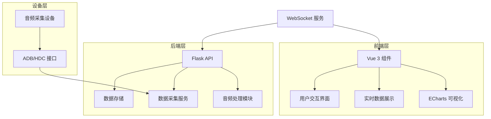
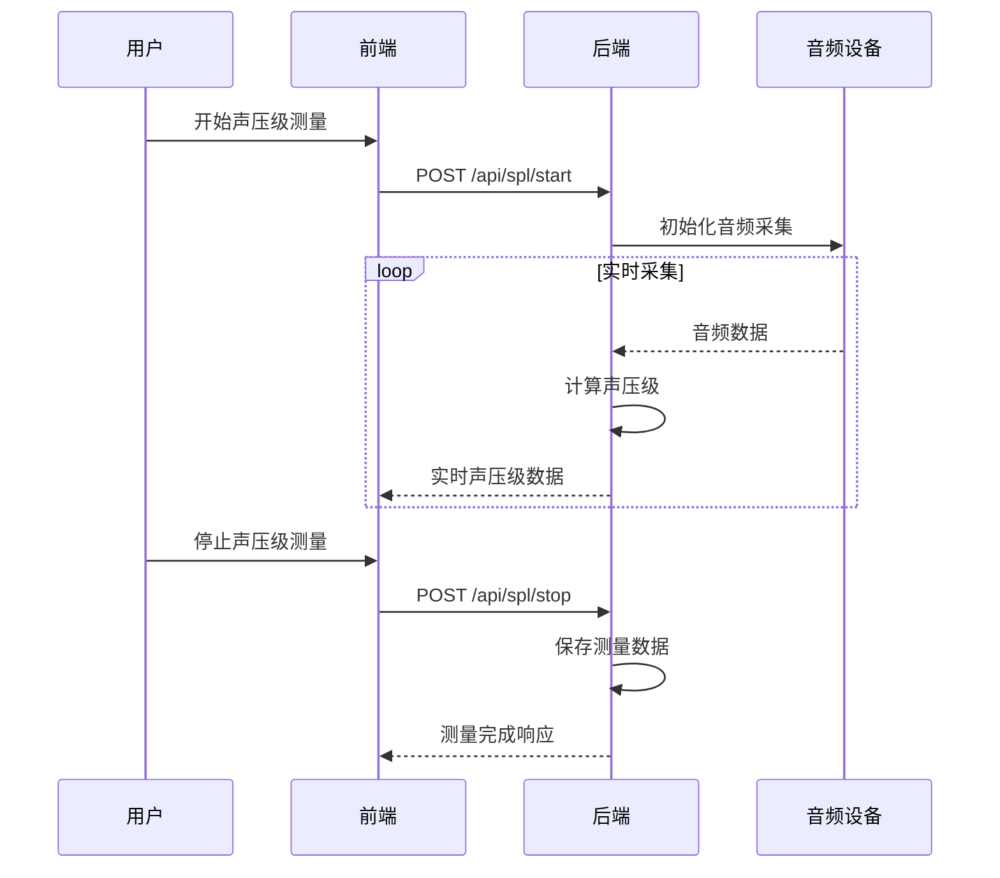

# 声压级映射（SPLMapping）功能设计文档

## 1. 功能概述

声压级映射（Sound Pressure Level Mapping）功能是智能语音测试系统中的核心组件，用于测量、分析和可视化不同设备在不同测试场景下的声压级分布情况。该功能通过专业音频采集设备与软件算法相结合，实现对测试环境中声压级的精确测量和空间映射，为语音测试的评估提供重要的声学数据支持。

**主要功能点：**
- 声压级实时测量与数据采集
- 空间声压级分布可视化
- 声压级阈值设置与告警
- 历史声压级数据趋势分析
- 多设备声压级对比
- 测试环境声学特性评估

## 2. 系统架构

### 2.1 整体架构

声压级映射功能采用前后端分离架构，前端负责数据可视化和用户交互，后端负责数据采集、处理和存储。系统通过WebSocket实现实时数据传输，确保声压级数据的实时性和准确性。



### 2.2 核心模块

| 模块名称 | 功能描述 | 技术实现 | 文件位置 |
|---------|---------|---------|----------|
| 数据采集模块 | 负责从音频设备采集声压级数据 | Python, sounddevice | backend/spl_mapping/data_collector.py |
| 数据处理模块 | 对采集的原始数据进行处理和分析 | Python, numpy, scipy | backend/spl_mapping/data_processor.py |
| 数据存储模块 | 存储历史声压级数据和测试结果 | PostgreSql, SQLAlchemy | backend/spl_mapping/models.py |
| 可视化模块 | 展示声压级分布和趋势图表 | ECharts, Vue 3 | frontend/components/SPLMapping.vue |
| 配置管理模块 | 管理声压级测试的配置参数 | Flask, JSON | backend/spl_mapping/config.py |

## 3. 核心功能模块

### 3.1 声压级实时测量

**功能描述：** 实时测量测试环境中的声压级数据，支持多通道同时采集。

**技术实现：**
- 使用 sounddevice 库进行音频数据采集
- 应用数字信号处理算法计算声压级
- 通过 WebSocket 实时传输数据到前端

**核心流程：**


### 3.2 空间声压级分布可视化

**功能描述：** 将采集的声压级数据以热力图形式可视化，展示空间声压级分布情况。

**技术实现：**
- 使用 ECharts 绘制热力图
- 支持 2D/3D 空间映射
- 提供颜色梯度自定义

**核心流程：**
1. 采集不同位置的声压级数据
2. 构建空间坐标与声压级的映射关系
3. 使用插值算法生成连续的声压级分布
4. 通过 ECharts 渲染热力图

### 3.3 声压级阈值设置与告警

**功能描述：** 设置声压级阈值，当测量值超过阈值时触发告警。

**技术实现：**
- 前端提供阈值设置界面
- 后端实现实时阈值检测
- 支持多种告警方式（视觉、听觉）

**核心流程：**
1. 用户设置声压级阈值范围
2. 系统实时监控测量数据
3. 当数据超出阈值时触发告警
4. 记录告警事件并通知用户

### 3.4 历史数据趋势分析

**功能描述：** 分析和展示历史声压级数据的变化趋势，支持不同时间维度的查看。

**技术实现：**
- 使用 ECharts 绘制趋势图表
- 支持数据筛选和对比
- 提供数据导出功能

**核心流程：**
1. 从数据库加载历史声压级数据
2. 根据用户选择的时间范围进行数据筛选
3. 生成趋势图表并展示
4. 支持数据导出为 CSV 或 Excel 格式

### 3.5 多设备声压级对比

**功能描述：** 同时测量和对比多个设备的声压级表现。

**技术实现：**
- 支持多设备并行数据采集
- 提供设备间声压级对比图表
- 计算设备间声压级差异

**核心流程：**
1. 选择需要对比的设备
2. 同时启动多设备声压级测量
3. 采集并处理各设备的数据
4. 生成对比图表并分析差异

## 4. 前端设计

### 4.1 页面结构

**SPLMapping.vue**
- 顶部：操作工具栏（开始/停止测量、阈值设置、数据导出）
- 左侧：设备选择和配置面板
- 中央：声压级分布热力图
- 右侧：实时数据和趋势图表
- 底部：状态栏（测量状态、设备连接状态）

### 4.2 核心组件

| 组件名称 | 功能描述 | 技术实现 | 文件位置 |
|---------|---------|---------|----------|
| SPLHeatmap | 声压级热力图展示 | ECharts, Vue 3 | frontend/components/spl/SPLHeatmap.vue |
| SPLTrendChart | 声压级趋势图表 | ECharts, Vue 3 | frontend/components/spl/SPLTrendChart.vue |
| SPLThresholdConfig | 阈值设置面板 | Vue 3, Element Plus | frontend/components/spl/SPLThresholdConfig.vue |
| SPLDeviceSelector | 设备选择组件 | Vue 3, Element Plus | frontend/components/spl/SPLDeviceSelector.vue |

### 4.3 交互流程

**声压级测量流程：**
1. 用户进入声压级映射页面
2. 选择测试设备和配置参数
3. 设置声压级阈值（可选）
4. 点击「开始测量」按钮
5. 系统实时显示声压级数据和分布热力图
6. 点击「停止测量」按钮
7. 系统保存测量数据并生成分析报告

**数据查看流程：**
1. 用户进入历史数据页面
2. 选择时间范围和设备
3. 系统加载并展示历史声压级数据
4. 用户可以查看趋势图表或导出数据

## 5. 后端设计

### 5.1 API 接口

| API路径 | 方法 | 功能描述 | 请求参数 | 成功响应 |
|---------|------|---------|---------|----------|
| /api/spl/start | POST | 开始声压级测量 | device_ids: ["dev1", "dev2"], duration: 60 | {"status": "started", "session_id": "sess123"} |
| /api/spl/stop | POST | 停止声压级测量 | session_id: "sess123" | {"status": "stopped", "data_id": "data456"} |
| /api/spl/data | GET | 获取声压级数据 | data_id: "data456", device_id: "dev1" | {"timestamp": "2023-12-01T12:00:00", "values": [65, 66, 67]} |
| /api/spl/config | GET | 获取声压级配置 | - | {"sample_rate": 48000, "channels": 2} |
| /api/spl/config | PUT | 更新声压级配置 | sample_rate: 48000, channels: 2 | {"status": "updated"} |
| /api/spl/threshold | POST | 设置声压级阈值 | min: 60, max: 80 | {"status": "set"} |
| /api/spl/history | GET | 获取历史声压级数据 | start_time: "2023-11-01", end_time: "2023-12-01" | [{"timestamp": "2023-11-15T10:00:00", "value": 68}] |
| /api/spl/export | GET | 导出声压级数据 | data_id: "data456", format: "csv" | CSV 或 Excel 文件 |

### 5.2 数据模型

**SPLMeasurement**
- id: 测量记录 ID
- session_id: 测量会话 ID
- device_id: 设备 ID
- start_time: 开始时间
- end_time: 结束时间
- sample_rate: 采样率
- channels: 通道数
- status: 测量状态
- created_at: 创建时间

**SPLData**
- id: 数据 ID
- measurement_id: 关联的测量记录 ID
- timestamp: 数据采集时间
- channel: 通道号
- value: 声压级值（dB）
- created_at: 创建时间

**SPLThreshold**
- id: 阈值 ID
- device_id: 设备 ID
- min_value: 最小阈值（dB）
- max_value: 最大阈值（dB）
- created_at: 创建时间
- updated_at: 更新时间

### 5.3 核心服务

**数据采集服务**
```python
# backend/spl_mapping/data_collector.py
import sounddevice as sd
import numpy as np
from datetime import datetime

class SPLDataCollector:
    def __init__(self, sample_rate=48000, channels=2):
        self.sample_rate = sample_rate
        self.channels = channels
        self.is_recording = False
        self.stream = None
    
    def start_collection(self, callback):
        self.is_recording = True
        self.stream = sd.InputStream(
            samplerate=self.sample_rate,
            channels=self.channels,
            callback=callback
        )
        self.stream.start()
    
    def stop_collection(self):
        self.is_recording = False
        if self.stream:
            self.stream.stop()
            self.stream.close()
```

**数据处理服务**
```python
# backend/spl_mapping/data_processor.py
import numpy as np
from scipy import signal

def calculate_spl(audio_data, reference=2e-5):
    """计算声压级"""
    rms = np.sqrt(np.mean(np.square(audio_data)))
    spl = 20 * np.log10(rms / reference)
    return spl

def process_audio_data(data):
    """处理音频数据并计算声压级"""
    # 应用窗口函数
    windowed = data * np.hanning(len(data))
    # 计算声压级
    spl = calculate_spl(windowed)
    return spl
```

## 6. 技术实现

### 6.1 前端实现

**SPLMapping.vue**
```vue
<template>
  <div class="spl-mapping-container">
    <!-- 操作工具栏 -->
    <div class="toolbar">
      <el-button type="primary" @click="startMeasurement" :disabled="isMeasuring">
        开始测量
      </el-button>
      <el-button type="danger" @click="stopMeasurement" :disabled="!isMeasuring">
        停止测量
      </el-button>
      <el-button @click="openThresholdConfig">
        阈值设置
      </el-button>
      <el-button @click="exportData">
        导出数据
      </el-button>
    </div>
    
    <!-- 主内容区 -->
    <div class="content">
      <!-- 左侧：设备选择和配置 -->
      <div class="left-panel">
        <h3>设备选择</h3>
        <el-checkbox-group v-model="selectedDevices">
          <el-checkbox v-for="device in availableDevices" :key="device.id" :label="device.id">
            {{ device.name }}
          </el-checkbox>
        </el-checkbox-group>
        
        <h3>测量配置</h3>
        <el-form :inline="true">
          <el-form-item label="采样率">
            <el-select v-model="config.sampleRate" placeholder="选择采样率">
              <el-option label="44.1kHz" value="44100"></el-option>
              <el-option label="48kHz" value="48000"></el-option>
            </el-select>
          </el-form-item>
          <el-form-item label="测量时长">
            <el-input-number v-model="config.duration" :min="1" :max="3600" label="秒"></el-input-number>
          </el-form-item>
        </el-form>
      </div>
      
      <!-- 中央：声压级分布热力图 -->
      <div class="center-panel">
        <h3>声压级分布</h3>
        <div ref="heatmapRef" class="heatmap-container"></div>
      </div>
      
      <!-- 右侧：实时数据和趋势图表 -->
      <div class="right-panel">
        <h3>实时数据</h3>
        <div class="realtime-data">
          <div v-for="device in selectedDevices" :key="device" class="device-data">
            <span class="device-name">{{ getDeviceName(device) }}:</span>
            <span class="spl-value">{{ realtimeData[device] || 0 }} dB</span>
          </div>
        </div>
        
        <h3>趋势图表</h3>
        <div ref="trendChartRef" class="trend-chart-container"></div>
      </div>
    </div>
    
    <!-- 状态栏 -->
    <div class="status-bar">
      <span>测量状态: {{ measurementStatus }}</span>
      <span>设备连接: {{ deviceConnectionStatus }}</span>
    </div>
    
    <!-- 阈值设置对话框 -->
    <el-dialog v-model="thresholdDialogVisible" title="声压级阈值设置">
      <el-form>
        <el-form-item label="最小阈值 (dB)">
          <el-input-number v-model="threshold.min" :min="0" :max="120"></el-input-number>
        </el-form-item>
        <el-form-item label="最大阈值 (dB)">
          <el-input-number v-model="threshold.max" :min="0" :max="120"></el-input-number>
        </el-form-item>
      </el-form>
      <template #footer>
        <span class="dialog-footer">
          <el-button @click="thresholdDialogVisible = false">取消</el-button>
          <el-button type="primary" @click="saveThreshold">保存</el-button>
        </span>
      </template>
    </el-dialog>
  </div>
</template>

<script setup>
import { ref, onMounted, onUnmounted } from 'vue';
import * as echarts from 'echarts';
import { useWebSocket } from '@/composables/useWebSocket';

// 状态管理
const isMeasuring = ref(false);
const measurementStatus = ref('就绪');
const deviceConnectionStatus = ref('正常');
const selectedDevices = ref([]);
const availableDevices = ref([]);
const realtimeData = ref({});
const thresholdDialogVisible = ref(false);

// 配置
const config = ref({
  sampleRate: 48000,
  duration: 60
});

const threshold = ref({
  min: 60,
  max: 80
});

// 图表引用
const heatmapRef = ref(null);
const trendChartRef = ref(null);
const heatmapChart = ref(null);
const trendChart = ref(null);

// WebSocket 连接
const { connect, disconnect, sendMessage, onMessage } = useWebSocket('ws://localhost:5000/ws/spl');

// 初始化
onMounted(() => {
  loadAvailableDevices();
  initCharts();
  connect();
  
  // 监听 WebSocket 消息
  onMessage((message) => {
    const data = JSON.parse(message);
    if (data.type === 'spl_data') {
      updateRealtimeData(data);
      updateCharts(data);
    }
  });
});

onUnmounted(() => {
  disconnect();
  if (heatmapChart.value) {
    heatmapChart.value.dispose();
  }
  if (trendChart.value) {
    trendChart.value.dispose();
  }
});

// 加载可用设备
const loadAvailableDevices = async () => {
  try {
    const response = await fetch('/api/devices');
    const data = await response.json();
    availableDevices.value = data.devices;
  } catch (error) {
    console.error('加载设备失败:', error);
  }
};

// 初始化图表
const initCharts = () => {
  // 初始化热力图
  if (heatmapRef.value) {
    heatmapChart.value = echarts.init(heatmapRef.value);
    heatmapChart.value.setOption({
      title: {
        text: '声压级分布热力图'
      },
      tooltip: {
        position: 'top'
      },
      grid: {
        height: '60%',
        top: '10%'
      },
      xAxis: {
        type: 'category',
        data: ['位置1', '位置2', '位置3', '位置4', '位置5'],
        splitArea: {
          show: true
        }
      },
      yAxis: {
        type: 'category',
        data: ['设备1', '设备2', '设备3'],
        splitArea: {
          show: true
        }
      },
      visualMap: {
        min: 0,
        max: 100,
        calculable: true,
        orient: 'horizontal',
        left: 'center',
        bottom: '15%',
        inRange: {
          color: ['blue', 'green', 'yellow', 'red']
        }
      },
      series: [{
        name: '声压级 (dB)',
        type: 'heatmap',
        data: [],
        label: {
          show: true
        },
        emphasis: {
          itemStyle: {
            shadowBlur: 10,
            shadowColor: 'rgba(0, 0, 0, 0.5)'
          }
        }
      }]
    });
  }
  
  // 初始化趋势图
  if (trendChartRef.value) {
    trendChart.value = echarts.init(trendChartRef.value);
    trendChart.value.setOption({
      title: {
        text: '声压级趋势'
      },
      tooltip: {
        trigger: 'axis'
      },
      legend: {
        data: []
      },
      grid: {
        left: '3%',
        right: '4%',
        bottom: '3%',
        containLabel: true
      },
      xAxis: {
        type: 'time',
        boundaryGap: false
      },
      yAxis: {
        type: 'value',
        name: '声压级 (dB)',
        min: 0,
        max: 100
      },
      series: []
    });
  }
};

// 开始测量
const startMeasurement = async () => {
  if (selectedDevices.value.length === 0) {
    ElMessage.warning('请选择至少一个设备');
    return;
  }
  
  try {
    const response = await fetch('/api/spl/start', {
      method: 'POST',
      headers: {
        'Content-Type': 'application/json'
      },
      body: JSON.stringify({
        device_ids: selectedDevices.value,
        duration: config.value.duration
      })
    });
    
    const data = await response.json();
    if (data.status === 'started') {
      isMeasuring.value = true;
      measurementStatus.value = '测量中';
      ElMessage.success('测量已开始');
    }
  } catch (error) {
    console.error('开始测量失败:', error);
    ElMessage.error('开始测量失败');
  }
};

// 停止测量
const stopMeasurement = async () => {
  try {
    const response = await fetch('/api/spl/stop', {
      method: 'POST',
      headers: {
        'Content-Type': 'application/json'
      },
      body: JSON.stringify({ session_id: 'current' })
    });
    
    const data = await response.json();
    if (data.status === 'stopped') {
      isMeasuring.value = false;
      measurementStatus.value = '已停止';
      ElMessage.success('测量已停止');
    }
  } catch (error) {
    console.error('停止测量失败:', error);
    ElMessage.error('停止测量失败');
  }
};

// 更新实时数据
const updateRealtimeData = (data) => {
  realtimeData.value[data.device_id] = data.spl;
};

// 更新图表
const updateCharts = (data) => {
  // 更新热力图数据
  if (heatmapChart.value) {
    // 这里需要根据实际数据结构更新热力图
  }
  
  // 更新趋势图数据
  if (trendChart.value) {
    // 这里需要根据实际数据结构更新趋势图
  }
};

// 保存阈值设置
const saveThreshold = async () => {
  try {
    const response = await fetch('/api/spl/threshold', {
      method: 'POST',
      headers: {
        'Content-Type': 'application/json'
      },
      body: JSON.stringify(threshold.value)
    });
    
    const data = await response.json();
    if (data.status === 'set') {
      thresholdDialogVisible.value = false;
      ElMessage.success('阈值设置已保存');
    }
  } catch (error) {
    console.error('保存阈值失败:', error);
    ElMessage.error('保存阈值失败');
  }
};

// 导出数据
const exportData = () => {
  // 实现数据导出功能
};

// 获取设备名称
const getDeviceName = (deviceId) => {
  const device = availableDevices.value.find(d => d.id === deviceId);
  return device ? device.name : deviceId;
};

// 打开阈值设置对话框
const openThresholdConfig = () => {
  thresholdDialogVisible.value = true;
};
</script>

<style scoped>
.spl-mapping-container {
  height: 100vh;
  display: flex;
  flex-direction: column;
}

.toolbar {
  padding: 10px;
  background-color: #f5f7fa;
  border-bottom: 1px solid #e4e7ed;
  display: flex;
  gap: 10px;
}

.content {
  flex: 1;
  display: flex;
  overflow: hidden;
}

.left-panel {
  width: 250px;
  padding: 15px;
  background-color: #f5f7fa;
  border-right: 1px solid #e4e7ed;
  overflow-y: auto;
}

.center-panel {
  flex: 1;
  padding: 15px;
  display: flex;
  flex-direction: column;
}

.right-panel {
  width: 300px;
  padding: 15px;
  background-color: #f5f7fa;
  border-left: 1px solid #e4e7ed;
  overflow-y: auto;
}

.heatmap-container {
  flex: 1;
  min-height: 400px;
}

.trend-chart-container {
  height: 300px;
  margin-top: 20px;
}

.status-bar {
  padding: 10px;
  background-color: #f5f7fa;
  border-top: 1px solid #e4e7ed;
  display: flex;
  justify-content: space-between;
  font-size: 14px;
  color: #606266;
}

.device-data {
  margin-bottom: 10px;
  padding: 8px;
  background-color: #ffffff;
  border-radius: 4px;
  display: flex;
  justify-content: space-between;
}

.device-name {
  font-weight: bold;
}

.spl-value {
  color: #409eff;
  font-weight: bold;
}
</style>
```

### 6.2 后端实现

**spl_mapping/routes.py**
```python
from flask import Blueprint, request, jsonify
from flask_socketio import emit
from .data_collector import SPLDataCollector
from .data_processor import process_audio_data
from .models import SPLMeasurement, SPLData, SPLThreshold
from ..extensions import db, socketio

bp = Blueprint('spl_mapping', __name__, url_prefix='/api/spl')

# 全局变量
collectors = {}
active_sessions = {}

@bp.route('/start', methods=['POST'])
def start_measurement():
    """开始声压级测量"""
    data = request.get_json()
    device_ids = data.get('device_ids', [])
    duration = data.get('duration', 60)
    
    if not device_ids:
        return jsonify({'error': 'No devices selected'}), 400
    
    # 创建测量会话
    session_id = f"sess_{int(time.time())}"
    
    # 为每个设备创建数据采集器
    for device_id in device_ids:
        collector = SPLDataCollector()
        collectors[device_id] = collector
        
        # 启动数据采集
        def callback(indata, frames, time, status):
            if status:
                print(status)
            # 处理数据
            spl = process_audio_data(indata[:, 0])
            # 发送数据到前端
            socketio.emit('spl_data', {
                'device_id': device_id,
                'spl': spl,
                'timestamp': datetime.now().isoformat()
            })
            # 保存数据到数据库
            spl_data = SPLData(
                measurement_id=session_id,
                device_id=device_id,
                timestamp=datetime.now(),
                channel=0,
                value=spl
            )
            db.session.add(spl_data)
            db.session.commit()
        
        collector.start_collection(callback)
    
    # 创建测量记录
    measurement = SPLMeasurement(
        session_id=session_id,
        start_time=datetime.now(),
        status='active'
    )
    db.session.add(measurement)
    db.session.commit()
    
    active_sessions[session_id] = {
        'device_ids': device_ids,
        'start_time': datetime.now(),
        'duration': duration
    }
    
    return jsonify({'status': 'started', 'session_id': session_id})

@bp.route('/stop', methods=['POST'])
def stop_measurement():
    """停止声压级测量"""
    data = request.get_json()
    session_id = data.get('session_id')
    
    if not session_id:
        return jsonify({'error': 'Session ID required'}), 400
    
    # 停止所有设备的数据采集
    if session_id in active_sessions:
        device_ids = active_sessions[session_id]['device_ids']
        for device_id in device_ids:
            if device_id in collectors:
                collector = collectors[device_id]
                collector.stop_collection()
                del collectors[device_id]
        
        # 更新测量记录状态
        measurement = SPLMeasurement.query.filter_by(session_id=session_id).first()
        if measurement:
            measurement.status = 'completed'
            measurement.end_time = datetime.now()
            db.session.commit()
        
        del active_sessions[session_id]
    
    return jsonify({'status': 'stopped', 'data_id': session_id})

@bp.route('/data', methods=['GET'])
def get_spl_data():
    """获取声压级数据"""
    data_id = request.args.get('data_id')
    device_id = request.args.get('device_id')
    
    if not data_id:
        return jsonify({'error': 'Data ID required'}), 400
    
    # 查询数据
    query = SPLData.query.filter_by(measurement_id=data_id)
    if device_id:
        query = query.filter_by(device_id=device_id)
    
    data = query.all()
    
    # 格式化数据
    result = []
    for item in data:
        result.append({
            'timestamp': item.timestamp.isoformat(),
            'value': item.value
        })
    
    return jsonify(result)

@bp.route('/config', methods=['GET', 'PUT'])
def config():
    """获取或更新声压级配置"""
    if request.method == 'GET':
        # 返回默认配置
        return jsonify({
            'sample_rate': 48000,
            'channels': 2,
            'window_size': 1024
        })
    else:
        # 更新配置
        data = request.get_json()
        # 这里可以保存配置到数据库或配置文件
        return jsonify({'status': 'updated'})

@bp.route('/threshold', methods=['POST'])
def set_threshold():
    """设置声压级阈值"""
    data = request.get_json()
    min_threshold = data.get('min')
    max_threshold = data.get('max')
    
    if min_threshold is None or max_threshold is None:
        return jsonify({'error': 'Threshold values required'}), 400
    
    # 保存阈值设置
    threshold = SPLThreshold(
        min_value=min_threshold,
        max_value=max_threshold
    )
    db.session.add(threshold)
    db.session.commit()
    
    return jsonify({'status': 'set'})

@bp.route('/history', methods=['GET'])
def get_history():
    """获取历史声压级数据"""
    start_time = request.args.get('start_time')
    end_time = request.args.get('end_time')
    
    # 查询数据
    query = SPLData.query
    if start_time:
        query = query.filter(SPLData.timestamp >= start_time)
    if end_time:
        query = query.filter(SPLData.timestamp <= end_time)
    
    data = query.all()
    
    # 格式化数据
    result = []
    for item in data:
        result.append({
            'timestamp': item.timestamp.isoformat(),
            'value': item.value
        })
    
    return jsonify(result)

@bp.route('/export', methods=['GET'])
def export_data():
    """导出声压级数据"""
    data_id = request.args.get('data_id')
    format = request.args.get('format', 'csv')
    
    if not data_id:
        return jsonify({'error': 'Data ID required'}), 400
    
    # 查询数据
    data = SPLData.query.filter_by(measurement_id=data_id).all()
    
    # 生成 CSV 数据
    if format == 'csv':
        import csv
        from io import StringIO
        
        output = StringIO()
        writer = csv.writer(output)
        writer.writerow(['Timestamp', 'Device ID', 'Channel', 'SPL (dB)'])
        
        for item in data:
            writer.writerow([
                item.timestamp.isoformat(),
                item.device_id,
                item.channel,
                item.value
            ])
        
        output.seek(0)
        
        from flask import make_response
        response = make_response(output.getvalue())
        response.headers['Content-Disposition'] = f'attachment; filename=spl_data_{data_id}.csv'
        response.headers['Content-Type'] = 'text/csv'
        return response
    
    return jsonify({'error': 'Unsupported format'}), 400

# WebSocket 事件处理
@socketio.on('connect', namespace='/spl')
def on_connect():
    print('Client connected to SPL namespace')

@socketio.on('disconnect', namespace='/spl')
def on_disconnect():
    print('Client disconnected from SPL namespace')
```

## 7. 性能与安全

### 7.1 性能优化

1. **数据采集优化**
   - 使用多线程/多进程并行采集多设备数据
   - 应用数据压缩技术减少网络传输量
   - 实现数据缓冲机制，避免数据丢失

2. **数据处理优化**
   - 使用 NumPy 和 SciPy 进行高效数据处理
   - 应用批处理技术减少 I/O 操作
   - 实现数据采样策略，平衡数据精度和处理速度

3. **前端优化**
   - 使用 ECharts 的增量渲染功能减少重绘开销
   - 实现数据节流，避免频繁更新图表
   - 使用虚拟滚动技术处理大量历史数据

4. **存储优化**
   - 实现数据分表存储，按时间范围划分数据
   - 应用数据归档策略，将历史数据压缩存储
   - 使用索引优化数据库查询性能

### 7.2 安全设计

1. **数据安全**
   - 实现数据加密传输，保护敏感测试数据
   - 应用访问控制机制，限制数据访问权限
   - 实现数据备份和恢复策略

2. **设备安全**
   - 验证设备身份，防止未授权设备接入
   - 实现设备操作权限控制
   - 监控设备异常行为，及时发现安全威胁

3. **系统安全**
   - 应用输入验证，防止注入攻击
   - 实现日志记录，便于安全审计
   - 定期更新系统依赖，修复安全漏洞

## 8. 测试策略

### 8.1 功能测试

| 测试项 | 测试内容 | 预期结果 |
|-------|---------|----------|
| 设备连接测试 | 测试与音频采集设备的连接 | 设备连接成功，能够识别设备型号和参数 |
| 数据采集测试 | 测试声压级数据的采集功能 | 能够正确采集和显示实时声压级数据 |
| 阈值告警测试 | 测试声压级阈值设置和告警功能 | 当声压级超过阈值时，系统能够及时告警 |
| 数据导出测试 | 测试数据导出功能 | 能够成功导出数据为 CSV 或 Excel 格式 |
| 多设备对比测试 | 测试多设备声压级对比功能 | 能够同时测量和对比多个设备的声压级 |

### 8.2 性能测试

| 测试项 | 测试内容 | 预期结果 |
|-------|---------|----------|
| 数据采集性能 | 测试高采样率下的数据采集性能 | 48kHz 采样率下能够稳定采集数据，无丢包 |
| 实时性测试 | 测试数据从采集到显示的延迟 | 延迟不超过 100ms |
| 多设备并行测试 | 测试多设备并行采集的性能 | 支持至少 4 个设备同时采集，性能稳定 |
| 大数据处理测试 | 测试处理大量历史数据的性能 | 能够快速加载和处理 1 小时以上的历史数据 |

### 8.3 可靠性测试

| 测试项 | 测试内容 | 预期结果 |
|-------|---------|----------|
| 设备断开重连测试 | 测试设备断开后重新连接的功能 | 设备断开后能够自动重连并恢复数据采集 |
| 网络中断测试 | 测试网络中断后的数据恢复 | 网络中断后能够保存数据，网络恢复后继续传输 |
| 长时间运行测试 | 测试系统长时间运行的稳定性 | 连续运行 24 小时，系统性能稳定，无内存泄漏 |
| 异常数据测试 | 测试系统对异常数据的处理能力 | 能够识别和处理异常数据，不会导致系统崩溃 |

## 9. 部署与集成

### 9.1 部署架构

声压级映射功能作为智能语音测试系统的一部分，与其他功能模块共享部署架构。推荐使用 Docker 容器化部署，便于环境管理和版本控制。

**部署步骤：**
1. 构建 Docker 镜像
2. 配置环境变量和依赖
3. 启动容器服务
4. 配置设备连接和权限

### 9.2 集成方案

**与其他功能模块的集成：**
- 与设备管理模块集成：获取设备信息和状态
- 与任务管理模块集成：作为测试任务的一部分执行
- 与报告管理模块集成：生成声压级测试报告
- 与评估系统模块集成：提供声压级评估数据

**API 集成：**
- 提供 RESTful API 接口供其他模块调用
- 支持 WebSocket 实时数据传输
- 实现数据格式标准化，便于模块间数据交换

## 10. 监控与维护

### 10.1 监控系统

**监控指标：**
- 数据采集状态：监控音频设备连接状态和数据采集情况
- 系统性能：监控 CPU、内存、磁盘使用情况
- 数据传输：监控 WebSocket 连接状态和数据传输速率
- 告警事件：监控声压级阈值告警事件

**监控工具：**
- 使用 Prometheus 采集监控指标
- 使用 Grafana 可视化监控数据
- 实现告警通知机制，及时响应异常情况

### 10.2 维护计划

1. **日常维护**
   - 检查设备连接状态和数据采集情况
   - 备份声压级测试数据
   - 清理过期数据，优化存储空间

2. **定期维护**
   - 校准音频采集设备，确保测量准确性
   - 更新系统依赖和安全补丁
   - 优化系统配置，提升性能

3. **故障处理**
   - 设备连接故障：检查设备驱动和连接线缆
   - 数据采集故障：检查音频设备状态和系统配置
   - 数据处理故障：检查算法实现和系统资源

## 11. 未来规划

### 11.1 功能扩展

1. **3D 声压级映射**
   - 实现三维空间的声压级分布可视化
   - 支持声压级数据的空间插值和预测

2. **智能声压级分析**
   - 应用机器学习算法分析声压级数据
   - 自动识别异常声压级模式
   - 提供声压级优化建议

3. **多场景声压级测试**
   - 支持不同测试场景的声压级标准
   - 实现场景模板管理，快速切换测试配置

4. **远程声压级监控**
   - 实现远程声压级数据采集和监控
   - 支持移动设备访问声压级数据

### 11.2 技术升级

1. **硬件升级**
   - 支持更高精度的音频采集设备
   - 实现多通道同步数据采集

2. **算法优化**
   - 应用更先进的声压级计算算法
   - 实现实时音频分析和处理

3. **系统架构升级**
   - 采用微服务架构，提高系统扩展性
   - 实现容器编排，提升系统可靠性

4. **用户体验升级**
   - 优化前端界面，提升用户操作体验
   - 实现个性化配置，满足不同用户需求

## 12. 总结

声压级映射（SPLMapping）功能是智能语音测试系统中的重要组成部分，通过精确测量和可视化声压级分布，为语音测试提供了科学、客观的声学数据支持。该功能采用先进的音频处理技术和可视化方案，实现了实时声压级测量、空间分布可视化、阈值告警、历史数据趋势分析和多设备对比等核心功能。

系统设计充分考虑了性能优化和安全保障，通过并行数据采集、高效数据处理和前端优化，确保了系统在高负载下的稳定运行。同时，系统提供了丰富的 API 接口和集成方案，便于与其他功能模块的无缝集成。

未来，声压级映射功能将继续演进，通过引入 3D 可视化、智能分析和远程监控等技术，进一步提升其在语音测试领域的应用价值，为智能语音设备的研发和质量控制提供更加强有力的支持。