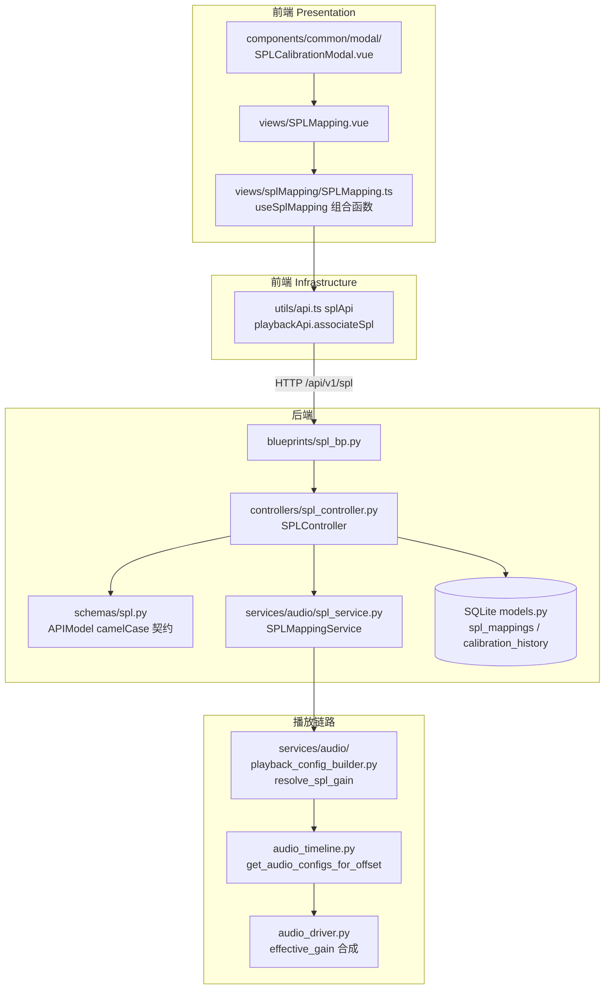

# 声压级映射（SPLMapping）功能设计文档

| 项目 | 内容 |
|------|------|
| 文档版本 | v2.0 |
| 更新日期 | 2026-09-11 |
| 适用范围 | 播放设备声压级校准映射（数字增益 ↔ 实际 SPL） |

> **v2.0 修订说明**：本文档早期版本描述的"声压级实时测量体系"（SPLMeasurement/SPLData/SPLThreshold 数据模型、`/api/spl/start|stop|data` 实时采集接口、`SPLDataCollector`/`SPLDataProcessor` 服务、WebSocket 实时推送）在代码库中并不存在，已整体废弃。v2.0 依据实际代码重写为 **SPLMapping 校准映射体系**：后端 `backend/controllers/spl_controller.py` + `backend/services/audio/spl_service.py`，前端 `frontend/src/views/SPLMapping.vue`。

## 1. 功能概述

声压级映射（SPL Mapping）用于建立**播放设备数字增益与实际输出声压级（dB SPL）之间的校准映射关系**。测试执行时，系统根据用例要求的目标声压级（如 65 dB SPL），通过已校准的映射关系换算出播放所需的数字增益，保证不同设备输出的实际响度一致。

**主要功能点：**
- 增益映射（SPLMapping）的增删改查与统计
- 校准点（数字增益 → 实测 SPL）采集与校准数据管理，含校准历史留痕
- 测试音播放（校准辅助，E2E 任务运行期间禁止外放）
- 映射与播放设备（PlaybackDevice）的关联管理
- 播放链路 SPL → 增益换算（`SPLMappingService.spl_to_gain`），供 E2E 播放、预览、设备测试复用

**术语约定：**
- **数字增益（digital_gain）**：前端 1-100 的音量档位，经 `gainOffset = (digital_gain - 50) × 0.24` 换算为增益偏移（dB）
- **增益偏移（gainOffset）**：相对基础电平 `-30 dBFS` 的偏移量，有效范围 `[-12, +25]` dB
- **基础电平（BASE_LEVEL_DB）**：`-30 dBFS`，系统统一参考电平
- **校准点（calibration point）**：一组 `(spl, gain)` 实测数据，存储于 `calibration_data` JSON 字段

## 2. 系统架构

### 2.1 整体架构

功能遵循前后端分离 + 分层架构。前端仅使用 camelCase 域模型；后端 Pydantic schema 通过 `APIModel`（`serialize_by_alias=True`）对外输出 camelCase，内部持久化使用 snake_case。



### 2.2 核心模块

| 模块 | 职责 | 文件位置 |
|------|------|----------|
| 路由层 | 注册 `/api/v1/spl` 下 12 个 REST 路由 | `backend/blueprints/spl_bp.py` |
| 控制器 | 请求校验、gainOffset 换算、状态流转 | `backend/controllers/spl_controller.py` |
| 服务层 | SPL ↔ 增益换算核心算法 | `backend/services/audio/spl_service.py` |
| Schema 层 | camelCase 输出契约（APIModel） | `backend/schemas/spl.py`、`backend/schemas/playback.py` |
| 数据模型 | `spl_mappings` / `calibration_history` 表 | `backend/models/models.py` |
| 播放集成 | `resolve_spl_gain` 封装，播放配置生成 | `backend/services/audio/playback_config_builder.py` |
| 前端页面 | 映射管理页（列表/统计/CRUD） | `frontend/src/views/SPLMapping.vue` + `frontend/src/views/splMapping/SPLMapping.ts` |
| 前端弹窗 | 校准曲线模拟、批量处理、设备关联 | `frontend/src/components/common/modal/SPLCalibrationModal.vue`、`BatchSPLModal.vue`、`CRUDFormModal.vue` |

## 3. 数据模型

### 3.1 SPLMapping（`spl_mappings` 表）

`backend/models/models.py` 中定义，一条记录代表一个"设备 + 距离 + 频率"维度下的校准映射。

| 字段（snake_case） | 类型 | 说明 |
|------|------|------|
| `id` | Integer PK | 映射唯一 ID |
| `name` | String(100) | 映射配置名称 |
| `description` | Text | 详细描述 |
| `device_id` | Integer FK → `playback_devices.id` | 关联播放设备（PlaybackDevice 1:N SPLMapping） |
| `device_type` | String(50) | 适用的设备类型 |
| `distance` | Float，默认 1.0 | 测试时物理距离（米） |
| `target_spl` | Float | 目标声压级（dB SPL） |
| `digital_gain` | Float | 对应的数字增益值 |
| `calibration_status` | String(20)，默认 `uncalibrated` | 校准状态：`calibrated` / `uncalibrated` |
| `test_frequency` | Integer，默认 1000 | 校准测试频率（Hz） |
| `calibration_data` | JSON | 校准点集合（详见 5.3） |
| `created_at` / `updated_at` | DateTime | 创建/更新时间（UTC+8） |

### 3.2 CalibrationHistory（`calibration_history` 表）

每次校准落库留痕：`mapping_id`（FK → `spl_mappings.id`）、`distance`、`test_frequency`、`calibration_data`、`created_at`。

### 3.3 播放设备关联

- `PlaybackDevice` 通过外键 `device_id` 关联多个 SPLMapping；
- 设备侧另持有 `current_spl_mapping_id`，指向当前生效的映射；
- 关联接口：`POST /api/v1/playback-devices/{device_id}/associate-spl`，请求体 `PlaybackAssociateSplSchema`（`backend/schemas/playback.py`），字段 `spl_mapping_id` 对外别名为 `splMappingId`。

## 4. 核心功能

### 4.1 映射 CRUD 与统计

由 `SPLController` 提供列表、详情、创建、更新、删除、按设备查询、统计（总数/已校准/未校准/关联设备数）。创建与更新入参经 `SPLMappingCreateSchema` / `SPLMappingUpdateSchema` 校验。

### 4.2 校准（calibrate）

`POST /spl/{id}/calibrate` 提交校准点集合，控制器完成：
1. 解析校准点（兼容 `gainOffset`/`gain_offset`/`digital_gain`/`gain` 多种键名）；
2. `gainOffset = (digital_gain - 50) × 0.24` 换算，单点 `gainOffset` 上限 `+25`（超限报错）；
3. `finalLevel = -30 + gainOffset`（基础电平 + 偏移）；
4. 写入 `calibration_data`，置 `calibration_status = 'calibrated'`，并写入 `calibration_history`；
5. `distance` / `testFrequency` 变化时映射自动重置为 `uncalibrated`。

### 4.3 测试音播放

`POST /spl/test-tone` 播放静态测试音频（`AUDIO_STORAGE_PATH/test.wav`），以 `-30 dBFS` 为参考电平，按 `gain_offset` 或 `gain_value`（默认 50 档）合成播放增益，返回 `unique_id`；`POST /spl/test-tone/stop` 按 `unique_id` 停止。**存在待执行 E2E 任务时禁止播放**（`has_running_e2e_tasks()` 拦截，避免占用扬声器）。

### 4.4 SPL → 增益换算（播放链路核心）

`SPLMappingService.spl_to_gain(spl_mapping_id, target_spl, app=None)`：按映射校准点插值/外推，返回线性增益（详见 8.1）。供播放链路（`resolve_spl_gain`）、预览与设备测试复用。

## 5. 接口设计

### 5.1 路由清单

蓝图注册于 `backend/app.py`：`app.register_blueprint(spl_bp, url_prefix='/api/v1/spl')`。

| 方法 | 路径 | 说明 | 控制器方法 |
|------|------|------|-----------|
| GET | `/api/v1/spl` | 分页查询映射列表 | `get_all` |
| GET | `/api/v1/spl/{mapping_id}` | 映射详情 | `get_one` |
| POST | `/api/v1/spl` | 创建映射 | `create` |
| PUT | `/api/v1/spl/{mapping_id}` | 更新映射 | `update` |
| DELETE | `/api/v1/spl/{mapping_id}` | 删除映射 | `delete` |
| POST | `/api/v1/spl/{mapping_id}/calibrate` | 提交校准数据 | `calibrate` |
| GET | `/api/v1/spl/{mapping_id}/history` | 校准历史 | `get_history` |
| GET | `/api/v1/spl/{mapping_id}/calibration-data` | 当前校准数据 | `get_calibration_data` |
| GET | `/api/v1/spl/stats` | 统计（total/calibrated/uncalibrated/associatedDevices） | `get_stats` |
| GET | `/api/v1/spl/by-device/{device_id}` | 按设备查映射 | `get_by_device` |
| POST | `/api/v1/spl/test-tone` | 播放测试音 | `play_test_tone` |
| POST | `/api/v1/spl/test-tone/stop` | 停止测试音 | `stop_test_tone` |

设备关联接口位于播放设备蓝图：`POST /api/v1/playback-devices/{device_id}/associate-spl`（`backend/blueprints/playback_bp.py`）。

### 5.2 字段命名契约

所有 Schema 继承 `APIModel`（`backend/schemas/base.py`），`serialize_by_alias=True`，**对外一律输出 camelCase**；snake_case ↔ camelCase 的兜底转换由 `NamingAliasMiddleware`（`backend/utils/web/naming_middleware.py`）完成。详见《10_系统架构/前后端字段命名适配机制.md》。

### 5.3 报文示例

创建映射（`POST /api/v1/spl`）：

```json
{
  "name": "耳机-1m-1kHz",
  "deviceId": 3,
  "deviceType": "physical",
  "distance": 1.0,
  "testFrequency": 1000,
  "description": "头戴耳机 1 米 1kHz 校准"
}
```

校准提交（`POST /api/v1/spl/{id}/calibrate`），校准点以 `gainOffset`（或兼容 `digitalGain`）+ `spl` 描述：

```json
{
  "calibrationPoints": [
    { "gainOffset": -12, "spl": 48.5 },
    { "gainOffset": 0,   "spl": 65.0 },
    { "gainOffset": 12,  "spl": 78.2 }
  ]
}
```

`calibration_data` 持久化结构（snake_case，点内键名兼容 `gainOffset`/`gain_offset`/`digital_gain`/`gain`）：

```json
{
  "points": [
    { "gainOffset": -12.0, "digital_gain": 0, "spl": 48.5 },
    { "gainOffset": 0.0,   "digital_gain": 50, "spl": 65.0 }
  ]
}
```

设备关联（`POST /api/v1/playback-devices/{device_id}/associate-spl`）：

```json
{ "splMappingId": 7 }
```

## 6. 前端设计

### 6.1 页面结构

- **`frontend/src/views/SPLMapping.vue`**：映射管理主页面。顶部统计卡（增益映射数/已校准/未校准/关联设备数），中部映射卡片网格（名称、校准状态徽标、关联设备、校准点数、校准时间、增益偏移范围、SPL 范围、基础电平），支持关键字搜索、校准状态与设备筛选、前端分页。
- **`frontend/src/views/splMapping/SPLMapping.ts`**：`useSplMapping()` 组合函数，封装页面状态与用例编排：调用 `splApi.getAll/getStats/create/update/delete`；基于校准点在前端派生 `gainOffsetMin/Max`、`minOffsetSpl/Max`、`finalLevelMin/Max`（`BASE_LEVEL_DBFS = -30`）。
- **`frontend/src/assets/styles/SPLMapping.css`**：页面样式。

### 6.2 核心组件

| 组件 | 位置 | 职责 |
|------|------|------|
| SPLCalibrationModal | `components/common/modal/SPLCalibrationModal.vue` | 校准参数配置（测试设备、信号类型 sine/whiteNoise/pinkNoise、测试频率、测量距离、测试点数、最小/最大 dB）与**前端增益曲线模拟预览**（`volumeToDb`、`DB_MIN`/`DB_MAX`，0-100 音量档线性化展示） |
| BatchSPLModal / BatchSplModal | `components/common/modal/`、`components/common/test-case/TestCaseModal/` | 批量 SPL 配置 |
| CRUDFormModal | `components/common/modal/CRUDFormModal.vue` | 设备表单内按设备加载映射（`splApi.getByDevice`）、测试音播放（原生 `fetch('/api/v1/spl/test-tone')`） |

### 6.3 交互流程

1. 用户进入"声压级映射管理"页，`useSplMapping` 并行拉取映射列表与统计；
2. "添加增益映射"打开表单，提交 `splApi.create`（camelCase 报文）；
3. 校准流程：在弹窗中配置信号/频率/距离/点数 → 预览增益曲线 → 提交校准点至 `POST /spl/{id}/calibrate`，后端换算 gainOffset 并落库；
4. "关联设备"通过 `playbackApi.associateSpl(deviceId, splMappingId)` 写入设备当前生效映射；
5. 播放测试音辅助人工核对实际响度（E2E 运行期间被后端拒绝）。

## 7. 播放链路集成

### 7.1 E2E 播放链路

SPL 映射在测试执行时的消费路径（由 `device_type='physical'` 决定走真机播放）：

```
E2EExecutor → PlaybackOrchestrator
  → playback_config_builder.build_dry_configs / build_noise_play_configs / build_interferer_configs
      （内部 resolve_spl_gain(spl_mapping_id, target_spl) 换算增益）
  → audio_timeline.get_audio_configs_for_offset(offset_ms) 输出音频配置
  → audio_driver（PyAudioDriver）
      effective_gain = audio_gains[i] × GLOBAL_SAFE_GAIN × gain_compensations[i]
```

- `resolve_spl_gain` 封装 `SPLMappingService.spl_to_gain`，并统一处理映射缺失/未校准的降级；
- 背景噪声优先级：case 级 `config.background_noise` > round 级 `rounds[].background_noise`，case 级存在时 round 级不播放；干扰人来自 `rounds[].algorithm_params.interferers`。

### 7.2 与评估链路的关系

评估侧参数（`case_config → played_audios`）按《04_评估/case-config-stimulus-audios方案.md》三组参数映射传递；`spl` 属于**非文件标量**，在 multipart 占位符替换中原样保留。评估服务（`eval_server` xiaoyi_metrics）**不消费 SPL 指标**——SPL 仅作用于播放端响度控制，评估端无独立 SPL 指标项。

### 7.3 双套对称设计（设计态与实现态）

| 维度 | E2E 真机播放（已实现） | API 类被测服务（设计态） |
|------|----------------------|------------------------|
| 映射实体 | `SPLMapping`（`device.current_spl_mapping_id`） | `ApiRmsSplMapping`（`api.rms_spl_mapping_id`） |
| 换算服务 | `SPLMappingService`（`backend/services/audio/spl_service.py`） | `ApiRmsSplService`（见 04_类设计.md 5.7b） |
| 编排方 | `PlaybackOrchestrator` → `AudioDriver` | `AudioStreamOrchestrator`（见 04_类设计.md） |

API 类对称体系（`ApiRmsSplMapping`/`ApiRmsSplService`/`AudioStreamOrchestrator`）目前**仅存在于设计文档**《01_测试执行/04_类设计.md》第 5.7a/5.7b 节，backend 尚未实现，落地前本文档对应章节以设计文档为准。

## 8. 技术实现

### 8.1 SPLMappingService 换算算法

文件：`backend/services/audio/spl_service.py`。核心常量（禁止散落硬编码，统一收敛于此）：

```python
DB_MIN = -60.0            # 数字增益下限（dBFS）
DB_MAX = 0.0              # 数字增益上限（dBFS）
BASE_LEVEL_DB = -30.0     # 基础参考电平（dBFS）
MAX_OUTPUT_DB = -5.0      # 最大允许输出电平（dBFS）
MIN_GAIN_DB = -70.0       # 增益偏移下限（dB）
MAX_GAIN_DB = 25.0        # 增益偏移上限（dB）
MIN_GAIN_LINEAR = 10 ** (MIN_GAIN_DB / 20)
MAX_GAIN_LINEAR = 10 ** (MAX_GAIN_DB / 20)
```

`spl_to_gain(spl_mapping_id, target_spl, app=None)` 流程：
1. 按 `app`（支持外部注入上下文）加载映射的 `calibration_data.points`，兼容 `gainOffset`/`gain_offset`/`digital_gain`/`gain` 键名；
2. 目标 SPL 落在校准点区间内：`np.interp` 线性插值求 gain；
3. 低于最小校准点：`np.polyfit(spls, gains, 1)` 一次拟合**线性外推**；仅单点时以该点回退；
4. `_apply_gain_limit(gain_linear)` 将结果限制在 `[MIN_GAIN_LINEAR, MAX_GAIN_LINEAR]` 线性区间内。

### 8.2 gainOffset 换算与状态机

控制器换算规则（`spl_controller.py`）：

```
gainOffset  = (digital_gain - 50) × 0.24    # 1-100 档位 → dB 偏移
finalLevel  = -30 + gainOffset              # 基础电平 + 偏移
```

- 单点 `gainOffset` 上限 `+25`，超限返回参数错误；
- 校准状态机：`uncalibrated → calibrate 成功 → calibrated`；`distance` 或 `testFrequency` 变更 → 回到 `uncalibrated`；
- 每次校准成功均追加一条 `CalibrationHistory` 记录。

## 9. 测试要点

- **换算正确性**：区间内插值、区间下界外推、单点回退、`±` 增益限幅边界（`MIN_GAIN_DB`/`MAX_GAIN_DB`）；
- **状态机**：distance/testFrequency 变更后必须回到 `uncalibrated`；`gainOffset > 25` 拒绝；
- **契约一致性**：响应字段全部 camelCase（`splMappingId`、`calibrationStatus` 等），前端无 snake_case 泄漏；
- **并发互斥**：存在待执行 E2E 任务时 `test-tone` 必须被拒绝；
- **链路回归**：`resolve_spl_gain` 在映射缺失/未校准时的降级行为不阻断播放。

## 10. 总结

声压级映射功能以"校准映射"为核心：**校准期**由人工/工具采集数字增益与实测 SPL 的对应点并落库；**执行期**由 `SPLMappingService` 将目标声压级换算为线性增益，经 `playback_config_builder` → `audio_timeline` → `audio_driver` 合成最终播放增益，实现跨设备的响度一致性。与 API 类被测服务的 `ApiRmsSpl` 对称体系为设计态扩展，实现落地时须同步更新本文档第 7.3 节。
