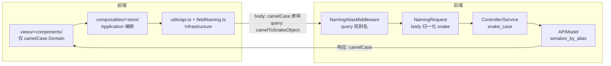

# 前后端字段命名规范适配机制

## 1. 概述

本文档是系统字段命名机制的**权威描述**，与代码库实际实现逐项对应。后端 Python 层使用 snake_case，前端 TypeScript 层使用 camelCase，系统通过**四道关卡**实现无缝对接：

| 关卡 | 位置 | 方向 | 职责 |
|------|------|------|------|
| ① APIModel | `backend/schemas/base.py` | 响应出口 | `serialize_by_alias=True`，所有 API 响应**直接输出 camelCase** |
| ② NamingRequest | `backend/utils/web/naming_request.py` | 请求入口（JSON body） | 请求体键名递归归一化为 snake_case |
| ③ NamingAliasMiddleware | `backend/utils/web/naming_middleware.py` | 请求入口（query string） | 查询参数双别名补全（snake_case 与 camelCase 同时可用） |
| ④ AliasChoices | `backend/schemas/` 部分模型 | 请求入口（字段级） | 显式声明多别名，兼容历史/异构报文 |

前端侧不引入 Axios 拦截器或第三方转换库，由 `frontend/src/utils/api.ts`（请求封装）与 `frontend/src/utils/fieldNaming.ts`（字段工具族）承担 Infrastructure 层转换职责。



## 2. 命名规范定义

### 2.1 后端命名规范

后端 Python 代码统一采用 snake_case（小写下划线分隔）。所有对外响应模型必须继承 `APIModel` 基类（`backend/schemas/base.py`），字段一律以 snake_case 声明：

```python
# backend/schemas/base.py（完整原文）
from pydantic import BaseModel, ConfigDict
from pydantic.alias_generators import to_camel


class APIModel(BaseModel):
    model_config = ConfigDict(
        alias_generator=to_camel,      # snake_case → camelCase 别名生成器
        populate_by_name=True,          # 校验时接受字段名（snake_case）
        populate_by_alias=True,         # 校验时同时接受别名（camelCase）
        serialize_by_alias=True,        # 序列化一律使用别名（camelCase）★核心
        extra="ignore",                 # 忽略额外字段
    )
```

> `serialize_by_alias=True` 是**camelCase 输出契约的关键**：后端返回给前端的 JSON 中不存在 snake_case 字段（个别刻意保留的特例见 4.3）。

### 2.2 前端命名规范

前端 TypeScript 代码统一采用 camelCase。按前端 DDD 分层约束：

- **Presentation**（`views/` + `components/`）：只见 camelCase Domain 与 composables（Ports）；
- **Application**（`composables/` + `store/`）：编排用例，缓存 ReadModel，只见 Domain；
- **Domain**（`domain/model/` + `enums.ts`）：零依赖；
- **Infrastructure**（`utils/api.ts`、`utils/fieldNaming.ts`、`preload/apiadapter.ts`）：**唯一知道 snake_case 细节**的层。

**前端类型示例**（`frontend/src/shared/types/`，camelCase 与后端 camelCase 输出一一对应）：

```typescript
interface TaskListItem {
    id: number;
    name: string;
    status: string;
    createdAt?: string;
    totalCases?: number;
    completedCases?: number;
    maxAudioDuration?: number;
    needsPromptAudio?: boolean;
}
```

## 3. 适配机制原理

### 3.1 响应出口：APIModel 强制 camelCase

凡继承 `APIModel` 的模型，响应序列化一律走 `to_camel` 生成的别名：

| 后端字段（snake_case） | 前端字段（camelCase） |
|------------------------|----------------------|
| `id` | `id` |
| `task_id` | `taskId` |
| `created_at` | `createdAt` |
| `total_cases` | `totalCases` |
| `completed_cases` | `completedCases` |
| `error_message` | `errorMessage` |
| `max_audio_duration` | `maxAudioDuration` |
| `needs_prompt_audio` | `needsPromptAudio` |
| `app_version` | `appVersion` |
| `serial_number` | `serialNumber` |
| `last_online_at` | `lastOnlineAt` |
| `test_frequency` | `testFrequency` |
| `calibration_status` | `calibrationStatus` |
| `spl_mapping_id` | `splMappingId` |

显式声明 `alias` 的字段以显式值为准（优先级高于 `alias_generator`），例如 `backend/schemas/spl.py` 中 `spl_mapping_id: int = Field(..., alias='splMappingId', validation_alias='splMappingId')`。

### 3.2 请求入口（JSON body）：NamingRequest 归一化

`backend/app.py` 中 `app.request_class = NamingRequest`。该类重写 `get_json`，对请求体键名**递归**执行 camelCase → snake_case 归一化（`normalize_keys_to_snake`）：

- 已是 snake_case 的键原样保留；
- kebab-case（含连字符且无大写）原样保留；
- 其余驼峰键转为 snake_case（含连续大写处理，如 `WEREn` → `wer_en`）。

因此**控制器与 Service 内部拿到的 JSON 键恒为 snake_case**，前端请求体直接发 camelCase 即可，无需自行转换。

### 3.3 请求入口（query string）：NamingAliasMiddleware 双别名补全

`backend/app.py` 中 `app.wsgi_app = NamingAliasMiddleware(app.wsgi_app)`（WSGI 中间件）。对每个带查询串的请求，`add_case_aliases_to_query_string` 会**同时补全 snake_case 与 camelCase 两种键名**（值相同），缺失的一侧自动追加：

```python
# backend/utils/web/naming_middleware.py（核心逻辑摘要）
for k, v in pairs:
    snake_key = k if _SNAKE_LIKE_KEY_RE.fullmatch(k) else to_snake(k)
    if snake_key not in existing: out.append((snake_key, v))
    camel_key = to_camel(k)
    if camel_key not in existing: out.append((camel_key, v))
```

效果：无论前端以 `?pageSize=20` 还是 `?page_size=20` 发送，后端两种键名都能取到值。

### 3.4 字段级多别名：AliasChoices 显式特例

对历史报文或异构来源需要同时兼容多种键名的字段，在 `validation_alias` 中显式声明 `AliasChoices`（**优先级高于**中间件与生成器，仅 6 个 schema 文件使用）：`testcase.py`、`report.py`、`algorithm.py`、`evaluation.py`、`group.py`、`device.py`。

真实用例（`backend/schemas/testcase.py`）：

```python
audio_id: Optional[Union[int, str]] = Field(
    None, alias='audio_id',
    validation_alias=AliasChoices('audio_id', 'audioId'))
playback_device_id: Optional[Union[int, str]] = Field(
    None, alias='playback_device_id',
    validation_alias=AliasChoices('playback_device_id', 'playbackDeviceId'))
```

### 3.5 双向支持

`populate_by_name=True` + `populate_by_alias=True` 使校验阶段同时接受字段名与别名；配合 3.2/3.3 的入口归一化，**请求体与查询参数的两种命名风格后端均可正确解析**，内部代码一律使用 snake_case 属性访问。

## 4. Schema 模块结构

### 4.1 模块清单

| 模块文件 | 功能说明 | 主要数据模型（实际） |
|---------|---------|-------------|
| `base.py` | APIModel 基类 | APIModel |
| `common.py` | 通用数据结构 | PaginatedData, CountData |
| `task.py` | 任务管理 | TaskListItem, TaskDetailData, TaskProgressData |
| `device.py` | 设备管理（使用 AliasChoices） | DeviceItem, DeviceStatusItem, DeviceScanItem |
| `audio.py` | 音频管理 | AudioItem, DirectionItem, TagListData |
| `evaluation.py` | 评估维度（使用 AliasChoices） | CategoryItem, DimensionInput, HealthCheckResultItem |
| `report.py` | 报告管理（使用 AliasChoices） | ReportListItem, ReportDetailData, ReportSummarySimplified |
| `api.py` | API 驱动 | ApiConfig, ApiEndpoint, ApiHealthData |
| `group.py` | 分组管理（使用 AliasChoices） | GroupItem, GroupCreateRequest, GroupUpdateRequest |
| `testcase.py` | 用例管理（使用 AliasChoices，含输出契约特例见 4.3） | TestCaseAudioConfigItem, TestCaseBackgroundNoiseItem |
| `playback.py` | 播放管理 | PlaybackItem, PlaybackControlData, PlaybackAssociateSplSchema |
| `spl.py` | SPL 映射 | SPLMappingCreateRequest, SplMappingItem, SplStatsData, PlayTestToneRequest |
| `algorithm.py` | 算法管理（使用 AliasChoices） | AlgorithmReferenceParam 等 |
| `home.py` | 首页统计 | HomeStats 等 |

### 4.2 核心数据结构

```python
# backend/schemas/common.py —— 分页结构，输出 perPage（camelCase）
class PaginatedData(APIModel, Generic[T]):
    items: List[T] = Field(..., alias='items', validation_alias='items')
    total: int = Field(..., alias='total', validation_alias='total')
    page: int = Field(..., alias='page', validation_alias='page')
    per_page: int = Field(..., alias='perPage', validation_alias='perPage')
    pages: int = Field(..., alias='pages', validation_alias='pages')
```

### 4.3 输出契约特例：用例音频配置保持 snake_case

`backend/schemas/testcase.py` 中 `TestCaseAudioConfigItem`、`TestCaseBackgroundNoiseItem` **刻意**将 `alias` 声明为 snake_case（`audio_id`、`playback_device_id`、`background_noise`、`play_order` 等），并配置 `extra='allow'` 保留额外字段。原因：这些结构随 case_config 原样传递至评估链路（`case_config → played_audios`，见《04_评估/case-config-stimulus-audios方案.md》），评估服务（eval_server）按 snake_case 消费。**这是跨服务契约，不属于命名缺陷，修改前须同步评估端**。

## 5. 前端适配层实现（Infrastructure）

> 前端实际技术栈为 **Vue 3 + Electron + 原生 fetch**（无 Axios、无 lodash 转换库）。字段转换集中在 `utils/api.ts` 与 `utils/fieldNaming.ts`。

### 5.1 请求封装：utils/api.ts

`request<T>()` 是所有 HTTP 调用的唯一入口，双通道发出：Electron 环境经 `window.electronAPI.apiRequest`（IPC，见 `preload/apiadapter.ts` 的 `APIAdapter`）；浏览器环境走原生 `fetch`。

字段规则（**仅 GET 查询参数做 camelCase → snake_case 转换**）：

```typescript
// frontend/src/utils/api.ts（摘要）
import { camelToSnakeObject } from './fieldNaming';

// GET params：camelCase → snake_case 后拼接 query string
const snakeParams = camelToSnakeObject(requestOptions.params);
const filteredParams = Object.fromEntries(
  Object.entries(snakeParams).filter(([_, v]) => v !== undefined && v !== null)
);
const query = new URLSearchParams(filteredParams).toString();
```

请求体（JSON/FormData）**不做键名转换**，camelCase 原样发送，由后端 NamingRequest / NamingAliasMiddleware 兼容（见 3.2/3.3）。

### 5.2 字段工具族：utils/fieldNaming.ts

| 工具函数 | 职责 |
|---------|------|
| `snakeToCamel` / `camelToSnake` | 字符串级转换 |
| `snakeToCamelObject` / `camelToSnakeObject` | 对象/数组**递归**键名转换（响应归一、GET 参数预转换） |
| `normalizeReportSummary` | 报告摘要**别名表兜底**：17 组映射（如 `passRate ← ['pass_rate','passRate','overall_success_rate','overallSuccessRate']`），嵌套 `deviceStats`/`apiStats` 再走 `snakeToCamelObject` |
| `normalizeReport` | 报告顶层字段兜底（`taskId`/`taskName`/`algorithmType`/`createdAt`/`updatedAt` 双命名兼容） |
| `getFieldWithAliases` | 主字段 + 别名列表逐一回退取值 |

另含类型级推导 `SnakeToCamelCase<S>` / `CamelToSnakeCase<S>`，用于编译期字段名约束。

### 5.3 视图层局部兜底（特例）

`frontend/src/views/Home.vue` 在消费统计接口时定义局部 `getCaseInsensitive(obj, key)`：按 `key` / 全小写 / 首字母大写三种形态取值，兼容后端统计数据的键名差异。该兜底**仅限视图层局部使用**，新增代码应优先依赖 Infrastructure 层工具，禁止在 Presentation 层散落 snake_case 处理。

## 6. API 报文示例

### 6.1 任务列表

**后端实际返回（camelCase，无需前端再转换）：**

```json
{
  "items": [
    {
      "id": 1,
      "name": "语音识别测试任务",
      "status": "running",
      "createdAt": "2026-01-15T10:30:00",
      "totalCases": 100,
      "completedCases": 45,
      "failedCases": 2,
      "tags": ["voice", "test"]
    }
  ],
  "total": 1,
  "page": 1,
  "perPage": 20,
  "pages": 1
}
```

### 6.2 请求示例

查询参数（前端可发 camelCase，后端双别名兼容）与请求体（camelCase 原样）：

```
GET /api/v1/spl?page=1&pageSize=10&calibrationStatus=calibrated
```

```json
POST /api/v1/spl
{
  "name": "耳机-1m-1kHz",
  "deviceId": 3,
  "testFrequency": 1000
}
```

**特例**：用例保存接口返回的音频配置块为 snake_case（见 4.3），前端类型定义按 `TestCaseAudioConfigItem` 契约处理：

```json
{
  "audio_id": 12,
  "audio_name": "dry_01.wav",
  "spl": 65,
  "playback_device_id": 3,
  "play_order": 1,
  "background_noise": null
}
```

## 7. 最佳实践

### 7.1 后端开发规范

- 所有 API 响应模型必须继承 `APIModel`，禁止直接继承 `BaseModel`（否则 `serialize_by_alias` 失效，泄漏 snake_case）；
- 字段统一 snake_case 声明，输出命名交给 `alias_generator`，仅在跨服务/历史兼容时显式 `alias`/`validation_alias`；
- 枚举语义字段使用字符串（配合后端 enums 常量，禁止魔法字符串字面量散落）；
- 复杂嵌套结构拆分为独立模型类，Pydantic 会递归转换嵌套模型的键名。

```python
# 正确示范
class TaskCaseBrief(APIModel):
    case_id: str
    name: str
    status: Optional[str] = None
    started_at: Optional[str] = None
    error_message: Optional[str] = None

# 避免的做法
class BadModel(BaseModel):   # 未继承 APIModel：输出将泄漏 snake_case
    caseId: str              # 声明处直接写 camelCase
```

### 7.2 前端开发规范

- 类型定义（`shared/types/`）与后端 camelCase 输出一一对应；组件/composable 中直接使用 camelCase；
- snake_case 仅允许出现在 Infrastructure 层（`utils/api.ts`、`utils/fieldNaming.ts`）与 4.3 特例的类型定义中；
- 新增字段须在后端 Schema 与前端类型中同步添加，禁止视图层临时 `as any` 取 snake_case 键。

```vue
<!-- 正确示范（Vue 3 组合式） -->
<script setup lang="ts">
const progress = computed(() =>
  `${task.value?.completedCases ?? 0}/${task.value?.totalCases ?? 0}`);
</script>

<!-- 避免的做法 -->
<template>
  <span>{{ task.created_at }}</span>   <!-- snake_case 泄漏到视图层 -->
</template>
```

### 7.3 特殊情况处理

- 第三方/外部 API 字段名不规范时，在**后端 Schema 接收层**用 `validation_alias` 统一，不在前端逐处适配；
- 数据库列名与 API 输出名之间的映射由 ORM（snake_case 列）+ APIModel（camelCase 别名）天然完成；
- 新增需要同时兼容两种命名的入参字段，优先依赖 NamingRequest/NamingAliasMiddleware 的通用能力，仅当通用规则不足（如非标准缩写词）时才显式 `AliasChoices`。

## 8. 常见问题

### 8.1 响应中出现 snake_case 字段

**排查步骤**：① 确认模型继承 `APIModel`（而非 `BaseModel`）；② 确认序列化路径走 `model_dump` 默认配置（`serialize_by_alias=True` 生效）；③ 确认不是 4.3 所述评估链路特例。

### 8.2 请求体字段未被后端识别

**排查步骤**：① NamingRequest 已将 body 归一化为 snake_case，确认后端读取的是 `request.get_json()`（而非自行解析原始 body）；② 字段若被 `validation_alias` 显式接管，则 `populate_by_name` 不再适用，须命中 AliasChoices 中的某个别名；③ query 参数问题优先检查 NamingAliasMiddleware 补全结果（可在 `request.args` 观察双别名）。

### 8.3 前端拿到的对象两种命名混杂

**排查步骤**：① 数据源若绕过 `request<T>()`（如视图层直接 `fetch`，见 `CRUDFormModal.vue` 的 test-tone 调用），需自行用 `snakeToCamelObject` 归一；② 报告类数据使用 `normalizeReport`/`normalizeReportSummary` 兜底；③ 检查是否为 4.3 特例结构，是则在类型层按 snake_case 契约声明。

## 9. 性能考虑

Pydantic 别名转换在模型实例化/序列化时完成，大列表场景（分页已控制单页规模）开销可忽略。前端侧转换仅在 GET 参数与个别报告归一化时发生，均为浅层或受限递归。配置类数据可在 Application 层（store）缓存 ReadModel，避免重复请求与转换。

## 10. 版本兼容性

字段更名遵循"过渡期双命名"策略：新字段以标准 camelCase 输出；旧字段兼容通过 `validation_alias=AliasChoices('oldName', 'old_name')` 声明；旧字段在文档中标注废弃计划后移除。API 版本以 URL 前缀区分（当前 `/api/v1/`）。**评估链路特例（4.3）的 snake_case 契约变更必须与 eval_server 同步评审**。

## 11. 相关文档

- [SPL 映射逻辑说明](../09_声压级映射/SPL映射逻辑说明.md)
- [case_config→played_audios 音频传递方案](../04_评估/case-config-stimulus-audios方案.md)
- [测试执行类设计](../01_测试执行/04_类设计.md)
- [Pydantic 官方文档](https://docs.pydantic.dev/)
- [TypeScript 官方文档](https://www.typescriptlang.org/)
